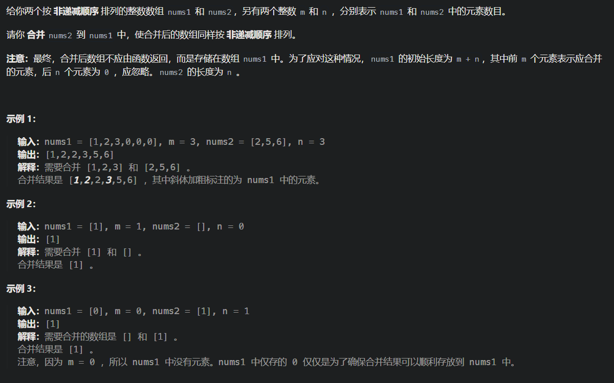
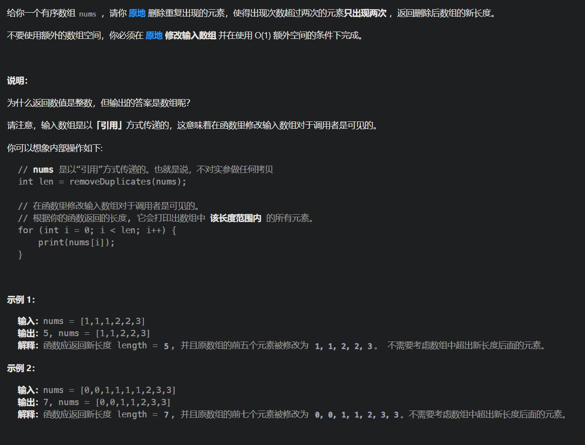
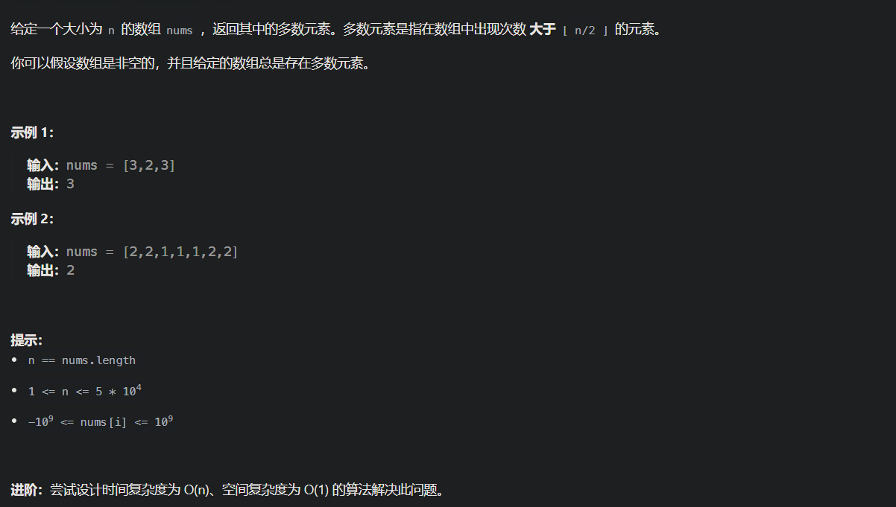
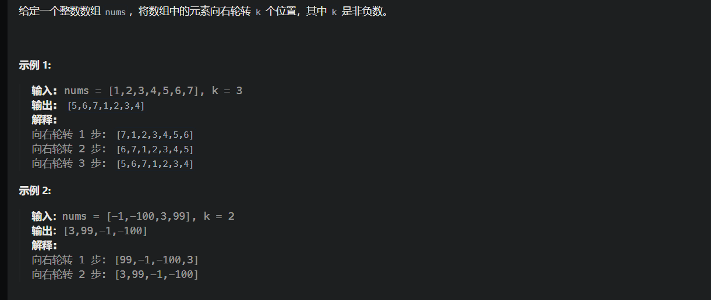
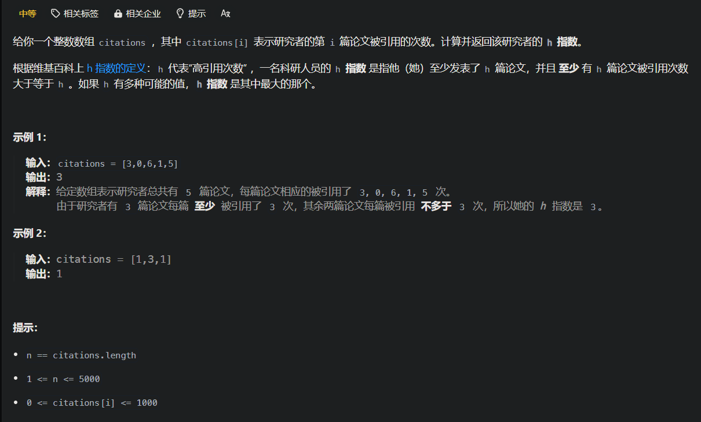

# 数组字符串

## [88. 合并两个有序数组](https://leetcode.cn/problems/merge-sorted-array/)



```java
class Solution {
    public void merge(int[] nums1, int m, int[] nums2, int n) {
        int i = m-1;
        int j = n-1;
        int end = m+n-1;
        int cur;
        while(i >= 0 || j >= 0){
            if( i == -1){
                cur = nums2[j--];
            }else if( j == -1){
                cur = nums1[i--];
            }else if(nums1[i] < nums2[j]){
                cur = nums2[j--];
            }else{
                cur = nums1[i--];
            }
            nums1[end--] = cur;
        }
    }
}
```


## [80. 删除有序数组中的重复项 II](https://leetcode.cn/problems/remove-duplicates-from-sorted-array-ii/)



```java
class Solution {
    public int removeDuplicates(int[] nums) {
        int n = nums.length;
        if (n <= 2) {
            return n;
        }
        int slow = 2, fast = 2;
        while (fast < n) {
            if (nums[slow - 2] != nums[fast]) {
                nums[slow] = nums[fast];
                ++slow;
            }
            ++fast;
        }
        return slow;
    }
}
```


## [169. 多数元素](https://leetcode.cn/problems/majority-element/)



```java
class Solution {
    private Map<Integer, Integer> countNums(int[] nums) {
        Map<Integer, Integer> counts = new HashMap<Integer, Integer>();
        for (int num : nums) {
            if (!counts.containsKey(num)) {
                counts.put(num, 1);
            } else {
                counts.put(num, counts.get(num) + 1);
            }
        }
        return counts;
    }

    public int majorityElement(int[] nums) {
        Map<Integer, Integer> counts = countNums(nums);

        Map.Entry<Integer, Integer> majorityEntry = null;
        for (Map.Entry<Integer, Integer> entry : counts.entrySet()) {
            if (majorityEntry == null || entry.getValue() > majorityEntry.getValue()) {
                majorityEntry = entry;
            }
        }

        return majorityEntry.getKey();
    }
}
```


## [189. 轮转数组](https://leetcode.cn/problems/rotate-array/)



```java
class Solution {
    public void rotate(int[] nums, int k) {
        int len = nums.length;
        int[] res = new int[len];
        for(int i = 0; i < len; i++)
            res[(i+k) % len] = nums[i];
        for(int i = 0; i < len; i++)
            nums[i] = res[i];
    }
}
```


## [274. H 指数](https://leetcode.cn/problems/h-index/)



```java
class Solution {
    public int hIndex(int[] citations) {
        Arrays.sort(citations);
        // 0 1 3 5 6
        int h = 0, i = citations.length - 1; 
        while (i >= 0 && citations[i] > h) {
            h++; 
            i--;
        }
        return h;
    }
}
```

