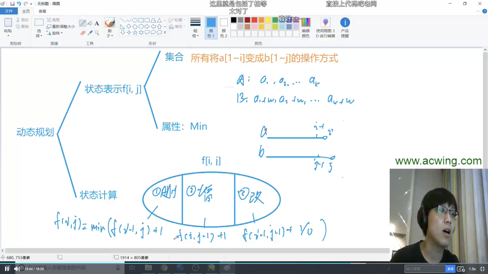
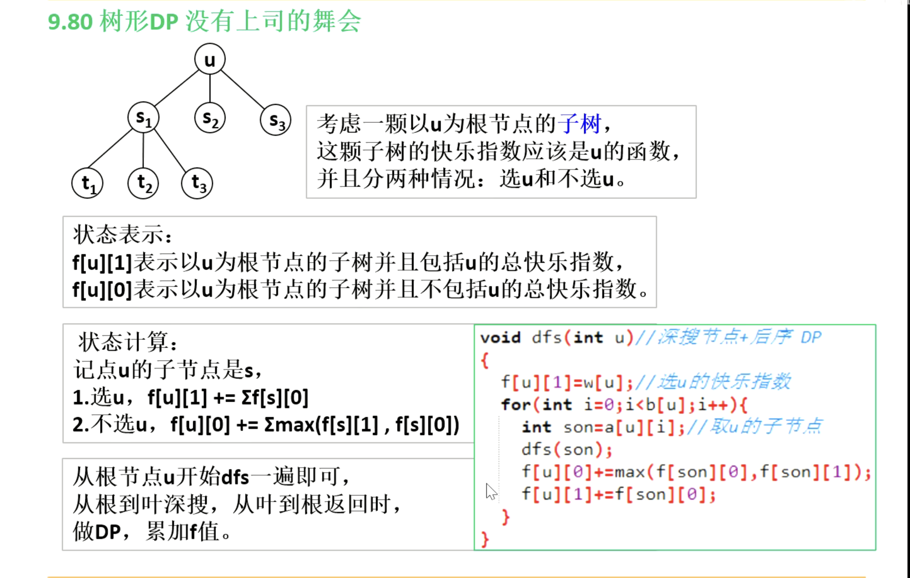

# 动态规划

## 背包问题


### 2.01背包问题


首先是二维数组版本


```java
import java.util.Scanner;

public class Main {
    static final int N = 1010;
    static int[] v = new int[N];//体积
    static int[] w = new int[N];//价值
    static int[][] f = new int[N][N];//f[i][j]表示不超过j体积下，前i个物品的最大价值
    public static void main(String[] args) {
        Scanner scanner = new Scanner(System.in);
        int n = scanner.nextInt();//物品个数
        int m = scanner.nextInt();//最大体积
        for (int i = 1; i <= n; i++) {
            v[i] = scanner.nextInt();
            w[i] = scanner.nextInt();
        }
        //f[0][j]、f[i][0]是0，所以遍历i、j从1开始
        for (int i = 1; i <= n; i++) {//物品
            for (int j = 1; j <= m; j++) {//体积
                //如果装不下第i个物品,则价值就是前i-1个物品
                if(j<v[i])
                    f[i][j] = f[i-1][j];
                else //装得下第i个物品，就选择装或不装的情况下价值高的那个
                    f[i][j] = Math.max(f[i-1][j],f[i-1][j-v[i]]+w[i]);
            }
        }
        System.out.println(f[n][m]);
    }
}

```


优化到一维数组


```java
import java.util.Scanner;

public class ac1_优化 {
    static final int N = 1010;
    static int[] f = new int[N];//f[j]表示前i轮决策的物品且体积小于j下最大价值
    static int[] v = new int[N];
    static int[] w = new int[N];
    public static void main(String[] args) {
        Scanner scanner = new Scanner(System.in);
        int n = scanner.nextInt();//物品个数
        int m = scanner.nextInt();//最大体积
        for (int i = 1; i <= n; i++) {
            v[i] = scanner.nextInt();
            w[i] = scanner.nextInt();
        }
        for (int i = 1; i <= n; i++) {
            for (int j = m;j>=v[i];j--)//倒序遍历保证每一个物品只添加一次
                //f[j]表示不放物品i
                f[j] = Math.max(f[j],f[j-v[i]]+w[i]);
        }
        System.out.println(f[m]);
    }
}

```


[AcWing 2. 01背包问题（状态转移方程讲解） - AcWing](https://www.acwing.com/solution/content/1374/)

### 3.完全背包问题


 

首先是三重循环版本，k表示第i个物品取k个


优化成二重循环


由于完全背包问题都是本层的i，所以正序

```java
import java.util.Scanner;

public class Main {
    static final int N = 1010;
    static int[] v = new int[N];
    static int[] w = new int[N];
    static int[] f = new int[N];
    public static void main(String[] args) {
        Scanner scanner = new Scanner(System.in);
        int n = scanner.nextInt();
        int m = scanner.nextInt();
        for (int i = 1; i <= n; i++) {
            v[i] = scanner.nextInt();
            w[i] = scanner.nextInt();
        }
        for (int i = 1; i <= n; i++) {
            for (int j = v[i]; j <= m; j++) {
                f[j] = Math.max(f[j],f[j-v[i]]+w[i]);
            }
        }
        System.out.println(f[m]);
    }
}

```


### 4.多重背包问题


分析：本题数据很小，不用优化版本，和完全背包问题差不多

```java
import java.util.Scanner;

public class Main {
    static final int N = 110;
    static int[] v = new int[N];
    static int[] w = new int[N];
    static int[] s = new int[N];
    static int[][] f = new int[N][N];
    static int n,m;
    public static void main(String[] args) {
        Scanner scanner = new Scanner(System.in);
        n = scanner.nextInt();
        m = scanner.nextInt();
        for (int i = 1; i <= n; i++) {
            v[i] = scanner.nextInt();
            w[i] = scanner.nextInt();
            s[i] = scanner.nextInt();
        }
        for (int i = 1; i <= n; i++) {
            for (int j = 1; j <= m; j++) {
                for (int k = 0; k<=s[i]; k++) {
                    if(j-k*v[i]>=0)
                        f[i][j] = Math.max(f[i][j],f[i-1][j-k*v[i]]+k*w[i]);
                }
            }
        }
        System.out.println(f[n][m]);
    }
}

```


### 5.多重背包问题II


分析：本题如果用朴素多重背包做法，一定会超时，所以要优化

```java
import java.util.Scanner;

public class Main {
    static final int N = 12010;
    static final int M = 2010;
    static int[] v = new int[N];
    static int[] w = new int[N];
    static int[] f = new int[M];
    public static void main(String[] args) {
        Scanner scanner = new Scanner(System.in);
        int n = scanner.nextInt();
        int m = scanner.nextInt();
        int cnt = 0;//二进制优化后的物品号
        for (int i = 1; i <= n; i++) {
            int a = scanner.nextInt();
            int b = scanner.nextInt();
            int s = scanner.nextInt();
            int k = 1;//1,2,4,8,16....
            while (k<=s){
                cnt++;
                v[cnt] = a*k;
                w[cnt] = b*k;
                s -= k;
                k *=2;
            }
            if(s>0){//不能用2^n次表示的剩下部分
                cnt++;
                v[cnt] = s*a;
                w[cnt] = s*b;
            }
        }
        n = cnt;//变为cnt个物品的01背包问题
        for (int i = 1; i <= n; i++) {
            for (int j = m; j >= v[i]; j--) {
                f[j] = Math.max(f[j],f[j-v[i]]+w[i]);
            }
        }
        System.out.println(f[m]);
    }
}

```

[AcWing 5. 二进制优化，它为什么正确，为什么合理，凭什么可以这样分？？ - AcWing](https://www.acwing.com/solution/content/20115/)


### 9.分组背包问题


```java
import java.util.Scanner;

public class Main {
    static final int N = 110;
    static int[][] v = new int[N][N];
    static int[][] w = new int[N][N];
    static int[] s = new int[N];//s[i]表示第i组物品的个数
    static int[] f = new int[N];
    static int n,m;
    public static void main(String[] args) {
        Scanner scanner = new Scanner(System.in);
        n = scanner.nextInt();
        m = scanner.nextInt();
        for (int i = 1; i <= n; i++) {
            s[i] = scanner.nextInt();
            for (int j = 1; j <= s[i]; j++) {
                v[i][j] = scanner.nextInt();
                w[i][j] = scanner.nextInt();
            }
        }
        for (int i = 1; i <= n; i++) {
            for (int j = m; j >= 0; j--) {
                for (int k = 1; k <= s[i]; k++) {
                    if(j-v[i][k] >= 0)
                        f[j] = Math.max(f[j],f[j-v[i][k]]+w[i][k]);
                }
            }
        }
        System.out.println(f[m]);
    }
}

```


## 线性DP

### 898.数字三角形


```java
import java.util.Scanner;

public class Main {
    static final int N = 510;
    static int INF = 0x3f3f3f3f;
    static int[][] a = new int[N][N];
    static int[][] f = new int[N][N];
    static int n;
    public static void main(String[] args) {
        Scanner scanner = new Scanner(System.in);
        n  =scanner.nextInt();
        for (int i = 1; i <= n; i++) {
            for (int j = 1; j <= i; j++) {
                a[i][j] = scanner.nextInt();
            }
        }
        //将f数组初始化为最小值，注意0列和i+1列也要初始化为-inf
        for (int i = 1; i <= n; i++) {
            for (int j = 0; j <= i+1; j++) {
                f[i][j] = -INF;
            }
        }
        f[1][1] = a[1][1];
        //从左上角和右上角来
        for (int i = 1; i <= n; i++) {
            for (int j = 1; j <= i; j++) {
                f[i][j] = Math.max(f[i-1][j-1]+a[i][j],f[i-1][j]+a[i][j]);
            }
        }
        int res = -INF;
        for (int i = 1; i <= n; i++) {
            res = Math.max(res,f[n][i]);
        }
        System.out.println(res);
    }
}

```


### 895.最长上升子序列


```java
import java.util.Arrays;
import java.util.Scanner;

public class Main {
    static final int N = 1010;
    static int n;
    static int[] a = new int[N];
    static int[] f = new int[N];//f[i]表示以a[i]为结尾的子序列的长度
    static int[] g = new int[N];//若需要输出方案，记录状态转移
    public static void main(String[] args) {
        Scanner scanner = new Scanner(System.in);
        n = scanner.nextInt();
        for (int i = 1; i <= n; i++) {
            a[i] = scanner.nextInt();
        }
        Arrays.fill(f,1);//f[i]最小是1
        for (int i = 1; i <= n; i++) {
            for (int j = 1; j < i; j++) {
                //如果a[j]比a[i]小
                if(a[j] < a[i]){
                    //f[i] = Math.max(f[i],f[j]+1);   //若不用记录方案，就max即可
                    //若要记录方案，则判断f[i]和f[j]+1,若本次的f[j]+1比之前的f[i]大，则记录下来，并更新f[i]
                    if(f[i] < f[j] +1){
                        f[i] = f[j] +1;
                        g[i] = j;
                    }
                }
            }
        }
        int k = 1;//k表示最长子序列最后一个数的下标
        for (int i = 1; i <= n; i++) {
            if(f[k] < f[i])
                k = i;
        }
        System.out.println(f[k]);//最长子序列长度
        //倒序输出子序列
        for (int i = 0,len = f[k]; i < len; i++) {
            System.out.print(a[k] + " ");
            k = g[k];
        }
    }
}

```


### 896.最长上升子序列II


```java
import java.util.Scanner;

public class Main {
    static final int N = 100010;
    static int n;
    static int[] a = new int[N];
    static int[] f = new int[N];//维护严格单调递增的序列，最终f的长度即为答案
    static int cnt;

    static int find(int x) {//找x右区间
        int l = 1, r = cnt;
        while (l < r) {
            int mid = l + r >> 1;
            if (f[mid] > x) r = mid;//因为要找第一个大于或等于a[i]的数，所以要取等号
            else l = mid + 1;
        }
        return l;
    }

    public static void main(String[] args) {
        Scanner scanner = new Scanner(System.in);
        n = scanner.nextInt();
        for (int i = 1; i <= n; i++) {
            a[i] = scanner.nextInt();
        }
        f[++cnt] = a[1];
        for (int i = 2; i <= n; i++) {
            if (a[i] > f[cnt]) f[++cnt] = a[i];//因为f是严格递增的，所以如果ai比f最后一个数大，那直接替换
            else {
                int temp = find(a[i]);//找到f中第一个大于或等于a[i]的数的下标
                f[temp] = a[i];//替换
            }
        }
        System.out.println(cnt);
    }
}

```


### 897.最长公共子序列


 


```java
import java.util.Scanner;

public class Main {
    static final int N = 1010;
    static int n, m;
    static int[] a = new int[N];
    static int[] b = new int[N];
    static int[][] f = new int[N][N];//f[i][j]表示a中前i个和b中前j个字符序列中的最长公共串的长度

    public static void main(String[] args) {
        Scanner scanner = new Scanner(System.in);
        n = scanner.nextInt();
        m = scanner.nextInt();
        String sa = scanner.next();
        String sb = scanner.next();
        for (int i = 1; i <= n; i++) {
            a[i] = sa.charAt(i - 1);
        }
        for (int i = 1; i <= m; i++) {
            b[i] = sb.charAt(i - 1);
        }
        for (int i = 1; i <= n; i++) {
            for (int j = 1; j <= m; j++) {
                f[i][j] = Math.max(f[i - 1][j], f[i][j - 1]);//01,10两种情况是一定会取max
                if(a[i] == b[j])
                    f[i][j] = Math.max(f[i][j],f[i-1][j-1]+1);
            }
        }
        System.out.println(f[n][m]);
    }
}

```


### 902.最短编辑距离


其实没必要转成数组

```java
import java.util.Scanner;

public class Main {
    static final int N = 1010;
    static int n, m;
    static int[] a = new int[N];
    static int[] b = new int[N];
    static int[][] f = new int[N][N];//f[i][j]表示a中前i个字符变成b中前j个字符所需要的次数

    public static void main(String[] args) {
        Scanner scanner = new Scanner(System.in);
        n = scanner.nextInt();
        String sa = scanner.next();
        for (int i = 1; i <= n; i++) {
            a[i] = sa.charAt(i-1);
        }
        m = scanner.nextInt();
        String sb = scanner.next();
        for (int i = 1; i <= m; i++) {
            b[i] = sb.charAt(i-1);
        }
        //因为后面涉及i-1，所以下标从0开始，所以要初始化0的情况
        for (int i = 1; i <= n; i++) {
            f[i][0] = i;
        }
        for (int i = 1; i <= m; i++) {
            f[0][i] = i;
        }
        for (int i = 1; i <= n; i++) {
            for (int j = 1; j <= m; j++) {
                f[i][j] = Math.min(f[i-1][j]+1,f[i][j-1]+1);//删除a或b
                if(a[i] == b[j]) f[i][j] = Math.min(f[i][j],f[i-1][j-1]);//如果相等，则次数就是-1的次数
                else f[i][j] = Math.min(f[i][j],f[i-1][j-1]+1);//如果不等，则就是-1的次数再多一步
            }
        }
        System.out.println(f[n][m]);
    }
}

```




### 899.编辑距离


```java
import java.io.BufferedReader;
import java.io.IOException;
import java.io.InputStreamReader;

public class Main {
    static final int N = 1010;
    static int n, m;
    static String[] sa = new String[N];
    static int[][] f = new int[N][N];
    static int getEditDist(String sa,String sb){
        int n1= sa.length();
        int n2 = sb.length();
        for (int i = 1; i <= n1; i++) {
            f[i][0] = i;
        }
        for (int i = 1; i <= n2; i++) {
            f[0][i] = i;
        }
        for (int i = 1; i <= n1; i++) {//a
            for (int j = 1; j <= n2; j++) {//b
                f[i][j] = Math.min(f[i-1][j]+1,f[i][j-1]+1);
                if(sa.charAt(i-1) == sb.charAt(j-1)) f[i][j] = Math.min(f[i][j],f[i-1][j-1]);
                else f[i][j] = Math.min(f[i][j],f[i-1][j-1]+1);
            }
        }
        return f[n1][n2];
    }

    public static void main(String[] args) throws IOException {
        BufferedReader br = new BufferedReader(new InputStreamReader(System.in));
        String[] s = br.readLine().split(" ");
        n = Integer.parseInt(s[0]);
        m = Integer.parseInt(s[1]);
        for (int i = 0; i < n; i++) {
            sa[i] = br.readLine();
        }
        while (m-- > 0) {
            s = br.readLine().split(" ");
            String sb = s[0];
            int t = Integer.parseInt(s[1]);
            int res = 0;
            for (int i = 0; i < n; i++) {
                int dis = getEditDist(sa[i],sb);
                if(dis <= t) res++;
            }
            System.out.println(res);
        }
    }
}

```


## 区间DP

### 282.石子合并


以最后一步合并的分界线来分类


```java
import java.util.Arrays;
import java.util.Scanner;

public class Main {
    static final int N = 310;
    static final int INF = 0x3f3f3f3f;
    static int n;
    static int[] s = new int[N];//后面存前缀和
    static int[][] f = new int[N][N];//f[i][j]表示将i堆与j堆合并的所有方案中最小的代价
    public static void main(String[] args) {
        Scanner scanner = new Scanner(System.in);
        n = scanner.nextInt();
        for (int i = 1; i <= n; i++) {
            s[i] = scanner.nextInt();
            s[i] += s[i-1];
        }
        for (int i = 1; i <= n; i++) {
            Arrays.fill(f[i],INF);
        }
        for (int len = 1;len<=n;len++)//区间长度
            for (int i = 1; i+len-1 <=n ; i++) {//区间起点
                int j = i+len-1;//右端点
                if(len == 1){
                    f[i][j] = 0;//区间内只有一个数的话，代价是0
                    continue;
                }
                for (int k = i; k < j; k++) {//分割点
                    f[i][j] = Math.min(f[i][j],f[i][k]+f[k+1][j]+s[j]-s[i-1]);
                }
            }
        System.out.println(f[1][n]);
    }
}

```

[AcWing 282. 石子合并（区间 DP 模版题详解分析） - AcWing](https://www.acwing.com/solution/content/13945/)


## 计数类dp

### 900.整数的划分


分析：可以看作是完全背包问题。容量为n，商品的体积为1,2,3......n，问恰好装满背包的方案数

```
f[i][j]表示前i个整数加起来恰好等于j的方案数
把集合分成选0,1,2...个i，也就是前i-1个整数加起来恰好等于j-k*i的方案数之和
然后可以像完全背包问题一样化简
```


最朴素的做法，选k个i


完全背包优化二维数组版本

```java
import java.util.Scanner;

public class Main {
    static final int N = 1010;
    static final int mod = (int) 1e9 + 7;
    static int[][] f = new int[N][N];//f[i][j]表示前i个整数之和恰好等于j的方案数

    public static void main(String[] args) {
        Scanner scanner = new Scanner(System.in);
        int n = scanner.nextInt();
        //初始化，背包容量是0时，方案数为1
        for (int i = 0; i <= n; i++) {
            f[i][0] = 1;
        }
        for (int i = 1; i <= n; i++) {
            for (int j = 0; j <= n; j++) {
                f[i][j] = f[i - 1][j] % mod;
                if (j >= i) f[i][j] = (f[i - 1][j] + f[i][j - i]) % mod;
            }
        }
        System.out.println(f[n][n]);
    }
}

```

再度优化为一维数组版本,完全背包问题第二层循环正序

```java
import java.util.Scanner;

public class Main {
    static final int N = 1010;
    static final int mod = (int) 1e9 + 7;
    static int[] f = new int[N];//f[i]表示前i个整数之和恰好等于9的方案数

    public static void main(String[] args) {
        Scanner scanner = new Scanner(System.in);
        int n = scanner.nextInt();
        //初始化，背包容量是0时，方案数为1
        f[0] = 1;
    
        for (int i = 1; i <= n; i++) {
            for (int j = i; j <= n; j++) {
                f[j] = (f[j]+f[j-i])%mod;
            }
        }
        System.out.println(f[n]);
    }
}

```


[AcWing 900. 整数划分 （求方案数、朴素做法 、等价变形 ） - AcWing](https://www.acwing.com/solution/content/2954/)


## 数位统计dp

### 338.计数问题


可以不用讨论那么多细枝末节，只需要知道，当i为0时其左边整数不能为0，就够了。

```java
import java.util.ArrayList;
import java.util.Scanner;

public class Main {
    static final int N = 10;//最多10位

    //1234在num中存为 4321,若l=3,r=1,则返回234
    static int get(ArrayList<Integer> num,int l,int r){//求num中第l~r位置的数字
        int res = 0;
        for (int i = l; i >= r; i--) {
            res = res*10 + num.get(i-1);
        }
        return res;
    }
    static int count(int n, int x) {//求1~n中，x出现的次数
        if(n==0) return 0;
        ArrayList<Integer> num = new ArrayList<>();//将n存入list，方便求解;n的高位存在num高位
        while (n > 0) {
            num.add(n % 10);
            n /= 10;
        }
        int len = num.size();
        int res = 0;
        //从右向左遍历求第i位上x出现的次数
        //以abc d efg，l=xxx,r=yyy
        for (int i = 1; i <= len; i++) {
            int p = (int) Math.pow(10,i-1);//p表示x右边构成的数的个数;若i=2，则第二位的右边可能为0~9，共10个数
            int l = get(num,len,i+1);
            int r = get(num,i-1,1);
            int d = get(num,i,i);
            //情况1
            if(x>0) res += l*p;//如果x不是0，xxx=000~abc-1
            if(x==0 && l>0) res += (l-1)*p;//如果x是0，那l不能是全0，xxx=001 ~abc-1
            //情况2.3
            if(d>x && (x>0 || l>0)) res += p;
            //情况2.2
            if(d==x && (x>0||l>0)) res += r+1;
        }
        return res;
    }

    public static void main(String[] args) {
        Scanner scanner = new Scanner(System.in);
        while (true) {
            int a = scanner.nextInt();
            int b = scanner.nextInt();
            if(a==0 && b==0)
                break;
            if (a > b) {//保证a<b
                int temp = a;
                a = b;
                b = temp;
            }
            //求0~9在a~b间出现的次数,类似前缀和
            for (int i = 0; i <= 9; i++) {
                System.out.print(count(b, i) - count(a - 1, i) + " ");
            }
            System.out.println();
        }
    }
}

```

[AcWing 338. 计数问题---超短写法 - AcWing](https://www.acwing.com/solution/content/7128/)


## 状态压缩dp

将路径的状态用二进制表示

### 291.蒙德里安的梦想


```java
import java.util.Arrays;
import java.util.Scanner;

public class Main {
    static final int N = 12;//列
    static final int M = 1 << N;//每列的状态数
    static long[][] f = new long[N][M];//f[i][j]表示前i-1列摆好了，且延伸到i列的状态是k的方案数
    static boolean[] st = new boolean[M];//每种状态是否合法，有奇数个连续的0则是非法

    public static void main(String[] args) {
        Scanner scanner = new Scanner(System.in);
        while (true) {

            int n = scanner.nextInt();
            int m = scanner.nextInt();
            if (n == 0 && m == 0)
                break;
            //预处理st[]
            for (int i = 0; i < 1 << n; i++) {//i是状态，n位二进制
                st[i] = true;
                int cnt = 0;//记录连续的0的个数
                for (int j = 0; j < n; j++) {//二进制的每一位
                    if (((i >> j) & 1) == 1) {//i的第j位是1
                        if (cnt % 2 == 1) {//有奇数个0
                            st[i] = false;
                            cnt = 0;//清0，进行下一组连续0判断
                        }
                    } else {
                        cnt++;//i的第j位不是0，则继续计数连续0
                    }
                }
                if (cnt % 2 == 1) st[i] = false;//最后一组连续0不能再for循环中判断完，外面单独判断
            }

            //初始化f,注意总共m列
            for (int i = 0; i <= m; i++) {
                Arrays.fill(f[i], 0);
            }

            f[0][0] = 1;//-1列摆完且延伸到0列的状态是0的方案数是1

            for (int i = 1; i <= m; i++) {//i列
                for (int j = 0; j < 1 << n; j++) {//i列状态j
                    for (int k = 0; k < 1 << n; k++) {//i-1列状态k
                        if ((j & k) == 0 && st[j | k])//j&k==0表示j和k不在同一行同时横着放
                            f[i][j] += f[i - 1][k];
                    }
                }
            }
            System.out.println(f[m][0]);
        }
    }
}

```


[AcWing 291. 蒙德里安的梦想 - AcWing](https://www.acwing.com/solution/content/28088/)


### 91.最短Hamilton路径


```java
import java.util.Arrays;
import java.util.Scanner;

public class Main {
    static final int N = 20;
    static final int M = 1 << N;//状态最大为20个1
    static final int INF = 0x3f3f3f3f;
    static int n;
    static int[][] w = new int[N][N];//权重
    static int[][] f = new int[M][N];//f[state][j]表示，经过点集state后到达j的所有路径的最小值

    public static void main(String[] args) {
        Scanner scanner = new Scanner(System.in);
        n = scanner.nextInt();
        for (int i = 0; i < n; i++) {
            for (int j = 0; j < n; j++) {
                w[i][j] = scanner.nextInt();
            }
        }
        //注意初始化i从1到1<<n
        for (int i = 0; i < 1<<n; i++) {
            Arrays.fill(f[i], INF);//后面要求路径最小值，所以初始化为max
        }


        f[1][0] = 0;//从0->0的点集为1，路径长度为0

        for (int state = 1; state < 1 << n; state++) {//枚举路径点集1~1111...1
            if ((state & 1) == 1) {//合法的state最低为一定是1
                for (int j = 0; j < n; j++) {//枚举当前点集state经过的所有的点
                    if ((state >> j & 1) == 1) {//如果当前点集state的第j位是1，说明经过了j,要进行状态转移
                        for (int k = 0; k < n; k++) {
                            if (((state ^ 1 << j) >> k & 1) == 1) {//(state^1<<j)表示当前点集state去掉j，如果去掉j后仍然第k位是1，那么才能从k转移到j
                                f[state][j] = Math.min(f[state][j], f[state - (1 << j)][k] + w[k][j]);
                            }
                        }
                    }
                }
            }
        }
        System.out.println(f[(1 << n) - 1][n - 1]);//输出f[1111..1][n-1]
    }
}

```


[AcWing 91. 最短Hamilton路径 - AcWing](https://www.acwing.com/solution/content/15328/)


## 树形dp

### 285.没有上司的舞会


```java
 import java.util.Arrays;
import java.util.Scanner;

public class Main {
    static final int N = 6010;
    static int n;
    static int[] e = new int[N];
    static int[] ne = new int[N];
    static int[] h = new int[N];
    static int idx;
    static boolean[] hasFather = new boolean[N];
    static int[][] f = new int[N][2];//f[i][0]表示以i为根节点但不含i的所有方案的快乐值的最大值；f[i][1]为含i的方案
    static int[] happy = new int[N];//快乐值,从1开始

    static void add(int a,int b){
        e[idx] = b;
        ne[idx] = h[a];
        h[a] = idx++;
    }

    static void dfs(int u){
        f[u][1] = happy[u];
        for (int i = h[u]; i != -1; i=ne[i]) {//u的孩子
            int j = e[i];
            dfs(j);//回溯
            f[u][0] += Math.max(f[j][0],f[j][1]);//不选u，则j可以自由选或不选
            f[u][1] += f[j][0];//选了u，那j就不能选了
        }
    }

    public static void main(String[] args) {
        Scanner scanner = new Scanner(System.in);
        n = scanner.nextInt();
        for (int i = 1; i <= n; i++) {
            happy[i] = scanner.nextInt();
        }
        Arrays.fill(h,-1);
        for (int i = 1; i < n; i++) {
            int a = scanner.nextInt();
            int b = scanner.nextInt();//b是a的父亲
            hasFather[a] = true;
            add(b,a);
        }
        int root = 1;//找根节点
        while (hasFather[root]) root++;
        dfs(root);
        System.out.println(Math.max(f[root][0], f[root][1]));
    }
}

```





[9.80 树形DP 没有上司的舞会——信息学竞赛培训课程_哔哩哔哩_bilibili](https://www.bilibili.com/video/BV1eK411N7Ly/?spm_id_from=333.999.0.0&vd_source=55c287a81883465b30c11b1feb8b72c3)


## 记忆化搜索

### 901.滑雪


```java
import java.util.Arrays;
import java.util.Scanner;

public class Main {
    static final int N = 310;
    static int n,m;
    static int[][] h = new int[N][N];//高度
    static int[][] f = new int[N][N];//f[i][j]表示从(i,j)开始滑的路径所经过的长度
    static int[] dx = {0,1,0,-1};
    static int[] dy = {1,0,-1,0};
    
    static int dp(int x,int y){
        if(f[x][y] != -1) return f[x][y];//如果长度不是-1说明已经计算过了，直接返回结果即可
        f[x][y] = 1;//至少滑动一格
        for (int i = 0; i < 4; i++) {
            int xx = x + dx[i];
            int yy = y + dy[i];
            if(xx>=1 && xx <=n && yy>=1 && yy<=m && h[xx][yy]<h[x][y] )
                f[x][y] = Math.max(f[x][y],dp(xx,yy)+1);//更新长度
        }
        return f[x][y];
    }
    public static void main(String[] args) {
        Scanner scanner = new Scanner(System.in);
        n = scanner.nextInt();
        m = scanner.nextInt();
        for (int i = 1; i <= n; i++) {
            for (int j = 1; j <= m; j++) {
                h[i][j] = scanner.nextInt();
            }
        }
        for (int i = 1; i <= n; i++) {
            Arrays.fill(f[i],-1);
        }
        int res = 0;
        for (int i = 1; i <= n; i++) {
            for (int j = 1; j <= m; j++) {
                res = Math.max(res,dp(i,j));
            }
        }
        System.out.println(res);
    }
}

```


