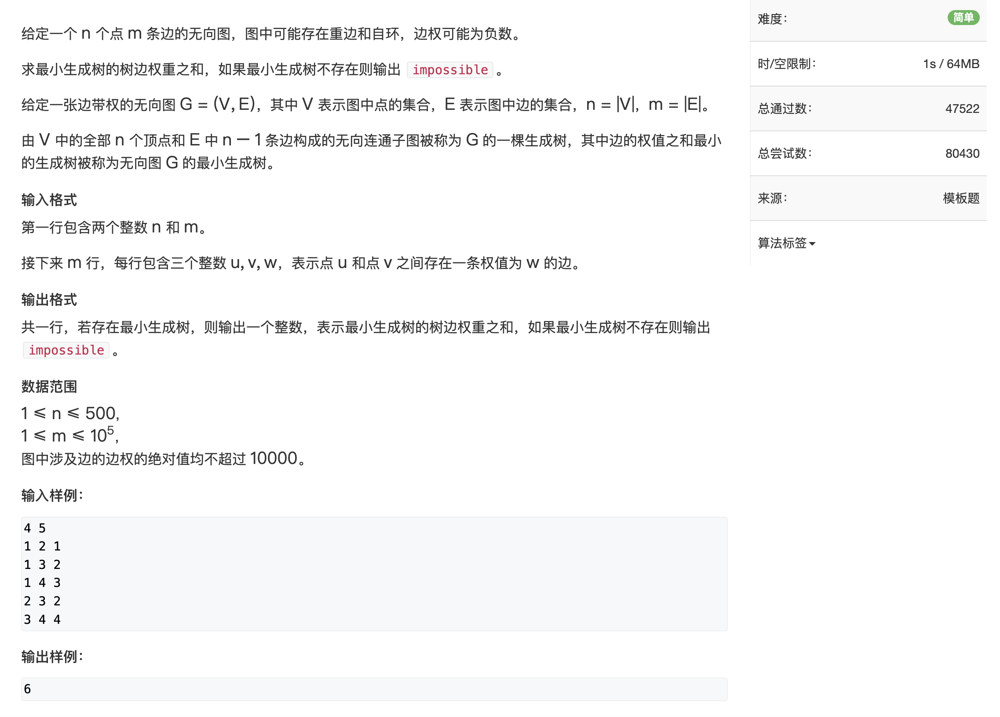
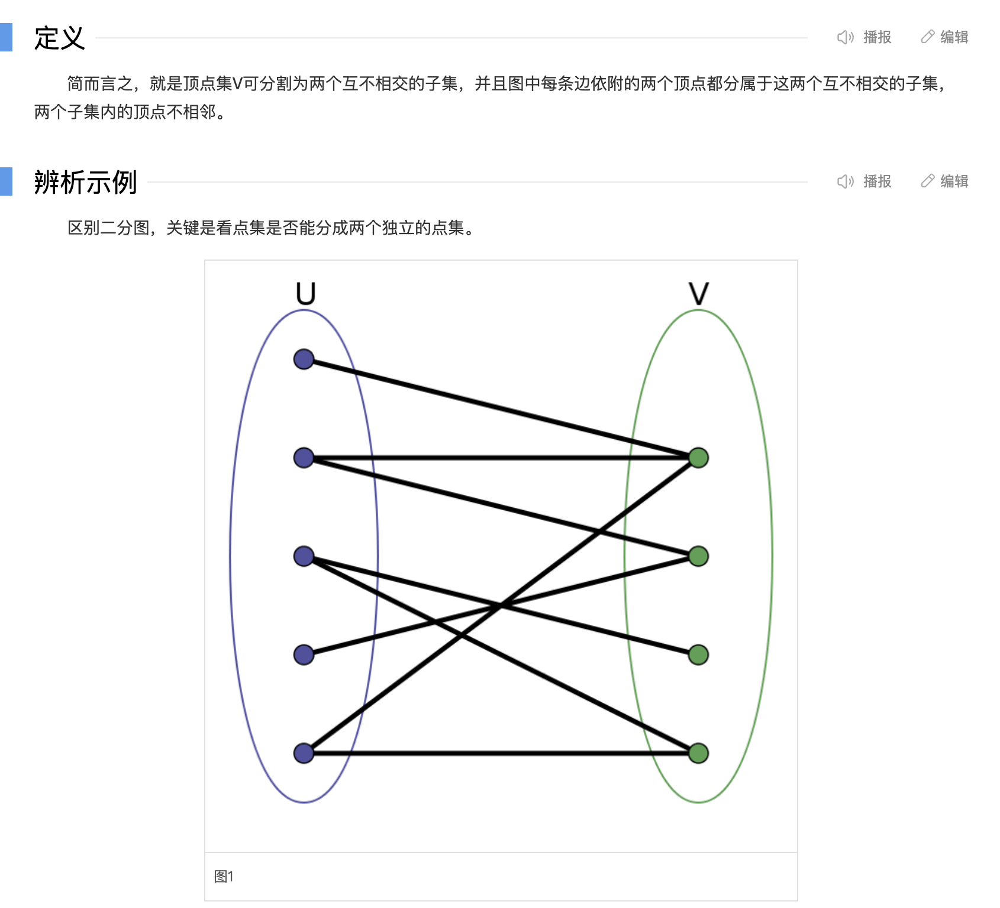

# 第三章、搜索与图论

## DFS


### 842.排列数字


```java
import java.util.Scanner;

public class Main {
    static final int N = 10;
    static int[] path = new int[N];//存路径
    static int[] state = new int[N];//存状态是否被用过
    static int n;
    static void dfs(int u){
        //n个数字填满了，退出递归;n=3的话，u=0,1,2还在递归，u=3退出递归
        if(u==n){
            for (int i = 0; i < n; i++) {
                System.out.print(path[i] + " ");
            }
            System.out.println();
            return;
        }

        for (int i = 1; i <= n; i++) {
            if(state[i] == 0){//如果i没被用过
                path[u] = i;
                state[i] = 1;//i用过了
                dfs(u+1);
                state[i] = 0;//每次回溯都要恢复现场
            }
        }
    }
    public static void main(String[] args) {
        Scanner scanner = new Scanner(System.in);
        n = scanner.nextInt();
        dfs(0);
    }
}

```


### 843.n皇后


```java
import java.util.Scanner;

public class ac843 {
    static final int N = 20;
    static int n;
    static char[][] g = new char[N][N];
    static int[] col = new int[N];//存状态
    static int[] dg = new int[N];//对角线
    static int[] udg = new int[N];//反对角线

    static void dfs(int u) {
        if (u == n) {
            for (int i = 0; i < n; i++) {
                for (int j = 0; j < n; j++) {
                    System.out.print(g[i][j]);
                }
                System.out.println();
            }
            System.out.println();
            return;
        }

        //枚举第u行
        for (int i = 0; i < n; i++) {
            if (col[i] == 0 && dg[i+u] == 0 && udg[i-u+n] == 0){//如果都有空余
                g[u][i] = 'Q';
                col[i] = dg[i+u] = udg[i-u+n] = 1;
                dfs(u+1);
                col[i] = dg[i+u] = udg[i-u+n] = 0;
                g[u][i] = '.';
            }
        }
    }

    public static void main(String[] args) {
        Scanner scanner = new Scanner(System.in);
        n = scanner.nextInt();
        for (int i = 0; i < n; i++) {
            for (int j = 0; j < n; j++) {
                g[i][j] = '.';
            }
        }
        dfs(0);
    }
}

```


## BFS

宽搜可以搜到最短路

模板

 


### 844.走迷宫


分析：可以用BFS来搜，因为这样可以搜到最短路，即最小的步数

```java
import java.io.BufferedReader;
import java.io.IOException;
import java.io.InputStreamReader;
import java.util.LinkedList;
import java.util.Queue;

public class Main {
    static final int N = 110;
    static final int M = 110;
    static int n;
    static int m;
    static int[][] maze = new int[N][M];
    static int[][] d = new int[N][M];//存点的距离
    static pair[][] prev = new pair[N][M];

    static int bfs(){
        Queue<pair> queue = new LinkedList<>();
        //向量存四个方向
        int[] dy = {0,1,0,-1};
        int[] dx = {-1,0,1,0};
        queue.offer(new pair(0,0));
        while (!queue.isEmpty()){
            pair temp = queue.poll();
            for (int i = 0; i < 4; i++) {
                int x = temp.first + dx[i];
                int y = temp.second + dy[i];
                if(x>=0 && x<n && y>=0 && y<m && d[x][y] == -1 && maze[x][y] ==0){
                    queue.offer(new pair(x,y));
                    d[x][y] = d[temp.first][temp.second] + 1;//距离是上个点+1
                    prev[x][y] = temp;//记录走过的点
                }
            }
        }

        int x = n-1;
        int y = m-1;
        while (x>0 || y>0){
            System.out.println(x + " " + y);
            pair temp = prev[x][y];
            x = temp.first;
            y = temp.second;
//            x = prev[x][y].first;
//            y = prev[x][y].second;
        }

        return d[n-1][m-1];//返回出口点的距离
    }

    public static void main(String[] args) throws IOException {
        BufferedReader br = new BufferedReader(new InputStreamReader(System.in));
        String[] s = br.readLine().split(" ");
        n = Integer.parseInt(s[0]);
        m = Integer.parseInt(s[1]);
        for (int i = 0; i < n; i++) {
            s = br.readLine().split(" ");
            for (int j = 0; j < m; j++) {
                maze[i][j] = Integer.parseInt(s[j]);
                d[i][j] = -1;
            }
        }
        d[0][0] = 0;
        System.out.println(bfs());
    }
}

```


bfs每次搜索距离相同的点，迷宫这道题中，上图右下角的点在第八次搜索中被搜到，所以八步


### 845.八数码


分析：初始->目标状态需要多少步；转化为bfs求最短路问题

```java
import java.io.BufferedReader;
import java.io.IOException;
import java.io.InputStreamReader;
import java.util.HashMap;
import java.util.LinkedList;
import java.util.Queue;

public class ac845 {
    static int bfs(String start) {//输入初始状态
        //定义终止状态
        String end = "12345678x";
        //定义队列和记录距离的map
        Queue<String> queue = new LinkedList<>();
        HashMap<String, Integer> d = new HashMap<>();
        //初始化队列和距离map
        queue.offer(start);
        d.put(start, 0);
        //转移数组
        int[] dx = {-1, 0, 1, 0};
        int[] dy = {0, 1, 0, -1};

        while (!queue.isEmpty()) {
            String curState = queue.poll();//当前状态
            int distance = d.get(curState);//当前距离
            //若达到终止状态，返回距离，即最优解
            if (curState.equals(end))
                return distance;
            //找到当前状态下，x在数组中的坐标xy
            int k = curState.indexOf('x');
            int x = k / 3;
            int y = k % 3;
            //状态转移
            for (int i = 0; i < 4; i++) {
                //a,b为转移后的坐标
                int a = x + dx[i];
                int b = y + dy[i];
                //没越界
                if(a>=0 && a<3 && b>=0 && b<3){
                    //当前状态下交换x至转移后的位置
                    String newState = swap(curState,k,a*3+b);
                    //如果d中没有新状态的键，则put并距离值为当前状态的距离+1，再入队
                    if(!d.containsKey(newState)){
                        d.put(newState,distance+1);
                        queue.offer(newState);
                    }
                }
            }
        }
        //没有达到终止状态
        return -1;
    }

    static String swap(String s,int a,int b){
        StringBuilder sb = new StringBuilder(s);
        char temp = sb.charAt(a);
        sb.setCharAt(a,sb.charAt(b));
        sb.setCharAt(b,temp);
        return sb.toString();
    }

    public static void main(String[] args) throws IOException {
        BufferedReader br = new BufferedReader(new InputStreamReader(System.in));
        String start = br.readLine().replaceAll(" ","");
        System.out.println(bfs(start));
    }
}

```


[AcWing 845. 八数码 - AcWing](https://www.acwing.com/solution/content/15149/)


## 树与图的深度优先遍历

### 846.树的重心


```java
import java.io.BufferedReader;
import java.io.IOException;
import java.io.InputStreamReader;
import java.util.Arrays;

public class ac846 {
    static final int N = 100010;
    static int[] value = new int[2 * N];//有向图，最多2N个元素
    static int[] next = new int[2 * N];
    static int[] head = new int[N];
    static int idx;
    static int n;
    static int ans = N;//答案最大为N
    static boolean[] state = new boolean[N];

    //头插
    static void add(int a, int b) {
        value[idx] = b;
        next[idx] = head[a];
        head[a] = idx++;
    }

    //返回u结点的子树的结点数
    static int dfs(int u) {
        int res = 0;//存连通图最大节点数
        int sum = 1;//存以u为根的节点数，包括n
        state[u] = true;//u被访问了，标记
        for (int i = head[u]; i != -1; i = next[i]) {
            int j = value[i];
            if (!state[j]) {//没被访问过
                int s = dfs(j);//s存j节点的子树的节点数
                res = Math.max(s, res);//记录最大的节点
                sum += s;
            }
        }
        res = Math.max(res, n - sum);
        ans = Math.min(res, ans);
        return sum;
    }

    public static void main(String[] args) throws IOException {
        BufferedReader br = new BufferedReader(new InputStreamReader(System.in));
        String[] s = br.readLine().split(" ");
        n = Integer.parseInt(s[0]);
        Arrays.fill(head, -1);//-1表示尾节点
        for (int i = 0; i < n - 1; i++) {
            s = br.readLine().split(" ");
            int a = Integer.parseInt(s[0]);
            int b = Integer.parseInt(s[1]);
            add(a, b);
            add(b, a);
        }

        dfs(1);//随意一个结点
        System.out.println(ans);
    }
}

```

[AcWing 846. 树的重心 详细注释 - AcWing](https://www.acwing.com/solution/content/13513/)

 


## 树与图的广度优先遍历

### 847.图中点的层次


```java
import java.io.BufferedReader;
import java.io.IOException;
import java.io.InputStreamReader;
import java.util.Arrays;
import java.util.LinkedList;
import java.util.Queue;

public class Main {
    static final int N = 100010;
    static int n;
    static int m;
    static int[] head = new int[N];
    static int[] value = new int[N];
    static int[] next = new int[N];
    static int idx;
    static int[] d = new int[N];

    static void add(int a, int b) {
        value[idx] = b;
        next[idx] = head[a];
        head[a] = idx++;
    }

    static int bfs() {
        Queue<Integer> queue = new LinkedList<>();
        Arrays.fill(d,-1);
        queue.offer(1);
        d[1] = 0;

        while (!queue.isEmpty()){
            int temp = queue.poll();
            //遍历temp的邻边
            for (int i = head[temp];i!=-1;i = next[i]){
                int j = value[i];
                //若果j没有扩展
                if(d[j] == -1){
                    d[j] = d[temp] +1;
                    queue.offer(j);
                }
            }
        }
        return d[n];
    }

    public static void main(String[] args) throws IOException {
        BufferedReader br = new BufferedReader(new InputStreamReader(System.in));
        String[] s = br.readLine().split(" ");
        n = Integer.parseInt(s[0]);
        m = Integer.parseInt(s[1]);
        //注意初始化位置不要放错了
        Arrays.fill(head,-1);
        while (m-- > 0) {
            s = br.readLine().split(" ");
            int a = Integer.parseInt(s[0]);
            int b = Integer.parseInt(s[1]);
            add(a, b);
        }
        System.out.println(bfs());
    }
}

```


## 拓扑排序


### 848.有向图的拓扑序列


```java
import java.io.BufferedReader;
import java.io.IOException;
import java.io.InputStreamReader;
import java.util.Arrays;


public class Main {
    static final int N = 100010;
    static int[] e = new int[N];
    static int[] h = new int[N];
    static int[] ne = new int[N];
    static int idx;
    static int n;
    static int[] queue = new int[N];
    static int hh = 0;
    static int tt = -1;
    static int[] d = new int[N];


    static void add(int a, int b) {
        e[idx] = b;
        ne[idx] = h[a];
        h[a] = idx++;
    }

    static void topSort() {
        //所有入度为0的点入队
        for (int i = 1; i <= n; i++) {
            if (d[i] == 0) {
                queue[++tt] = i;
            }
        }
        while (hh<=tt) {
            int t = queue[hh++];
            for (int i = h[t]; i != -1; i = ne[i]) {//循环删除t点出发的边
                int j = e[i];//点t一条边指向j
                d[j]--;//删除边以后，入度减1
                if (d[j] == 0) {//j的入度为0后，入队
                    queue[++tt] = j;
                }
            }
        }
        //如果n个点全部在队列中，则满足拓扑
        if (tt == n-1)
            for (int i = 0; i < n; i++) {
                System.out.print(queue[i] + " ");
            }
        else
            System.out.println("-1");
    }

    public static void main(String[] args) throws IOException {
        BufferedReader br = new BufferedReader(new InputStreamReader(System.in));
        String[] s = br.readLine().split(" ");
        n = Integer.parseInt(s[0]);
        int m = Integer.parseInt(s[1]);
        Arrays.fill(h, -1);
        while (m-- > 0) {
            s = br.readLine().split(" ");
            int a = Integer.parseInt(s[0]);
            int b = Integer.parseInt(s[1]);
            add(a, b);
            d[b]++;
        }
        topSort();
    }
}

```


## 最短路


### 849.Dijkstra最短路I


分析：朴素dijkstra适用于稠密图，即边数远远大于点数的情况, m >= n^2


```java
import java.io.BufferedReader;
import java.io.IOException;
import java.io.InputStreamReader;
import java.util.Arrays;

public class Main {
    static final int N = 510;
    static int[][] g = new int[N][N];//稠密图用邻接矩阵
    static int[] dist = new int[N];//记录每个点到1号点的最小距离
    static boolean[] st = new boolean[N];//记录每个点的最小距离是否已经被找到
    static int n;
    static int m;

    static int Dijkstra() {
        Arrays.fill(dist, 0x3f3f3f3f);//每个点最小距离初始化为无穷大
        dist[1] = 0;//第一个点到自己的距离是0
        for (int i = 0; i < n; i++) {//n个点要n次循环
            int t = -1;//t为当前访问的点
            for (int j = 1; j <= n; j++) {//点是1~n
                if (!st[j] && (t == -1 || dist[t] > dist[j]))//找到未确定最短路径的点中距离最短的点
                    t = j;
            }
            st[t] = true;//当前点被访问了
            for (int j = 1; j <= n; j++) {
                dist[j] = Math.min(dist[j],dist[t]+g[t][j] );//更新最短距离为 每个点自己之前的到1的距离和当前距离加上邻接矩阵中转移距离
            }
        }
        if(dist[n] == 0x3f3f3f3f) return -1;
        return dist[n];
    }

    public static void main(String[] args) throws IOException {
        BufferedReader br = new BufferedReader(new InputStreamReader(System.in));
        String[] s = br.readLine().split(" ");
        n = Integer.parseInt(s[0]);
        m = Integer.parseInt(s[1]);
        for (int i = 1; i <= n; i++) {
            Arrays.fill(g[i], 0x3f3f3f3f);//邻接矩阵初始化为无穷大
        }
        while (m-- > 0) {
            s = br.readLine().split(" ");
            int x = Integer.parseInt(s[0]);
            int y = Integer.parseInt(s[1]);
            int z = Integer.parseInt(s[2]);
            g[x][y] = Math.min(g[x][y], z);//有重边的话选择较短的那条
        }
        System.out.println(Dijkstra());
        br.close();
    }
}

```

[AcWing 849. Dijkstra求最短路 I - AcWing](https://www.acwing.com/solution/content/5806/)


### 850.Dijkstra最短路II


分析：稀疏图，即点与边相当或者大于边数，则需要用堆优化后的dijkstra算法


```java
import java.io.BufferedReader;
import java.io.IOException;
import java.io.InputStreamReader;
import java.util.Arrays;
import java.util.Comparator;
import java.util.PriorityQueue;

public class Main {
    static int N = 150010;
    //邻接表
    static int[] h = new int[N];
    static int[] ne = new int[N];
    static int[] e = new int[N];
    static int idx;

    static int[] dist = new int[N];
    static int[] w = new int[N];//权重
    static boolean[] st = new boolean[N];

    static void add(int a, int b,int c){
        w[idx] = c;
        e[idx] = b;
        ne[idx] = h[a];
        h[a] = idx++;
    }

    static int Dijkstra(){
        Arrays.fill(dist,0x3f3f3f3f);
        dist[1] = 0;
        PriorityQueue<pair> q = new PriorityQueue<>(new Comparator<pair>() {
            @Override
            public int compare(pair o1, pair o2) {
                return o1.first - o2.first;
            }
        });

        q.offer(new pair(0,1));
        while (!q.isEmpty()){
            pair k = q.poll();//距离最短的点出队
            int t = k.second; int d = k.first;
            if(st[t]) continue;//如果已经找到了最短路径，则跳过
            st[t] = true;
            for (int i = h[t];i!=-1;i = ne[i]){
                int j = e[i];
                if(dist[j] > d + w[i]){
                    dist[j] = d + w[i];
                    q.offer(new pair(dist[j], j));
                }
            }
        }
        if(dist[n] == 0x3f3f3f3f) return -1;
        return dist[n];
    }

    static int n,m;

    public static void main(String[] args) throws IOException {
        BufferedReader br = new BufferedReader(new InputStreamReader(System.in));
        String[] s = br.readLine().split(" ");
        n = Integer.parseInt(s[0]);
        m = Integer.parseInt(s[1]);
        Arrays.fill(h,-1);
        while (m-- > 0) {
            s = br.readLine().split(" ");
            int x = Integer.parseInt(s[0]);
            int y = Integer.parseInt(s[1]);
            int z = Integer.parseInt(s[2]);
            add(x,y,z);
        }
        System.out.println(Dijkstra());
        br.close();
    }
}


class pair {
    public pair(int first, int second) {
        this.first = first;
        this.second = second;
    }

    int first;
    int second;
}

```

[AcWing 850. 朴素Dijkstra与堆优化Dijkstra总结 - AcWing](https://www.acwing.com/solution/content/6554/)


### 853.有边数限制的最短路（bellman-ford)


贝尔曼佛得算法允许图中有负环，但必须有边数限制的题；本题只能用贝尔曼佛得算法；

其他情况下完全可以用spfa算法替代

```java
import java.io.BufferedReader;
import java.io.IOException;
import java.io.InputStreamReader;
import java.util.Arrays;

public class Main {
    static final int N = 510;
    static final int M = 100010;
    static int n;
    static int m;
    static int k;//最多k条边
    static int[] dist = new int[N];
    static int[] backup = new int[N];//备份上次循环的dist，防止串联
    static edge[] edges = new edge[M];
    static final int INF = 0x3f3f3f3f;

    static int bellman_ford(){
        Arrays.fill(dist,INF);
        dist[1] = 0;
        for (int i = 0; i < k; i++) {//最多k条边,所以做多k次大循环
            backup = Arrays.copyOf(dist,n+1);
            for (int j = 0; j < m; j++) {//总共m条边
                edge e = edges[j];
                dist[e.end] = Math.min(dist[e.end],backup[e.start] + e.weight );//注意要用backup
            }
        }
        return dist[n];
    }
    public static void main(String[] args) throws IOException {
        BufferedReader br = new BufferedReader(new InputStreamReader(System.in));
        String[] s = br.readLine().split(" ");
        n = Integer.parseInt(s[0]);
        m = Integer.parseInt(s[1]);
        k = Integer.parseInt(s[2]);
        for (int i = 0; i < m; i++) {
            s = br.readLine().split(" ");
            int start = Integer.parseInt(s[0]);
            int end = Integer.parseInt(s[1]);
            int weight = Integer.parseInt(s[2]);
            edges[i] = new edge(start,end,weight);
        }
        int t = bellman_ford();
        if(t > INF/2) System.out.println("impossible");
        else
            System.out.println(t);
    }
}

class edge{
    int start;
    int end;
    int weight;

    public edge(int start, int end, int weight) {
        this.start = start;
        this.end = end;
        this.weight = weight;
    }
}

```

[AcWing 853. 有边数限制的最短路 - AcWing](https://www.acwing.com/solution/content/6320/)


### 851.spfa求最短路


分析：贝尔曼佛得算法每次都遍历所有的边来更新距离，然而在dist[end] = Math.min(dist[e.end],backup[e.start] + e.weight )中，只有在start的距离变小的前提下，end才可能会更新。所以用一个队列，里面存放start变小的边

```java
import java.io.BufferedReader;
import java.io.IOException;
import java.io.InputStreamReader;
import java.util.Arrays;
import java.util.LinkedList;
import java.util.Queue;

public class Main {
    static final int N = 100010;
    static final int M = 100010;
    static int[] e = new int[N];
    static int[] ne = new int[N];
    static int[] h = new int[N];
    static int idx;
    static int[] w = new int[N];
    static int n;
    static int m;

    static int[] dist = new int[N];
    static boolean[] st = new boolean[N];

    static void add(int a, int b, int c) {
        w[idx] = c;
        e[idx] = b;
        ne[idx] = h[a];
        h[a] = idx++;
    }

    static int spfa() {
        Queue<Integer> q = new LinkedList<>();
        Arrays.fill(dist,0x3f3f3f3f);
        dist[1] = 0;
        q.offer(1);//下标
        st[1] = true;
        while (!q.isEmpty()){
            int t = q.poll();
            st[t] = false;//取出来后st置false
            for (int i = h[t];i !=-1;i = ne[i]){
                int j = e[i];
                if(dist[j] > dist[t] + w[i]){
                    dist[j] = dist[t] + w[i];
                    if(!st[j]){//如果未加入，则加入
                        st[j] = true;
                        q.offer(j);
                    }
                }
            }
        }
        return dist[n];
    }

    public static void main(String[] args) throws IOException {
        BufferedReader br = new BufferedReader(new InputStreamReader(System.in));
        String[] s = br.readLine().split(" ");
        n = Integer.parseInt(s[0]);
        m = Integer.parseInt(s[1]);
        Arrays.fill(h, -1);
        for (int i = 0; i < m; i++) {
            s = br.readLine().split(" ");
            int a = Integer.parseInt(s[0]);
            int b = Integer.parseInt(s[1]);
            int w = Integer.parseInt(s[2]);
            add(a, b, w);
        }
        int t = spfa();
        if (t == 0x3f3f3f3f) System.out.println("impossible");
        else
            System.out.println(t);
    }
}

```

[AcWing 851. SPFA算法 - AcWing](https://www.acwing.com/solution/content/9306/)


### 852.spfa判断负环


用cnt[x]维护 1~x最短路的边数;如果出现cnt[x]>=n了，那就表示存在了负环

```java
import java.io.BufferedReader;
import java.io.IOException;
import java.io.InputStreamReader;
import java.util.Arrays;
import java.util.LinkedList;
import java.util.Queue;

public class Main {
    static final int N = 10010;
    static final int M = 10010;

    static int[] e = new int[N];
    static int[] ne = new int[N];
    static int[] h = new int[N];
    static int idx;
    static int[] w = new int[N];
    static int n;
    static int m;
    static int[] cnt = new int[N];
    static boolean[] st = new boolean[N];
    static int[] dist = new int[N];

    static void add(int a, int b, int c) {
        w[idx] = c;
        e[idx] = b;
        ne[idx] = h[a];
        h[a] = idx++;
    }

    static boolean spfa() {
        Queue<Integer> q = new LinkedList<>();
        //所有的点都入队
        for (int i = 1; i <= n; i++) {
            q.offer(i);
            st[i] = true;
        }
        while (!q.isEmpty()) {
            int t = q.poll();
            st[t] = false;
            for (int i = h[t]; i != -1; i = ne[i]) {
                int j = e[i];
                if (dist[j] > dist[t] + w[i]) {
                    dist[j] = dist[t] + w[i];
                    cnt[j] = cnt[t] + 1;
                    if(!st[j]){
                        q.offer(j);
                        st[j] = true;
                    }
                    if(cnt[j] >= n)
                        return true;
                }
            }
        }
        return false;
    }

    public static void main(String[] args) throws IOException {
        BufferedReader br = new BufferedReader(new InputStreamReader(System.in));
        String[] s = br.readLine().split(" ");
        n = Integer.parseInt(s[0]);
        m = Integer.parseInt(s[1]);
        Arrays.fill(h, -1);
        for (int i = 0; i < m; i++) {
            s = br.readLine().split(" ");
            int a = Integer.parseInt(s[0]);
            int b = Integer.parseInt(s[1]);
            int w = Integer.parseInt(s[2]);
            add(a, b, w);
        }
        boolean res = spfa();
        if (res) System.out.println("Yes");
        else
            System.out.println("No");
    }
}

```

[AcWing 852. spfa判断负环 - AcWing](https://www.acwing.com/solution/content/6336/)


### 854.Floyd求最短路


用于求解多源汇最短路问题

```java
import java.io.BufferedReader;
import java.io.IOException;
import java.io.InputStreamReader;
import java.util.Arrays;

public class Main {
    static final int N = 210;
    static final int M = 20010;
    static final int INF = 0x3f3f3f3f;
    static int n, m, k;
    static int[][] dist = new int[N][N];//dist[i][j]表示i到j的距离

    static void floyd(){
        for (int k = 1; k <= n; k++) {
            for (int i = 1; i <= n; i++) {
                for (int j = 1; j <= n; j++) {
                    dist[i][j] = Math.min(dist[i][j],dist[i][k] + dist[k][j]);
                }
            }
        }
    }

    public static void main(String[] args) throws IOException {
        BufferedReader br = new BufferedReader(new InputStreamReader(System.in));
        String[] s = br.readLine().split(" ");
        n = Integer.parseInt(s[0]);
        m = Integer.parseInt(s[1]);
        k = Integer.parseInt(s[2]);
        for (int i = 1; i <= n; i++) {
            for (int j = 1; j <= n; j++) {
                dist[i][j] = INF;
                if(i==j)
                    dist[i][j] = 0;
            }
        }
        while (m-- > 0) {
            s = br.readLine().split(" ");
            int x = Integer.parseInt(s[0]);
            int y = Integer.parseInt(s[1]);
            int z = Integer.parseInt(s[2]);
            dist[x][y] = Math.min(dist[x][y],z);
        }
        floyd();

        while (k-->0){
            s = br.readLine().split(" ");
            int x = Integer.parseInt(s[0]);
            int y = Integer.parseInt(s[1]);
            if(dist[x][y] > INF/2) System.out.println("impossible");
            else
                System.out.println(dist[x][y]);
        }
    }
}

```


## 最小生成树


稠密图用朴素prim

稀疏图用kruskal


### 858.Prim算法求最小生成树




```java
import java.io.BufferedReader;
import java.io.IOException;
import java.io.InputStreamReader;
import java.util.Arrays;

public class Main {
    static final int N = 510;
    static final int INF = 0x3f3f3f3f;
    static int n, m;
    static int[][] g = new int[N][N];//稠密图用邻接矩阵
    static int[] dist = new int[N];
    static boolean[] st = new boolean[N];

    static int prim() {
        Arrays.fill(dist, INF);
        int res = 0;
        dist[1] = 0;
        for (int i = 0; i < n; i++) {//每次循环将一个点加入集合
            int t = -1;
            for (int j = 1; j <= n; j++) {//找到不在集合中的离集合距离最短的点
                if (!st[j] && (t == -1 || dist[t] > dist[j]))
                    t = j;
            }
            if (dist[t] == INF) return INF;//如果找不到连通的点了，就不能生产最小生成树
            res += dist[t];
            st[t] = true;
            for (int j = 1; j <= n; j++) {
                dist[j] = Math.min(dist[j], g[t][j]);
            }
        }
        return res;
    }

    public static void main(String[] args) throws IOException {
        BufferedReader br = new BufferedReader(new InputStreamReader(System.in));
        String[] s = br.readLine().split(" ");
        n = Integer.parseInt(s[0]);
        m = Integer.parseInt(s[1]);
        //边初始化为无穷大
        for (int i = 1; i <= n; i++) {
            for (int j = 1; j <=n ; j++) {
                g[i][j] = INF;
                if (i == j)
                    g[i][j] = 0;
            }
        }
        while (m-- > 0) {
            s = br.readLine().split(" ");
            int a = Integer.parseInt(s[0]);
            int b = Integer.parseInt(s[1]);
            int w = Integer.parseInt(s[2]);
            g[a][b] = g[b][a] = Math.min(g[a][b], w);//无向图
        }
        int t = prim();
        if (t == INF) System.out.println("impossible");
        else
            System.out.println(t);
    }
}

```


### 859.Kruskal算法求最小生成树


```java
import java.io.BufferedReader;
import java.io.IOException;
import java.io.InputStreamReader;
import java.util.Arrays;
import java.util.Comparator;

public class Main {
    static final int N = 100010;
    static final int M = 200010;
    static int n, m;
    static edge[] edges = new edge[M];

    static int[] p = new int[N];

    static int find(int x) {
        if (p[x] != x) p[x] = find(p[x]);
        return p[x];
    }

    static int kruskal() {
        int res = 0;//记录最小生成树权重和
        int cnt = 0;//记录生成树集合中的边数
        for (int i = 0; i < m; i++) {//遍历所有的边，如果边的两个点不在同一个集合中，就合并
            edge e = edges[i];
            int start = e.start;
            int end = e.end;
            int w = e.weight;
            int a = find(start);
            int b = find(end);
            if (a != b){
                p[a] = b;
                cnt++;
                res += w;
            }
        }
        if (cnt == n - 1) return res;
        else return -1;
    }

    public static void main(String[] args) throws IOException {
        BufferedReader br = new BufferedReader(new InputStreamReader(System.in));
        String[] s = br.readLine().split(" ");
        n = Integer.parseInt(s[0]);
        m = Integer.parseInt(s[1]);
        //集合初始化
        for (int i = 0; i < n; i++) {
            p[i] = i;
        }
        //建边
        for (int i = 0; i < m; i++) {
            s = br.readLine().split(" ");
            int a = Integer.parseInt(s[0]);
            int b = Integer.parseInt(s[1]);
            int w = Integer.parseInt(s[2]);
            edges[i] = new edge(a, b, w);
        }
        //按边的权重从小到大排序
        Arrays.sort(edges, 0, m, new Comparator<edge>() {
            @Override
            public int compare(edge o1, edge o2) {
                return o1.weight - o2.weight;
            }
        });
        int t = kruskal();
        if (t == -1) System.out.println("impossible");
        else
            System.out.println(t);
    }
}

class edge{
    int start;
    int end;
    int weight;

    public edge(int start, int end, int weight) {
        this.start = start;
        this.end = end;
        this.weight = weight;
    }
}

```


## 二分图：染色法、匈牙利算法

二分图的定义：




**重要性质**：

**一个图是二分图   <==> 图中不含有奇数环**

### 860.染色法判定二分图


```java
import java.io.BufferedReader;
import java.io.IOException;
import java.io.InputStreamReader;
import java.util.Arrays;

public class Main {
    static final int N = 100010;
    static int n, m;

    static int[] h = new int[N];
    static int[] e = new int[2*N];//无向图 e和ne要开两倍
    static int[] ne = new int[2*N];
    static int idx;

    static int[] color = new int[N];//存每个点染的颜色 0表示未染， 1，,2为两种颜色

    static void add(int a,int b){
        e[idx] = b;
        ne[idx] = h[a];
        h[a] = idx++;
    }

    static boolean dfs(int u,int c){
        color[u] = c;//当前的点染色
        //对邻接点染色
        for (int i = h[u];i!=-1;i=ne[i]){
            int j = e[i];
            //邻接点染色为当前点的另一种颜色，如果当前点是1，则邻接点染色成2
            if(color[j] == 0){//未染色
                if(!dfs(j,3-c))//邻接点染色失败
                    return false;
            } else if (color[j]==c) { //已经染上色了，但是邻接的两点颜色相同
                return false;
            }
        }
        return true;
    }

    public static void main(String[] args) throws IOException {
        BufferedReader br = new BufferedReader(new InputStreamReader(System.in));
        String[] s = br.readLine().split(" ");
        n = Integer.parseInt(s[0]);
        m = Integer.parseInt(s[1]);
        Arrays.fill(h,-1);
        for (int i = 0; i < m; i++) {
            s = br.readLine().split(" ");
            int a = Integer.parseInt(s[0]);
            int b = Integer.parseInt(s[1]);
            add(a,b);
            add(b,a);
        }
        boolean flag = true;
        //对所有未染色的点进行染色，若染色失败则将flag置false后退出遍历
        for (int i = 1; i <= n; i++) {
            if(color[i] == 0){
                if(!dfs(i,1)){
                    flag = false;
                    break;
                }
            }
        }
        if(flag) System.out.println("Yes");
        else
            System.out.println("No");
    }
}

```

[AcWing 860. 染色法判定二分图 - AcWing](https://www.acwing.com/solution/content/5281/)


### 861.二分图的最大匹配


```java
import java.io.BufferedReader;
import java.io.IOException;
import java.io.InputStreamReader;
import java.util.Arrays;

public class Main {
    static final int N = 510;
    static final int M = 100010;
    static int n1, n2, m;

    static int[] h = new int[N];
    static int[] ne = new int[M];
    static int[] e = new int[M];
    static int idx;

    static int[] match = new int[N];//match[j]=a 表示 j女生配对a男生
    static boolean[] st = new boolean[N];//st[j]=true 表示本轮配对中 j女生被预定了

    static void add(int a, int b) {
        e[idx] = b;
        ne[idx] = h[a];
        h[a] = idx++;
    }

    static boolean find(int x) {
        for (int i = h[x]; i != -1; i = ne[i]){//遍历男生x预定的所有女生
            int j = e[i];//j是女生的标号
            if(!st[j]){//如果本轮匹配中，j女生没有被预定，则进行配对
                st[j] = true;//女生被预定
                if(match[j]==0 || find(match[j])){//如果女生j没有配对的男友，或者其男友match[j]预定了其他女孩，则配对成功
                    match[j] = x;
                    return true;
                }
            }
        }
        return false;
    }

    public static void main(String[] args) throws IOException {
        BufferedReader br = new BufferedReader(new InputStreamReader(System.in));
        String[] s = br.readLine().split(" ");
        n1 = Integer.parseInt(s[0]);
        n2 = Integer.parseInt(s[1]);
        m = Integer.parseInt(s[2]);
        Arrays.fill(h, -1);
        while (m-- > 0) {
            s = br.readLine().split(" ");
            int u = Integer.parseInt(s[0]);
            int v = Integer.parseInt(s[1]);
            add(u, v);
        }
        int res = 0;
        for (int i = 1; i <= n1; i++) {//遍历男生 进行配对
            Arrays.fill(st, false);//每次配对都要初始化
            if (find(i))
                res++;
        }
        System.out.println(res);
    }
}

```


[AcWing 861. 二分图的最大匹配 - AcWing](https://www.acwing.com/solution/content/5334/)


