# 数学知识

## 质数

### 866.试除法判定质数

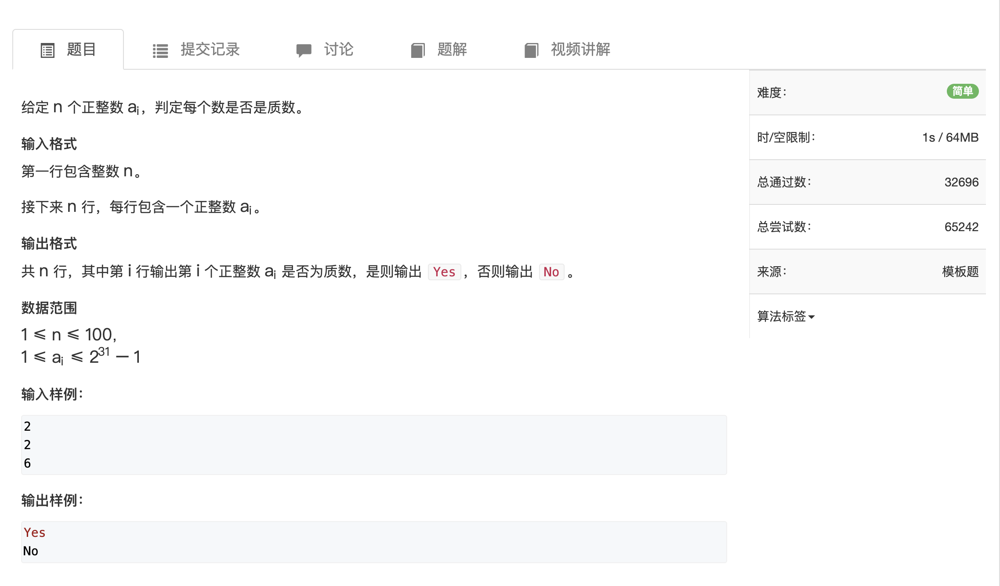

```java
import java.util.Scanner;

public class Main {
    static boolean isPrime(int n) {
        if(n<2) return false;
        for (int i = 2; i <= n / i; i++) {//优化
            if (n % i == 0)
                return false;
        }
        return true;
    }

    public static void main(String[] args) {
        Scanner scanner = new Scanner(System.in);
        int m = scanner.nextInt();
        while (m-- > 0) {
            int n = scanner.nextInt();
            if (isPrime(n)) System.out.println("Yes");
            else System.out.println("No");
        }
    }
}

```


### 867.分解质因数

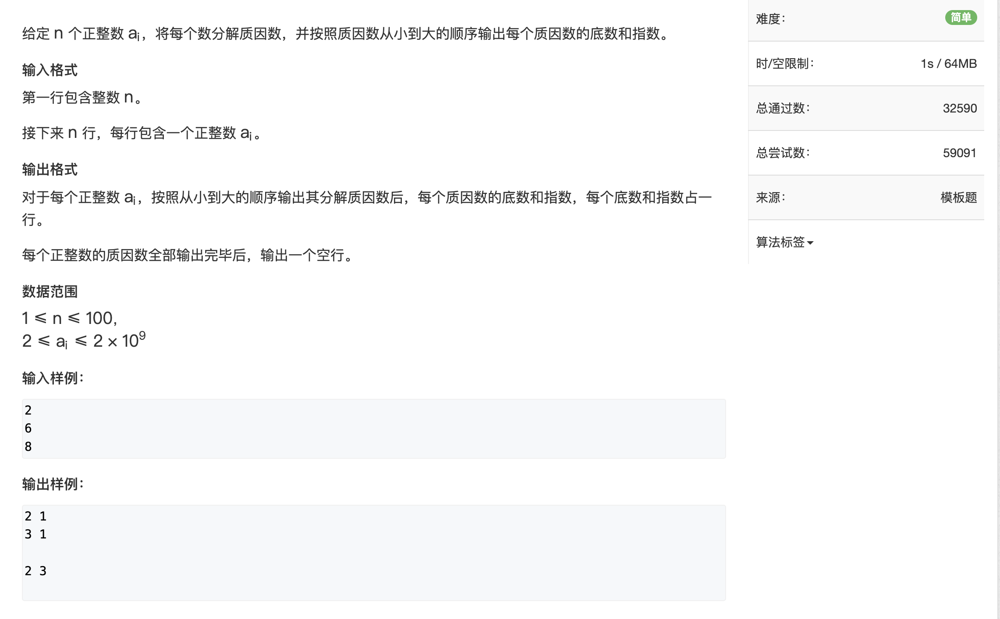

```java
import java.util.Scanner;

public class Main {
    public static void main(String[] args) {
        Scanner scanner = new Scanner(System.in);
        int m = scanner.nextInt();
        while (m-->0){
            int n = scanner.nextInt();
            for (int i = 2; i <= n/i; i++) {
                if(n%i==0) {
                    int s =0;
                    while (n % i == 0) {
                        n /= i;
                        s++;
                    }
                    System.out.println(i + " " + s);
                }
            }
            if(n>1) System.out.println(n+ " " + 1);
            System.out.println();
        }
    }
}

```

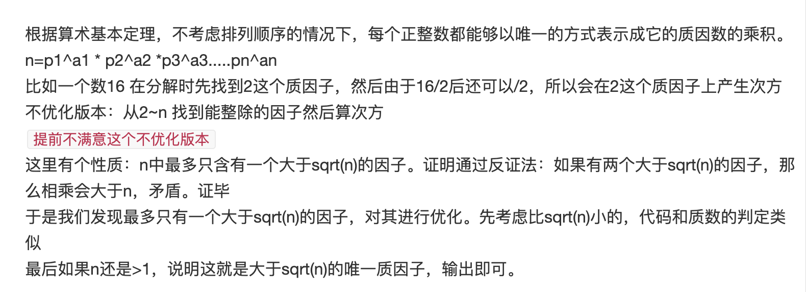


### 868.筛质数

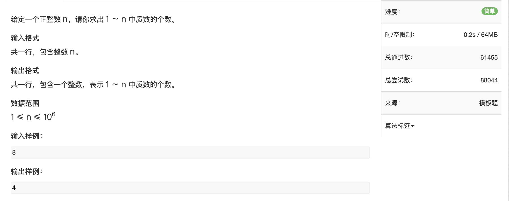

```java
import java.util.Scanner;

public class Main {
    static final int N = 1000010;
    static int cnt;//记录质因数个数
    static int[] prime = new int[N];//prime[i]是第i个素数
    static boolean[] st = new boolean[N];//st[i]=true表示i被筛除

    static void getPrimes(int n){//线性筛，每次只用最小质因数去筛除
        for (int i = 2; i <= n; i++) {
            if(!st[i]) prime[cnt++] = i;//如果i没有被筛除，则将其加入prime
            for (int j = 0; prime[j] <= n/i; j++) {//开筛,prime[j] <= n/i筛除了所有大于n的点
                st[prime[j]*i] = true;//prime[j]一定是i*prime[j]的最小质因数，所以直接删除
                if(i%prime[j] == 0) break;//如果prime[j]的i的最小质因数，那么i*prime[j+1]这个合数肯定被prime[j]乘以某个数筛掉，为了避免重复，跳出循环
                //即i=k*prime[j]，那么i*prime[j+1]=(k*prime[j])*prime[j+1]=k’*prime[j]
            }
        }
    }
    public static void main(String[] args) {
        Scanner scanner = new Scanner(System.in);
        int n = scanner.nextInt();
        getPrimes(n);
        System.out.println(cnt);
    }
}

```

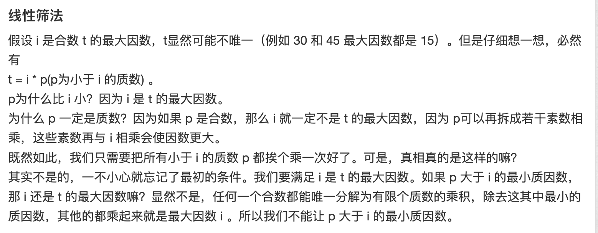


## 约数

### 869.试除法求约数

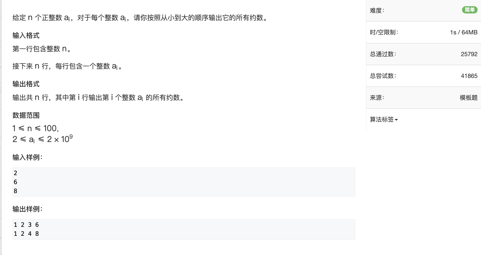


```java
import java.util.ArrayList;
import java.util.Comparator;
import java.util.Scanner;

public class Main {
    static void getDivisors(int n){
        ArrayList<Integer> list = new ArrayList<>();
        for (int i = 1; i <= n/i; i++) {
            if(n%i==0){
                list.add(i);
                if(i != n/i)
                    list.add(n/i);//避免i^2=n时重复加入
            }
        }
        list.sort(new Comparator<Integer>() {
            @Override
            public int compare(Integer o1, Integer o2) {
                return o1-o2;
            }
        });
        for (Integer i : list) {
            System.out.print(i + " ");
        }
    }

    public static void main(String[] args) {
        Scanner scanner = new Scanner(System.in);
        int m = scanner.nextInt();
        while (m-->0){
            int n = scanner.nextInt();
            getDivisors(n);
            System.out.println();
        }
    }
}

```


### 870.约数个数

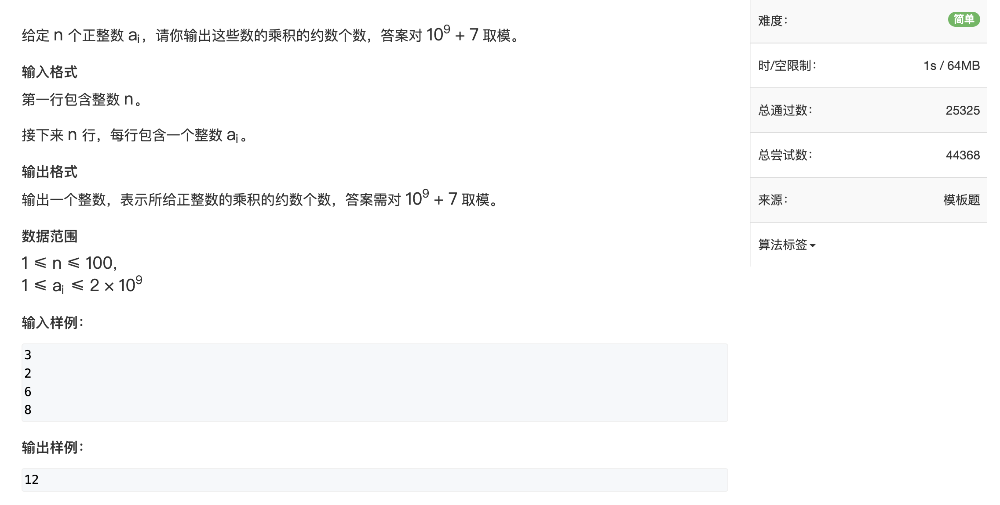


```java
import java.util.HashMap;
import java.util.Map;
import java.util.Scanner;

public class Main {
    public static void main(String[] args) {
        Scanner scanner = new Scanner(System.in);
        int m = scanner.nextInt();
        long res = 1;
        HashMap<Integer, Integer> map = new HashMap<>();//<质因数,个数>
        while (m-->0){
            int n = scanner.nextInt();
            for (int i = 2; i <= n/i; i++) {
                while (n%i ==0){
                    n /= i;
                    map.put(i,map.getOrDefault(i,0)+1);
                }
            }
            if(n>1) map.put(n,map.getOrDefault(n,0)+1);
        }
        for (Map.Entry<Integer, Integer> entry : map.entrySet()) {
            res = (res * (entry.getValue()+1))%1000000007;
        }
        System.out.println(res);
    }
}

```

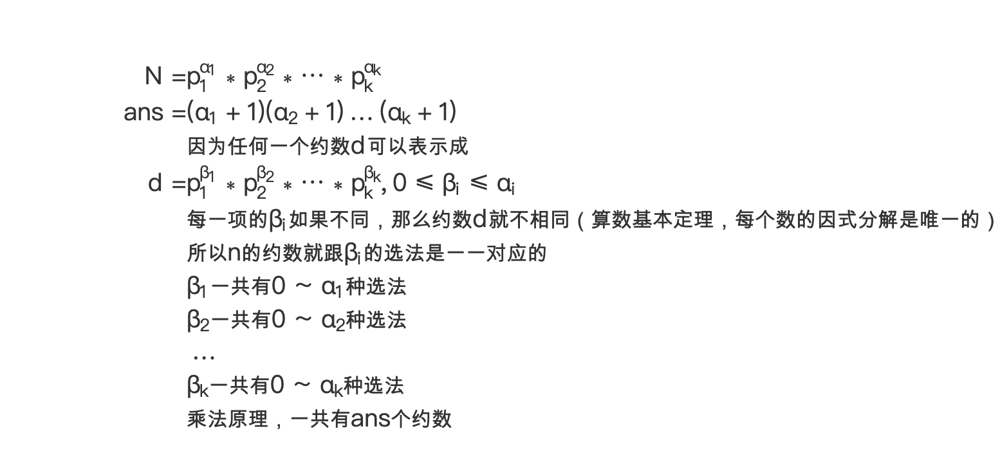


### 871.约数之和

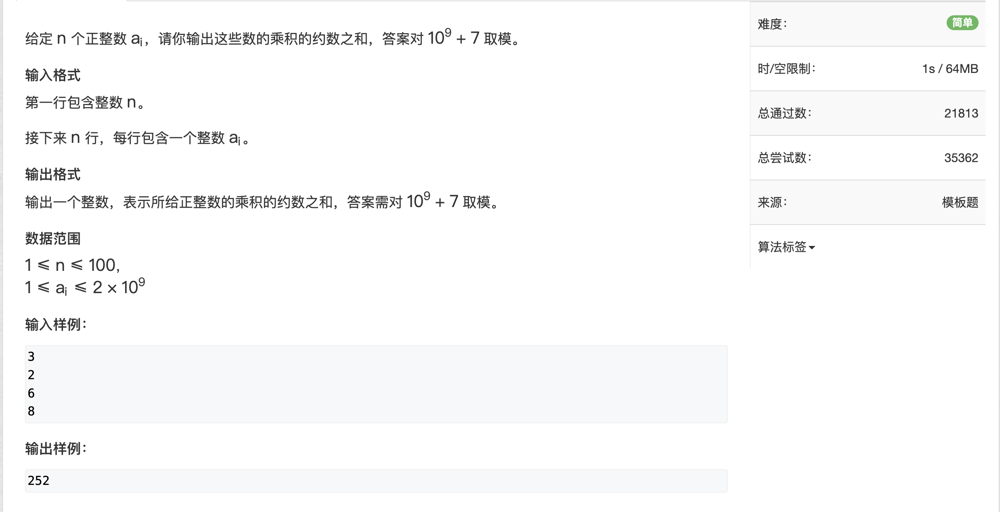


```java
import java.util.HashMap;
import java.util.Map;
import java.util.Scanner;

public class Main {
    public static void main(String[] args) {
        Scanner scanner = new Scanner(System.in);
        int m = scanner.nextInt();
        long res = 1;
        HashMap<Integer, Integer> map = new HashMap<>();
        while (m-- > 0) {
            int n = scanner.nextInt();
            for (int i = 2; i <= n / i; i++) {
                while (n % i == 0) {
                    n /= i;
                    map.put(i, map.getOrDefault(i, 0) + 1);
                }
            }
            if (n > 1) map.put(n, map.getOrDefault(n, 0) + 1);
        }
        for (Map.Entry<Integer, Integer> entry : map.entrySet()) {
            int a = entry.getKey();
            int b = entry.getValue();
            long t = 1;
            while (b-- > 0) {
                t = (t * a + 1) % ((int)1e9+7);
            }
            res = res * t % ((int)1e9+7);
        }
        System.out.println(res);
    }
}

```

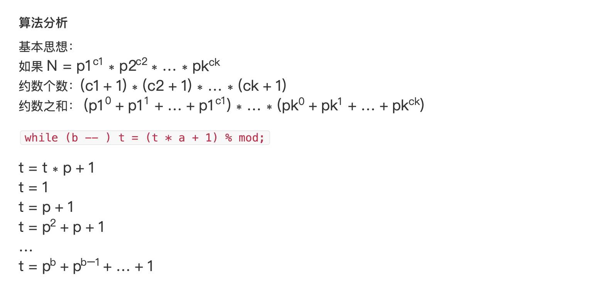


### 872.最大公约数(辗转相除)

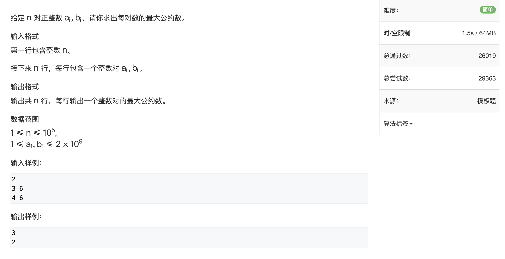

```java
import java.util.Scanner;

public class Main {
    static int a,b,m;
    static int gcd(int a,int b){
        if(b ==0) return a;
        return gcd(b,a%b);
    }
    public static void main(String[] args) {
        Scanner scanner = new Scanner(System.in);
        m = scanner.nextInt();
        while (m-->0){
            a = scanner.nextInt();
            b = scanner.nextInt();
            System.out.println(gcd(a, b));
        }
    }
}

```


## 欧拉函数

### 873.欧拉函数

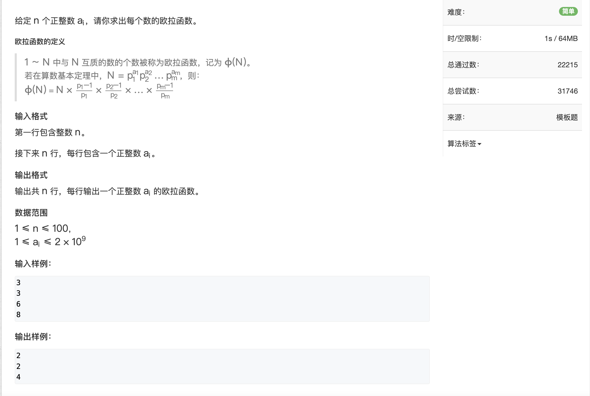

```java
import java.util.Scanner;

public class Main {
    static long getEuler(int n) {
        long res = n;
        for (int i = 2; i <= n / i; i++) {
            if (n % i == 0) {
                while (n % i == 0)
                    n /= i;
                res = res / i * (i - 1);
            }
        }
        if (n > 1) res = res / n * (n - 1);
        return res;
    }

    public static void main(String[] args) {
        Scanner scanner = new Scanner(System.in);
        int m = scanner.nextInt();
        while (m-- > 0) {
            int n = scanner.nextInt();
            System.out.println(getEuler(n));
        }
    }
}

```


### 874.筛法求欧拉函数

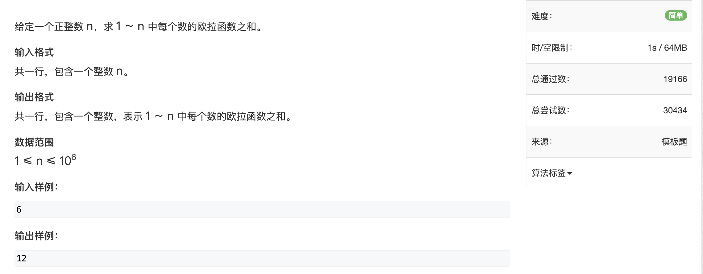

```java
import java.util.Scanner;

public class Main {
    static final int N = 1000010;
    static int[] primes = new int[N];
    static int[] phi = new int[N];
    static boolean[] st = new boolean[N];
    static int cnt;

    static void getEuler(int n) {
        phi[1] = 1;
        //注意筛法要遍历2~n
        for (int i = 2; i <= n; i++) {
            if (!st[i]) {//如果i未被筛除，则说明i是质数，质数的phi是i-1
                primes[cnt++] = i;
                phi[i] = i - 1;
            }
            for (int j = 0; primes[j] <= n / i; j++) {
                st[primes[j] * i] = true;
                if (i % primes[j] == 0) {//如果pj是i的质因数
                    phi[primes[j] * i] = phi[i] * primes[j];
                    break;
                }
                phi[primes[j] * i] = phi[i] * (primes[j] - 1);
            }
        }
    }

    public static void main(String[] args) {
        Scanner scanner = new Scanner(System.in);
        int n = scanner.nextInt();
        long res = 0;
        getEuler(n);
        for (int i = 1; i <= n; i++) {
            res += phi[i];
        }
        System.out.println(res);
    }
}

```

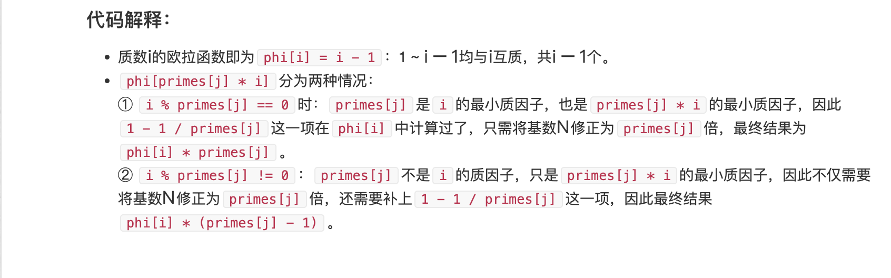


## 快速幂

### 875.快速幂

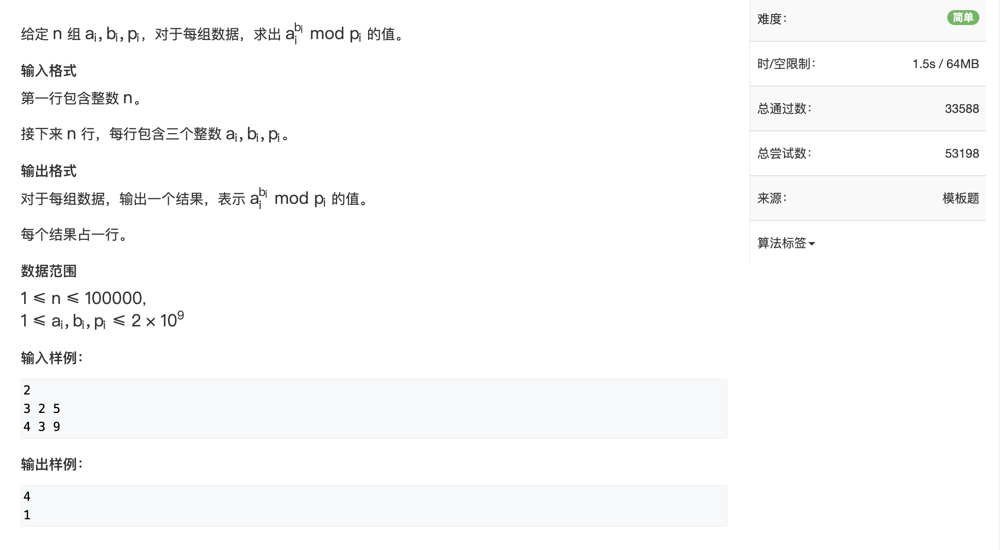

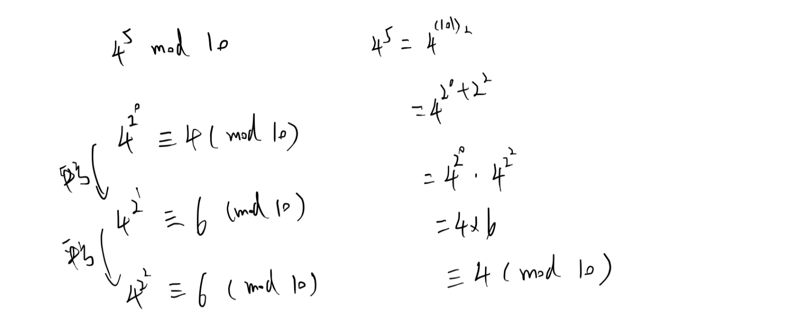

```java
import java.io.BufferedReader;
import java.io.IOException;
import java.io.InputStreamReader;

public class Main {
    static long qmi(long a,long k,long p){
        long res = 1;
        while (k>0){
            if((k&1)==1) res = res*a%p;
            k = k>>1;
            a = a*a%p;
        }
        return res;
    }
    public static void main(String[] args) throws IOException {
        BufferedReader br = new BufferedReader(new InputStreamReader(System.in));
        String[] s = br.readLine().split(" ");
        int m = Integer.parseInt(s[0]);
        while (m-->0){
            s = br.readLine().split(" ");
            long a = Integer.parseInt(s[0]);
            long k = Integer.parseInt(s[1]);
            long p = Integer.parseInt(s[2]);
            System.out.println(qmi(a, k, p));
        }
    }
}

```


### 876.快速幂求逆元

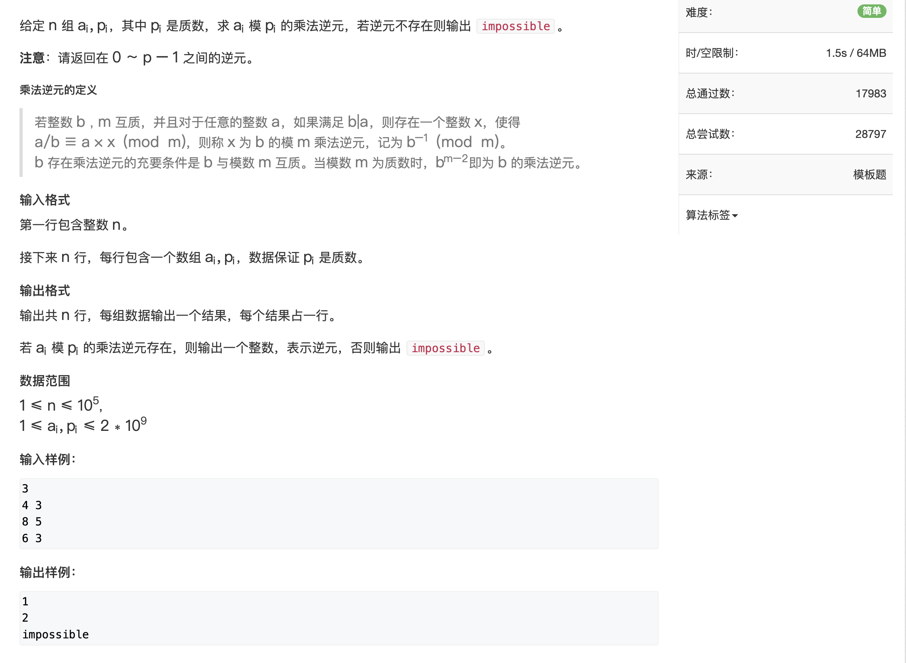

```java
import java.io.BufferedReader;
import java.io.IOException;
import java.io.InputStreamReader;

public class Main {
    static long qmi(long a, long k, long p) {
        long res = 1;
        while (k > 0) {
            if ((k & 1) == 1) res = res * a % p;
            k = k >> 1;
            a = a * a % p;
        }
        return res;
    }

    public static void main(String[] args) throws IOException {
        BufferedReader br = new BufferedReader(new InputStreamReader(System.in));
        String[] s = br.readLine().split(" ");
        int m = Integer.parseInt(s[0]);
        while (m-- > 0) {
            s = br.readLine().split(" ");
            long a = Integer.parseInt(s[0]);
            long p = Integer.parseInt(s[1]);
            long res = qmi(a, p - 2, p);
            if (res != 1) System.out.println("impossible");//如果a、p不互质，则不存在逆元
            else System.out.println(res);
        }
    }
}

```

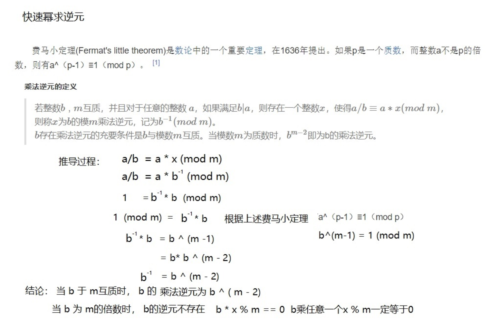

[AcWing 876. 费马小定理 - 快速幂求逆元 - AcWing](https://www.acwing.com/solution/content/16468/)


扩展欧几里得法也可求逆元

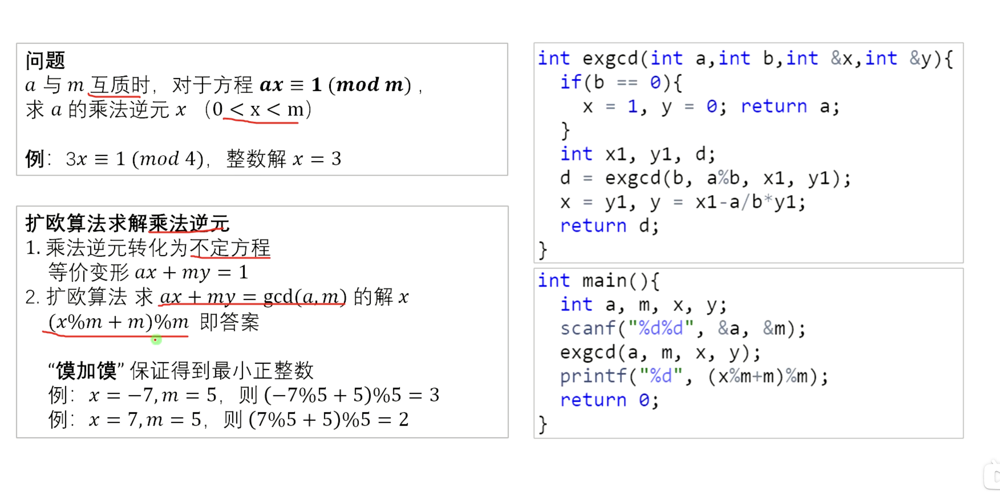

```java
import java.io.BufferedReader;
import java.io.IOException;
import java.io.InputStreamReader;

public class Main {
    static long x, y;

    static long exgcd(long a, long b) {
        if (b == 0) {
            x = 1;
            y = 0;
            return a;
        }
        long d = exgcd(b, a % b);
        long temp = x;
        x = y;
        y = temp - a / b * x;
        return d;
    }

    public static void main(String[] args) throws IOException {
        BufferedReader br = new BufferedReader(new InputStreamReader(System.in));
        String[] s = br.readLine().split(" ");
        int m = Integer.parseInt(s[0]);
        while (m-- > 0) {
            s = br.readLine().split(" ");
            long a = Integer.parseInt(s[0]);
            long p = Integer.parseInt(s[1]);
            exgcd(a, p);
            if (a % p == 0) System.out.println("impossible");//如果a是p的倍数，则不存在逆元
            else System.out.println((x + p) % p);
        }
    }
}

```


## 扩展欧几里得算法

### 877.扩展欧几里得算法

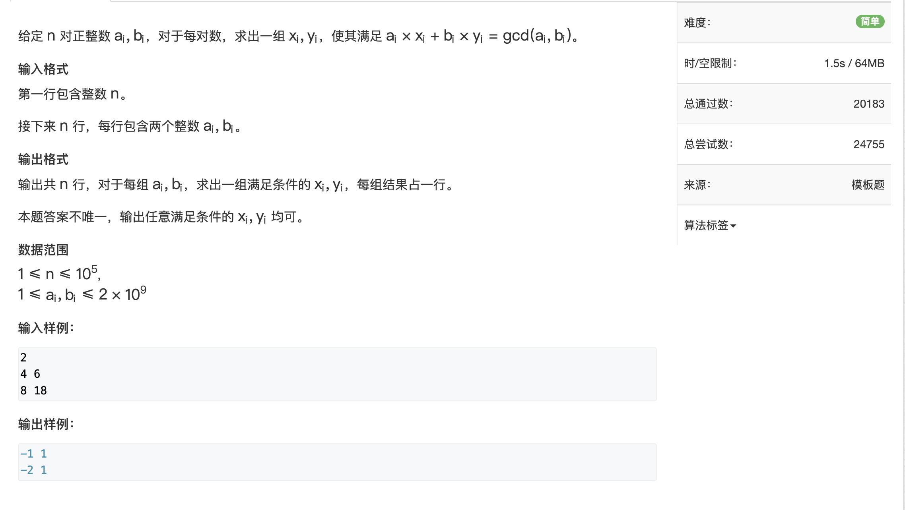

```java
import java.util.Scanner;

public class Main {
    static int x;
    static int y;

    static int exgcd(int a, int b) {
        if (b == 0) {
            x = 1;
            y = 0;
            return a;
        }
        int d = exgcd(b, a % b);
        int temp = x;
        x = y;
        y = temp - a / b * y;
        return d;
    }

    public static void main(String[] args) {
        Scanner scanner = new Scanner(System.in);
        int m = scanner.nextInt();
        while (m-- > 0) {
            int a = scanner.nextInt();
            int b = scanner.nextInt();
            int d = exgcd(a, b);
            System.out.println(x + " " + y);
        }
    }
}

```

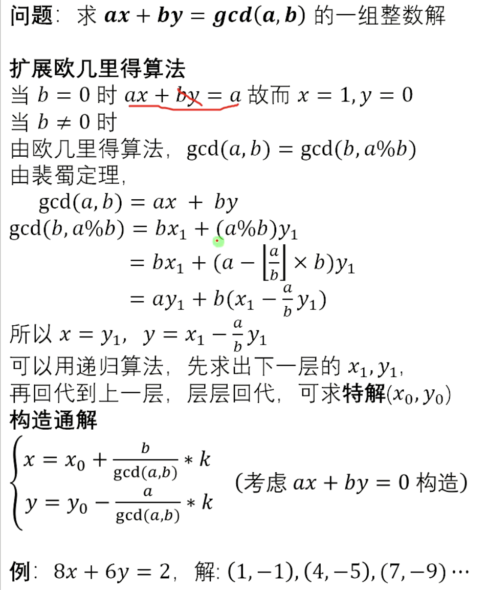

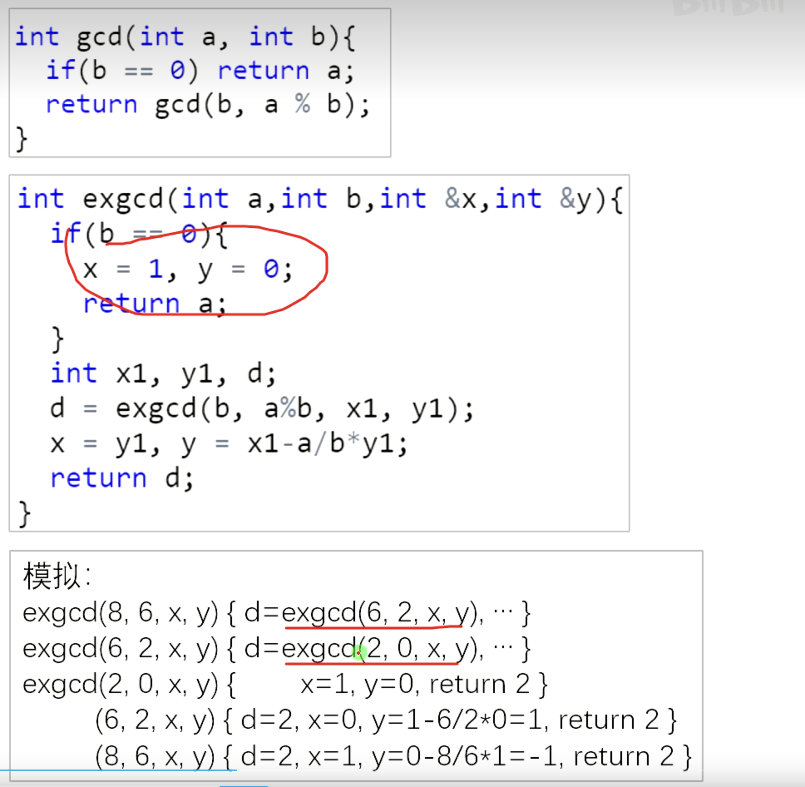

[AcWing 877. 扩展欧几里得算法 - AcWing](https://www.acwing.com/solution/content/1393/)

[525 不定方程 扩展欧几里得算法_哔哩哔哩_bilibili](https://www.bilibili.com/video/BV1rD4y1C7qg/?spm_id_from=333.999.0.0&vd_source=55c287a81883465b30c11b1feb8b72c3)


```java
static long exGcd(long a,long b,Long x,Long y){
        if(b==0){
            x.v = 1;
            y.v = 0;
            return a;
        }
        long d = exGcd(b,a%b,y,x);
        y.v -= a/b*x.v;
        return d;
    }
```


### 878.线性同余方程

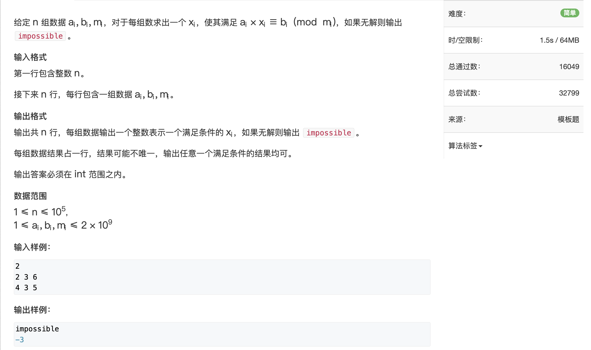


```java
import java.util.Scanner;

public class Main {
    static int x, y;

    static int exgcd(int a, int b) {
        if (b == 0) {
            x = 1;
            y = 0;
            return a;
        }
        int d = exgcd(b, a % b);
        int temp = x;
        x = y;
        y = temp - a / b * y;
        return d;
    }

    public static void main(String[] args) {
        Scanner scanner = new Scanner(System.in);
        int n = scanner.nextInt();
        while (n-- > 0) {
            int a = scanner.nextInt();
            int b = scanner.nextInt();
            int m = scanner.nextInt();
            int d = exgcd(a, m);
            if (b % d == 0) System.out.println(1l*x * b / d % m);//防止爆int
            else System.out.println("impossible");
        }
    }
}

```

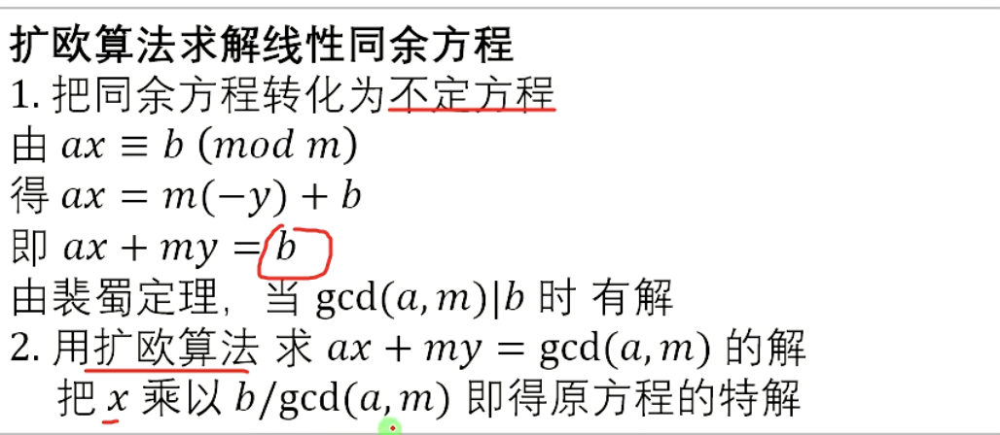


[526 同余方程 乘法逆元 扩展欧几里得算法_哔哩哔哩_bilibili](https://www.bilibili.com/video/BV1mg411a7o2/?spm_id_from=333.337.search-card.all.click&vd_source=55c287a81883465b30c11b1feb8b72c3)


## 中国剩余定理

### 204.表达整数的奇怪方式

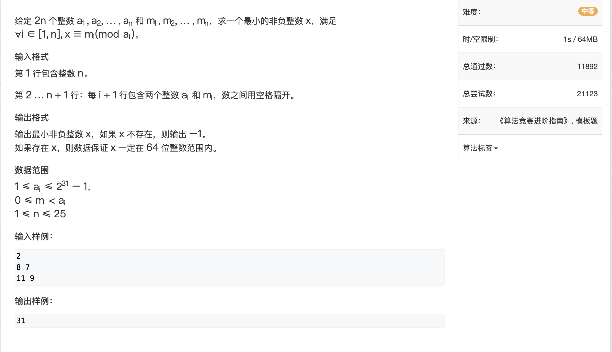

注意：本题m不一定互质，所以要用扩展中国剩余定理

```java
import java.io.BufferedReader;
import java.io.IOException;
import java.io.InputStreamReader;

public class Main {
    static long x, y;

    static long exgcd(long a, long b) {
        if (b == 0) {
            x = 1;
            y = 0;
            return a;
        }
        long d = exgcd(b, a % b);
        long temp = x;
        x = y;
        y = temp - a / b * x;
        return d;
    }

    // x = r (mod m)
    public static void main(String[] args) throws IOException {
        BufferedReader br = new BufferedReader(new InputStreamReader(System.in));
        String[] s = br.readLine().split(" ");
        int n = Integer.parseInt(s[0]);
        boolean flag = true;
        long m1, m2, r1, r2;//两个等式
        s = br.readLine().split(" ");
        m1 = Integer.parseInt(s[0]);
        r1 = Integer.parseInt(s[1]);
        for (int i = 1; i < n; i++) {
            s = br.readLine().split(" ");
            m2 = Integer.parseInt(s[0]);
            r2 = Integer.parseInt(s[1]);
            long d = exgcd(m1, m2);
            if ((r2 - r1) % d != 0)//(r1-r2)/d不为整数，则无解
                flag = false;
            x = x * (r2 - r1) / d;//特解
            x = (x % (m2 / d) + (m2 / d)) % (m2 / d);
            r1 = r1 + m1 * x;
            m1 = m1 * m2 / d;//m1是m1,m2最小公倍数，即两数之积除以最大公约数
        }
        if (flag)
            System.out.println((r1 % m1 + m1) % m1);//r1
        else System.out.println("-1");
    }
}

```

**朴素中国剩余定理**

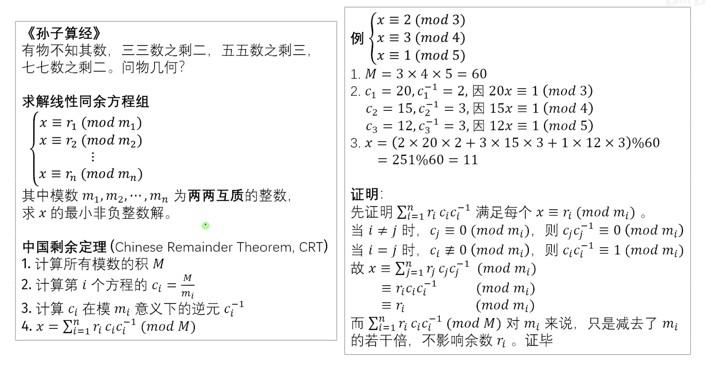

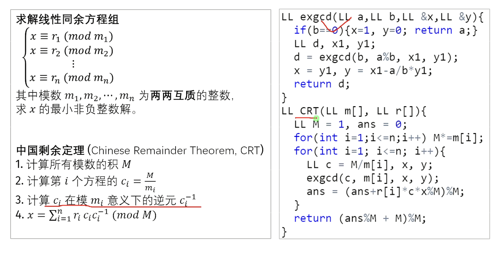

[527 中国剩余定理_哔哩哔哩_bilibili](https://www.bilibili.com/video/BV1AN4y1N7Su/?spm_id_from=333.999.0.0&vd_source=55c287a81883465b30c11b1feb8b72c3)


**扩展中国剩余定理**

[528 扩展中国剩余定理_哔哩哔哩_bilibili](https://www.bilibili.com/video/BV1Ut4y1F7HG/?spm_id_from=333.999.0.0&vd_source=55c287a81883465b30c11b1feb8b72c3)

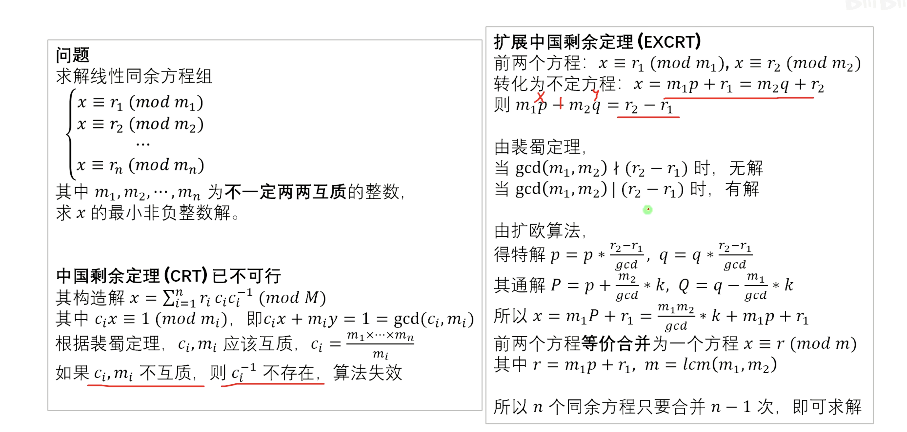

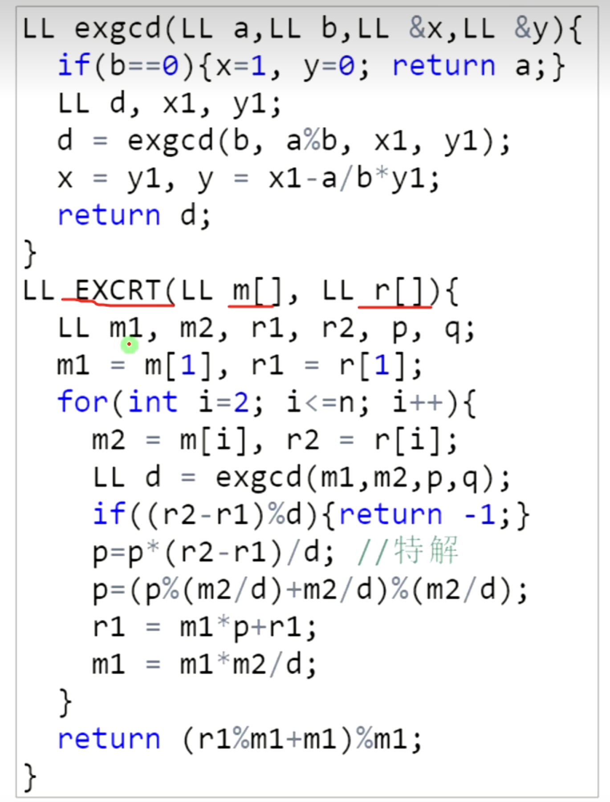


## 高斯消元

### 883.高斯消元解线性方程组 

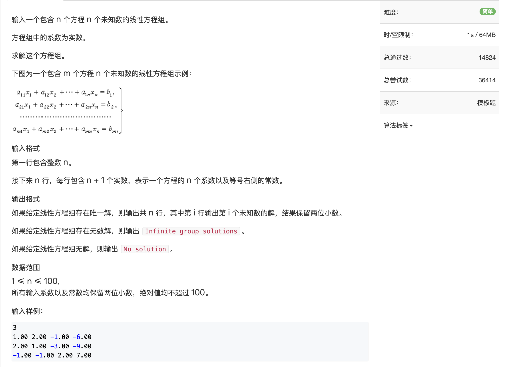


```java
import java.io.BufferedReader;
import java.io.IOException;
import java.io.InputStreamReader;

public class ac883 {
    static final int N = 110;
    static double eps = 1e-6;//误差
    static int n;//矩阵为n*(n+1)
    static double[][] a = new double[N][N];

    static int gauss() {
        int c, r;//c,r是当前消到哪一行，上面的都固定
        //枚举每一列
        for (c = 0, r = 0; c < n; c++) {
            int t = r;//找到当前列绝对值最大的那一行,从r开始因为上面的都固定了不动
            for (int i = r; i < n; i++) {
                if (Math.abs(a[i][c]) > Math.abs(a[t][c]))
                    t = i;
            }
            if(Math.abs(a[t][c]) < eps) continue;//如果当前列最大的值都是0，那该列都是0，就不用算了，r不可以++,因为约束条件在下一列
            for (int i = c; i < n+1; i++) {
                //将最大的那一行t换到r行
                double temp = a[t][i];
                a[t][i] = a[r][i];
                a[r][i] = temp;
            }
            //把当前行第一个数变成1,要倒着÷，否则第一个数是0了后面就无法操作了
            for (int i = n; i >=c ; i--) {
                a[r][i] /= a[r][c];
            }
            //改行当前列下面的数变成0
            for (int i = r+1; i <n ; i++) {
                if(Math.abs(a[i][c]) > eps)//如果这个数不是0，就操作
                    for (int j = n; j >= c; j--) {
                        //a[r][j]是固定行j列，a[i][c]是当前处理行的第一个数，即消元要乘的倍数
                        a[i][j] -= a[r][j] * a[i][c];
                    }
            }
            r++;//当前行操作完成
        }
        //已化成梯形
        if(r<n){//剩下的方程个数<n,说明不是唯一解，可能是无穷解或无解
            for (int i = r; i < n; i++) {
                if(Math.abs(a[i][n]) > eps)//0 = ！0
                    return 2;//无解
            }
            return 0;//0 = 0
        }
        //唯一解，从下往回代
        for (int i = n-1; i >=0 ; i--) {
            for (int j = i+1; j < n; j++) {
                a[i][n] -= a[j][n] * a[i][j];//a[i][n]是要处理行的结果，a[j][n]是下面几行的结果，a[i][j]是系数
            }
        }
        return 0;
    }

    public static void main(String[] args) throws IOException {
        BufferedReader br = new BufferedReader(new InputStreamReader(System.in));
        String[] s = br.readLine().split(" ");
        n = Integer.parseInt(s[0]);
        for (int i = 0; i < n; i++) {
            s = br.readLine().split(" ");
            for (int j = 0; j < n + 1; j++) {
                a[i][j] = Double.parseDouble(s[j]);
            }
        }
        int t = gauss();
        if (t == 0) {//有解
            for (int i = 0; i < n; i++) {
                System.out.println(String.format("%.2f", a[i][n]));
            }
        } else if (t == 1) {//无穷解
            System.out.println("Infinite group solutions");
        } else
            System.out.println("No solution");
    }
}

```


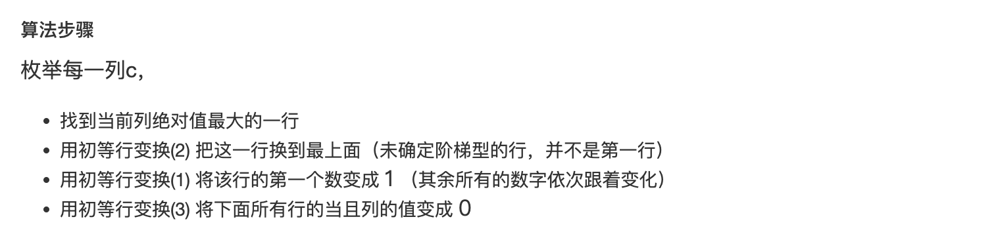


### 884.高斯消元解异或线性方程组  

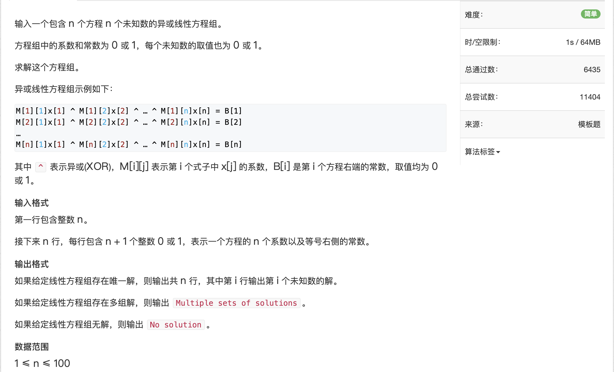

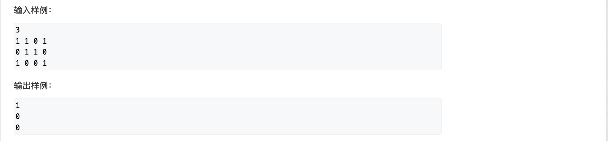


```java
import java.io.BufferedReader;
import java.io.IOException;
import java.io.InputStreamReader;

public class Main {
    static final int N = 110;
    static int[][] a = new int[N][N];
    static int n;

    static int gauss() {
        int c, r;//消到哪一行列了
        //枚举每一列
        for (c = 0, r = 0; c < n; c++) {
            int t = r;//找到当前列绝对值最大的那一行
            for (int i = r; i < n; i++) {
                if (a[i][c] > a[t][c])
                    t = i;
            }
            //如果最大的那一行也是0，那就continue，r不++
            if (a[t][c] == 0) continue;
            //把t行交换到r行
            //注意等号！ 第n+1列也要换
            for (int i = c; i <= n; i++) {
                int temp = a[t][i];
                a[t][i] = a[r][i];
                a[r][i] = temp;
            }
            //这里r行首个数字一定是1
            //将r行下面几行的c列都消成0,
            for (int i = r + 1; i < n; i++) {
                if (a[i][c] == 1)//如果是1就操作变成0，否则不用动
                    for (int j = n; j >= c; j--)
                        a[i][j] ^= a[r][j];
            }
            r++;//固定该行
        }
        //已经化成梯形
        if (r < n) {//无解或无穷解
        //从r行开始
            for (int i = r; i < n; i++) {
                if (a[i][n] == 0) //0 = 0,无穷解
                    return 1;
            }
            return 2;//无解
        }

        //有正常解，从下往上回代
        for (int i = n - 1; i >= 0; i--)
            for (int j = i + 1; j < n; j++)
                a[i][n] ^= a[j][n] * a[i][j];

        return 0;//正常解
    }

    public static void main(String[] args) throws IOException {
        BufferedReader br = new BufferedReader(new InputStreamReader(System.in));
        String[] s = br.readLine().split(" ");
        n = Integer.parseInt(s[0]);
        for (int i = 0; i < n; i++) {
            s = br.readLine().split(" ");
            for (int j = 0; j < n + 1; j++) {
                a[i][j] = Integer.parseInt(s[j]);
            }
        }
        int t = gauss();
        if (t == 0) {//有解
            for (int i = 0; i < n; i++) {
                System.out.println(a[i][n]);
            }
        } else if (t == 1) {//无穷解
            System.out.println("Multiple sets of solutions");
        } else
            System.out.println("No solution");
    }
}

```


## 求组合数


### 885. 求组合数 I

 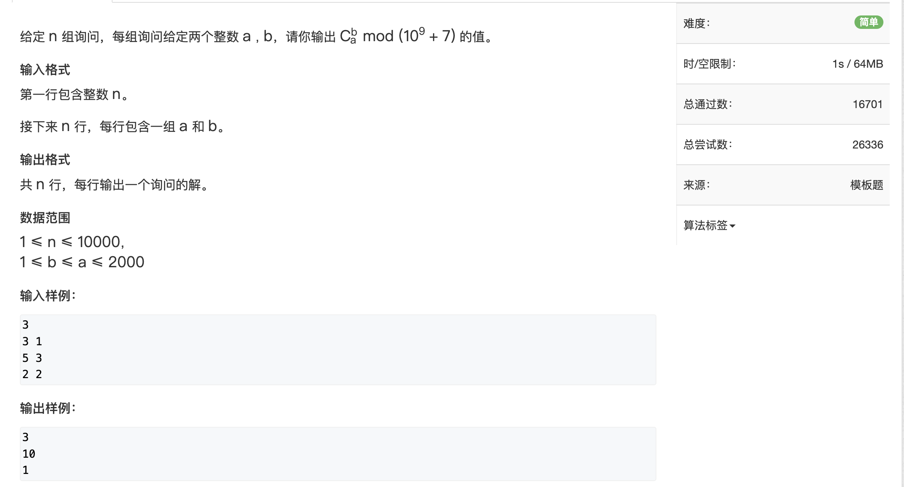

分析：

10万组  2000  递推

cij = ci-1j-1 + ci-1j

```java
import java.util.Scanner;

public class Main {
    static final int N = 2010;
    static final int mod = (int) 1e9+7;
    static int[][] c = new int[N][N];
    
    static void init(){
        for (int i = 0; i < N; i++) {
            for (int j = 0; j <= i; j++) {//组合数j<=i
                if(j==0) c[i][j] = 1;
                else c[i][j] =( c[i-1][j-1] + c[i-1][j])%mod;
            }
        }
    }
    public static void main(String[] args) {
        Scanner scanner = new Scanner(System.in);
        int n = scanner.nextInt();
        init();
        while (n-->0){
            int a = scanner.nextInt();
            int b = scanner.nextInt();
            System.out.println(c[a][b]);
        }
    }
}

```


### 886. 求组合数 II

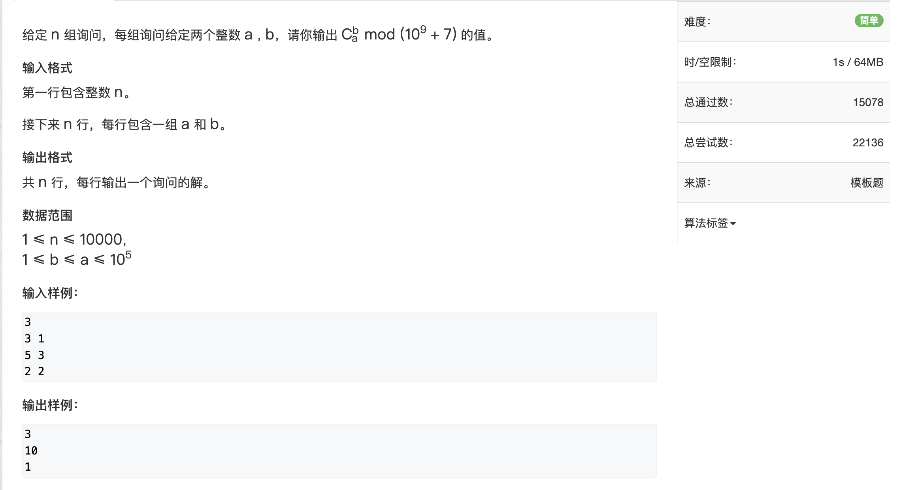

分析：

1万组 10^5 预处理阶乘fact数组、infact逆元数组

```java
import java.util.Scanner;

public class Main {
    static final int N = 100010;
    static final int mod = (int) 1e9 + 7;
    static int[] fact = new int[N];//存阶乘
    static int[] infact = new int[N];//存阶乘的逆元

    static int qmi(int a, int k, int p) {
        long res = 1;
        while (k > 0) {
            if ((k & 1) != 0) res = res * a % p;
            k = k >> 1;
            a = (int) ((long) a * a % p);
        }
        return (int) res;
    }

    public static void main(String[] args) {
        Scanner scanner = new Scanner(System.in);
        int n = scanner.nextInt();
        fact[0] = 1;
        infact[0] = 1;
        for (int i = 1; i < N; i++) {
            fact[i] = (int) ((long) fact[i - 1] * i % mod);
            infact[i] = (int) ((long) infact[i - 1] * qmi(i, mod - 2, mod) % mod);
        }
        while (n-- > 0) {
            int a = scanner.nextInt();
            int b = scanner.nextInt();
            int res = (int) ((long) fact[a] * infact[a - b] % mod * infact[b] % mod);
            System.out.println(res);
        }
    }
}

```

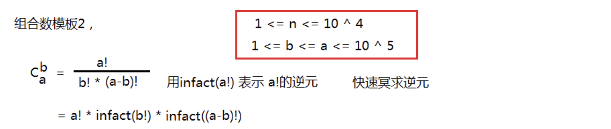


### 887. 求组合数 III

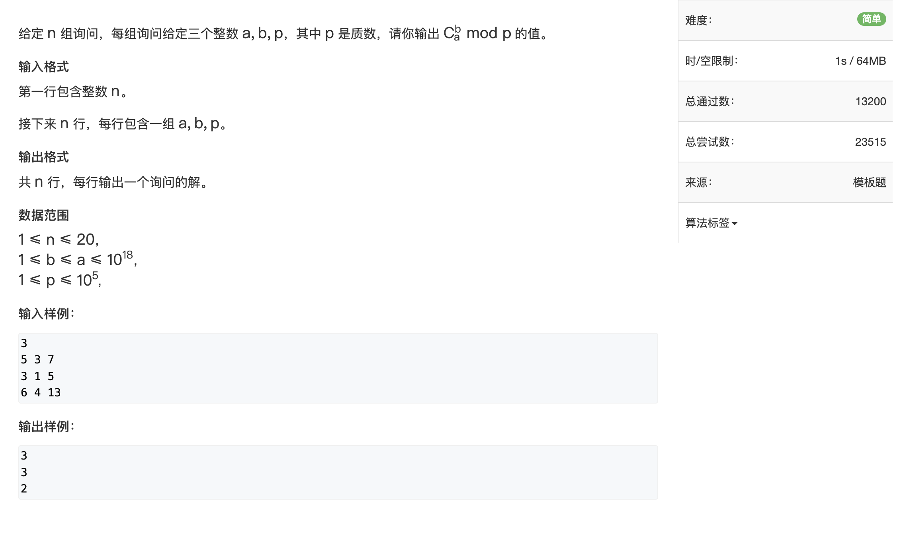

分析：a、b达到10^18，询问次数20，用卢卡斯定理

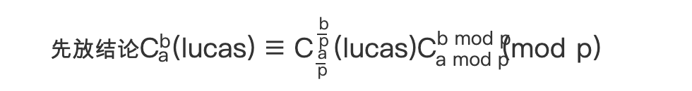

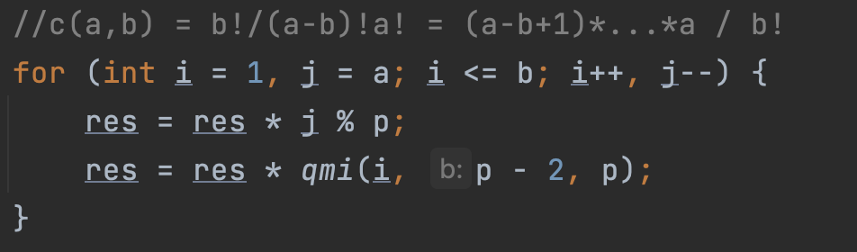

```java
import java.util.Scanner;

public class Main {
    static int qmi(int a, int k, int p) {
        long res = 1;
        while (k > 0) {
            if ((k & 1) == 1) res = res * a % p;
            k = k >> 1;
            a = (int) ((long) a * a % p);
        }
        return (int) res;
    }

    static int C(int a, int b, int p) {
        if (b > a) return 0;
        long res = 1;
        //c(a,b) = b!/(a-b)!a! = (a-b+1)*...*a / b!
        for (int i = 1, j = a; i <= b; i++, j--) {
            res = res * j % p;
            res = res * qmi(i, p - 2, p)%p;
        }
        return (int) res;
    }

    static long lucas(long a, long b, long p) {
        if (a < p && b < p) return C((int) a, (int) b, (int) p);
        //卢卡斯公式，因为a%p一定小于p，可以直接算，所以用C；而a/p不一定小于p，所以继续卢卡斯递归
        return (long) C((int) (a % p), (int) (b % p), (int) p) * lucas(a / p, b / p, p) % p;
    }

    public static void main(String[] args) {
        Scanner scanner = new Scanner(System.in);
        int n = scanner.nextInt();
        while (n-- > 0) {
            long a = scanner.nextLong();
            long b = scanner.nextLong();
            long p = scanner.nextLong();
            System.out.println(lucas(a, b, p));
        }
    }
}

```


### 888. 求组合数 IV

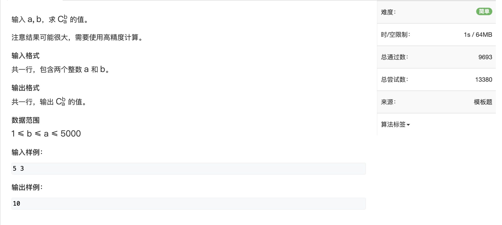

分析：本题不取模，所以要高精度

```java
import java.math.BigInteger;
import java.util.Scanner;

public class Main {
    static BigInteger C(int a,int b){
        if(b>a) return BigInteger.valueOf(0);
        BigInteger res = new BigInteger("1");
        for (int i=1,j=a;i<=b;i++,j--){
            res = res.multiply(BigInteger.valueOf(j));
            res = res.divide(BigInteger.valueOf(i));
        }
        return res;
    }
    public static void main(String[] args) {
        Scanner scanner = new Scanner(System.in);
        int a = scanner.nextInt();
        int b = scanner.nextInt();
        System.out.println(C(a, b));
    }
}

```


### 889.满足条件的01序列 

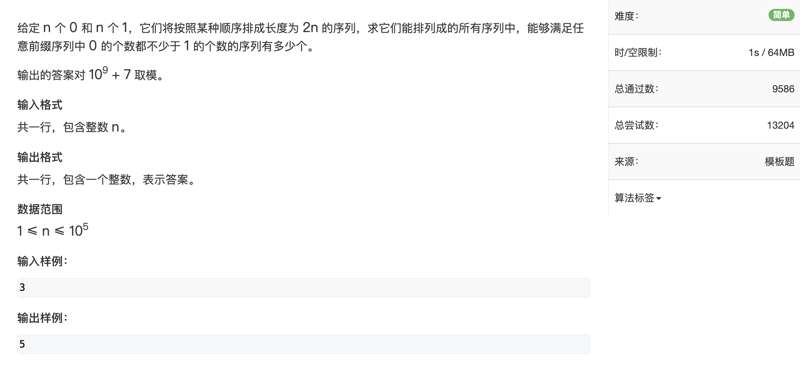

分析：卡特兰数

```java
import java.util.Scanner;

public class Main {
    static final int N = 200010;
    static int p = (int) 1e9 + 7;
    static int[] fact = new int[N];
    static int[] infact = new int[N];

    static int qmi(int a, int k, int p) {
        long res = 1;
        while (k > 0) {
            if ((k & 1) == 1) res = res * a % p;
            k = k >> 1;
            a = (int) ((long) a * a % p);
        }
        return (int) res;
    }

    static void init(){
        fact[0] = infact[0] = 1;
        for (int i = 1; i < N; i++) {
            fact[i] = (int) ((long) fact[i - 1] * i % p);
            infact[i] = (int) ((long) infact[i - 1] * qmi(i, p - 2, p) % p);
        }
    }

    public static void main(String[] args) {
        Scanner scanner = new Scanner(System.in);
        int n = scanner.nextInt();
        init();
        //卡特兰数公式 res = C(2n,n)-C(2n,n-1) = C(2n,n)/n+1 = 2n!/(n!*n!*(n+1))
        System.out.println((long) fact[2 * n] * infact[n] % p * infact[n] % p * qmi(n + 1, p - 2, p) % p);
    }
}

```

[AcWing 889. 满足条件的01序列 - AcWing](https://www.acwing.com/solution/content/8907/)

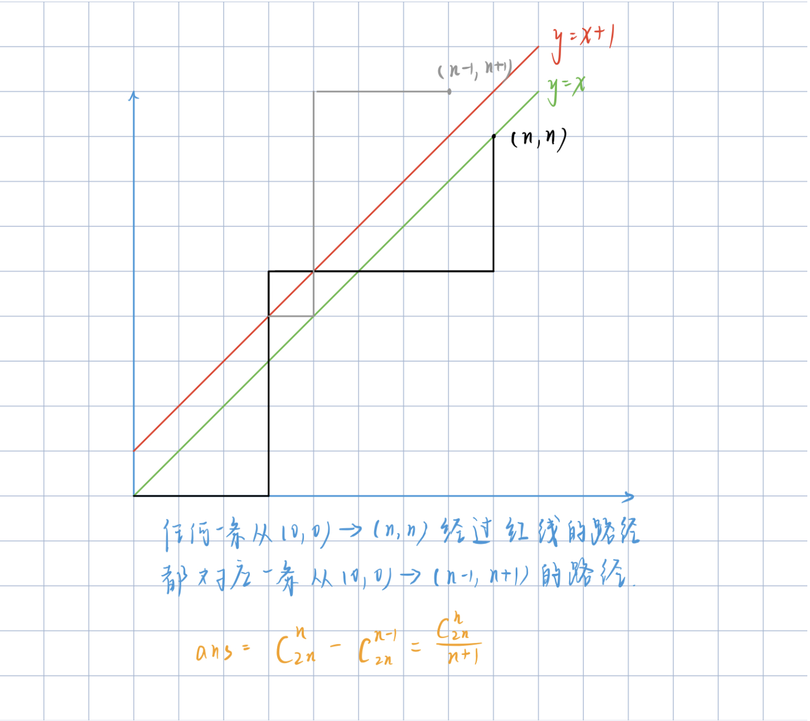


## 容斥原理

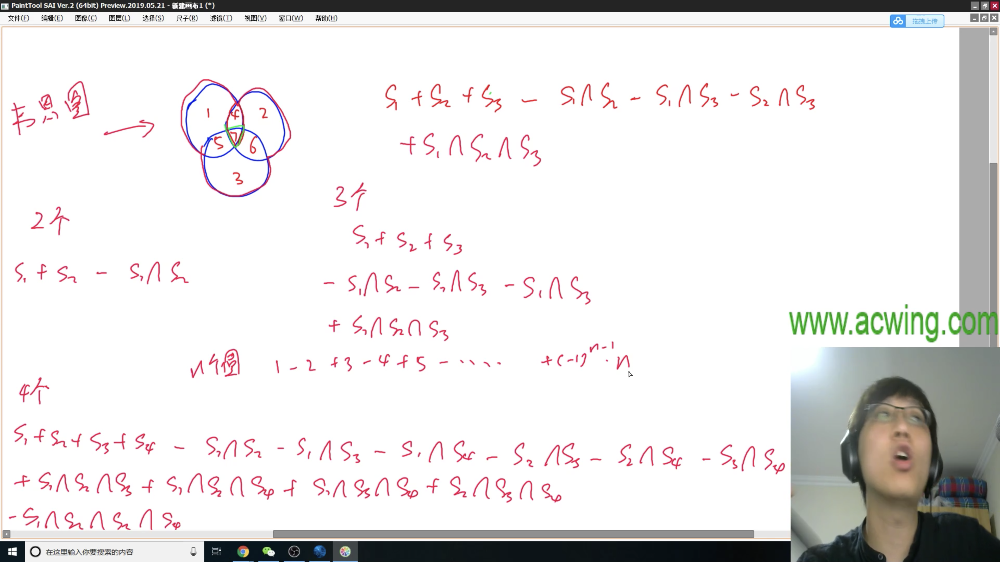


### 890.能被整除的数

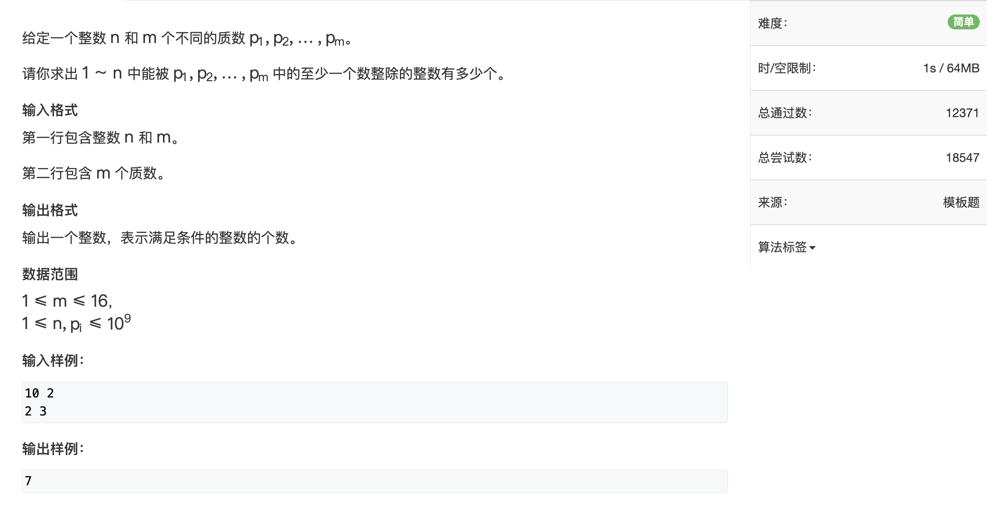

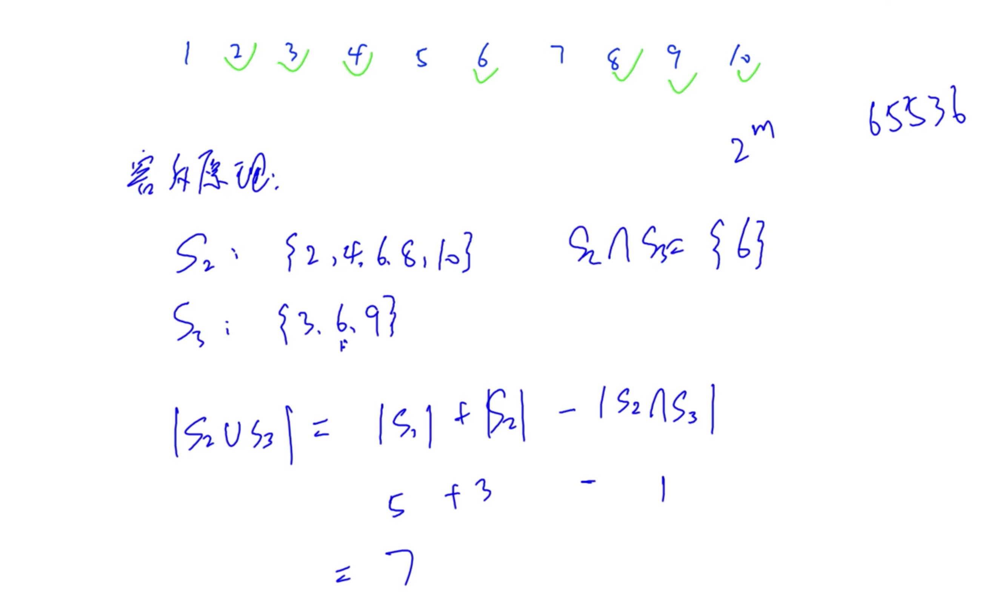

```java
import java.util.Scanner;

public class Main {
    static final int N = 20;
    static int n,m;
    static int[] primes = new int[N];

    static int calc(){
        int res = 0;
        for (int i = 1; i < 1<<m; i++) {//枚举当前状态，如果m=2,则枚举01,10,11这三个状态,表示三个集合
            int t = 1;//记录素数的积
            int sign = -1;//整合res时的符号
            for (int j = 0; j < m; j++) {//枚举当前状态下的每一位
                if((i&1<<j)>0){//如果第j位是1
                    if((long)t*primes[j] > n){//如果积大于n，则后面都找不到满足的集合，break
                        t = 0;
                        break;
                    }
                    t *= primes[j];
                    sign = -1*sign;//奇数位1，则为正
                }
            }
            if(t>0) res += n/t *sign;
        }
        return res;
    }
    public static void main(String[] args) {
        Scanner scanner = new Scanner(System.in);
        n = scanner.nextInt();
        m = scanner.nextInt();
        for (int i = 0; i < m; i++) {
            primes[i] = scanner.nextInt();
        }
        System.out.println(calc());
    }
}

```

[546 容斥原理 集合的并_哔哩哔哩_bilibili](https://www.bilibili.com/video/BV1S8411h77u/?spm_id_from=333.999.0.0&vd_source=55c287a81883465b30c11b1feb8b72c3)


## 博弈论

### 891. Nim游戏

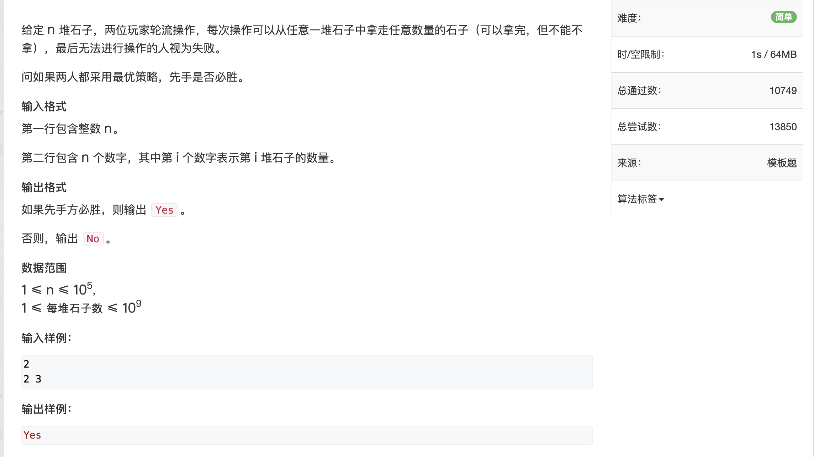

结论： 若a1^a2^...^an=x != 0,那么先手一定能使得a1^a2^...^an =0,那么先手必胜；

​			设x的最高一位1在第k位，那么肯定有一堆ai的第k位是1，并且ai^x一定小于ai，所以从第i堆拿走ai-ai^x个石头，第i堆中就剩下ai^x个，那么a1^a2^...^an=x^x=0

​			若a1^a2^...^an = 0,那么先手一定会使得a1^a2^...^an !=0,那么后手就能让其变成0，那么后手必胜

```java
import java.util.Scanner;

public class Main {
    public static void main(String[] args) {
        Scanner scanner = new Scanner(System.in);
        int n = scanner.nextInt();
        int res = 0;
        while (n-->0){
            int x = scanner.nextInt();
            res ^= x;
        }
        if(res==0) System.out.println("No");
        else System.out.println("Yes");
    }
}

```


[AcWing 891. Nim游戏 - AcWing](https://www.acwing.com/solution/content/14269/)

### 892. 台阶-Nim游戏

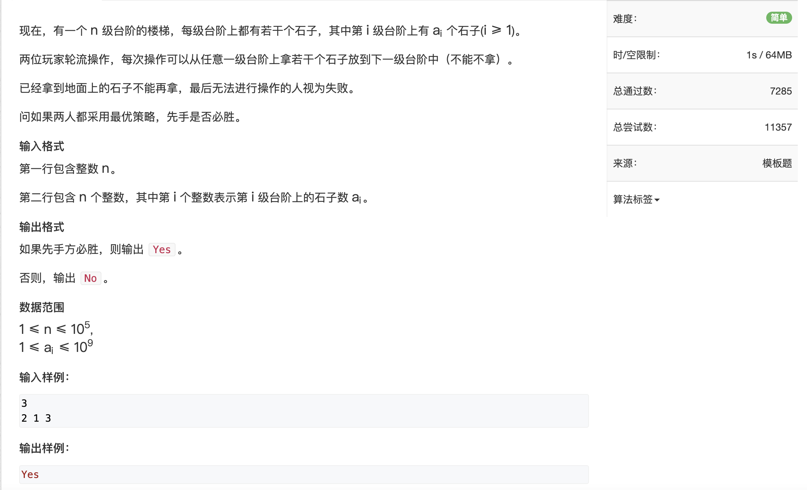

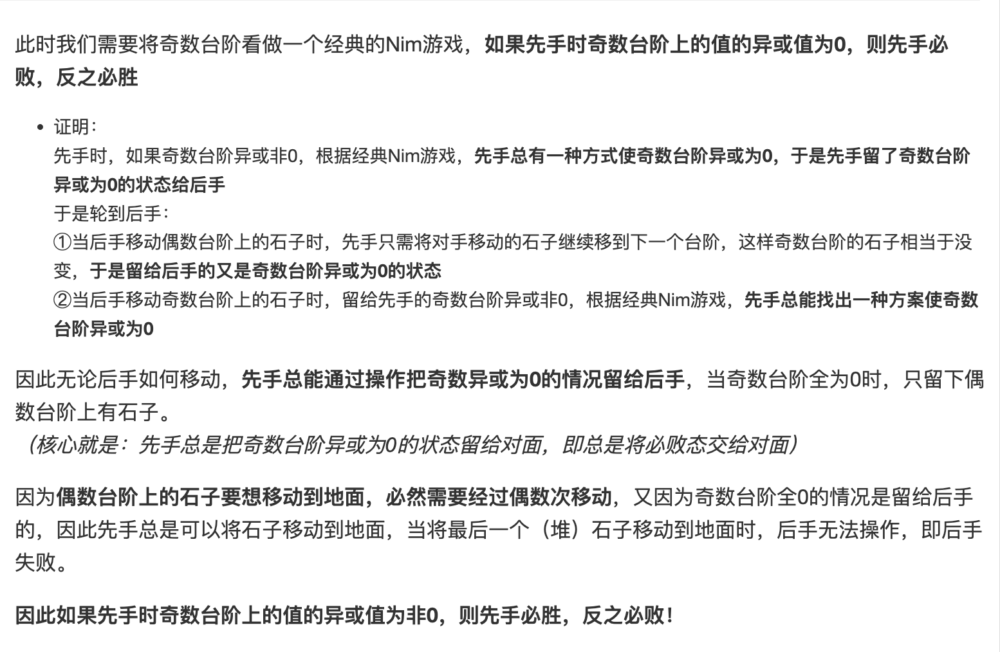

```java
import java.util.Scanner;

public class Main {
    public static void main(String[] args) {
        Scanner scanner = new Scanner(System.in);
        int n = scanner.nextInt();
        int res = 0;//记录奇数阶梯石子数的异或值
        for (int i = 1; i <= n; i++) {
            int x = scanner.nextInt();
            if(i%2==1)
                res ^= x;
        }
        if(res == 0) System.out.println("No");
        else System.out.println("Yes");
    }
}

```


### 893. 集合-Nim游戏

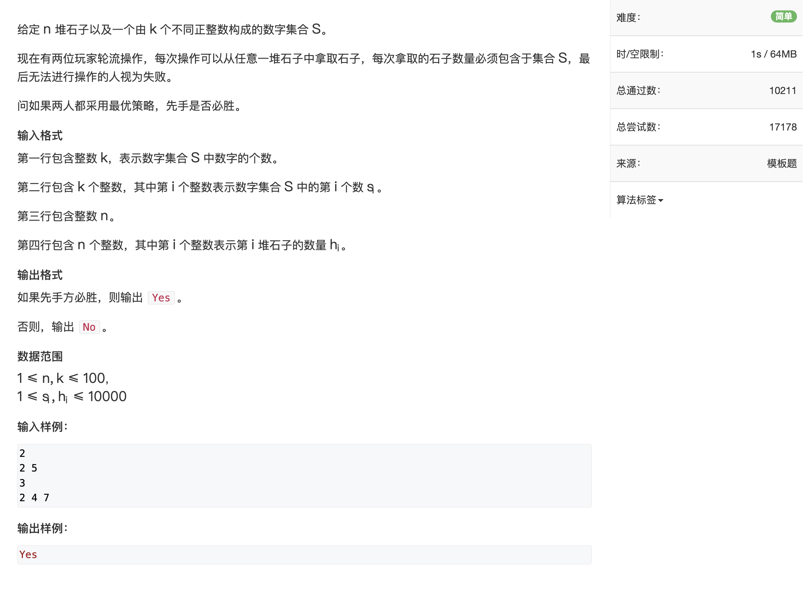


```java
import java.util.*;

public class Main {
    static final int N = 110, M = 10010;
    static int n, m;
    static int[] s = new int[N];//存储可以选择的集合
    static int[] f = new int[M];//存储所有坑出现的情况的sg值，初始化为-1

    static int sg(int x) {
        if (f[x] != -1) return f[x];//如果x的sg值已经确定了，那就不用求了，直接返回其sg值f[x]
        HashSet<Integer> set = new HashSet<>();
        //添加x节点后面可以达到的点的sg值
        for (int i = 0; i < m; i++) {
            if (x - s[i] >= 0)
                set.add(sg(x - s[i]));
        }
        //mex操作
        for (int i = 0; ; i++) {
            if (!set.contains(i)) {
                ;
                return f[x] = i;
            }
        }
    }

    public static void main(String[] args) {
        Scanner scanner = new Scanner(System.in);
        m = scanner.nextInt();
        for (int i = 0; i < m; i++) {
            s[i] = scanner.nextInt();
        }
        Arrays.fill(f, -1);
        int res = 0;
        n = scanner.nextInt();
        for (int i = 0; i < n; i++) {
            int x = scanner.nextInt();
            res ^= sg(x);
        }
        if (res == 0) System.out.println("No");
        else System.out.println("Yes");
    }
}

```

[AcWing 893. 集合-Nim游戏 - AcWing](https://www.acwing.com/solution/content/23435/)


### 894. 拆分-Nim游戏  

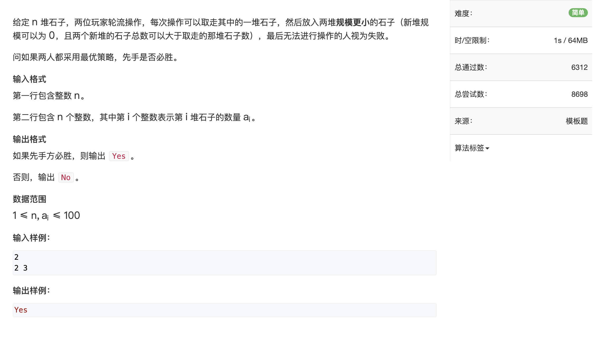


```java
import java.util.Arrays;
import java.util.HashSet;
import java.util.Scanner;

public class Main {
    static int N = 110;
    static int n;
    static int[] f = new int[N];//每个局面的sg值

    static int sg(int x){
        if(f[x] != -1) return f[x];
        HashSet<Integer> set = new HashSet<>();
        for (int i = 0; i < x; i++) {
            for (int j = 0; j <= i; j++) {
                set.add(sg(i)^sg(j));//将一个局面拆分成两个局面，相当于两个局面sg值的异或和
            }
        }
        for (int i=0;;i++)
            if(!set.contains(i))
                return f[x] = i;
    }
    public static void main(String[] args) {
        Scanner scanner = new Scanner(System.in);
        n = scanner.nextInt();
        int res = 0;
        Arrays.fill(f,-1);
        while (n-->0){
            int x = scanner.nextInt();
            res ^= sg(x);
        }
        if(res ==0 ) System.out.println("No");
        else System.out.println("Yes");
    }
}

```

[AcWing 894. 拆分-Nim游戏 - AcWing](https://www.acwing.com/solution/content/13193/)