#  贪心算法

## 区间问题

### 905.区间选点

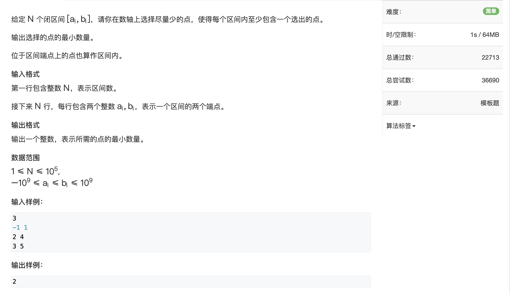

思路：将所有区间按右端点的大小从小到大排序，然后如果当前区间的左端点大于上次区间的右端点，则说明标一个点即可，如果不在，则要选新的点，按照贪心的思想，选择右端点可以保证每次都是最优解。


```java
import java.util.Arrays;
import java.util.Comparator;
import java.util.Scanner;

public class Main {
    static int n;
    public static void main(String[] args) {
        Scanner scanner = new Scanner(System.in);
        n = scanner.nextInt();
        range[] ranges = new range[n];
        for (int i = 0; i < n; i++) {
            int l = scanner.nextInt();
            int r = scanner.nextInt();
            ranges[i] = new range(l,r);
        }
        //按右端点将区间从小到大排序
        Arrays.sort(ranges, new Comparator<range>() {
            @Override
            public int compare(range o1, range o2) {
                return o1.r - o2.r;
            }
        });

        int res = 0;
        int end = (int) -2e9;
        for (int i = 0; i < n; i++) {
            range cur = ranges[i];
            if(cur.l > end){
                res ++ ;
                end  = cur.r;
            }
        }
        System.out.println(res);
    }
}

class range{
    int l,r;

    public range(int l, int r) {
        this.l = l;
        this.r = r;
    }
}
```


### 908.最大不相交区间数量

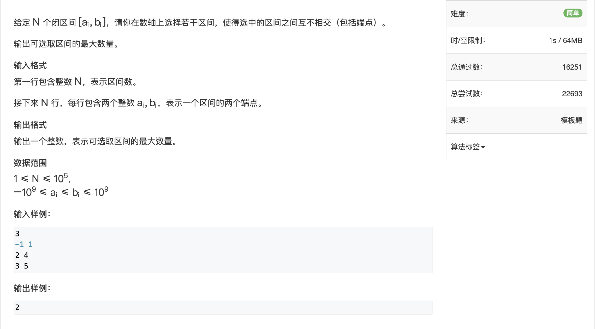

与905思路相同

```java
import java.util.Arrays;
import java.util.Comparator;
import java.util.Scanner;

public class Main {
    public static void main(String[] args) {
        Scanner scanner = new Scanner(System.in);
        int n = scanner.nextInt();
        range[] ranges = new range[n];
        for (int i = 0; i < n; i++) {
            int l = scanner.nextInt();
            int r = scanner.nextInt();
            ranges[i] = new range(l, r);
        }
        Arrays.sort(ranges, new Comparator<range>() {
            @Override
            public int compare(range o1, range o2) {
                return o1.r - o2.r;
            }
        });
        int res = 0;
        int end = (int) -2e9;
        for (int i = 0; i < n; i++) {
            range cur = ranges[i];
            if (cur.l > end) {
                res++;
                end = cur.r;
            }
        }
        System.out.println(res);
    }
}
class range{
    int l,r;

    public range(int l, int r) {
        this.l = l;
        this.r = r;
    }
}
```


### 906.区间分组

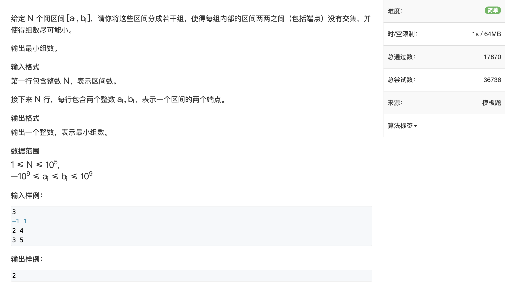

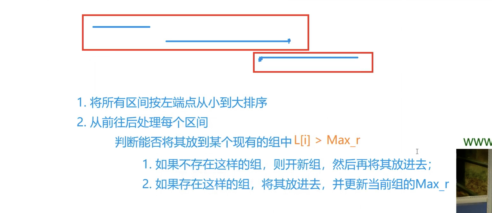


```java
import java.util.Arrays;
import java.util.Comparator;
import java.util.PriorityQueue;
import java.util.Scanner;

public class Main {
    public static void main(String[] args) {
        Scanner scanner = new Scanner(System.in);
        int n = scanner.nextInt();
        range[] ranges = new range[n];
        for (int i = 0; i < n; i++) {
            int l = scanner.nextInt();
            int r = scanner.nextInt();
            ranges[i] = new range(l, r);
        }
        //按左端点排序
        Arrays.sort(ranges, new Comparator<range>() {
            @Override
            public int compare(range o1, range o2) {
                return o1.l - o2.l;
            }
        });

        PriorityQueue<Integer> heap = new PriorityQueue<>();//小根堆,维护每组区间的尾端点
        for (int i = 0; i < n; i++) {
            int l = ranges[i].l;
            int r = ranges[i].r;
            if (heap.isEmpty() || heap.peek() >= l)//如果堆是空的，或者当前组尾端点大于等于当前区间的左端点，则要加入新区间组
                heap.offer(r);
            else {//否则，当前区间要加入老区间组，并更新老区间组的r
                int max_r = heap.poll();
                heap.offer(Math.max(r, max_r));
            }

        }
        System.out.println(heap.size());
    }
}

class range{
    int l,r;

    public range(int l, int r) {
        this.l = l;
        this.r = r;
    }
}
```

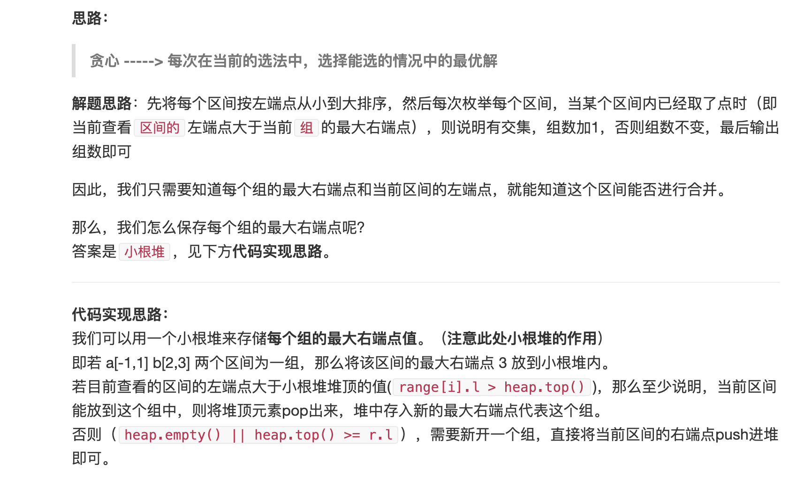


### 907.区间覆盖

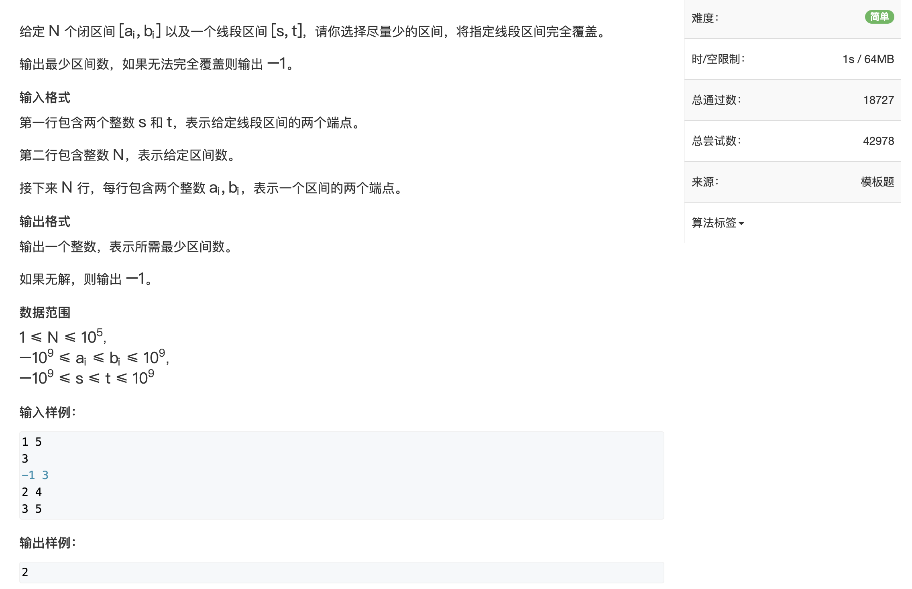

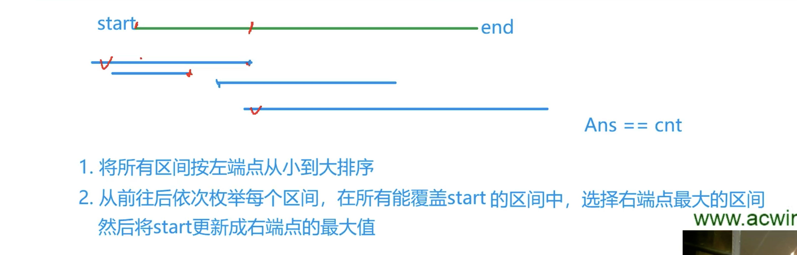

```java
import java.util.Arrays;
import java.util.Comparator;
import java.util.Scanner;

public class Main {
    public static void main(String[] args) {
        Scanner scanner = new Scanner(System.in);
        int st = scanner.nextInt();
        int ed = scanner.nextInt();
        int n = scanner.nextInt();
        range[] ranges = new range[n];
        for (int i = 0; i < n; i++) {
            int l = scanner.nextInt();
            int r = scanner.nextInt();
            ranges[i] = new range(l, r);
        }
        //按左端点排序
        Arrays.sort(ranges, new Comparator<range>() {
            @Override
            public int compare(range o1, range o2) {
                return o1.l - o2.l;
            }
        });
        boolean flag = false;
        int res = 0;
        for (int i = 0; i < n; i++) {
            int j = i;
            int r = (int) -2e9;
            //找到所有左端点比st小的区间，r表示这些区间的右端点的最大值,最后j是左端点小于st的区间的后一个
            while (j < n && ranges[j].l <= st) {
                r = Math.max(r, ranges[j].r);
                j++;
            }
            if (r < st) {//如果这些区间最大的右端点都比st小，说明这区间包不住st，失败；否则包住了，res++
                flag = false;
                break;
            } else res++;
            if (r >= ed) {//如果r比ed大，说明这个区间已经是覆盖整个范围的最后一个区间了，成功
                flag = true;
                break;
            } else {//否则说明还不够，更新st为r，以及下次for循环开始的i值：最后一个左端点小于st的区间j-1
                st = r;
                i = j - 1;
            }
        }
        if (flag) System.out.println(res);
        else System.out.println("-1");
    }
}

class range{
    int l,r;

    public range(int l, int r) {
        this.l = l;
        this.r = r;
    }
}

```


## Huffman树

### 148.合并果子

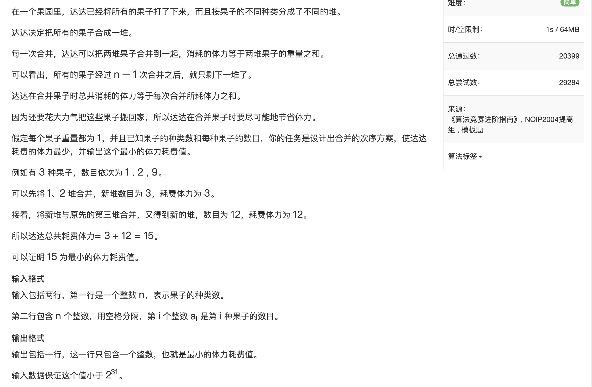

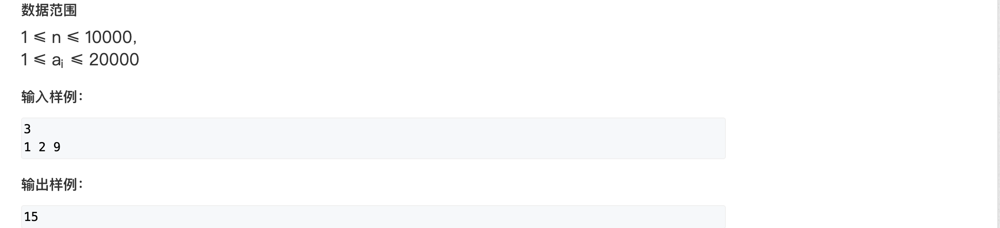


```java
import java.util.PriorityQueue;
import java.util.Scanner;

public class Main {
    public static void main(String[] args) {
        Scanner scanner = new Scanner(System.in);
        int n = scanner.nextInt();
        PriorityQueue<Integer> heap = new PriorityQueue<>();//小根堆
        while (n-->0){
            int x = scanner.nextInt();
            heap.offer(x);
        }
        int res = 0;
        while (heap.size()>1){
            int a = heap.poll();
            int b = heap.poll();
            res += a+b;
            heap.offer(a+b);
        }
        System.out.println(res);
    }
}

```


## 排序不等式

### 913.排队打水

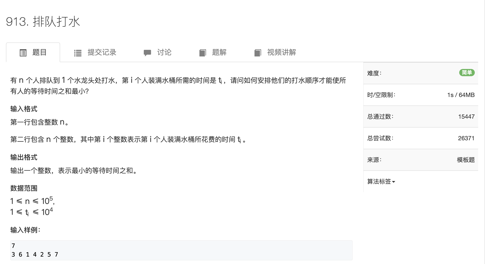

思路：

所需要时间短的人先打水

```java
import java.util.Arrays;
import java.util.Scanner;

public class Main {
    public static void main(String[] args) {
        Scanner scanner = new Scanner(System.in);
        int n = scanner.nextInt();
        int[] a = new int[n];
        for (int i = 0; i < n; i++) {
            a[i] = scanner.nextInt();
        }
        Arrays.sort(a);
        long sum = 0;
        for (int i = 0; i < n; i++) {
            sum += (n-i-1)*a[i];
        }
        System.out.println(sum);
    }
}

```


## 绝对值不等式

### 104.货仓选址

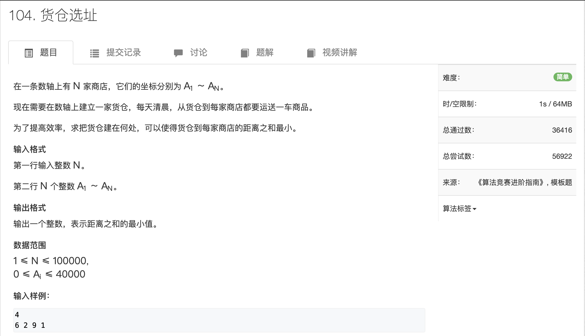

分析：选在序列的中间，则货仓到最左右两商店的距离最小，即两者之差。 所以先将数组排序，然后取中位数作为仓库的选址

```java
import java.util.Arrays;
import java.util.Scanner;

public class Main {
    public static void main(String[] args) {
        Scanner scanner = new Scanner(System.in);
        int n = scanner.nextInt();
        int[] A = new int[n];
        for (int i = 0; i < n; i++) {
            A[i] = scanner.nextInt();
        }
        Arrays.sort(A);
        int sum = 0;
        for (int i = 0; i < n; i++) {
            sum += Math.abs(A[n/2] - A[i]);
        }
        System.out.println(sum);
    }
}

```


## 推公式

### 125.耍杂技的牛

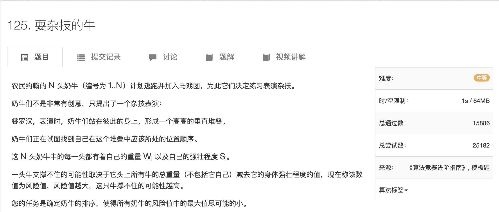

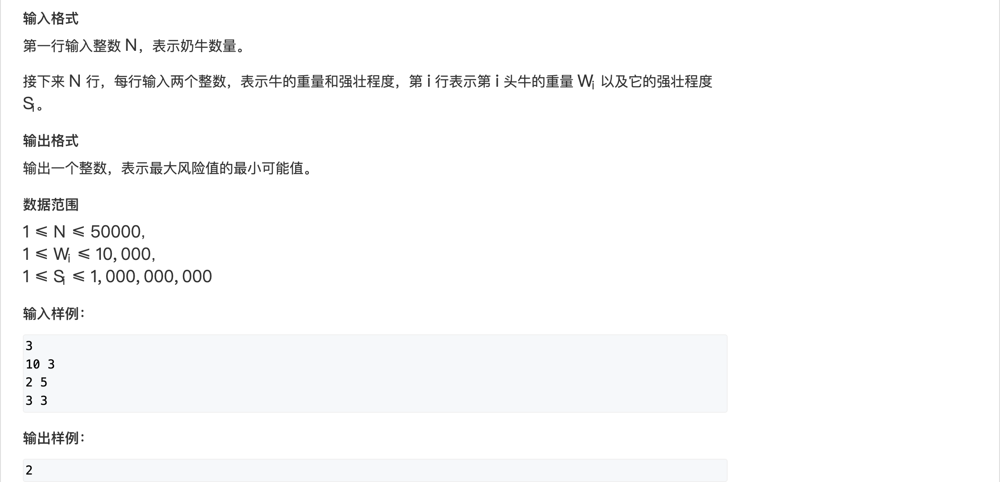

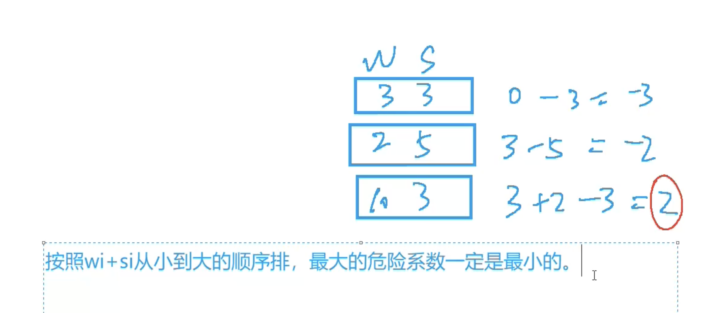

```java
import java.util.Arrays;
import java.util.Comparator;
import java.util.Scanner;

public class Main {
    public static void main(String[] args) {
        Scanner scanner = new Scanner(System.in);
        int n = scanner.nextInt();
        cow[] cows = new cow[n];
        for (int i = 0; i < n; i++) {
            int w = scanner.nextInt();
            int s = scanner.nextInt();
            cows[i] = new cow(w, s);
        }
        Arrays.sort(cows, new Comparator<cow>() {
            @Override
            public int compare(cow o1, cow o2) {
                return o1.ws - o2.ws;
            }
        });
        int res = Integer.MIN_VALUE;
        int wSum = 0;
        for (int i = 0; i < n; i++) {
            res = Math.max(res, wSum - cows[i].strength);
            wSum += cows[i].weight;
        }
        System.out.println(res);
    }
}

class cow {
    public int weight;
    public int strength;
    public int ws;

    public cow(int weight, int strength) {
        this.weight = weight;
        this.strength = strength;
        this.ws = weight + strength;
    }
}
```


