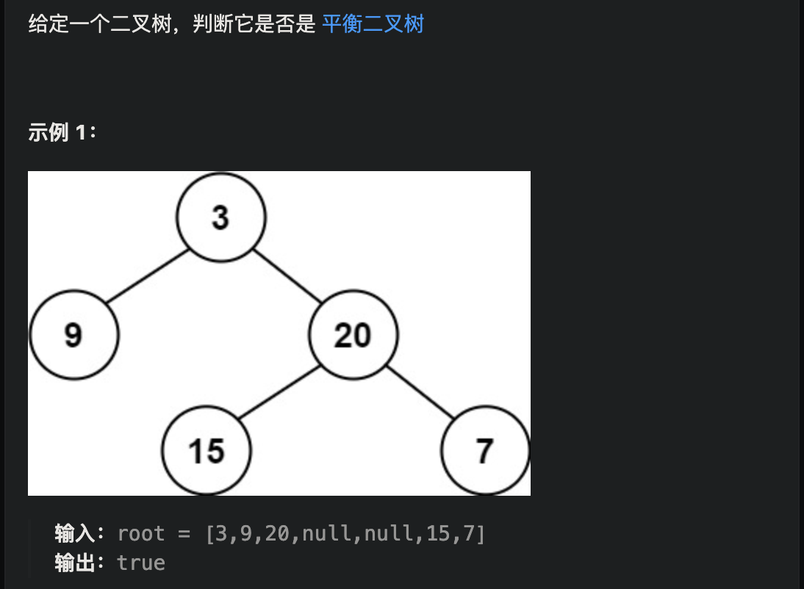
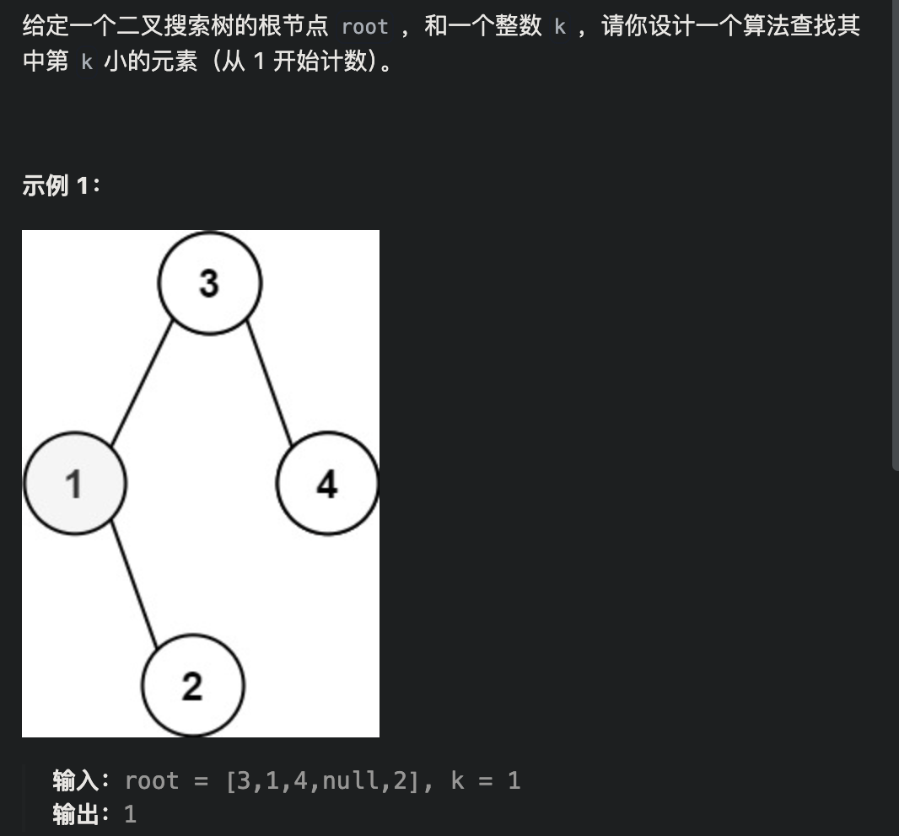

# 二叉树递归遍历

## 1.前序遍历

```java
class Solution {
    public List<Integer> preorderTraversal(TreeNode root) {
        List<Integer> res = new ArrayList<>();
        preoder(root,res);
        return res;
    }
    public void preoder(TreeNode root, List<Integer> res){
        if(root == null)
            return;
        res.add(root.val);
        preoder(root.left, res);
        preoder(root.right, res);
    }
}
```


## 2.后序遍历

```java
class Solution {
    public List<Integer> postorderTraversal(TreeNode root) {
        List <Integer> result = new ArrayList<Integer>();
        postorder(root, result);
        return result;
    }
    public void postorder(TreeNode root, List result){
        if(root == null)
            return;
        postorder(root.left, result);
        postorder(root.right, result);
        result.add(root.val);
    }
}
```


## 3.中序遍历

```java
class Solution {
    public List<Integer> inorderTraversal(TreeNode root) {
        List <Integer> result = new ArrayList();
        inorder(root, result);
        return result;
    }
    public void inorder(TreeNode root, List result){
        if(root == null)
            return;
        inorder(root.left, result);
        result.add(root.val);
        inorder(root.right,result);
    }
}
```


# 二叉树**统一**迭代遍历

主要是**后序遍历一定要用标记**

这种统一迭代遍历的写法，三种方式唯一的区别就是在当前节点不为空时，st.push的顺序，应该为倒序的正常遍历方式，如前序就应该是(右左中)

## 1.前序遍历

```java
//leetcode submit region begin(Prohibit modification and deletion)

import java.util.ArrayList;
import java.util.List;
import java.util.Stack;

/**
 * Definition for a binary tree node.
 * public class TreeNode {
 *     int val;
 *     TreeNode left;
 *     TreeNode right;
 *     TreeNode() {}
 *     TreeNode(int val) { this.val = val; }
 *     TreeNode(int val, TreeNode left, TreeNode right) {
 *         this.val = val;
 *         this.left = left;
 *         this.right = right;
 *     }
 * }
 */
class Solution {
    public List<Integer> preorderTraversal(TreeNode root) {
        List<Integer> res = new ArrayList<>();
        if(root == null) return res;
        Stack<TreeNode> stack = new Stack<>();
        stack.push(root);
        while (!stack.isEmpty()){
            TreeNode node = stack.pop();
            if(node != null){
                if(node.right != null) stack.push(node.right);
                if(node.left != null) stack.push(node.left);
                stack.push(node);
                stack.push(null);
            }else {
                res.add(stack.pop().val);
            }
        }
        return res;
    }
}
//leetcode submit region end(Prohibit modification and deletion)

```


## 2.后序遍历

```java
//leetcode submit region begin(Prohibit modification and deletion)

import java.util.ArrayList;
import java.util.List;
import java.util.Stack;

/**
 * Definition for a binary tree node.
 * public class TreeNode {
 *     int val;
 *     TreeNode left;
 *     TreeNode right;
 *     TreeNode() {}
 *     TreeNode(int val) { this.val = val; }
 *     TreeNode(int val, TreeNode left, TreeNode right) {
 *         this.val = val;
 *         this.left = left;
 *         this.right = right;
 *     }
 * }
 */
class Solution {
    public List<Integer> postorderTraversal(TreeNode root) {
        List<Integer> res = new ArrayList<>();
        if(root == null) return res;
        Stack<TreeNode> stack = new Stack<>();
        stack.push(root);
        while (!stack.isEmpty()){
            TreeNode node = stack.pop();
            if(node != null){
                stack.push(node);
                stack.push(null);
                if(node.right != null) stack.push(node.right);
                if(node.left != null) stack.push(node.left);
            }else {
                res.add(stack.pop().val);
            }
        }
        return res;
    }
}
//leetcode submit region end(Prohibit modification and deletion)

```


## 3.中序遍历

```java
class Solution {
public List<Integer> inorderTraversal(TreeNode root) {
        List<Integer> result = new LinkedList<>();
    Stack<TreeNode> st = new Stack<>();
    if (root != null) st.push(root);
    while (!st.empty()) {
        TreeNode node = st.peek();
        if (node != null) {
            st.pop(); // 将该节点弹出，避免重复操作，下面再将右中左节点添加到栈中
            if (node.right!=null) st.push(node.right);  // 添加右节点（空节点不入栈）
            st.push(node);                          // 添加中节点
            st.push(null); // 中节点访问过，但是还没有处理，加入空节点做为标记。

            if (node.left!=null) st.push(node.left);    // 添加左节点（空节点不入栈）
        } else { // 只有遇到空节点的时候，才将下一个节点放进结果集
            st.pop();           // 将空节点弹出
            node = st.peek();    // 重新取出栈中元素
            st.pop();
            result.add(node.val); // 加入到结果集
        }
    }
    return result;
}
}
```


# 二叉树层序遍历

## [二叉树的层序遍历](https://leetcode.cn/problems/binary-tree-level-order-traversal/)


```java
class Solution {
    public List<List<Integer>> levelOrder(TreeNode root) {
        List<List<Integer>> res = new ArrayList<>();
        Queue<TreeNode> queue = new LinkedList<>();
        if(root != null) queue.offer(root);
        while(!queue.isEmpty()){
            int size = queue.size();
            List<Integer> list = new ArrayList<>();
            while(size-->0){
                TreeNode temp = queue.poll();
                list.add(temp.val);
                if(temp.left!=null) queue.offer(temp.left);
                if(temp.right!=null) queue.offer(temp.right);
            }
            res.add(list);
        }
        return res;
    }
}
```


## [二叉树的层序遍历 II](https://leetcode.cn/problems/binary-tree-level-order-traversal-ii/)


```java
class Solution {
    public List<List<Integer>> levelOrderBottom(TreeNode root) {
        Queue<TreeNode> queue = new LinkedList<>();
        if(root != null) queue.offer(root);
        List<List<Integer>> res = new ArrayList<>();
        while(!queue.isEmpty()){
            int size = queue.size();
            List<Integer> list = new ArrayList<>();
            while(size -- >0){
                TreeNode node = queue.poll();
                list.add(node.val);
                if(node.left != null) queue.offer(node.left);
                if(node.right != null) queue.offer(node.right);
            }
            res.add(0, list);
        }
        return res;
    }
}
```

## [二叉树的右视图](https://leetcode.cn/problems/binary-tree-right-side-view/)


```java
class Solution {
    public List<Integer> rightSideView(TreeNode root) {
        Queue<TreeNode> queue = new LinkedList<>();
        if(root != null) queue.offer(root);
        List<Integer> res = new ArrayList<>();
        while(!queue.isEmpty()){
            int size = queue.size();
            while(size-- > 0){
                TreeNode node = queue.poll();
                if(node.left != null) queue.offer(node.left);
                if(node.right != null) queue.offer(node.right);
                if(size == 0)
                    res.add(node.val);
            }
        }
        return res;
    }
}
```


## [二叉树的层平均值](https://leetcode.cn/problems/average-of-levels-in-binary-tree/)


```java
class Solution {
    public List<Double> averageOfLevels(TreeNode root) {
        List<Double> resList = new LinkedList<>();
        Queue<TreeNode> queue = new LinkedList<>();
        if(root == null)
            return resList;
        queue.offer(root);
        while(!queue.isEmpty()){
            int size = queue.size();
            int sizeTemp = size;
            double sum = 0;
            while(size-->0){
                TreeNode node = queue.poll();
                sum += node.val;
                if(node.left != null)
                    queue.offer(node.left);
                if(node.right != null)
                    queue.offer(node.right);
            }
            resList.add(sum/sizeTemp);
        }
        return resList;
    }
}
```


## [N 叉树的层序遍历](https://leetcode.cn/problems/n-ary-tree-level-order-traversal/)


```java
class Solution {
    public List<List<Integer>> levelOrder(Node root) {
        Queue<Node> queue = new LinkedList<>();
        if(root != null) queue.offer(root);
        List<List<Integer>> res = new ArrayList<>();
        while(!queue.isEmpty()){
            int size = queue.size();
            List<Integer> list = new ArrayList<>();
            while(size-- > 0){
                Node node= queue.poll();
                list.add(node.val);
                for(Node child : node.children)
                    if(child != null)
                        queue.offer(child);
            }
            res.add(list);
        }
        return res;
    }
}
```


## [在每个树行中找最大值](https://leetcode.cn/problems/find-largest-value-in-each-tree-row/)


```java
class Solution {
    public List<Integer> largestValues(TreeNode root) {
        List<Integer> resList = new LinkedList<>();
        Queue<TreeNode> queue = new LinkedList<>();
        if(root != null)
            queue.offer(root);
        while(!queue.isEmpty()){
            int size = queue.size();
            int max = Integer.MIN_VALUE;
            while(size-->0){
                TreeNode node = queue.poll();
                if(node.val>=max)
                    max = node.val;
                if(node.left!=null)
                    queue.offer(node.left);
                if(node.right!=null)
                    queue.offer(node.right);
            }
            resList.add(max);
        }
        return resList;
    }
}
```


##  [* 填充每个节点的下一个右侧节点指针（完美二叉树，可以用递归遍历三叉树）](https://leetcode.cn/problems/populating-next-right-pointers-in-each-node/) 


```java
class Solution {
    public Node connect(Node root) {
        if(root == null) return null;
        traverse(root.left, root.right);
        return root;
    }

    void traverse(Node node1, Node node2){
        if(node1 == null || node2 == null) return;
        //前序位置，连接传入的两个节点
        node1.next = node2;
        //连接相同父亲节点的两个子节点
        traverse(node1.left, node1.right);
        traverse(node2.left, node2.right);
        //连接跨越父亲节点的练个子节点
        traverse(node1.right, node2.left);
    }
}
```


## [*填充每个节点的下一个右侧节点指针 （不是完美二叉树，层序遍历）](https://leetcode.cn/problems/populating-next-right-pointers-in-each-node-ii/) 


```java
class Solution {
    public Node connect(Node root) {
        Queue<Node> queue = new LinkedList<>();
        if(root != null)
            queue.offer(root);
        while(!queue.isEmpty()){
            int size = queue.size();
            Node pre = null;
            int sizeTemp = size;
            while(size-->0){
                Node node = queue.poll();
                if(size < sizeTemp-1 && size >= 0)
                    pre.next = node;
                pre = node;
                if(node.left!=null)
                    queue.offer(node.left);
                if(node.right!=null)
                    queue.offer(node.right);
            }
        }
        return root;
    }
}
```


## [*103. 二叉树的锯齿形层序遍历](https://leetcode.cn/problems/binary-tree-zigzag-level-order-traversal/)


```java

import java.util.*;

/**
 * Definition for a binary tree node.
 * public class TreeNode {
 *     int val;
 *     TreeNode left;
 *     TreeNode right;
 *     TreeNode() {}
 *     TreeNode(int val) { this.val = val; }
 *     TreeNode(int val, TreeNode left, TreeNode right) {
 *         this.val = val;
 *         this.left = left;
 *         this.right = right;
 *     }
 * }
 */
class Solution {
    public List<List<Integer>> zigzagLevelOrder(TreeNode root) {
        List<List<Integer>> res = new ArrayList<>();
        if(root == null) return res;
        Queue<TreeNode> queue = new LinkedList<>();
        queue.offer(root);
        int depth = 0;
        while (!queue.isEmpty()){
            int size = queue.size();
            LinkedList<Integer> path = new LinkedList<>();
            while (size-- > 0){
                TreeNode node = queue.poll();
                if(depth % 2 == 1) path.addFirst(node.val);
                else path.addLast(node.val);
                if(node.left != null) queue.offer(node.left);
                if(node.right != null) queue.offer(node.right);
            }
            depth++;
            res.add(path);
        }
        return res;
    }
}

//runtime:1 ms
//memory:42.4 MB

```


# [二叉树的最大深度](https://leetcode.cn/problems/maximum-depth-of-binary-tree/)

### 递归版本（分解问题）


```java
class Solution {
    public int maxDepth(TreeNode root) {
        if(root == null) return 0;
        int leftDepth = maxDepth(root.left);
        int rightDepth = maxDepth(root.right);
        return Math.max(leftDepth, rightDepth) + 1;
    }
}
```


### 遍历版本

```java
class Solution {
    public int maxDepth(TreeNode root) {
        Queue<TreeNode> queue = new LinkedList<>();
        if(root == null)
            return 0;
        int depth = 0;
        queue.offer(root);
        while(!queue.isEmpty()){
            int size = queue.size();
            while(size-->0){
                TreeNode node = queue.poll();
                if(node.left!=null)
                    queue.offer(node.left);
                if(node.right!=null)
                    queue.offer(node.right);
            }
            depth++;
        }
        return depth;
    }
}
```


# [*△二叉树的最小深度](https://leetcode.cn/problems/minimum-depth-of-binary-tree/)


### 递归版本

```java
class Solution {
    public int minDepth(TreeNode root) {
        if(root == null) return 0;
        int leftMinDep = minDepth(root.left);
        int rightMinDep = minDepth(root.right);
        if(root.left == null || root.right == null) return Math.max(leftMinDep, rightMinDep)+1;
        return Math.min(leftMinDep, rightMinDep) + 1;
    }
}
```


### 遍历版本

```java
class Solution {
    public int minDepth(TreeNode root) {
        int res = 0;
        Queue<TreeNode> queue = new LinkedList<>();
        if(root == null) return 0;
        queue.offer(root);
        while(!queue.isEmpty()){
            int size = queue.size();
            while(size-->0){
                TreeNode temp = queue.poll();
                if(temp.left == null && temp.right == null)
                    return res + 1;
                if(temp.left!=null)
                    queue.offer(temp.left);
                if(temp.right!=null)
                    queue.offer(temp.right);
            }
            res++;
        }
        return res;
    }
}
```


# [*翻转二叉树](https://leetcode.cn/problems/invert-binary-tree/)


### 递归版本

```java
class Solution {
    public TreeNode invertTree(TreeNode root) {
        if (root == null) {
            return null;
        }
        TreeNode left = invertTree(root.left);
        TreeNode right = invertTree(root.right);
        root.left = right;
        root.right = left;
        return root;
    }
}
```


### 遍历版本

```java
class Solution {
    public TreeNode invertTree(TreeNode root) {
        Queue<TreeNode> queue = new LinkedList<>();
        if(root != null) queue.offer(root);
        while(!queue.isEmpty()){
            int size = queue.size();
            while(size-->0){
                TreeNode node = queue.poll();
                swap(node);
                if(node.left != null) queue.offer(node.left);
                if(node.right != null) queue.offer(node.right);
            }
        }
        return root;
    }
    void swap(TreeNode node){
        TreeNode temp = node.left;
        node.left = node.right;
        node.right = temp;
    }
}
```


# [*对称二叉树](https://leetcode.cn/problems/symmetric-tree/)


```java
class Solution {
    public boolean isSymmetric(TreeNode root) {
        if(root == null) return true;
        return check(root.left, root.right);
    }
    boolean check(TreeNode left, TreeNode right){
        if(left == null && right == null)
            return true;
        if(left == null && right != null)
            return false;
        if(left != null && right == null)
            return false;
        if(left.val != right.val)
            return false;
        return check(left.left, right.right) && check(left.right, right.left);
    }
}
```


## [相同的树](https://leetcode.cn/problems/same-tree/)


```java
class Solution {
    public boolean isSameTree(TreeNode p, TreeNode q) {
        return check(p, q);
    }
    boolean check(TreeNode node1, TreeNode node2){
        if(node1 == null && node2 == null)
            return true;
        if(node1 != null && node2 == null)
            return false;
        if(node1 == null && node2 != null)
            return false;
        if(node1.val != node2.val)
            return false;
        return check(node1.left, node2.left) && check(node1.right, node2.right);
    }
}
```


## [**△另一棵树的子树](https://leetcode.cn/problems/subtree-of-another-tree/)


思路：check判断两棵树是否相同， 主函数中递归遍历左右子树与sub是否相同即可

```java
//leetcode submit region begin(Prohibit modification and deletion)

class Solution {
    public boolean isSubtree(TreeNode root, TreeNode subRoot) {
        if(root == null && subRoot != null) return false;
        if(root != null && subRoot == null) return true;
        if(check(root, subRoot)) return true;
        return isSubtree(root.left, subRoot) || isSubtree(root.right, subRoot);
    }

    boolean check(TreeNode left, TreeNode right){
        if(left==null && right!=null)
            return false;
        if(left!=null && right==null)
            return false;
        if(left==null && right==null)
            return true;
        if(left.val != right.val)
            return false;
        return check(left.left, right.left) && check(left.right, right.right);
    }
}
//leetcode submit region end(Prohibit modification and deletion)

```


# [N 叉树的最大深度](https://leetcode.cn/problems/maximum-depth-of-n-ary-tree/)


```java
class Solution {
    public int maxDepth(Node root) {
        if(root == null) return 0;
        int max = 0;
        for(Node child : root.children){
            int res = maxDepth(child);
            max = max > res ? max : res;
        }
        return max + 1;
    }
}
```


# [*完全二叉树的节点个数](https://leetcode.cn/problems/count-complete-tree-nodes/)


```java
class Solution {
    public int countNodes(TreeNode root) {
        if(root == null) return 0;
        return countNodes(root.left) + countNodes(root.right) + 1;
    }
}
```


# [***△平衡二叉树](https://leetcode.cn/problems/balanced-binary-tree/)



```java

class Solution {
    boolean isNotBalanced = false;
    public boolean isBalanced(TreeNode root) {
        if(root == null) return true;
        getDepth(root);
        return !isNotBalanced;
    }
    int getDepth(TreeNode root){
        if(root == null) return 0;
        int leftDepth = getDepth(root.left);
        int rightDepth = getDepth(root.right);
        if(Math.abs(leftDepth - rightDepth) > 1) isNotBalanced = true;
        return Math.max(leftDepth,rightDepth)+1;
    }
}

```

# [**△二叉树的所有路径](https://leetcode.cn/problems/binary-tree-paths/)


关键点：注意回溯，删除path结点

```java
class Solution {
    List<String> res = new ArrayList<>();
    List<Integer> path = new ArrayList<>();
    public List<String> binaryTreePaths(TreeNode root) {
        backtracking(root);
        return res;
    }

    void backtracking(TreeNode root){
        path.add(root.val);
        if(root.left == null && root.right == null){
            String s = "";
            for (int i = 0; i < path.size()-1; i++) {
                s += path.get(i);
                s += "->";
            }
            s += path.get(path.size()-1);
            res.add(s);
        }
        if(root.left != null) {
            backtracking(root.left);
            path.remove(path.size()-1);
        }
        if(root.right != null) {
            backtracking(root.right);
            path.remove(path.size()-1);
        }
    }
}
```


# [***左叶子之和](https://leetcode.cn/problems/sum-of-left-leaves/)

关键： 递归时传入参数：是否是从左子树传来的


```java
//leetcode submit region begin(Prohibit modification and deletion)

class Solution {
    int sum = 0;
    public int sumOfLeftLeaves(TreeNode root) {
        if(root == null) return 0;
        traverse(root, false);
        return sum;
    }
    void traverse(TreeNode root, boolean isFromLeft){
        if(root == null) return;
        if(isFromLeft && root.left == null && root.right == null)
            sum += root.val;
        traverse(root.left, true);
        traverse(root.right, false);
    }
}
//leetcode submit region end(Prohibit modification and deletion)

```


# [**找树左下角的值](https://leetcode.cn/problems/find-bottom-left-tree-value/)


## 层序遍历

```java
class Solution {
    public int findBottomLeftValue(TreeNode root) {
        Queue<TreeNode> queue = new LinkedList<>();
        queue.offer(root);
        int res = root.val;
        while(!queue.isEmpty()){
            int size = queue.size();
            res = queue.peek().val;
            while(size -- >0){
                TreeNode temp = queue.poll();
                if(temp.left != null)
                    queue.offer(temp.left);
                if(temp.right != null)
                    queue.offer(temp.right);
            }
        }
        return res;
    }
}
```

## 递归回溯（深度最深的那个结点的值（若深度相同，则左边））

```java
class Solution {
    int res;
    int maxDepth;
    public int findBottomLeftValue(TreeNode root) {
        traversal(root,1);
        return res;
    }
    public void traversal(TreeNode root,int depth){
        if(root.left == null && root.right == null){
          //这里>保证深度相同的话选择靠左的结点
            if(depth > maxDepth){
                maxDepth = depth;
                res = root.val;
            }
        }
      //先递归左子树保证深度相同的话选择靠左的结点
        if(root.left != null) traversal(root.left,depth+1);
        if(root.right != null) traversal(root.right,depth+1);
    }
}
```


# [*△路径总和](https://leetcode.cn/problems/path-sum/)


```java
//leetcode submit region begin(Prohibit modification and deletion)
class Solution {
    boolean findPath = false;
    int sum = 0;

    public boolean hasPathSum(TreeNode root, int targetSum) {
        if (root == null) return false;
        sum += root.val;
        traverse(root, targetSum);
        return findPath;
    }

    void traverse(TreeNode root, int targetSum) {
        if (root.left == null && root.right == null && sum == targetSum) {
            findPath = true;
            return;
        }
        if (root.left != null) {
            sum += root.left.val;
            traverse(root.left, targetSum);
            sum -= root.left.val;
        }
        if (root.right != null) {
            sum += root.right.val;
            traverse(root.right, targetSum);
            sum -= root.right.val;
        }
    }
}
//leetcode submit region end(Prohibit modification and deletion)

```


## [路径总和 II](https://leetcode.cn/problems/path-sum-ii/)


```java
class Solution {
    List<Integer> path = new ArrayList<>();
    List<List<Integer>> res = new ArrayList<>();

    public List<List<Integer>> pathSum(TreeNode root, int targetSum) {
        if(root == null) return res;
        path.add(root.val);
        backtracking(root, targetSum - root.val);
        return res;
    }

    void backtracking(TreeNode root, int targetSum){
        if(root.left == null && root.right == null && targetSum == 0){
            res.add(new ArrayList<>(path));
            return;
        }
        if(root.left != null) {
            path.add(root.left.val);
            backtracking(root.left, targetSum - root.left.val);
            path.remove(path.size()-1);
        }
        if(root.right != null) {
            path.add(root.right.val);
            backtracking(root.right, targetSum - root.right.val);
            path.remove(path.size()-1);
        }
    }
}
```


## [**437. 路径总和 III](https://leetcode.cn/problems/path-sum-iii/)


```java
class Solution {
    int res = 0;
    public int pathSum(TreeNode root, int targetSum) {
        backtracking1(root, targetSum);
        return res;
    }
    void backtracking1(TreeNode root, int targetSum){
        if(root == null) return;
        backtracking2(root, targetSum - root.val);
        backtracking1(root.left, targetSum);
        backtracking1(root.right, targetSum);
    }
    void backtracking2(TreeNode root, long targetSum){
        if(targetSum == 0)
            res++;
        if(root.left != null)
            backtracking2(root.left, targetSum - root.left.val);
        if(root.right != null)
            backtracking2(root.right, targetSum - root.right.val);
    }
}
```


# [**106. 从中序与后序遍历序列构造二叉树](https://leetcode.cn/problems/construct-binary-tree-from-inorder-and-postorder-traversal/)


首先回忆一下如何根据两个顺序构造一个唯一的二叉树，相信理论知识大家应该都清楚，就是以 **后序数组**的**最后一个元素为切割点**，**先切中序数组**，根据中序数组，**反过来再切后序数组**。一层一层切下去，每次后序数组最后一个元素就是节点元素。


```
第一步：如果数组大小为零的话，说明是空节点了。

第二步：如果不为空，那么取后序数组最后一个元素作为节点元素。

第三步：找到后序数组最后一个元素在中序数组的位置，作为切割点

第四步：切割中序数组，切成中序左数组和中序右数组 （顺序别搞反了，一定是先切中序数组）

第五步：切割后序数组，切成后序左数组和后序右数组

第六步：递归处理左区间和右区间
```

```java
class Solution {
    HashMap<Integer, Integer> map = new HashMap<>();
    public TreeNode buildTree(int[] inorder, int[] postorder) {
        for (int i = 0; i < inorder.length; i++) {
            map.put(inorder[i], i);
        }
        return build(inorder, postorder, 0, inorder.length-1, 0, postorder.length-1);
    }

    TreeNode build(int[] inorder, int[] postorder, int il, int ir, int pl, int pr){
        if(il > ir || pl > pr) return null;
        int rootVal = postorder[pr];
        int index = map.get(rootVal);
        TreeNode root = new TreeNode(rootVal);
        int LeftLen = index - il;
        int RightLen = ir - index;
        root.left = build(inorder, postorder, il, il + LeftLen - 1, pl, pl + LeftLen - 1);
        root.right = build(inorder, postorder,ir - RightLen + 1, ir, pr - RightLen, pr - 1);
        return root;
    }
}
```


## [105. 从前序与中序遍历序列构造二叉树](https://leetcode.cn/problems/construct-binary-tree-from-preorder-and-inorder-traversal/)


```java
class Solution {
    HashMap<Integer, Integer> map = new HashMap<>();
    public TreeNode buildTree(int[] preorder, int[] inorder) {
        for (int i = 0; i < inorder.length; i++) {
            map.put(inorder[i], i);
        }
        return build(preorder, inorder, 0, inorder.length-1, 0, preorder.length-1);
    }

    TreeNode build(int[] preorder, int[] inorder, int il, int ir, int pl, int pr){
        if(il > ir || pl > pr) return null;
        int rootVal = preorder[pl];
        int index = map.get(rootVal);
        int leftLen = index - il;
        int rightLen = ir - index;
        TreeNode root = new TreeNode(rootVal);
        root.left = build(preorder, inorder, il, il + leftLen-1, pl+1, pl + leftLen);
        root.right = build(preorder, inorder, ir - rightLen + 1, ir, pr - rightLen + 1, pr);
        return root;
    }
}
```


# [**617.合并二叉树](https://leetcode.cn/problems/merge-two-binary-trees/)


```java
class Solution {
  //合并两棵树
    public TreeNode mergeTrees(TreeNode root1, TreeNode root2) {
         if(root1 == null) return root2;
         if(root2 == null) return root1;
         root1.val += root2.val;
         root1.left = mergeTrees(root1.left, root2.left);
         root1.right = mergeTrees(root1.right, root2.right);
         return root1;
    }
}
```


# 二叉搜索树

## [700.二叉搜索树中的搜索](https://leetcode.cn/problems/search-in-a-binary-search-tree/)


### 遍历

```java
class Solution {
    public TreeNode searchBST(TreeNode root, int val) {
        TreeNode cur = root;
        while(cur != null){
            if(cur.val > val)
                cur = cur.left;
            else if(cur.val < val)
                cur = cur.right;
            else
                return cur;
        }
        return null;
    }
}
```

### 递归

```java
class Solution {
    public TreeNode searchBST(TreeNode root, int val) {
        if(root == null || root.val == val) return root;
        TreeNode res = null;
        if(root.val > val)
            res = searchBST(root.left, val);
        if(root.val < val)
            res = searchBST(root.right, val);
        return res;
    }
}
```


## [*530.二叉搜索树的最小绝对差](https://leetcode.cn/problems/minimum-absolute-difference-in-bst/)


```java
//因为二叉搜索树中序遍历是顺序的，所以维护一个pre前一个节点的值，用当前节点的值减去pre前一个节点值即可获得任意两个相邻节点的值，取最小值即可
```

```java
class Solution {
    int res = Integer.MAX_VALUE;
    int pre = -1;
    public int getMinimumDifference(TreeNode root) {
        traverse(root);
        return res;
    }

    void traverse(TreeNode root){
        if(root == null) return;
        traverse(root.left);
        if(pre != -1)
            res = Math.min(res, Math.abs(pre - root.val));
        pre = root.val;
        traverse(root.right);
    }
}
```


## [**△108. 将有序数组转换为二叉搜索树](https://leetcode.cn/problems/convert-sorted-array-to-binary-search-tree/)


```java
// BST 的中序遍历是升序的，因此本题等同于根据中序遍历的序列恢复二叉搜索树。因此我们可以以升序序列中的任一个元素作为根节点，以该元素左边的升序序列构建左子树，以该元素右边的升序序列构建右子树，这样得到的树就是一棵二叉搜索树啦～ 又因为本题要求高度平衡，因此我们需要选择升序序列的中间元素作为根节点奥～
```

```java
class Solution {
    public TreeNode sortedArrayToBST(int[] nums) {
        return traverse(nums, 0, nums.length-1);
    }
    //以nums[left, right]构造一棵平衡搜索树,返回构造的root结点
    TreeNode traverse(int[] nums, int left, int right){
        if(left > right) return null;
        //前序逻辑，以中间的数构建
        int mid = left + right >> 1;
        TreeNode root = new TreeNode(nums[mid]);

        root.left = traverse(nums, left, mid-1);
        root.right = traverse(nums, mid+1, right);
        return root;
    }
}
```


## [*98. 验证二叉搜索树](https://leetcode.cn/problems/validate-binary-search-tree/)


```java
//中序遍历时，判断当前节点是否大于中序遍历的前一个节点，如果大于，说明满足 BST，继续遍历；否则直接返回 false。
//只返回false的情况，因为只有全都符合才返回true
```

```java
//leetcode submit region begin(Prohibit modification and deletion)
class Solution {
    boolean isValid = true;
    boolean isFirstTime = true;
    int pre;
    public boolean isValidBST(TreeNode root) {
        traverse(root);
        return isValid;
    }
    void traverse(TreeNode root){
        if(root == null) return;
        traverse(root.left);
        if(isFirstTime){
            pre = root.val;
            isFirstTime = false;
        }else{
            if(root.val <= pre) isValid = false;
            pre = root.val;
        }
        traverse(root.right);
    }
}
//leetcode submit region end(Prohibit modification and deletion)

```


# [*230. 二叉搜索树中第 K 小的元素](https://leetcode.cn/problems/kth-smallest-element-in-a-bst/)




```java
class Solution {
    int cnt;
    int res;
    public int kthSmallest(TreeNode root, int k) {
        cnt = k;
        traverse(root);
        return res;
    }

    void traverse(TreeNode root){
        if(root == null) return;
        traverse(root.left);
        if(--cnt == 0) res = root.val;
        traverse(root.right);
    }
}
```


# [**114. 二叉树展开为链表](https://leetcode.cn/problems/flatten-binary-tree-to-linked-list/)


思路：分解问题的思维

```java
class Solution {
    //将一颗树拉平
    public void flatten(TreeNode root) {
        if(root == null) return;
        //拉平左右子树
        flatten(root.left);
        flatten(root.right);
        //后序遍历逻辑
        TreeNode left = root.left;
        TreeNode right = root.right;
        //左子树接到root
        root.left = null;
        root.right = left;
        //右子树接到末尾
        TreeNode cur = root;
        while(cur.right != null) cur = cur.right;
        cur.right = right;
    }

}
```


# [*543. 二叉树的直径](https://leetcode.cn/problems/diameter-of-binary-tree/)


```java
//思路：一颗树的直径等于左右子树的深度之和
```

```java
class Solution {
    int res = 0;
    public int diameterOfBinaryTree(TreeNode root) {
        getMaxDepth(root);
        return res;
    }

    int getMaxDepth(TreeNode root){
        if(root == null) return 0;
        int leftMaxDepth = getMaxDepth(root.left);
        int rightMaxDepth = getMaxDepth(root.right);
        //后序逻辑
        int curDiametre = leftMaxDepth + rightMaxDepth;
        res = Math.max(res, curDiametre);
        return Math.max(leftMaxDepth, rightMaxDepth) + 1;
    }
}
```


## [***124. 二叉树中的最大路径和](https://leetcode.cn/problems/binary-tree-maximum-path-sum/)


```java
class Solution {
    int res = Integer.MIN_VALUE;
    public int maxPathSum(TreeNode root) {
        if(root == null) return 0;
        traverse(root);
        return res;
    }
    //返回经过root的单边分支的最大和
    int traverse(TreeNode root){
        if(root == null) return 0;
        //左边分支最大值，若<0则不选择
        int leftMax = Math.max(0, traverse(root.left));
        //右边分支最大值
        int rightMax = Math.max(0, traverse(root.right));
        //跟历史最大值比较
        res = Math.max(res, root.val + leftMax + rightMax);
        //返回经过root的单边分支最大值
        return root.val + Math.max(leftMax, rightMax);
    }
}
```


# [**△236. 二叉树的最近公共祖先](https://leetcode.cn/problems/lowest-common-ancestor-of-a-binary-tree/)


```java
class Solution {
    public TreeNode lowestCommonAncestor(TreeNode root, TreeNode p, TreeNode q) {
        //终止条件：当越过叶节点，则直接返回 null ；当 root 等于 p,q ，则直接返回 root
        if(root == null || root == p || root == q) return root;
        TreeNode left = lowestCommonAncestor(root.left, p, q);
        TreeNode right = lowestCommonAncestor(root.right, p , q);
        //说明 root 的左 / 右子树中都不包含 p,q ，返回 null
        if(left == null && right == null) return null;
        //p,q 都不在 root 的左子树中，直接返回 right
        if(left == null) return right;
        if(right == null) return left;
        //说明 p,q 分列在 root 的 异侧 （分别在 左 / 右子树），因此 root 为最近公共祖先
        return root;
    }
}
```


## [**235. 二叉搜索树的最近公共祖先](https://leetcode.cn/problems/lowest-common-ancestor-of-a-binary-search-tree/)


```java
class Solution {
    public TreeNode lowestCommonAncestor(TreeNode root, TreeNode p, TreeNode q) {
        if(p.val < root.val && q.val < root.val)
            return lowestCommonAncestor(root.left, p, q);
        if(p.val > root.val && q.val > root.val)
            return lowestCommonAncestor(root.right, p, q);
        return root;
    }
}
```


# 二叉树平均路径长度

```java
class Solution {
    private int totalPathLength = 0; // 所有叶子节点的路径长度总和
    private int leafCount = 0;       // 叶子节点的数量

    public double averagePathLength(TreeNode root) {
        if (root == null) return 0; // 空树直接返回0
        dfs(root, 0);               // 从根节点开始深度优先搜索
        return (double) totalPathLength / leafCount; // 计算平均值
    }

    private void dfs(TreeNode node, int currentDepth) {
        if (node == null) return; // 当前节点为空，直接返回

        // 如果是叶子节点
        if (node.left == null && node.right == null) {
            totalPathLength += currentDepth; // 累加路径长度
            leafCount++;                     // 增加叶子节点计数
            return;
        }

        // 递归遍历左子树和右子树
        dfs(node.left, currentDepth + 1);
        dfs(node.right, currentDepth + 1);
    }
}
```


# [129. 求根节点到叶节点数字之和](https://leetcode.cn/problems/sum-root-to-leaf-numbers/)


```java
//leetcode submit region begin(Prohibit modification and deletion)
/**
 * Definition for a binary tree node.
 * public class TreeNode {
 *     int val;
 *     TreeNode left;
 *     TreeNode right;
 *     TreeNode() {}
 *     TreeNode(int val) { this.val = val; }
 *     TreeNode(int val, TreeNode left, TreeNode right) {
 *         this.val = val;
 *         this.left = left;
 *         this.right = right;
 *     }
 * }
 */
class Solution {
    int res = 0;
    StringBuilder path = new StringBuilder();
    public int sumNumbers(TreeNode root) {
        traverse(root);
        return res;
    }

    void traverse(TreeNode root){
        path.append(root.val);
        if(root.left == null && root.right == null){
            int sum = Integer.parseInt(path.toString());
            res += sum;
            return;
        }
        if(root.left != null){
            traverse(root.left);
            path.deleteCharAt(path.length()-1);
        }
        if(root.right != null){
            traverse(root.right);
            path.deleteCharAt(path.length()-1);
        }
    }
}
//leetcode submit region end(Prohibit modification and deletion)

```


# [662. 二叉树最大宽度](https://leetcode.cn/problems/maximum-width-of-binary-tree/)


```java
//leetcode submit region begin(Prohibit modification and deletion)

import java.util.HashMap;
import java.util.LinkedList;
import java.util.Queue;

/**
 * Definition for a binary tree node.
 * public class TreeNode {
 *     int val;
 *     TreeNode left;
 *     TreeNode right;
 *     TreeNode() {}
 *     TreeNode(int val) { this.val = val; }
 *     TreeNode(int val, TreeNode left, TreeNode right) {
 *         this.val = val;
 *         this.left = left;
 *         this.right = right;
 *     }
 * }
 */
class Solution {
    public int widthOfBinaryTree(TreeNode root) {
        Queue<TreeNode> queue = new LinkedList<>();
        HashMap<TreeNode, Integer> map = new HashMap<>();
        queue.offer(root);
        map.put(root, 0);
        int maxWidth = 1;
        while (!queue.isEmpty()){
            int size = queue.size();
            int width = 0;
            int start = -1;
            int end = -1;
            for (int i = 0; i < size; i++) {
                TreeNode node = queue.poll();
                int idx = map.get(node);
                if(i == 0) start = idx;
                if(i == size - 1) end = idx;
                if(node.left != null){
                    queue.offer(node.left);
                    map.put(node.left, idx * 2);
                }
                if(node.right != null){
                    queue.offer(node.right);
                    map.put(node.right, idx * 2 + 1);
                }
            }
            maxWidth = Math.max(maxWidth, end - start + 1);
        }
        return maxWidth;
    }
}
//leetcode submit region end(Prohibit modification and deletion)

```


# [297. 二叉树的序列化与反序列化](https://leetcode.cn/problems/serialize-and-deserialize-binary-tree/)


```java
public class Codec {
    public String serialize(TreeNode root) {
        if (root == null) return "[]";
        StringBuilder res = new StringBuilder("[");
        Queue<TreeNode> queue = new LinkedList<>() {{ add(root); }};
        while (!queue.isEmpty()) {
            TreeNode node = queue.poll();
            if (node != null) {
                res.append(node.val + ",");
                queue.add(node.left);
                queue.add(node.right);
            }
            else res.append("null,");
        }
        res.deleteCharAt(res.length() - 1);
        res.append("]");
        return res.toString();
    }

    public TreeNode deserialize(String data) {
        if (data.equals("[]")) return null;
        String[] vals = data.substring(1, data.length() - 1).split(",");
        TreeNode root = new TreeNode(Integer.parseInt(vals[0]));
        Queue<TreeNode> queue = new LinkedList<>() {{ add(root); }};
        int i = 1;
        while (!queue.isEmpty()) {
            TreeNode node = queue.poll();
            if (!vals[i].equals("null")) {
                node.left = new TreeNode(Integer.parseInt(vals[i]));
                queue.add(node.left);
            }
            i++;
            if (!vals[i].equals("null")) {
                node.right = new TreeNode(Integer.parseInt(vals[i]));
                queue.add(node.right);
            }
            i++;
        }
        return root;
    }
}

```

