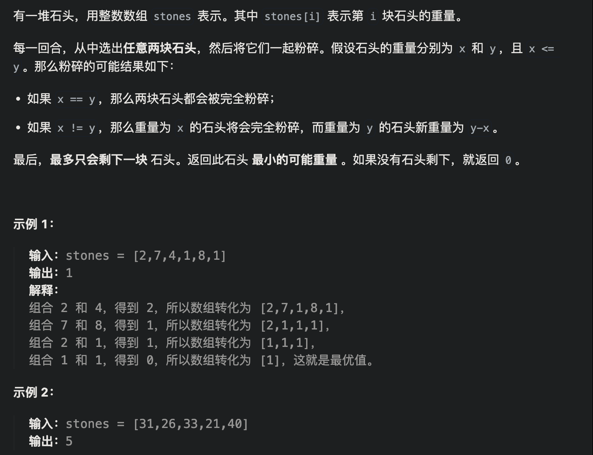
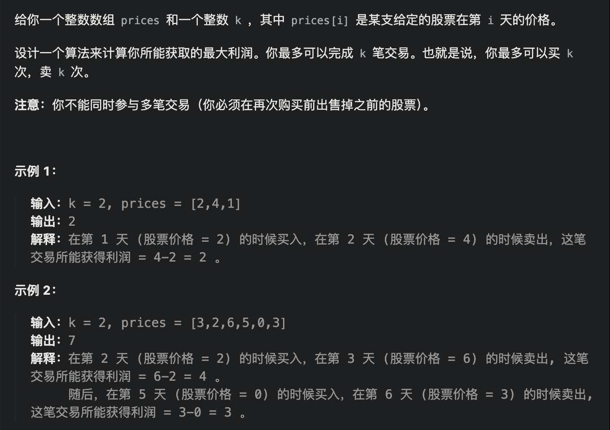
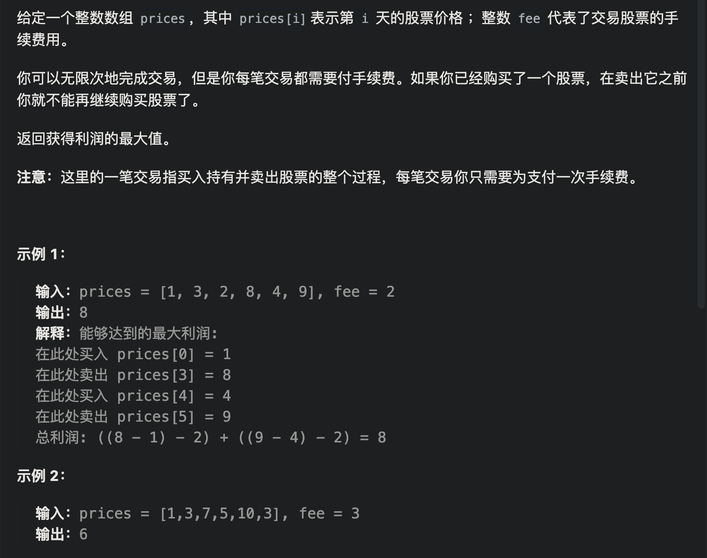

# [斐波那契数](https://leetcode.cn/problems/fibonacci-number/)


```java
class Solution {
    public int fib(int n) {
        if(n <= 1) return n; 
        int[] dp = new int[n+1];
        dp[0] = 0;
        dp[1] = 1;        
        for(int i = 2; i <= n; i ++){
            dp[i] = dp[i-1] + dp[i-2];
        }
        return dp[n];
    }
}
```


# [爬楼梯](https://leetcode.cn/problems/climbing-stairs/)


```java
class Solution {
    public int climbStairs(int n) {
        //dp[i]表示 爬到i层阶梯的方法数
        //递推dp[i]=dp[i-1]+dp[i-2]
        int[] dp = new int[n+1];
        dp[0] = 1;
        dp[1] = 1;
        for(int i = 2; i <=n; i++){
            dp[i] = dp[i-1] + dp[i-2];
        }
        return dp[n];
    }
}
```


# [使用最小花费爬楼梯](https://leetcode.cn/problems/min-cost-climbing-stairs/)


```java
class Solution {
    public int minCostClimbingStairs(int[] cost) {
        //dp[i]表示爬到第i个台阶所花的最低费用
        //dp[i] = min(dp[i-1]+cost[i-1],dp[i-2]+cost[i-2] )
        int len = cost.length;
        int[] dp = new int[len+1];
        dp[0] = 0;
        dp[1] = 0;
        for(int i = 2; i <= len; i++){
            dp[i] = Math.min(dp[i-1]+cost[i-1],dp[i-2]+cost[i-2]);
        }
        return dp[len];
    }
}
```

# [不同路径](https://leetcode.cn/problems/unique-paths/)


```java
class Solution {
    public int uniquePaths(int m, int n) {
        int[][] dp = new int[m][n];
        for(int i = 0; i < m; i++) dp[i][0] = 1;
        for(int j = 0; j < n; j++) dp[0][j] = 1;
        for(int i = 1; i < m; i++)
            for(int j = 1; j < n; j++){
                dp[i][j] += dp[i-1][j] + dp[i][j-1];
            }
        return dp[m-1][n-1];
    }
}
```


# [不同路径 II](https://leetcode.cn/problems/unique-paths-ii/)


```java
class Solution {
    public int uniquePathsWithObstacles(int[][] obstacleGrid) {
        int m = obstacleGrid.length;
        int n = obstacleGrid[0].length;
        int[][] dp = new int[m][n];
        if(obstacleGrid[0][0] == 1 || obstacleGrid[m-1][n-1] == 1) return 0;
        for(int i = 0; i < m; i++){
            if(obstacleGrid[i][0] == 1) break;
            dp[i][0] = 1;
        }
        for(int i = 0; i < n; i++){
            if(obstacleGrid[0][i] == 1) break;
            dp[0][i] = 1;
        }
        for(int i = 1; i < m; i++){
            for(int j = 1; j < n; j++){
                if(obstacleGrid[i-1][j] == 0)
                    dp[i][j] += dp[i-1][j];
                if(obstacleGrid[i][j-1] == 0)
                    dp[i][j] += dp[i][j-1];
            }
        }
        return dp[m-1][n-1];
    }
}
```


# [*整数拆分](https://leetcode.cn/problems/integer-break/)


可以想 dp[i]最大乘积是怎么得到的呢？

其实可以从1遍历j，然后有两种渠道得到dp[i].

一个是j * (i - j) 直接相乘。

一个是j * dp[i - j]，相当于是拆分(i - j)，对这个拆分不理解的话，可以回想dp数组的定义。

**那有同学问了，j怎么就不拆分呢？**

j是从1开始遍历，拆分j的情况，在遍历j的过程中其实都计算过了。那么从1遍历j，比较(i - j) * j和dp[i - j] * j 取最大的。递推公式：dp[i] = max(dp[i], max((i - j) * j, dp[i - j] * j));

**也可以这么理解，j * (i - j) 是单纯的把整数拆分为两个数相乘，而j * dp[i - j]是拆分成两个以及两个以上的个数相乘。**

如果定义dp[i - j] * dp[j] 也是默认将一个数强制拆成4份以及4份以上了。

所以递推公式：dp[i] = max({dp[i], (i - j) * j, dp[i - j] * j});

那么在取最大值的时候，为什么还要比较dp[i]呢？

因为在递推公式推导的过程中，每次计算dp[i]，取最大的而已。

```java
class Solution {
    public int integerBreak(int n) {
        int[] dp = new int[n+1];
        dp[2] = 1;
        for(int i = 3; i <= n; i++){
            for(int j = 1; j < i; j++){
                dp[i] = Math.max(dp[i], Math.max(j * (i - j), j * dp[i-j]));
            }
        }
        return dp[n];
    }
}
```


# [**不同的二叉搜索树](https://leetcode.cn/problems/unique-binary-search-trees/)


dp[3]，就是 元素1为头结点搜索树的数量 + 元素2为头结点搜索树的数量 + 元素3为头结点搜索树的数量

元素1为头结点搜索树的数量 = 右子树有2个元素的搜索树数量 * 左子树有0个元素的搜索树数量

元素2为头结点搜索树的数量 = 右子树有1个元素的搜索树数量 * 左子树有1个元素的搜索树数量

元素3为头结点搜索树的数量 = 右子树有0个元素的搜索树数量 * 左子树有2个元素的搜索树数量

有2个元素的搜索树数量就是dp[2]。

有1个元素的搜索树数量就是dp[1]。

有0个元素的搜索树数量就是dp[0]。

所以dp[3] = dp[2] * dp[0] + dp[1] * dp[1] + dp[0] * dp[2]


```java
class Solution {
    public int numTrees(int n) {
        //初始化 dp 数组
        int[] dp = new int[n + 1];
        //初始化0个节点和1个节点的情况
        dp[0] = 1;
        dp[1] = 1;
        for (int i = 2; i <= n; i++) {
            for (int j = 1; j <= i; j++) {
                //对于第i个节点，需要考虑1作为根节点直到i作为根节点的情况，所以需要累加
                //一共i个节点，对于根节点j时,左子树的节点个数为j-1，右子树的节点个数为i-j
              	//y因为左子树结点比根结点小，而右子树大
                dp[i] += dp[j - 1] * dp[i - j];
            }
        }
        return dp[n];
    }
}
```


# 01背包问题


首先是二维数组版本


```java
import java.util.Scanner;

public class Main {
    static final int N = 1010;
    static int[] v = new int[N];//体积
    static int[] w = new int[N];//价值
    static int[][] f = new int[N][N];//f[i][j]表示不超过j体积下，前i个物品的最大价值
    public static void main(String[] args) {
        Scanner scanner = new Scanner(System.in);
        int n = scanner.nextInt();//物品个数
        int m = scanner.nextInt();//最大体积
        for (int i = 1; i <= n; i++) {
            v[i] = scanner.nextInt();
            w[i] = scanner.nextInt();
        }
        //f[0][j]、f[i][0]是0，所以遍历i、j从1开始
        for (int i = 1; i <= n; i++) {//物品
            for (int j = 1; j <= m; j++) {//体积
                //如果装不下第i个物品,则价值就是前i-1个物品
                if(j<v[i])
                    f[i][j] = f[i-1][j];
                else //装得下第i个物品，就选择装或不装的情况下价值高的那个
                    f[i][j] = Math.max(f[i-1][j],f[i-1][j-v[i]]+w[i]);
            }
        }
        System.out.println(f[n][m]);
    }
}

```


优化到一维数组


```java
import java.util.Scanner;

public class ac1_优化 {
    static final int N = 1010;
    static int[] f = new int[N];//f[j]表示前i轮决策的物品且体积小于j下最大价值
    static int[] v = new int[N];
    static int[] w = new int[N];
    public static void main(String[] args) {
        Scanner scanner = new Scanner(System.in);
        int n = scanner.nextInt();//物品个数
        int m = scanner.nextInt();//最大体积
        for (int i = 1; i <= n; i++) {
            v[i] = scanner.nextInt();
            w[i] = scanner.nextInt();
        }
        for (int i = 1; i <= n; i++) {
            for (int j = m;j>=v[i];j--)//倒序遍历保证每一个物品只添加一次
                //f[j]表示不放物品i
                f[j] = Math.max(f[j],f[j-v[i]]+w[i]);
        }
        System.out.println(f[m]);
    }
}

```


[AcWing 2. 01背包问题（状态转移方程讲解） - AcWing](https://www.acwing.com/solution/content/1374/)


# [分割等和子集](https://leetcode.cn/problems/partition-equal-subset-sum/)


```java
class Solution {
    public boolean canPartition(int[] nums) {
        int sum = 0;
        for(int num : nums)
            sum += num;
        if(sum % 2 == 1) return false;
        int target = sum / 2;
        int[] dp = new int[target+1];
        //转化为01背包，物品的体积和价值一样，找到target容量下最大价值，看是否能装满
        dp[0] = 0;
        for(int i = 0; i < nums.length; i++){
            for(int j = target; j >= nums[i]; j--){
                dp[j] = Math.max(dp[j], dp[j - nums[i]] + nums[i]);
            }
        }
        return dp[target] == target;
    }
}
```


# [最后一块石头的重量 II](https://leetcode.cn/problems/last-stone-weight-ii/)



```java
class Solution {
    public int lastStoneWeightII(int[] stones) {
        //转换成01背包，尽可能装满target容量，返回差值
        int sum = 0;
        for(int stone : stones)
            sum += stone;
        int target = sum / 2;
        int[] dp = new int[target + 1];
        for(int i = 0; i < stones.length; i++)
            for(int j = target; j >= stones[i]; j--){
                dp[j] = Math.max(dp[j], dp[j-stones[i]] + stones[i]);
            }
      // sum-dp[target] - dp[target]
        return Math.abs(sum - 2 * dp[target]);
    }
}
```


# [目标和](https://leetcode.cn/problems/target-sum/)


```java
class Solution {
    public int findTargetSumWays(int[] nums, int target) {
        // 01背包应用之“有多少种不同的填满背包最大容量的方法“
        // left - right = target
        // sum - 2*right = target
        // right = (sum-target)/2
        //正好填满right容量的方法数
        int sum = 0;
        for(int num : nums)
            sum += num;
        if((sum - target) % 2 == 1) return 0;
        if(sum - target < 0) return 0;
        int bagSize = (sum-target)/2;
      //dp[j]表示正好装满j容量的方法数
        int[] dp = new int[bagSize + 1];
        dp[0] = 1;
        for(int i = 0; i < nums.length; i++)
            for(int j = bagSize; j >= nums[i]; j--){
                dp[j] += dp[j - nums[i]];
            }
        return dp[bagSize];
    }
}
```


# [一和零](https://leetcode.cn/problems/ones-and-zeroes/)


```java
class Solution {
    public int findMaxForm(String[] strs, int m, int n) {
        int len = strs.length;
        int[] cnt0 = new int[len];
        int[] cnt1 = new int[len];
        for(int i = 0; i < strs.length; i++){
            String s = strs[i];
            for(int j = 0; j < s.length(); j++){
                char c = s.charAt(j);
                if(c == '0') cnt0[i]++;
                else cnt1[i]++;
            }
        }
        int[][] dp = new int[m+1][n+1];
        //三维背包压缩成二维背包
        for(int i = 0; i < len; i++)
            for(int j = m; j >= cnt0[i]; j--)
                for(int k = n; k >= cnt1[i]; k--)
                    dp[j][k] = Math.max(dp[j][k], dp[j-cnt0[i]][k-cnt1[i]] + 1);
        return dp[m][n];
    }
}
```


# 完全背包问题

**如果求组合数就是外层for循环遍历物品，内层for遍历背包**。

**如果求排列数就是外层for遍历背包，内层for循环遍历物品**。


首先是三重循环版本，k表示第i个物品取k个


优化成二重循环


由于完全背包问题都是本层的i，所以正序

```java
import java.util.Scanner;

public class Main {
    static final int N = 1010;
    static int[] v = new int[N];
    static int[] w = new int[N];
    static int[] f = new int[N];
    public static void main(String[] args) {
        Scanner scanner = new Scanner(System.in);
        int n = scanner.nextInt();
        int m = scanner.nextInt();
        for (int i = 1; i <= n; i++) {
            v[i] = scanner.nextInt();
            w[i] = scanner.nextInt();
        }
        for (int i = 1; i <= n; i++) {
            for (int j = v[i]; j <= m; j++) {
                f[j] = Math.max(f[j],f[j-v[i]]+w[i]);
            }
        }
        System.out.println(f[m]);
    }
}

```


# [零钱兑换 II](https://leetcode.cn/problems/coin-change-ii/)


**如果求组合数就是外层for循环遍历物品，内层for遍历背包**。

```java
class Solution {
    public int change(int amount, int[] coins) {
        int[] dp = new int[amount + 1];
        dp[0] = 1;
        for(int i = 0; i < coins.length; i++)
            for(int j = coins[i]; j <= amount; j++)
                dp[j] += dp[j-coins[i]];
        return dp[amount];
    }
}
```

# [组合总和 Ⅳ](https://leetcode.cn/problems/combination-sum-iv/)

**如果求排列数就是外层for遍历背包，内层for循环遍历物品**。


```java
class Solution {
    public int combinationSum4(int[] nums, int target) {
        int[] dp = new int[target + 1];
        dp[0] = 1;
        for(int j = 0; j <= target; j++)
            for(int i = 0; i < nums.length; i++)
                if(j >= nums[i])
                    dp[j] += dp[j-nums[i]];
        return dp[target];
    }
}
```


# [*零钱兑换](https://leetcode.cn/problems/coin-change/)


**考虑到递推公式的特性，dp[j]必须初始化为一个最大的数，否则就会在min(dp[j - coins[i]] + 1, dp[j])比较的过程中被初始值覆盖。**

**所以下标非0的元素都是应该是最大值。**

```java
class Solution {
    public int coinChange(int[] coins, int amount) {
        //组合问题
        int[] dp = new int[amount + 1];
        Arrays.fill(dp, Integer.MAX_VALUE);
        dp[0] = 0;
        for(int i = 0; i < coins.length; i++)
            for(int j = coins[i]; j <= amount; j++)
                //只有dp[j-coins[i]]不是初始最大值时，该位才有选择的必要
                if(dp[j-coins[i]] != Integer.MAX_VALUE)
                    dp[j] = Math.min(dp[j], dp[j-coins[i]]+1);
        return dp[amount] == Integer.MAX_VALUE? -1 : dp[amount];
    }
}
```


# [完全平方数](https://leetcode.cn/problems/perfect-squares/)


```java
class Solution {
    // 组合问题，先遍历物品, 再遍历背包
    public int numSquares(int n) {
        int max = Integer.MAX_VALUE;
        int[] dp = new int[n + 1];
        //初始化
				Arrays.fill(dp, Integer.MAX_VALUE);
	
        //当和为0时，组合的个数为0
        dp[0] = 0;
        // 遍历物品
        for (int i = 1; i * i <= n; i++) {
            // 遍历背包
            for (int j = i * i; j <= n; j++) {
                //if (dp[j - i * i] != max) {
                    dp[j] = Math.min(dp[j], dp[j - i * i] + 1);
                //}
		//不需要這個if statement，因爲在完全平方數這一題不會有"湊不成"的狀況發生（ 一定可以用"1"來組成任何一個n），故comment掉這個if statement。
            }
        }
        return dp[n];
    }
}

```


# [*单词拆分](https://leetcode.cn/problems/word-break/)


```java
class Solution {
    public boolean wordBreak(String s, List<String> wordDict) {
        //dp[j]表示长度为j的字符串是否可以拆分
        int len = s.length();
        boolean[] dp = new boolean[len+1];
        dp[0] = true;
        //完全背包排列问题，先遍历背包再遍历物品
        for(int j = 1; j <= len; j++)
            for(int i = 0; i < j; i++){
                //这里的物品指的是[i, j]的子串
                String substr = s.substring(i, j);
                // System.out.println("i:"+i+"---"+"j:"+j+"----substr:"+substr);
                if(wordDict.contains(substr) && dp[i])
                    dp[j] = true;
            }

        // for(int i = 0; i < dp.length; i++)
        //     System.out.println("dp"+ i + "----: " + dp[i]);
        return dp[len];
    }
}
```


# [打家劫舍](https://leetcode.cn/problems/house-robber/)


```java
class Solution {
    public int rob(int[] nums) {
        int[] dp = new int[nums.length];
        if(nums.length == 1) return nums[0];
        dp[0] = nums[0];
        dp[1] = Math.max(nums[0], nums[1]);
        for(int i = 2; i < nums.length; i++)
          //偷i或者不偷i
            dp[i] = Math.max(dp[i-1], dp[i-2]+nums[i]);
        return dp[nums.length - 1];
    }
}
```


# [*打家劫舍 II](https://leetcode.cn/problems/house-robber-ii/)


```java
class Solution {
    public int rob(int[] nums) {
        int n = nums.length;
        if(n == 1) return nums[0];
        int res1 = robHelper(nums, 1, n - 2);
        int res2 = robHelper(nums, 0, n - 2);
        int res3 = robHelper(nums, 1, n - 1);
        return Math.max(res1, Math.max(res2, res3));
    }

    int robHelper(int[] nums, int start, int end){
        if(start > end) return 0;
        if(start == end) return nums[start];
        int[] dp = new int[nums.length];
        dp[start] = nums[start];
        dp[start + 1] = Math.max(nums[start], nums[start+1]);
        for (int i = start + 2; i <= end; i++) {
            dp[i] = Math.max(dp[i - 1], dp[i - 2] + nums[i]);
        }
        return dp[end];
    }
}
```


# [**△打家劫舍 III](https://leetcode.cn/problems/house-robber-iii/)


```java
    // 3.状态标记递归
    // 执行用时：0 ms , 在所有 Java 提交中击败了 100% 的用户
    // 不偷：Max(左孩子不偷，左孩子偷) + Max(右孩子不偷，右孩子偷)
    // root[0] = Math.max(rob(root.left)[0], rob(root.left)[1]) +
    // Math.max(rob(root.right)[0], rob(root.right)[1])
    // 偷：左孩子不偷+ 右孩子不偷 + 当前节点偷
    // root[1] = rob(root.left)[0] + rob(root.right)[0] + root.val;
    class Solution {
    public int rob(TreeNode root) {
        int[] res = backtracking(root);
        return Math.max(res[0], res[1]);
    }

    int[] backtracking(TreeNode root){
        int[] res = new int[2];
        if(root == null) return res;
        int[] left = backtracking(root.left);
        int[] right = backtracking(root.right);
        res[0] = Math.max(left[0], left[1]) + Math.max(right[0], right[1]);
        res[1] = root.val + left[0] + right[0];
        return res;
    }
	}

```


# [买卖股票的最佳时机](https://leetcode.cn/problems/best-time-to-buy-and-sell-stock/)

只有一次买卖机会


```java
class Solution {
    public int maxProfit(int[] prices) {
        int len = prices.length;
        int[][] dp = new int[len][2];
        //dp[i][0] 表示第i天持有股票的最大收益
        //dp[i][1] 表示第i天不持有股票的最大收益
        dp[0][0] = -prices[0];
        dp[0][1] = 0;
        for(int i = 1; i < len; i++){
            dp[i][0] = Math.max(dp[i-1][0], -prices[i]);
            dp[i][1] = Math.max(dp[i-1][1], dp[i-1][0] + prices[i]);
        }
        return dp[len-1][1];
    }
}
```


# [买卖股票的最佳时机 II](https://leetcode.cn/problems/best-time-to-buy-and-sell-stock-ii/)

有无限次买卖机会


```java
class Solution {
    public int maxProfit(int[] prices) {
        int len = prices.length;
        int[][] dp = new int[len][2];
        dp[0][0] = -prices[0];
        dp[0][1] = 0;
        for(int i = 1; i < len; i++){
            //持有（唯一区别）
            dp[i][0] = Math.max(dp[i-1][0], dp[i-1][1] - prices[i]);
            //不持有
            dp[i][1] = Math.max(dp[i-1][1], dp[i-1][0] + prices[i]);
        }
        return dp[len-1][1];
    }
}
```


# [买卖股票的最佳时机 III](https://leetcode.cn/problems/best-time-to-buy-and-sell-stock-iii/)

只有两次买卖机会


```java
class Solution {
    public int maxProfit(int[] prices) {
        int n = prices.length;
        int[][] dp = new int[n][4];
        dp[0][0] = -prices[0];
        dp[0][2] = -prices[0];
        for (int i = 1; i < n; i++) {
            dp[i][0] = Math.max(dp[i-1][0], -prices[i]);
            dp[i][1] = Math.max(dp[i-1][1], dp[i-1][0] + prices[i]);
            dp[i][2] = Math.max(dp[i-1][2], dp[i-1][1] - prices[i]);
            dp[i][3] = Math.max(dp[i-1][3], dp[i-1][2] + prices[i]);
        }
        return dp[n-1][3];
    }
}
```

# [买卖股票的最佳时机 IV](https://leetcode.cn/problems/best-time-to-buy-and-sell-stock-iv/)



```java
//leetcode submit region begin(Prohibit modification and deletion)
class Solution {
    public int maxProfit(int k, int[] prices) {
        int n = prices.length;
        int[][] dp = new int[n][k*2];
        for (int i = 0; i < 2*k; i+=2) {
            dp[0][i] = -prices[0];
        }
        // dp[i][偶] 持有
        // dp[i][奇] 不持有
        for (int i = 1; i < n; i++) {
            for (int j = 0; j < k * 2; j++) {
                if(j == 0)
                    dp[i][j] = Math.max(dp[i-1][0], -prices[i]);
                else if(j % 2 == 0 && j != 0)
                    dp[i][j] = Math.max(dp[i-1][j], dp[i-1][j-1] - prices[i]);
                else
                    dp[i][j] = Math.max(dp[i-1][j], dp[i-1][j-1] + prices[i]);
            }
        }
        return dp[n-1][2*k-1];
    }
}
//leetcode submit region end(Prohibit modification and deletion)

```

# [*买卖股票的最佳时机含冷冻期](https://leetcode.cn/problems/best-time-to-buy-and-sell-stock-with-cooldown/)


```java
class Solution {
    public int maxProfit(int[] prices) {
        //dp[i][0] 第i天持有股票
        //dp[i][1] 第i天卖出股票
        //dp[i][2] 第i天保持卖出股票状态（非当天卖出）
        //dp[i][3] 第i天是冷冻期
        int len = prices.length;
        int[][] dp = new int[len][4];
        dp[0][0] = -prices[0];

        for(int i = 1; i < len; i++){
            dp[i][0] = Math.max(dp[i-1][0], Math.max(dp[i-1][3] - prices[i], dp[i-1][2] - prices[i]));
            dp[i][1] = dp[i-1][0] + prices[i];
            dp[i][2] = Math.max(dp[i-1][1], dp[i-1][2]);
            dp[i][3] = dp[i-1][1];
        }
        return Math.max(dp[len-1][1], Math.max(dp[len-1][2], dp[len-1][3]));
    }
}
```


# [买卖股票的最佳时机含手续费](https://leetcode.cn/problems/best-time-to-buy-and-sell-stock-with-transaction-fee/)



```java
class Solution {
    public int maxProfit(int[] prices, int fee) {
        //dp[i][0] 第i天持有股票
        //dp[i][1] 第i天不持有股票
        int len = prices.length;
        int[][] dp = new int[len][2];
        dp[0][0] = -prices[0];

        for(int i = 1; i < len; i++){
            dp[i][0] = Math.max(dp[i-1][0], dp[i-1][1] - prices[i]);
            dp[i][1] = Math.max(dp[i-1][1], dp[i-1][0] + prices[i] - fee);
        }
        return Math.max(dp[len-1][0], dp[len-1][1]);
    }
}
```


# [股票问题总结](https://programmercarl.com/%E5%8A%A8%E6%80%81%E8%A7%84%E5%88%92-%E8%82%A1%E7%A5%A8%E9%97%AE%E9%A2%98%E6%80%BB%E7%BB%93%E7%AF%87.html#%E5%8D%96%E8%82%A1%E7%A5%A8%E7%9A%84%E6%9C%80%E4%BD%B3%E6%97%B6%E6%9C%BA)


# [最长递增子序列](https://leetcode.cn/problems/longest-increasing-subsequence/)


```java
class Solution {
    public int lengthOfLIS(int[] nums) {
        //dp[i]代表以nums[i]作为结尾的子序列的最大长度
        int len = nums.length;
        int[] dp = new int[len];
        int res = 1;
        Arrays.fill(dp, 1);
      //遍历结尾
        for(int i = 1; i < len; i++){
          //遍历结尾之前
            for(int j = 0; j < i; j++){
                if(nums[j] < nums[i])
                    dp[i] = Math.max(dp[i], dp[j]+1);
            }
            res = Math.max(res, dp[i]);
        }
        return res;
    }
}
```


# [最长连续递增序列](https://leetcode.cn/problems/longest-continuous-increasing-subsequence/)


```java
class Solution {
    public int findLengthOfLCIS(int[] nums) {
        int len = nums.length;
        //dp[i] 以nums[i]结尾的最长连续递增子串
        int[] dp = new int[len];
        Arrays.fill(dp, 1);
        int res = 1;
        for(int i = 1; i < len; i++){
            if(nums[i] > nums[i - 1])
                dp[i] = dp[i-1] + 1;
            res = Math.max(res, dp[i]);
        }
        return res;
    }
}
```

# [最长重复子数组](https://leetcode.cn/problems/maximum-length-of-repeated-subarray/)


重复子数组得是连续的，和下面的公共子序列不一样

**两个数组的题，dp数组i，j定义为dp表示以nums[i-1]和nums[j-1]为结尾的大小**

```java
class Solution {
    public int findLength(int[] nums1, int[] nums2) {
        //dp[i][j] 表示以nums[i-1]和nums[j-1]为结尾的最长重复子串大小
        int len1 = nums1.length;
        int len2 = nums2.length;
        int[][] dp = new int[len1+1][len2+1];
        int res = 0;
        for(int i = 1; i <= len1; i++){
            for(int j = 1; j <= len2; j++){
                if(nums1[i-1] == nums2[j-1])
                    dp[i][j] = dp[i-1][j-1] + 1;
                res = Math.max(res, dp[i][j]);
            }
        }
        return res;
    }
}
```


```java
class Solution {
    public int findLength(int[] nums1, int[] nums2) {
        //dp[i][j] 表示以nums[i]和nums[j]为结尾的最长重复子串大小
        int len1 = nums1.length;
        int len2 = nums2.length;
        int[][] dp = new int[len1][len2];
        for(int i = 0; i < len1; i++){
            if(nums1[i] == nums2[0])
                dp[i][0] = 1;
        }
        for(int j = 0; j < len2; j++){
            if(nums2[j] == nums1[0])
                dp[0][j] = 1;
        }
        int res = 0;
        for(int i = 0; i < len1; i++){
            for(int j = 0; j < len2; j++){
                if(nums1[i] == nums2[j] && i > 0 && j > 0)
                    dp[i][j] = dp[i-1][j-1] + 1;
                res = Math.max(res, dp[i][j]);
            }
        }
        return res;
    }
}
```

这种写法 一定要多写一段初始化的过程。而且为了让 `if (dp[i][j] > result) result = dp[i][j];` 收集到全部结果，两层for训练一定从0开始遍历，这样需要加上 `&& i > 0 && j > 0`的判断。

对于基础不牢的小白来说，在推导出转移方程后可能疑惑上述代码为什么要从`i=0,j=0`遍历而不是从`i=1,j=1`开始遍历，原因在于这里如果不是从`i=0,j=0`位置开始遍历，会漏掉如下样例结果：

```txt
nums1 = [70,39,25,40,7]
nums2 = [52,20,67,5,31]
```


# [最长公共子序列](https://leetcode.cn/problems/longest-common-subsequence/)


```java
class Solution {
    public int longestCommonSubsequence(String text1, String text2) {
        int len1 = text1.length();
        int len2 = text2.length();
        //dp[i][j] 表示以字符串i-1 j-1结尾的最长公共序列长度
        int[][] dp = new int[len1+1][len2+1];
        for(int i = 1; i <= len1; i++){
            for(int j = 1; j <= len2; j++){
                if(text1.charAt(i-1) == text2.charAt(j-1))
                    dp[i][j] = dp[i-1][j-1] + 1;
                else
                    dp[i][j] = Math.max(dp[i-1][j], dp[i][j-1]);
            }
        }
        return dp[len1][len2];
    }
}
```

# [不相交的线](https://leetcode.cn/problems/uncrossed-lines/)


绘制一些连接两个数字 A[i] 和 B[j] 的直线，只要 A[i] == B[j]，且直线不能相交！

直线不能相交，这就是说明在字符串A中 找到一个与字符串B相同的子序列，且这个子序列不能改变相对顺序，只要相对顺序不改变，链接相同数字的直线就不会相交

这么分析完之后，大家可以发现：**本题说是求绘制的最大连线数，其实就是求两个字符串的最长公共子序列的长度！**

```java
class Solution {
    public int maxUncrossedLines(int[] nums1, int[] nums2) {
        int len1 = nums1.length;
        int len2 = nums2.length;
        int[][] dp = new int[len1+1][len2+1];
        for(int i = 1; i <= len1; i++)
            for(int j = 1; j <= len2; j++){
                if(nums1[i-1] == nums2[j-1])
                    dp[i][j] = dp[i-1][j-1] + 1;
                else
                    dp[i][j] = Math.max(dp[i][j-1], dp[i-1][j]);
            }
        return dp[len1][len2];
    }
}
```


# [最大子数组和](https://leetcode.cn/problems/maximum-subarray/)


```java
// DP 方法
class Solution {
    public int maxSubArray(int[] nums) {
        //dp[i]是以nums[i]结尾的最大子数组和
        int[] dp = new int[nums.length];
        dp[0] = nums[0];
        int res = dp[0];

        for (int i = 1; i < nums.length; i++){
          //dp[i-1]<0则抛弃
            dp[i] = Math.max(dp[i-1] + nums[i], nums[i]);
            res = Math.max(dp[i], res);
        }

        return res;
    }
}
```


# [判断子序列](https://leetcode.cn/problems/is-subsequence/)


```java
class Solution {
    public boolean isSubsequence(String s, String t) {
        int len1 = s.length();
        int len2 = t.length();
        if(len1 > len2) return false;
        //思路，求最大公共子串，判断长度是否为s1
        int[][] dp = new int[len1+1][len2+1];
        for(int i = 1; i <= len1; i++)
            for(int j = 1; j <= len2; j++){
                if(s.charAt(i-1) == t.charAt(j-1))
                    dp[i][j] = dp[i-1][j-1] + 1;
                else
                    dp[i][j] = Math.max(dp[i][j-1], dp[i-1][j]);
            }
        return dp[len1][len2] == len1;  
    }
}
```


# [**△不同的子序列](https://leetcode.cn/problems/distinct-subsequences/)


```
确定递推公式

这一类问题，基本是要分析两种情况

- s[i - 1] 与 t[j - 1]相等
- s[i - 1] 与 t[j - 1] 不相等

当s[i - 1] 与 t[j - 1]相等时，dp[i][j]可以有两部分组成。

一部分是用s[i - 1]来匹配，那么个数为dp[i - 1][j - 1]。即不需要考虑当前s子串和t子串的最后一位字母，所以只需要 dp[i-1][j-1]。

一部分是不用s[i - 1]来匹配，个数为dp[i - 1][j]。

**这里可能有录友不明白了，为什么还要考虑 不用s[i - 1]来匹配，都相同了指定要匹配啊**。

例如： s：bagg 和 t：bag ，s[3] 和 t[2]是相同的，但是字符串s也可以不用s[3]来匹配，即用s[0]s[1]s[2]组成的bag。

当然也可以用s[3]来匹配，即：s[0]s[1]s[3]组成的bag。

所以当s[i - 1] 与 t[j - 1]相等时，dp[i][j] = dp[i - 1][j - 1] + dp[i - 1][j];

当s[i - 1] 与 t[j - 1]不相等时，dp[i][j]只有一部分组成，不用s[i - 1]来匹配（就是模拟在s中删除这个元素），即：dp[i - 1][j]

所以递推公式为：dp[i][j] = dp[i - 1][j];
```


```java
class Solution {
    public int numDistinct(String s, String t) {
        int len1 = s.length();
        int len2 = t.length();
        if(len1 < len2) return 0;
        //dp[i][j] 以s的i-1结尾的子串 中有多少个 t的j-1结尾的子串
        int[][] dp = new int[len1+1][len2+1];
        for(int i = 0; i <= len1; i++) dp[i][0] = 1;
        for(int i = 0; i <= len2; i++) dp[0][i] = 0;
        dp[0][0] = 1;
        
        for(int i = 1; i <= len1; i++)
            for(int j = 1; j <= len2; j++){
                if(s.charAt(i-1) == t.charAt(j-1))
                    //末尾相同时，用s的末尾匹配 + 不用s的末尾匹配
                    // bagg bag, 用末尾匹配： bagg匹配bag = 用bag匹配ba的个数
                    //           不用末尾匹配: bag匹配bag
                    dp[i][j] = dp[i-1][j-1] + dp[i-1][j];
                else
                    dp[i][j] = dp[i-1][j];
            }
        return dp[len1][len2];
    }
}
```


# [**两个字符串的删除操作](https://leetcode.cn/problems/delete-operation-for-two-strings/)


```java
class Solution {
    public int minDistance(String word1, String word2) {
        int len1 = word1.length();
        int len2 = word2.length();
        int[][] dp = new int[len1+1][len2+1];
        //dp[i][j]  word1[0,i-1] word2[0,j-1] 删除多少个字符可以相同
        for(int i = 0; i <= len1; i++) dp[i][0] = i;
        for(int i = 0; i <= len2; i++) dp[0][i] = i;
        dp[0][0] = 0;
        for(int i = 1; i <= len1; i++)
            for(int j = 1; j <= len2; j++){
                //末尾相同，就不用新增操作，和前面不考虑末尾时一样
                if(word1.charAt(i-1) == word2.charAt(j-1))
                    dp[i][j] = dp[i-1][j-1];
                else
                    //末尾不相同，就有三种删除情况
                    dp[i][j] = Math.min(dp[i-1][j]+1, Math.min(dp[i][j-1]+1, dp[i-1][j-1]+2));
            }
        return dp[len1][len2];
    }
}
```


# [*编辑距离](https://leetcode.cn/problems/edit-distance/)


```
在整个动规的过程中，最为关键就是正确理解dp[i][j]的定义！

if (word1[i - 1] != word2[j - 1])，此时就需要编辑了，如何编辑呢？

操作一：word1删除一个元素，那么就是以下标i - 2为结尾的word1 与 j-1为结尾的word2的最近编辑距离 再加上一个操作。
即 dp[i][j] = dp[i - 1][j] + 1;

操作二：word2删除一个元素，那么就是以下标i - 1为结尾的word1 与 j-2为结尾的word2的最近编辑距离 再加上一个操作。
即 dp[i][j] = dp[i][j - 1] + 1;

这里有同学发现了，怎么都是删除元素，添加元素去哪了。

word2添加一个元素，相当于word1删除一个元素，例如 word1 = "ad" ，word2 = "a"，word1删除元素'd' 和 word2添加一个元素'd'，变成word1="a", word2="ad"， 最终的操作数是一样！ dp数组如下图所示意的：

            a                         a     d
   +-----+-----+             +-----+-----+-----+
   |  0  |  1  |             |  0  |  1  |  2  |
   +-----+-----+   ===>      +-----+-----+-----+
 a |  1  |  0  |           a |  1  |  0  |  1  |
   +-----+-----+             +-----+-----+-----+
 d |  2  |  1  |
   +-----+-----+
操作三：替换元素，word1替换word1[i - 1]，使其与word2[j - 1]相同，此时不用增删加元素。

可以回顾一下，if (word1[i - 1] == word2[j - 1])的时候我们的操作 是 dp[i][j] = dp[i - 1][j - 1] 对吧。

那么只需要一次替换的操作，就可以让 word1[i - 1] 和 word2[j - 1] 相同。

所以 dp[i][j] = dp[i - 1][j - 1] + 1;

综上，当 if (word1[i - 1] != word2[j - 1]) 时取最小的，即：dp[i][j] = min({dp[i - 1][j - 1], dp[i - 1][j], dp[i][j - 1]}) + 1;
```


```java
class Solution {
    public int minDistance(String word1, String word2) {
        int len1 = word1.length();
        int len2 = word2.length();
        int[][] dp = new int[len1+1][len2+1];
        //dp[i][j]  word1[0,i-1] word2[0,j-1] 删除多少个字符可以相同
        for(int i = 0; i <= len1; i++) dp[i][0] = i;
        for(int i = 0; i <= len2; i++) dp[0][i] = i;
        dp[0][0] = 0;
        for(int i = 1; i <= len1; i++)
            for(int j = 1; j <= len2; j++){
                //末尾相同，就不用新增操作，和前面不考虑末尾时一样
                if(word1.charAt(i-1) == word2.charAt(j-1))
                    dp[i][j] = dp[i-1][j-1];
                else
                    //末尾不相同，就有三种删除情况：删除word1末尾，删除word2末尾，替换一个末尾
                    //增和删效果是一样的
                    dp[i][j] = Math.min(dp[i-1][j]+1, Math.min(dp[i][j-1]+1, dp[i-1][j-1]+1));
            }
        return dp[len1][len2];
    }
}
```

# [*最长回文子序列[dp数组长度]](https://leetcode.cn/problems/longest-palindromic-subsequence/)


```java
class Solution {
    public int longestPalindromeSubseq(String s) {
        char[] sc = s.toCharArray();
        int len = sc.length;
        //[i,j] 最大回文子序列长度
        int[][] dp = new int[len][len];
        //对角线初始化1
        for(int i = 0; i < len; i++)
            dp[i][i] = 1;
        for(int i = len-1; i >=0; i--){
            for (int j = i+1; j < len; j++) {
                if(sc[i] == sc[j])
                    dp[i][j] = dp[i+1][j-1] + 2;
                else
                    dp[i][j] = Math.max(dp[i+1][j], dp[i][j-1]);
            }
        }
        return dp[0][len-1];
    }
}
```

# [**回文子串[dp数组true]](https://leetcode.cn/problems/palindromic-substrings/)


```java
class Solution {
    public int countSubstrings(String s) {
        int len = s.length();
        boolean[][] dp = new boolean[len][len];
        //dp[i][j] 表示 s[i,j]是否为回文串
        //对角线初始化为true,res也初始化为斜对角线的元素个数
        for(int i = 0; i < len; i++)
            dp[i][i] = true;
        int res = len;
        // [i+1][j-1] --> [i][j] i要倒序遍历
         for (int i = len - 1; i >= 0; i--) {
            for (int j = i+1; j < len; j++) {
                if (s.charAt(i) == s.charAt(j)) {
                  	int curLen = j -i + 1;
                    if (curLen <= 2) { // 情况一 和 情况二
                        res++;
                        dp[i][j] = true;
                    } else if (dp[i + 1][j - 1]) { //情况三
                        res++;
                        dp[i][j] = true;
                    }
                }
            }
        }
        return res;
    }
}
```


# [5. 最长回文子串[dp数组true]](https://leetcode.cn/problems/longest-palindromic-substring/)


```java
class Solution {
    public String longestPalindrome(String s) {
        char[] sc = s.toCharArray();
        int len = sc.length;

        boolean[][] dp = new boolean[len][len];
        for (int i = 0; i < len; i++) {
            dp[i][i] = true;
        }
        int maxLen = 1;  // 最短回文子串长度为 1
        int start = 0;
        for (int i = len - 1; i >= 0; i--) {  // 从右向左遍历
            for (int j = i+1; j < len; j++) {   // j 需要从 i 开始
                if (sc[i] == sc[j]) {
                    int curLen = j - i + 1;
                    if (curLen <= 2 || dp[i + 1][j - 1]) {  // 考虑 "aa" 或 "aba"
                        dp[i][j] = true;
                        if (curLen > maxLen) {
                            maxLen = curLen;
                            start = i;
                        }
                    }
                }
            }
        }
        return s.substring(start, start + maxLen);
    }
}

```


# [*152. 乘积最大子数组](https://leetcode.cn/problems/maximum-product-subarray/)


```java
class Solution {
    public int maxProduct(int[] nums) {
        int len = nums.length;
        //max[i]表示以nums[i]结尾的子数组的最大乘积
        long[] max = new long[len];
        long[] min = new long[len];
        max[0] = nums[0];
        min[0] = nums[0];
        for(int i = 1; i < nums.length; i++){
            max[i] = Math.max(nums[i], Math.max(max[i-1]*nums[i], min[i-1]*nums[i]));
            min[i] = Math.min(nums[i], Math.min(max[i-1]*nums[i], min[i-1]*nums[i]));
        }
        int res = (int) max[0];
        for(int i = 1; i < len; i++)
            res = Math.max(res, (int)max[i]);
        return res;
    }
}
```


# [****32. 最长有效括号](https://leetcode.cn/problems/longest-valid-parentheses/)


```java
//leetcode submit region begin(Prohibit modification and deletion)
class Solution {
    public int longestValidParentheses(String s) {
        int len = s.length();
        char[] sc = s.toCharArray();
        // dp[i] 表示以 sc[i] 结尾的最长有效括号子串长度
        int[] dp = new int[len];
        int res = 0;
        for (int i = 1; i < len; i++) {
            if(sc[i] == '(') continue;
            if(sc[i-1] == '('){
                if(i == 1) dp[i] = 2;
                else dp[i] = dp[i-2] + 2;
            }else {
                //   ((..))
                int preValidLen = dp[i-1];
                int preUnmatchedIndex = i - preValidLen - 1;
                if(preUnmatchedIndex >= 0 && sc[preUnmatchedIndex] == '(') {
                    dp[i] = preValidLen + 2;
                  // ()((..))
                    if(preUnmatchedIndex - 1 >= 0)
                        dp[i] += dp[preUnmatchedIndex - 1];
                }
            }
            res = Math.max(res, dp[i]);
        }
        return res;
    }
}
//leetcode submit region end(Prohibit modification and deletion)

```


# [64. 最小路径和](https://leetcode.cn/problems/minimum-path-sum/)


```java
//leetcode submit region begin(Prohibit modification and deletion)
class Solution {
    public int minPathSum(int[][] grid) {
        int n = grid.length;
        int m = grid[0].length;
        // dp[i][j] 表示 从0,0 到 i,j的最小值
        int[][] dp = new int[n][m];
        dp[0][0] = grid[0][0];
        for (int i = 1; i < m; i++) {
            dp[0][i] = dp[0][i-1] + grid[0][i];
        }
        for (int i = 1; i < n; i++) {
            dp[i][0] = dp[i - 1][0] + grid[i][0];
        }
        for (int i = 1; i < n; i++) {
            for (int j = 1; j < m; j++) {
                dp[i][j] = Math.min(dp[i-1][j], dp[i][j-1]) + grid[i][j];
            }
        }
        return dp[n-1][m-1];
    }
}
//leetcode submit region end(Prohibit modification and deletion)

```

