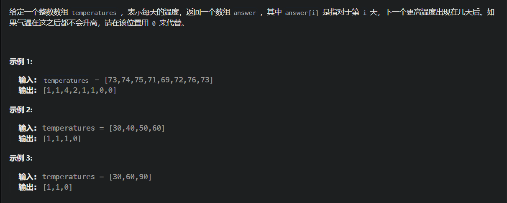
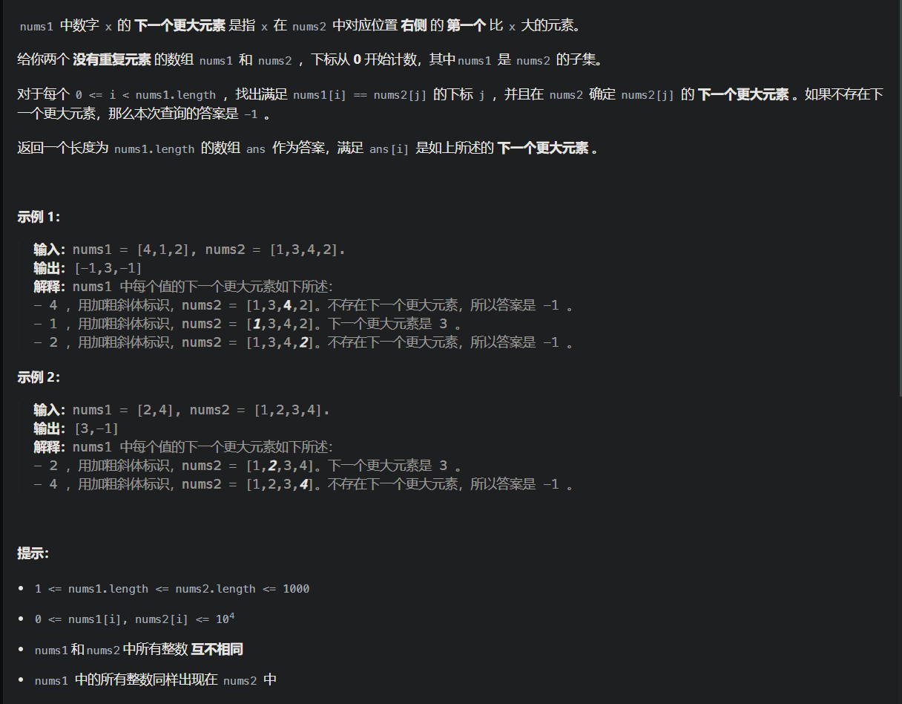
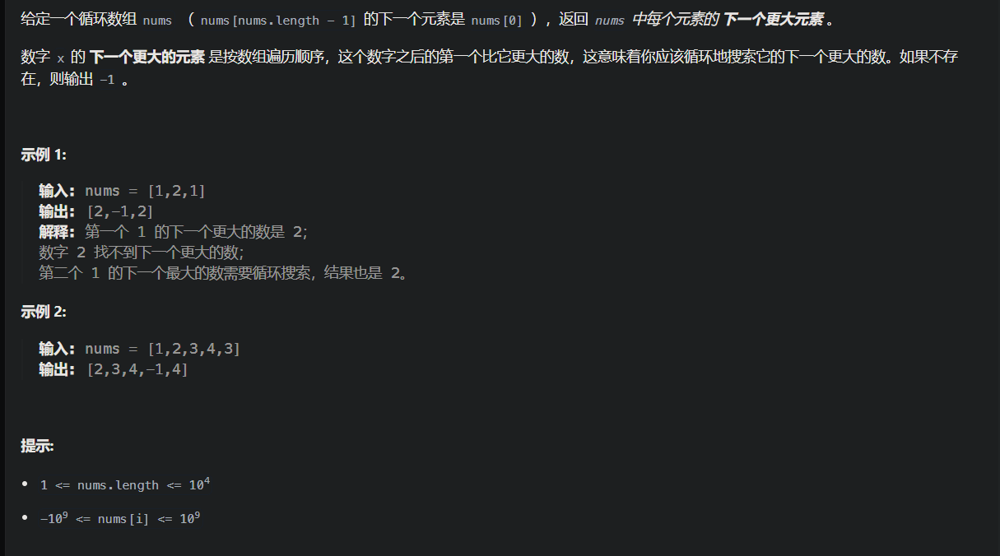
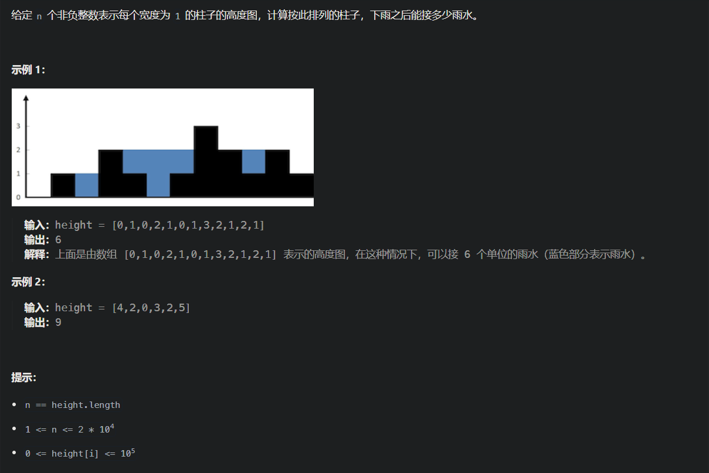
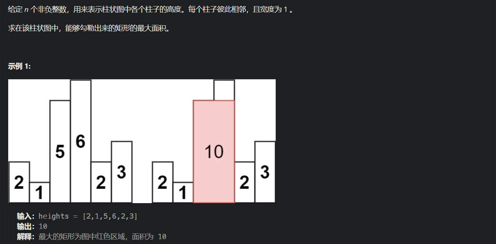

# [每日温度](https://leetcode.cn/problems/daily-temperatures/)



```java
/**
        如果当前遍历的元素 大于栈顶元素，表示 栈顶元素的 右边的最大的元素就是 当前遍历的元素，
        	所以弹出 栈顶元素，并记录
        	如果栈不空的话，还要考虑新的栈顶与当前元素的大小关系
        否则的话，可以直接入栈。
        注意，单调栈里 加入的元素是 下标。
        */
```

```java
class Solution {
    public int[] dailyTemperatures(int[] temperatures) {
        int len = temperatures.length;
        Stack<Integer> stack = new Stack<>();
        int[] res = new int[len];
        stack.push(0);
        for (int i = 1; i < len; i++) {
            if (temperatures[i] <= temperatures[stack.peek()])
                stack.push(i);
            else {
                while (!stack.isEmpty() && temperatures[i] > temperatures[stack.peek()]) {
                    res[stack.peek()] = i - stack.peek();
                    stack.pop();
                }
                stack.push(i);
            }
        }
        return res;
    }
}
```


# [下一个更大元素 I](https://leetcode.cn/problems/next-greater-element-i/)



注意：对位置指的是元素值相同，而不是对应下标

```java
class Solution {
    public int[] nextGreaterElement(int[] nums1, int[] nums2) {
        int len1 = nums1.length;
        int len2 = nums2.length;
        //因为数组是没有重复元素的，所以用哈希表存储nums1元素对应的下标
        HashMap<Integer, Integer> map = new HashMap<>();
        for(int i = 0; i < len1; i++)
            map.put(nums1[i], i);
        int[] res = new int[len1];
        Arrays.fill(res, -1);
        //单调栈存nums2的下标
        Stack<Integer> stack = new Stack<>();
        stack.push(0);
        for(int i = 1; i <len2; i++){
            //当前元素比栈顶小，那就不符合下一个更大元素，入栈
            if(nums2[i] <= nums2[stack.peek()])
                stack.push(i);
            //如果当前元素比栈顶大，那就符合条件，栈顶元素找到了res，填入数组
            //因为要找的是下一个更大的元素，所以每次倒要把栈顶元素出栈
            else{
                while(!stack.isEmpty() && nums2[i] > nums2[stack.peek()]){
                    if(map.containsKey(nums2[stack.peek()])){
                        int idx = map.get(nums2[stack.peek()]);
                        res[idx] = nums2[i];
                    }
                    stack.pop();
                }
                stack.push(i);
            }

        }
        return res;
    }
}
```


# [下一个更大元素 II](https://leetcode.cn/problems/next-greater-element-ii/)



```java
class Solution {
    public int[] nextGreaterElements(int[] nums) {
        int len = nums.length;
        int[] res= new int[len];
        Arrays.fill(res, -1);
        Stack<Integer> stack = new Stack<>();
        stack.push(0);
        //遍历一圈，即两个数组连接即可
        for(int i = 1; i < len * 2; i++){
            if(nums[i % len] > nums[stack.peek()]){
                while(!stack.isEmpty() && nums[i % len] > nums[stack.peek()]){
                    res[stack.peek()] = nums[i % len];
                    stack.pop();
                }
                stack.push(i % len);
            }else{
                stack.push(i % len);
            }
        }
        return res;
    }
}
```


# [接雨水](https://leetcode.cn/problems/trapping-rain-water/)



```java
class Solution {
    public int trap(int[] height) {
        int len = height.length;
        if (len <= 2)
            return 0;
        // 单调栈，存遍历过的下标
        Stack<Integer> stack = new Stack<>();
        stack.push(0);
        int res = 0;
        for (int i = 1; i < len; i++) {
            // 当前高度比栈首低，入栈
            if (height[i] < height[stack.peek()]) {
                stack.push(i);
            }
            // 当前高度等于栈首元素，将栈首弹出，再将当前高度推入（这步也可以省略）
            else if (height[i] == height[stack.peek()]) {
                stack.pop();
                stack.push(i);
            }
            // 当前元素比栈首高，说明找到凹槽，开始计算面积（用while因为可能不止一个凹槽）
            else {
                while (!stack.isEmpty() && height[i] > height[stack.peek()]) {
                    int mid = stack.pop();
                    if (!stack.isEmpty()) {	//与柱状图的区别
                        int h = Math.min(height[i], height[stack.peek()]) - height[mid];
                        int w = i - stack.peek() - 1;
                        res += h * w;
                    }
                }
                stack.push(i);
            }
        }
        return res;
    }
}
```


雨水高度是 min(凹槽左边高度, 凹槽右边高度) - 凹槽底部高度，代码为：`int h = min(height[st.top()], height[i]) - height[mid];`

雨水的宽度是 凹槽右边的下标 - 凹槽左边的下标 - 1（因为只求中间宽度），代码为：`int w = i - st.top() - 1 ;`

# [柱状图中最大的矩形](https://leetcode.cn/problems/largest-rectangle-in-histogram/)



```java
class Solution {
    public int largestRectangleArea(int[] heights) {
        int len = heights.length;
        if(len == 1) return heights[0];
        //新建一个首尾添加0的heights数组，为了适应递增和递减序列
        int[] h = new int[len+2];
        for(int i = 1; i < len + 1; i++)
            h[i] = heights[i-1];
        Stack<Integer> stack = new Stack<>();
        stack.push(0);
        int res = 0;
        for(int i = 1; i < h.length; i++){
            if(h[i] > h[stack.peek()]){
                stack.push(i);
            }
            else if(h[i] == h[stack.peek()]){
                stack.pop();
                stack.push(i);
            }
            else{
                while(!stack.isEmpty() && h[i] < h[stack.peek()]){
                    int right = i;
                    int mid = stack.pop();
                    int left = stack.peek();//不弹出
                    int hh = h[mid];
                    int w = right - left - 1;
                    res = Math.max(res, hh*w);
                }
                stack.push(i);
            }
        }
        return res;
    }
}
```

