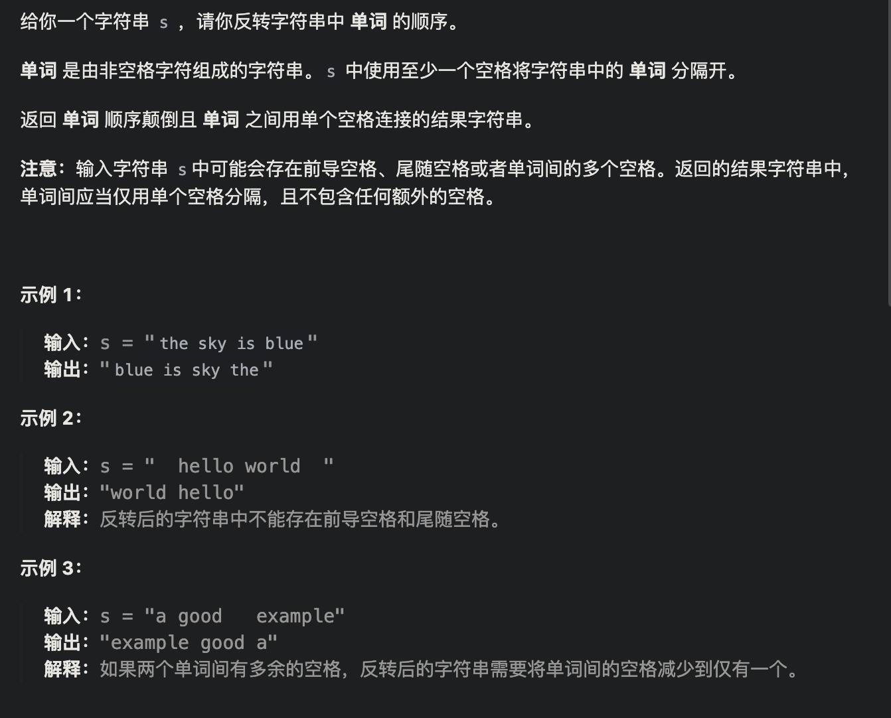

# 移除元素


```java
class Solution {
    public int removeElement(int[] nums, int val) {
        int slow = 0;
        int fast = 0;
        for(;fast < nums.length;fast++){
            if(nums[fast] != val)
                nums[slow++] = nums[fast]; 
        }
        return slow;
    }
}
```


# 反转字符串


```java
class Solution {
    public void reverseString(char[] s) {
        int left = 0;
        int right = s.length - 1;
        while(left < right){
            char c = s[left];
            s[left] = s[right];
            s[right] = c;
            left++;
            right--;
        }
    }
}
```


# 翻转字符串里的单词



```java
class Solution {
    public String reverseWords(String s) {
        // 1.去除多余空格
        StringBuffer sb = deleteExtraSpaces(s);
        // 2.翻转字符串
        reverseString(sb, 0 , sb.length() - 1);
        // 3.翻转每个单词
        reverseEachWord(sb);
        return sb.toString();
    }

    public StringBuffer deleteExtraSpaces(String s) {
        // System.out.println("ReverseWords.removeSpace() called with: s = [" + s + "]");
        int start = 0;
        int end = s.length() - 1;
        //去除首尾多余空格
        while (s.charAt(start) == ' ')
            start++;
        while (s.charAt(end) == ' ')
            end--;
        StringBuffer sb = new StringBuffer();
        while (start <= end) {
            char c = s.charAt(start);
            //如果当前字符不是空格，或者是第一个空格(存储的sb中最后一个不是空格)
            if (c != ' ' || sb.charAt(sb.length() - 1) != ' ') {
                sb.append(c);
            }
            start++;
        }
        // System.out.println("ReverseWords.removeSpace returned: sb = [" + sb + "]");
        return sb;
    }

    public void reverseString(StringBuffer sb, int start, int end) {
        // System.out.println("ReverseWords.reverseString() called with: sb = [" + sb + "], start = [" + start + "], end = [" + end + "]");
        while (start < end) {
            char temp = sb.charAt(start);
            sb.setCharAt(start, sb.charAt(end));
            sb.setCharAt(end, temp);
            start++;
            end--;
        }
        // System.out.println("ReverseWords.reverseString returned: sb = [" + sb + "]");
    }

    public void reverseEachWord(StringBuffer sb){
        int start = 0;
        int end = start + 1;
        while(end < sb.length()){
            while(end < sb.length() && sb.charAt(end) != ' ')
                end++;
            reverseString(sb, start, end - 1);
            start = end + 1;
            end = start + 1;
        }
    }
}
```


# 反转链表


```java
class Solution {
    public ListNode reverseList(ListNode head) {
        ListNode cur = head;
        ListNode pre = null;
        while(cur != null){
            ListNode temp = cur.next;
            cur.next = pre;
            pre = cur;
            cur = temp;
        }
        return pre;
    }
}
```


# 删除链表的倒数第N个节点


```java
class Solution {
    public ListNode removeNthFromEnd(ListNode head, int n) {
        ListNode dummy = new ListNode(0, head);
        ListNode fast = dummy;
        ListNode slow = dummy;
        while(n -- >= 0){
            fast = fast.next;
        }
        while(fast != null){
            slow = slow.next;
            fast = fast.next;
        }
        slow.next = slow.next.next;
        return dummy.next;
    }
}
```


# 链表相交


```java
public class Solution {
    public ListNode getIntersectionNode(ListNode headA, ListNode headB) {
        ListNode curA = headA;
        ListNode curB = headB;
        int lenA = 0;
        int lenB = 0;
        while(curA != null){
            lenA++;
            curA = curA.next;
        }
        while(curB != null){
            lenB++;
            curB = curB.next;
        }
        curA = headA;
        curB = headB;
        //将CurA指向较长的那个链表
        if(lenA < lenB){
            ListNode temp = curA;
            curA = curB;
            curB = temp;
        }
        //计算出两个链表的长度之差，并让A先走这个差
        int diff = Math.abs(lenA - lenB);
        while(diff-- >0)
            curA = curA.next;
        while(curA != null){
            if(curA == curB)
                return curA;
            curA = curA.next;
            curB = curB.next;
        }
        return null;
    }
}
```


# 环形链表II


```java
public class Solution {
    public ListNode detectCycle(ListNode head) {
        if(head == null)
            return null;
        ListNode fast = head;
        ListNode slow = head;
        //终止条件代表无环
        while(fast.next != null && fast.next.next != null){
            fast = fast.next.next;
            slow = slow.next;
            //若有环，总会有相遇的时候
            if(slow == fast){
                slow = head;
                //开始找入口
                while(slow != fast){
                    slow = slow.next;
                    fast = fast.next;
                }
                return fast;
            }
        }
        return null;
    }
}
```


# 三数之和


```java
class Solution {
    public List<List<Integer>> threeSum(int[] nums) {
        List<List<Integer>> res = new ArrayList<>();
        Arrays.sort(nums);
        // i是最小的
        for (int i = 0; i < nums.length; i++) {
            if (nums[i] > 0)
                return res;
            // 去重
            if (i > 0 && nums[i] == nums[i - 1])
                continue;
            int left = i + 1;
            int right = nums.length - 1;
            while (left < right) {
                int sum = nums[i] + nums[left] + nums[right];
                if (sum > 0)
                    right--;
                else if (sum < 0)
                    left++;
                else {
                    res.add(Arrays.asList(nums[i], nums[left], nums[right]));
                    // 去重
                    while (left < right && nums[left] == nums[left + 1])
                        left++;
                    while (left < right && nums[right] == nums[right - 1])
                        right--;
                    left++;
                    right--;
                }
            }

        }
        return res;
    }
}
```


# 四数之和


```java
class Solution {
    public List<List<Integer>> fourSum(int[] nums, int target) {
        //思路：三数之和再外面套一层循环
        List<List<Integer>> res = new ArrayList<>();
        Arrays.sort(nums);
        for(int i = 0; i < nums.length;i++){
            if(nums[i] > target && (nums[i]>0 || target>0))
                return res;
            if(i > 0 && nums[i] == nums[i - 1])
                continue;;
            for(int j = i+1; j < nums.length; j++){
                if(j > i+1 && nums[j] == nums[j - 1])
                    continue;
                int left = j + 1;
                int right = nums.length - 1;
                while(left < right){
                    int sum = nums[i] + nums[j] + nums[left] + nums[right];
                    if(sum > target)
                        right--;
                    else if(sum < target)
                        left++;
                    else{
                        res.add(Arrays.asList(nums[i], nums[j], nums[left], nums[right]));
                        while(left < right && nums[left + 1] == nums[left])
                            left++;
                        while(left < right && nums[right - 1] == nums[right])
                            right--;
                        left++;
                        right--;
                    }
                }
            }
        }
        return res;
    }
}
```


# [11. 盛最多水的容器](https://leetcode.cn/problems/container-with-most-water/)


```java
class Solution {
    public int maxArea(int[] height) {
        int left = 0;
        int right = height.length-1;
        int res = 0;
        while(left < right){
            int h1 = height[left];
            int h2 = height[right];
            int vol = (right - left) * Math.min(h1, h2);
            if(vol > res) {
                res = vol;
            }
            if(h1 < h2) left++;
            else right--;
            
        }
        return res;
    }
}
```


