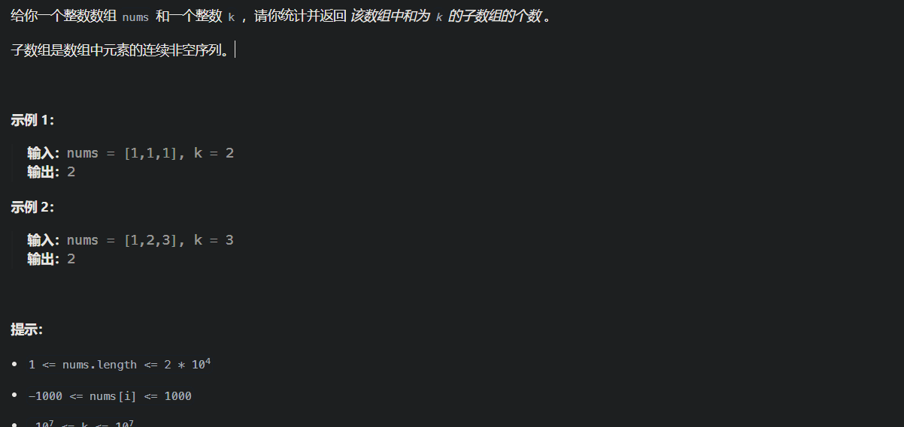

# 242,有效的字母异位词

https://leetcode.cn/problems/valid-anagram/description/


```java
class Solution {
    public boolean isAnagram(String s, String t) {
        int[] times = new int[26];
        if(s.length()!=t.length())
            return false;
        for(int i = 0;i<s.length();i++){
            times[s.charAt(i)-'a'] ++;
        }
        for(int i = 0;i<t.length();i++){
            times[t.charAt(i)-'a'] --;
        }
        for(int i = 0;i<times.length;i++){
            if(times[i] != 0)
                return false;
        }
        return true;
    }
}
```

## 1.赎金信

https://leetcode.cn/problems/ransom-note/description/


```java
class Solution {
    public boolean canConstruct(String ransomNote, String magazine) {
        int[] times = new int[26];
        for(int i = 0;i < ransomNote.length();i++){
            times[ransomNote.charAt(i) - 'a']++;
        }
        for(int i = 0;i < magazine.length();i++){
            times[magazine.charAt(i) - 'a']--;
        }
        for(int i = 0;i < times.length;i++){
            if(times[i] > 0)
                return false;
        }
        return true;
    }
}
```

## 2.字母异位词分组

https://leetcode.cn/problems/group-anagrams/description/


关键在于建立一个以<String, ArrayList>的哈希表

```java
class Solution {
    public List<List<String>> groupAnagrams(String[] strs) {
        HashMap<String, List<String>> map = new HashMap<>();
        for(String s : strs){
            int[] times = new int[26];
            for(int i = 0;i < s.length();i++){
                times[s.charAt(i) - 'a']++;
            }
            StringBuffer sbKey = new StringBuffer();    //作为map中查找的key，字母异位词有相同的key
            for(int i = 0;i < times.length;i++){
                //key为 a3b2...的形式
                if(times[i] != 0){
                    sbKey.append(i + 'a');
                    sbKey.append(times[i]);
                }
            }
            String key = sbKey.toString();
            List<String> list = map.getOrDefault(key, new ArrayList<String>());
            list.add(s);
            map.put(key, list);
        }
        //直接将values转换成list
        return new ArrayList<List<String>>(map.values());
    }
}
```


## *438.找到字符串中所有字母异位词

https://leetcode.cn/problems/find-all-anagrams-in-a-string/description/


```java
class Solution {
    public List<Integer> findAnagrams(String s, String p) {
        int left = 0;
        int right = 0;
        int lenS = s.length();
        int lenP = p.length();
        int validNum = 0;
        List<Integer> res = new ArrayList<>();
        if(lenS < lenP)
            return res;
        HashMap<Character, Integer> win = new HashMap<>();
        HashMap<Character, Integer> require = new HashMap<>();
        for(int i = 0; i < lenP; i++){
            char c = p.charAt(i);
            require.put(c, require.getOrDefault(c, 0) + 1);
        }
        while(right < lenS){
            char c = s.charAt(right);
            //窗口右端更新
            if(require.containsKey(c)){
                win.put(c, win.getOrDefault(c, 0) + 1);
                if(win.get(c).equals(require.get(c)))
                    validNum++;
            }
            right++;
            //判断左窗口收紧
            while(right - left + 1 > lenP){
                if(validNum == require.size())
                    res.add(left);
                char c2 = s.charAt(left);
                if(require.containsKey(c2)){
                    if(require.get(c2).equals(win.get(c2)))
                        validNum--;
                     win.put(c2, win.getOrDefault(c2, 0) - 1);
                }
                left++;
            }
        }
        return res;
    }
}
```

# 349.两个数组的交集

https://leetcode.cn/problems/intersection-of-two-arrays/description/


```java
class Solution {
    public int[] intersection(int[] nums1, int[] nums2) {
        Set<Integer> set1 = new HashSet<>();
        for(int num : nums1){
            set1.add(num);
        }
        Set<Integer> set2 = new HashSet<>();
        for(int num : nums2){
            if(set1.contains(num))
                set2.add(num);
        }
        return set2.stream().mapToInt(Integer::intValue).toArray();
    }
}
```

## 1.两个数组的交集 II

https://leetcode.cn/problems/intersection-of-two-arrays-ii/description/


```java
class Solution {
    public int[] intersect(int[] nums1, int[] nums2) {
        HashMap<Integer, Integer> map1 = new HashMap<>();
        List<Integer> list = new ArrayList<>();
        for(int num : nums1)
            map1.put(num, map1.getOrDefault(num, 0) + 1);
        for(int num : nums2){
            if(map1.containsKey(num) && map1.get(num) > 0){
                map1.put(num, map1.getOrDefault(num, 0) - 1);
                list.add(num);
            }
        }
        return list.stream().mapToInt(Integer::intValue).toArray();
    }
}
```

# 202.快乐数

https://leetcode.cn/problems/happy-number/description/


```java
class Solution {
    public boolean isHappy(int n) {
        Set<Integer> set = new HashSet<>();
        while(n != 1){
            if(set.contains(n))
                return false;
            set.add(n);
            n = getNext(n);
        }
        return true;
    }
    public int getNext(int n){
        int res = 0;
        while(n > 0){
            res += (n % 10) * (n % 10);
            n /= 10;
        }
        return res;
    }
}
```

# *1.两数之和

https://leetcode.cn/problems/two-sum/description/


```java
class Solution {
    public int[] twoSum(int[] nums, int target) {
        //存<当前元素，当前元素的下标>
        HashMap<Integer, Integer> map = new HashMap<>();
        int[] res = new int[2];
        for(int i = 0;i < nums.length;i++){
            int temp = target - nums[i];
            if(map.containsKey(temp)){
                res[0] = i;
                res[1] = map.get(temp);
                break;
            }
            map.put(nums[i], i);
        }
        return res;
    }
}
```

# *454.四数相加 II

https://leetcode.cn/problems/4sum-ii/description/


```java
class Solution {
    public int fourSumCount(int[] nums1, int[] nums2, int[] nums3, int[] nums4) {
        int len = nums1.length;
        //存<两个数组中元素配对和，配对和的个数>
        HashMap<Integer, Integer> map = new HashMap<>();
        for(int i = 0;i < len;i++){
            for(int j = 0;j < len;j++){
                int temp = nums1[i] + nums2[j];
                map.put(temp, map.getOrDefault(temp,0) + 1);
            }
        }
        int cnt = 0;
        for(int i = 0;i < len;i++){
            for(int j = 0;j < len;j++){
                int temp = nums3[i] + nums4[j];
                if(map.containsKey(-temp)){
                    cnt+=map.get(-temp);
                }
            }
        }
        return cnt;
    }
}
```

# *15.三数之和△

https://leetcode.cn/problems/3sum/description/

关键点是：去重


```java
class Solution {
    public List<List<Integer>> threeSum(int[] nums) {
        List<List<Integer>> res = new ArrayList<>();
        Arrays.sort(nums);
        for(int i = 0;i<nums.length;i++){//i遍历的是三元组中最小的，left是中间的，right是最大的
            if(nums[i]>0)
                return res;//如果三元组中最小的那个都大于0，则不可能组成0了
            if(i>0 && nums[i]==nums[i-1])
                continue;//最小的那个数去重
            int left = i+1;//中间的那个数
            int right = nums.length - 1;//最大的那个数
            while(left < right){
                int sum = nums[i] + nums[left] + nums[right];
                if(sum > 0)
                    right--;
                else if(sum < 0)
                    left++;
                else{
                    res.add(Arrays.asList(nums[i],nums[left],nums[right]));
                    while(left<right && nums[right]==nums[right-1]){//最大的数去重
                        right--;
                    }
                    while(left<right && nums[left]==nums[left+1]){//中间的数去重
                        left++;
                    }
                    left++;//去重完成，正常推进
                    right--;
                }
            }
        }
        return res;
    }
}
```

# *18.四数之和

https://leetcode.cn/problems/4sum/description/


```java
class Solution {
    public List<List<Integer>> fourSum(int[] nums, int target) {
        //思路：三数之和再外面套一层循环
        List<List<Integer>> res = new ArrayList<>();
        Arrays.sort(nums);
        for(int i = 0; i < nums.length;i++){
            //直接返回的条件注意（后面那个表示如果都是负数，则不能跳过）
            if(nums[i] > target && (nums[i]>0 || target>0))
                return res;
            if(i > 0 && nums[i] == nums[i - 1])
                continue;;
            for(int j = i+1; j < nums.length; j++){
                if(j > i+1 && nums[j] == nums[j - 1])
                    continue;
                int left = j + 1;
                int right = nums.length - 1;
                while(left < right){
                    int sum = nums[i] + nums[j] + nums[left] + nums[right];
                    if(sum > target)
                        right--;
                    else if(sum < target)
                        left++;
                    else{
                        res.add(Arrays.asList(nums[i], nums[j], nums[left], nums[right]));
                        while(left < right && nums[left + 1] == nums[left])
                            left++;
                        while(left < right && nums[right - 1] == nums[right])
                            right--;
                        left++;
                        right--;
                    }
                }
            }
        }
        return res;
    }
}
```


# [**128. 最长连续序列](https://leetcode.cn/problems/longest-consecutive-sequence/)


**简单来说就是每个数都判断一次这个数是不是连续序列的开头那个数**。

- 怎么判断呢，就是用哈希表查找这个数前面一个数是否存在，即num-1在序列中是否存在。存在那这个数肯定不是开头，直接跳过。
- 因此只需要对每个开头的数进行循环，直到这个序列不再连续，因此复杂度是O(n)。 以题解中的序列举例:
  **[100，4，200，1，3，4，2]**
  去重后的哈希序列为：
  **[100，4，200，1，3，2]**
  按照上面逻辑进行判断：

1. 元素100是开头,因为没有99，且以100开头的序列长度为1
2. 元素4不是开头，因为有3存在，过，
3. 元素200是开头，因为没有199，且以200开头的序列长度为1
4. 元素1是开头，因为没有0，且以1开头的序列长度为4，因为依次累加，2，3，4都存在。
5. 元素3不是开头，因为2存在，过，
6. 元素2不是开头，因为1存在，过。

```java
class Solution {
    public int longestConsecutive(int[] nums) {
        if(nums.length == 0) return 0;
        Set<Integer> set = new HashSet<>();
        for(int num : nums)
            set.add(num);
        int res = 1;
        for(Integer num : set){
            int cnt = 1;
            if(set.contains(num-1))
                continue;
            while(true){
                if(set.contains(num+1)){
                    cnt++;
                    num++;
                }else{
                    break;
                }
            }
            res = Math.max(res, cnt);
        }
        return res;
    }
}
```


# [△**560. 和为 K 的子数组](https://leetcode.cn/problems/subarray-sum-equals-k/)



k可以是负数，所以不能用滑动窗口

用前缀和+哈希（key为前缀和，value为出现次数）

注意初始化时，需要map.put(0, 1)        不能忘记0这个前缀和


```java
class Solution {
    public int subarraySum(int[] nums, int k) {
        int res = 0;
        int pre = 0;
        Map<Integer, Integer> map = new HashMap<>();
        map.put(0, 1);
        for(int i = 0; i < nums.length; i++){
            pre += nums[i];
            if(map.containsKey(pre - k)){
                res += map.get(pre - k);
            }
            map.put(pre, map.getOrDefault(pre, 0) + 1);
        }
        return res;
    }
}
```


# [**41. 缺失的第一个正数](https://leetcode.cn/problems/first-missing-positive/)


关键点，O(1)空间限制

使用原地哈希，把数值i+1放在下标i上

```java
class Solution {
    public int firstMissingPositive(int[] nums) {
        int len = nums.length;
        for(int i = 0; i < len; i++){
            // 最终数组要填满[1,len],如果当前数字在[1, len]，且没放在对应位置就要把它放在对应的位置。
            //比如当前遍历到nums[i] = 3,且nums[2]上的数字不是3，那就把i位置和2位置交换
          //注意这里要用while
            while(nums[i] >= 1 && nums[i] <= len && nums[nums[i]-1] != nums[i]){
                swap(nums, nums[i]-1, i);
            }
        }
        //校验找出第一个不符合位置的，如果都符合，那就返回len+1
        for(int i = 0 ; i < len; i++){
            if(nums[i] != i + 1)
                return i+1;
        }
        return len + 1;
    }

    void swap(int[] nums, int a, int b){
        int t = nums[a];
        nums[a] = nums[b];
        nums[b] = t;
    }
}
```


# [128. 最长连续序列](https://leetcode.cn/problems/longest-consecutive-sequence/)


```java
import java.util.HashSet;

//leetcode submit region begin(Prohibit modification and deletion)
class Solution {
    public int longestConsecutive(int[] nums) {
        HashSet<Integer> set = new HashSet<>();
        for (int i = 0; i < nums.length; i++) {
            set.add(nums[i]);
        }
        int res = 0;
        for (Integer num : set) {
            if(set.contains(num - 1))
                continue;
            int cnt = 0;
            while (set.contains(num++))
                cnt++;
            res = Math.max(res, cnt);
        }
        return res;
    }
}
//leetcode submit region end(Prohibit modification and deletion)

```

