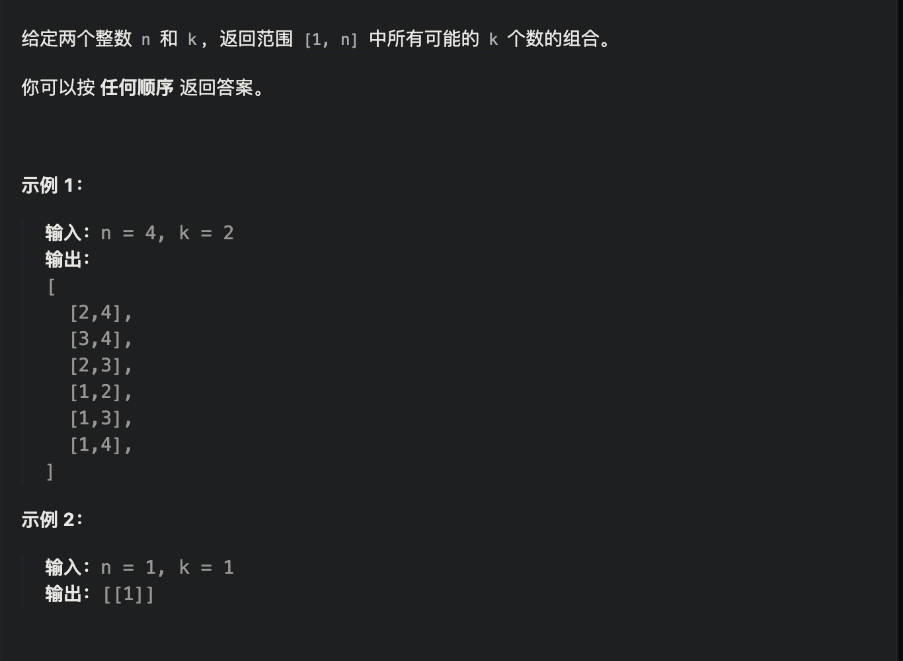
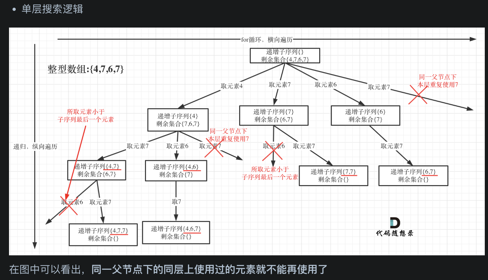
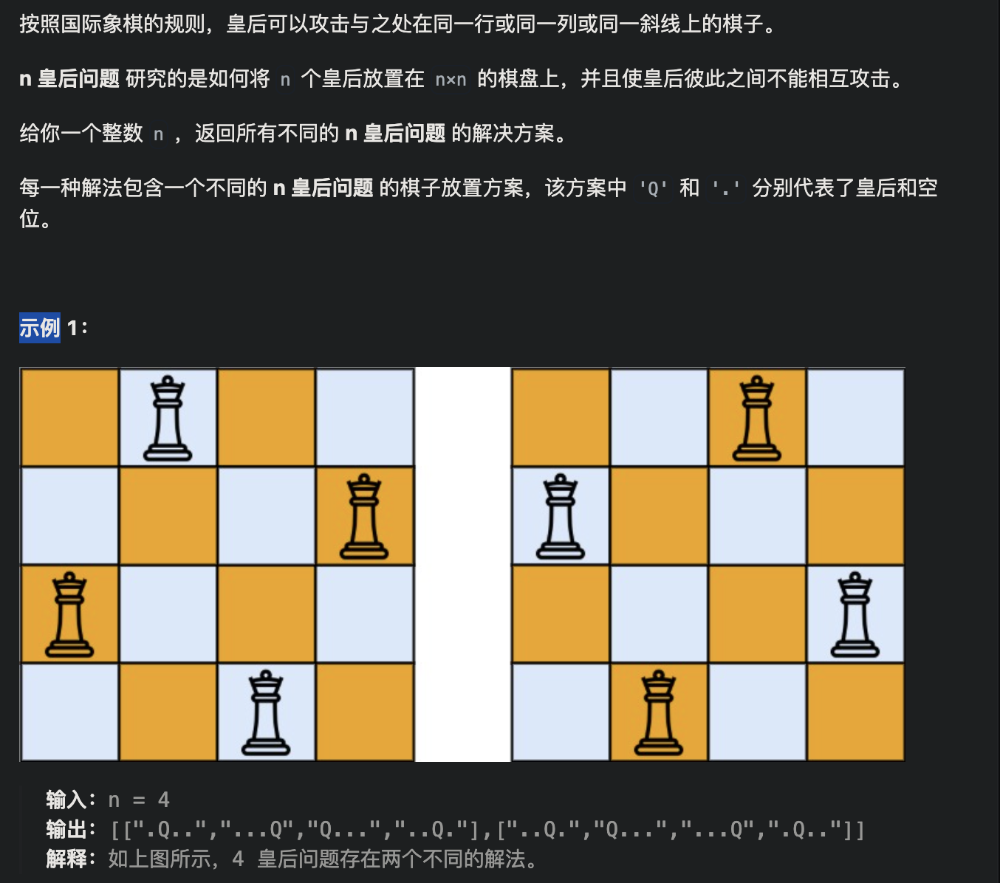

#  [77.组合](https://leetcode.cn/problems/combinations/)



```java
class Solution {
    List<Integer> path = new ArrayList<>();
    List<List<Integer>> res = new ArrayList<>();
    public List<List<Integer>> combine(int n, int k) {
        backtracking(n, k, 1);
        return res;
    }

    void backtracking(int n, int k, int start){
        if(path.size() == k){
            res.add(new ArrayList<>(path));//一定要新建副本
            return;
        }
        for(int i = start; i <= n; i++){
            path.add(i);
            backtracking(n, k, i+1);
            path.removeLast();
        }
    }
}
```


优化

```java
class Solution {
    List<Integer> path = new ArrayList<>();
    List<List<Integer>> res = new ArrayList<>();
    public List<List<Integer>> combine(int n, int k) {
        backtracking(n, k, 1);
        return res;
    }

    void backtracking(int n, int k, int start){
        if(path.size() == k){
            res.add(new ArrayList<>(path));//一定要新建副本
            return;
        }
        for(int i = start; i <= n - (k-path.size()) + 1; i++){
            path.add(i);
            backtracking(n, k, i+1);
            path.removeLast();
        }
    }
}
```


# [216.组合总和 III](https://leetcode.cn/problems/combination-sum-iii/)


sum也可以提出来当全局变量

```java
class Solution {
    List<Integer> path = new ArrayList<>();
    List<List<Integer>> res = new ArrayList<>();
    public List<List<Integer>> combinationSum3(int k, int n) {
        backtracking(k, n , 1, 0);
        return res;
    }

    void backtracking(int k, int n, int start, int sum){
        if(sum > n)
            return;

        if(path.size() == k){
            if(sum == n)
                res.add(new ArrayList<>(path));
            return;
        }
        for(int i = start; i <= 9 - (k - path.size()) + 1; i++){
            path.add(i);
            sum += i;
            backtracking(k, n, i+1, sum);
            sum -= i;
            path.removeLast();
        }
    }
}
```


# [*17.电话号码的字母组合](https://leetcode.cn/problems/letter-combinations-of-a-phone-number/)


```java
class Solution {

    //设置全局列表存储最后的结果
    List<String> list = new ArrayList<>();

    public List<String> letterCombinations(String digits) {
        if (digits == null || digits.length() == 0) {
            return list;
        }
        //初始对应所有的数字，为了直接对应2-9，新增了两个无效的字符串""
        String[] numString = {"", "", "abc", "def", "ghi", "jkl", "mno", "pqrs", "tuv", "wxyz"};
        //迭代处理
        backTracking(digits, numString, 0);
        return list;

    }

    //每次迭代获取一个字符串，所以会涉及大量的字符串拼接，所以这里选择更为高效的 StringBuilder
    StringBuilder temp = new StringBuilder();

    //比如digits如果为"23",num 为0，则str表示2对应的 abc
    public void backTracking(String digits, String[] numString, int len) {
        //遍历全部一次记录一次得到的字符串
        if (len == digits.length()) {
            list.add(temp.toString());
            return;
        }
        //str 表示当前len对应的字符串
        String str = numString[digits.charAt(len) - '0'];
        for (int i = 0; i < str.length(); i++) {
            temp.append(str.charAt(i));
            //递归，处理下一层
            backTracking(digits, numString, len + 1);
            //剔除末尾的继续尝试
            temp.deleteCharAt(temp.length() - 1);
        }
    }
}
```


# [39.组合总和](https://leetcode.cn/problems/combination-sum/)


排序 + start不递增

```java
class Solution {
    List<Integer> path = new ArrayList<>();
    List<List<Integer>> res= new ArrayList<>();

    public List<List<Integer>> combinationSum(int[] candidates, int target) {
        Arrays.sort(candidates);//从小到大排序
        backtracing(candidates, target, 0, 0);
        return res;
    }

    void backtracing(int[] candidates, int target, int start, int sum){
        if(sum == target){
            res.add(new ArrayList<>(path));
            return;
        }
        for(int i = start; i < candidates.length; i++){
            if(candidates[i] + sum > target)
                break;
            path.add(candidates[i]);
            sum += candidates[i];
            backtracing(candidates, target, i, sum);
            sum -= candidates[i];
            path.removeLast();
        }
    }
}
```


# [40.组合总和 II](https://leetcode.cn/problems/combination-sum-ii/)


排序+used数组

```java
class Solution {
    List<Integer> path = new ArrayList<>();
    List<List<Integer>> res = new ArrayList<>();
    boolean[] used;
    int sum = 0;

    public List<List<Integer>> combinationSum2(int[] candidates, int target) {
        used = new boolean[candidates.length];
        Arrays.fill(used, false);
        Arrays.sort(candidates);
        backtracing(candidates, target, 0);
        return res;
    }

    void backtracing(int[] candidates, int target, int start) {
        if(sum > target) return;
        if (sum == target) {
            res.add(new ArrayList<>(path));
            return;
        }
        for (int i = start; i < candidates.length; i++) {
            if (i > 0 && candidates[i] == candidates[i - 1] && !used[i-1])
                continue;
            sum += candidates[i];
            path.add(candidates[i]);
            used[i] = true;
            backtracing(candidates, target, i + 1);
            used[i] = false;
            path.removeLast();
            sum -= candidates[i];
        }
    }
}
```


# [**△131.分割回文串](https://leetcode.cn/problems/palindrome-partitioning/)


```java
class Solution {
    List<String> path = new ArrayList<>();
    List<List<String>> res = new ArrayList<>();

    public List<List<String>> partition(String s) {
        backtracking(s, 0);
        return res;
    }

    void backtracking(String s, int start){
        if(start == s.length()){
            res.add(new ArrayList<>(path));
            return;
        }
        for (int i = start; i < s.length(); i++) {
            String sub = s.substring(start, i+1);
            if(!isPalindrome(sub)) continue;
            path.add(sub);
            backtracking(s, i+1);
            path.removeLast();
        }
    }
    boolean isPalindrome(String s){
        int left = 0;
        int right = s.length()-1;
        while (left <= right){
            if(s.charAt(left) != s.charAt(right))
                return false;
            left++;
            right--;
        }
        return true;
    }
}

//runtime:7 ms
//memory:57 MB

```


# [**93.复原 IP 地址](https://leetcode.cn/problems/restore-ip-addresses/)


```java
class Solution {
    List<String> res = new ArrayList<>();

    public List<String> restoreIpAddresses(String s) {
        StringBuilder sb = new StringBuilder(s);
        backtracking(sb, 0, 0);
        return res;
    }

    void backtracking(StringBuilder sb, int start, int dotCnt){
        //这里的check的是最后一段数字
        if(dotCnt == 3 && check(sb, start, sb.length() - 1)){
            res.add(sb.toString());
            return;
        }
        for(int i = start; i < sb.length(); i++){
            if(!check(sb, start, i)) break;
            sb.insert(i+1, '.');
            dotCnt++;
            backtracking(sb, i+2, dotCnt);
            dotCnt--;
            sb.deleteCharAt(i+1);

        }

    }

    private boolean check(StringBuilder s, int start, int end){
        if(start > end)
            return false;
        if(s.charAt(start) == '0' && start != end)
            return false;
        int num = 0;
        for(int i = start; i <= end; i++){
            int digit = s.charAt(i) - '0';
            num = num * 10 + digit;
            if(num > 255)
                return false;
        }
        return true;
    }
}

//runtime:3 ms
//memory:42 MB

```


# [78.子集](https://leetcode.cn/problems/subsets/)


组合问题+直接收集path

```java
class Solution {
    List<Integer> path = new ArrayList<>();
    List<List<Integer>> res = new ArrayList<>();
    public List<List<Integer>> subsets(int[] nums) {
        backtracing(nums, 0);
        return res;
    }

    void backtracing(int[] nums, int start){
        res.add(new ArrayList<>(path));
        if(start == nums.length) return;
        for(int i = start; i < nums.length; i++){
            path.add(nums[i]);
            backtracing(nums, i + 1);
            path.removeLast();
        }
    }
}
```


# [90.子集 II](https://leetcode.cn/problems/subsets-ii/)


组合问题+排序+used数组+直接收集path

```java
class Solution {
    List<Integer> path = new ArrayList<>();
    List<List<Integer>> res = new ArrayList<>();
    boolean[] used;
    public List<List<Integer>> subsetsWithDup(int[] nums) {
        used = new boolean[nums.length];
        Arrays.fill(used, false);
        Arrays.sort(nums);
        backtracing(nums, 0);
        return res;
    }

    void backtracing(int[] nums, int start){
        res.add(new ArrayList<>(path));
        if(start == nums.length) return;
        for(int i = start; i < nums.length; i++){
          //当前的数和前一个数相同且前一个数没有放进path，则不添加
          //如果前面的数字也用过，那当前的也可以用
            if(i > 0 && nums[i] == nums[i - 1] && !used[i - 1]) 
              continue;
            path.add(nums[i]);
            used[i] = true;
            backtracing(nums, i + 1);
            used[i] = false;
            path.removeLast();
        }
    }
}
```


# [*△491.非递减子序列](https://leetcode.cn/problems/non-decreasing-subsequences/)




//不能重排序，所以不能用used数组，用hashset

```java
class Solution {
    List<List<Integer>> result = new ArrayList<>();
    List<Integer> path = new ArrayList<>();
    public List<List<Integer>> findSubsequences(int[] nums) {
        backTracking(nums, 0);
        return result;
    }
    private void backTracking(int[] nums, int startIndex){
        if(path.size() >= 2)
        	result.add(new ArrayList<>(path));
      //纵向递归都会重置判断重复集合
        HashSet<Integer> hs = new HashSet<>();
        for(int i = startIndex; i < nums.length; i++){
            if(!path.isEmpty() && path.get(path.size() -1 ) > nums[i] || hs.contains(nums[i]))
                continue;
          //本次使用了nums[i]
            hs.add(nums[i]);//判断同一层的，所以回溯不用去除
            path.add(nums[i]);
            backTracking(nums, i + 1);
            path.remove(path.size() - 1);
        }
    }
}
```


# [46.全排列](https://leetcode.cn/problems/permutations/)


没有start，所以向下深度递归要去掉重复数字，每次循环都整个数组

```java
class Solution {
    List<List<Integer>> res = new ArrayList<>();
    List<Integer> path = new ArrayList<>();
    public List<List<Integer>> permute(int[] nums) {
        backTracking(nums);
        return res;
    }
    private void backTracking(int[] nums){
        if(path.size() == nums.length){
            res.add(new ArrayList<>(path));
            return;
        }
        for(int i = 0; i < nums.length; i++){
            if(path.contains(nums[i]))
                continue;
            path.add(nums[i]);
            backTracking(nums);
            path.removeLast();
        }
    }
}
```


# [**☆47.全排列 II](https://leetcode.cn/problems/permutations-ii/)


排序+used数组


```java
class Solution {
    List<Integer> path = new ArrayList<>();
    List<List<Integer>> res = new ArrayList<>();
    boolean[] used;
    public List<List<Integer>> permuteUnique(int[] nums) {
        used = new boolean[nums.length];
        Arrays.fill(used, false);
        Arrays.sort(nums);
        backtracking(nums);
        return res;
    }

    void backtracking(int[] nums){
        if(path.size() == nums.length){
            res.add(new ArrayList<>(path));
            return;
        }
        for(int i = 0; i < nums.length; i++){
            //同一父节点下相同数字去重，横向
            if(i > 0 && nums[i] == nums[i-1] && !used[i-1])
                continue;
            //同一树枝下，去除处理过的结点，纵向
            if(used[i])
                continue;
            path.add(nums[i]);
            used[i] = true;
            backtracking(nums);
            used[i] = false;
            path.removeLast();
        }
    }
}
```


# [51.N 皇后](https://leetcode.cn/problems/n-queens/)



```java
class Solution {
    List<List<String>> res = new ArrayList<>();
    char[][] board;
    public List<List<String>> solveNQueens(int n) {
        board = new char[n][n];
        for(char[] c : board)
            Arrays.fill(c, '.');
        backtracking(n, 0);
        return res;
    }

    void backtracking(int n, int row){
        if(row == n){
            res.add(board2path());
            return;
        }
        for(int col = 0; col < n; col++){
            if(check(row, col, n)){
                board[row][col] = 'Q';
                row++;
                backtracking(n, row);
                row--;
                board[row][col] = '.';
            }
        }
    }

    List<String> board2path(){
        List<String> path = new ArrayList<>();
        for(char[] arr : board){
            path.add(String.copyValueOf(arr));
        }
        return path;
    }

    boolean check(int row, int col,int n){
        // 检查列
        for (int i=0; i<row; ++i) { // 相当于剪枝
            if (board[i][col] == 'Q') {
                return false;
            }
        }

        // 检查45度对角线
        for (int i=row-1, j=col-1; i>=0 && j>=0; i--, j--) {
            if (board[i][j] == 'Q') {
                return false;
            }
        }

        // 检查135度对角线
        for (int i=row-1, j=col+1; i>=0 && j<=n-1; i--, j++) {
            if (board[i][j] == 'Q') {
                return false;
            }
        }
        return true;
    }
    
}
```


# [△37.解数独](https://leetcode.cn/problems/sudoku-solver/)


```java
class Solution {
    public void solveSudoku(char[][] board) {
        backtracking(board);
    }

    boolean backtracking(char[][] board) {
        for (int i = 0; i < board.length; i++) { // 遍历行
            for (int j = 0; j < board[0].length; j++) { // 遍历列
                if (board[i][j] == '.') {
                    for (char k = '1'; k <= '9'; k++) { // (i, j) 这个位置放k是否合适
                        if (isValid(i, j, k, board)) {
                            board[i][j] = k; // 放置k
                            if (backtracking(board))
                                return true; // 如果找到合适一组立刻返回
                            board[i][j] = '.'; // 回溯，撤销k
                        }
                    }
                    return false; // 9个数都试完了，都不行，那么就返回false
                }
            }
        }
        return true; // 遍历完没有返回false，说明找到了合适棋盘位置了
    }

    boolean isValid(int row, int col, char val, char[][] board) {
        for (int i = 0; i < 9; i++) { // 判断行里是否重复
            if (board[row][i] == val) {
                return false;
            }
        }
        for (int j = 0; j < 9; j++) { // 判断列里是否重复
            if (board[j][col] == val) {
                return false;
            }
        }
        int startRow = (row / 3) * 3;
        int startCol = (col / 3) * 3;
        for (int i = startRow; i < startRow + 3; i++) { // 判断9方格里是否重复
            for (int j = startCol; j < startCol + 3; j++) {
                if (board[i][j] == val) {
                    return false;
                }
            }
        }
        return true;
    }
}
```


# [**22. 括号生成](https://leetcode.cn/problems/generate-parentheses/)


不需要再建一个isValid了，只需先递归左括号，再递归右括号。

判断 if(cnt1 < cnt2) return;， 避免出现 （（ ））），即当前的 **(**  比  **) **少

```java
import java.util.ArrayList;
import java.util.List;

//leetcode submit region begin(Prohibit modification and deletion)
class Solution {
    StringBuilder path = new StringBuilder();
    List<String> res = new ArrayList<>();
    public List<String> generateParenthesis(int n) {
        backtracking(n, 0, 0);
        return res;
    }

    void backtracking(int n, int cnt1, int cnt2){
        if(cnt1 < cnt2) return;
        if(cnt1 == n && cnt2 == n){
            res.add(path.toString());
            return;
        }
        if(cnt1 < n){
            path.append('(');
            backtracking(n, cnt1+1, cnt2);
            path.deleteCharAt(path.length()-1);
        }
        if(cnt2 < n){
            path.append(')');
            backtracking(n, cnt1, cnt2+1);
            path.deleteCharAt(path.length()-1);
        }

    }

}
//leetcode submit region end(Prohibit modification and deletion)

```


# [*79. 单词搜索](https://leetcode.cn/problems/word-search/)


```java
class Solution {
    int[] Xdirection = {-1, 0, 1, 0};
    int[] Ydirection = {0, -1, 0, 1};

    public boolean exist(char[][] board, String word) {
        int rows = board.length, cols = board[0].length;
        for (int i = 0; i < rows; i++) {
            for (int j = 0; j < cols; j++) {
                if (backtracking(board, word, i, j, 0)) {
                    return true;
                }
            }
        }
        return false;
    }

    boolean backtracking(char[][] board, String word, int n, int m, int len) {
        if (len == word.length()) return true;

        if (n < 0 || n >= board.length || m < 0 || m >= board[0].length || board[n][m] != word.charAt(len)) {
            return false;
        }

        char temp = board[n][m];
        board[n][m] = '#'; // 标记已访问

        for (int i = 0; i < 4; i++) {
            int newX = n + Xdirection[i];
            int newY = m + Ydirection[i];
            if (backtracking(board, word, newX, newY, len + 1)) {
                return true;
            }
        }

        board[n][m] = temp; // 恢复原始值
        return false;
    }
}

```

