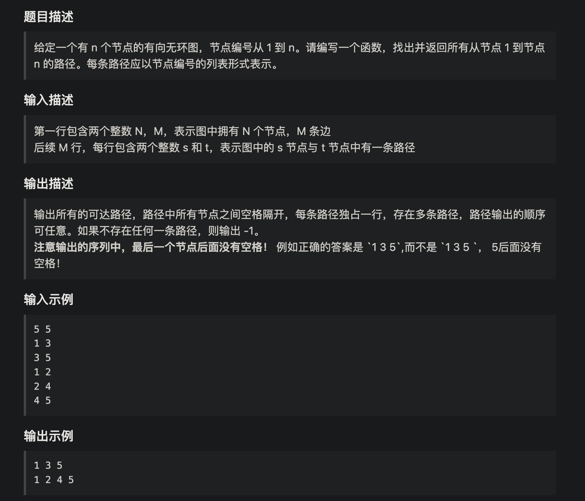
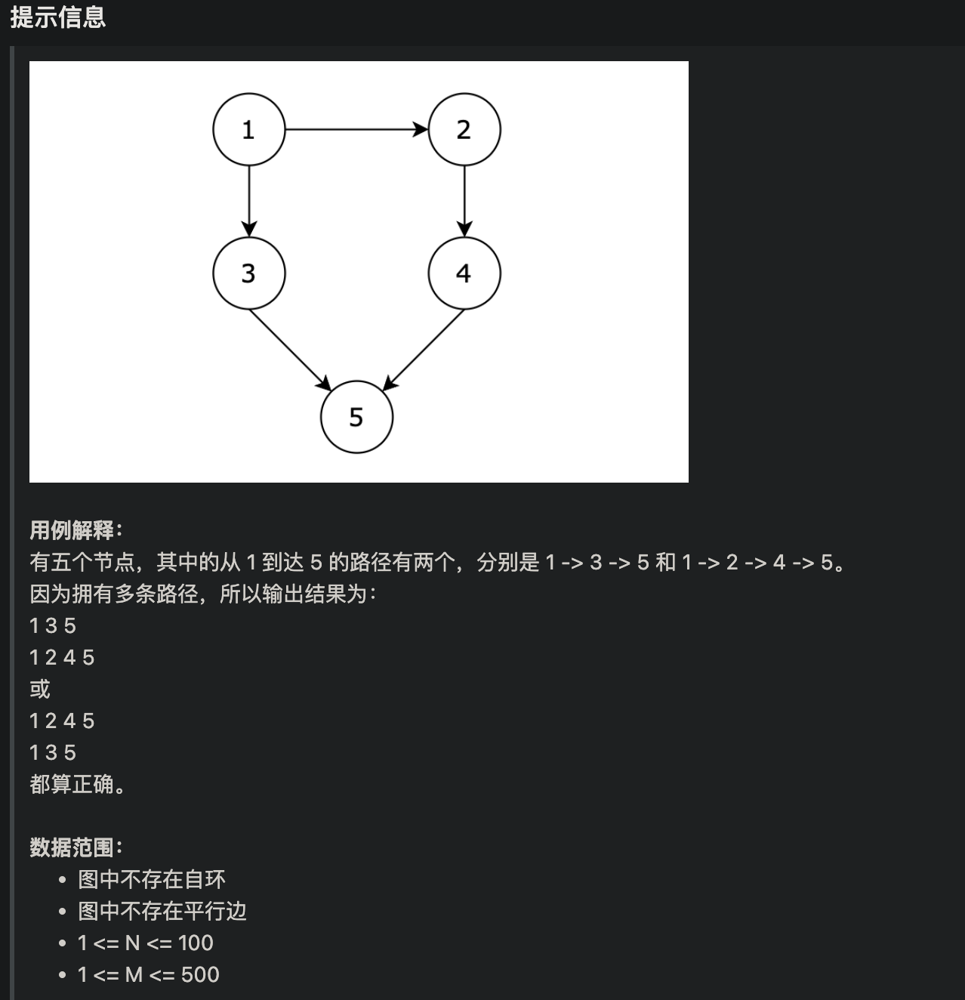
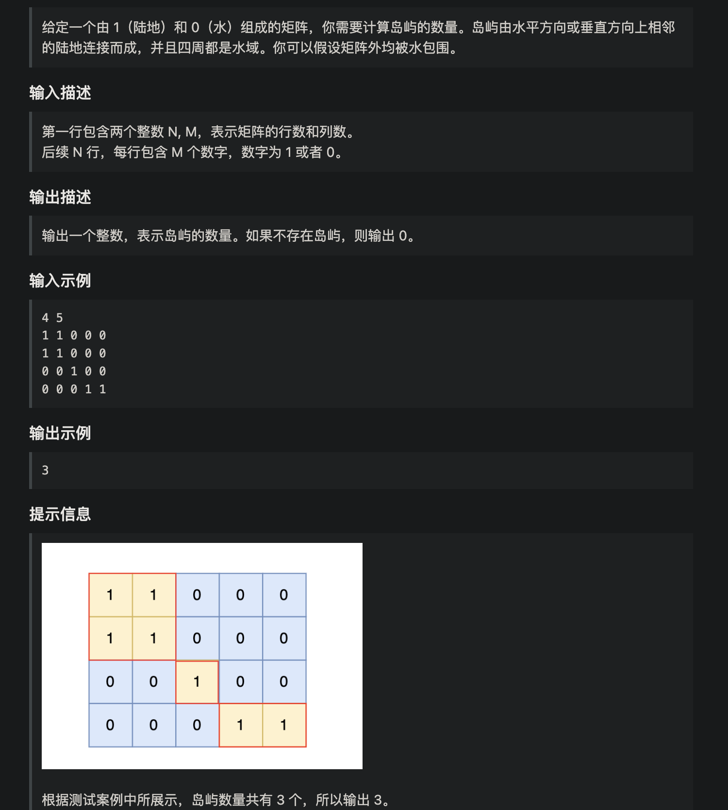
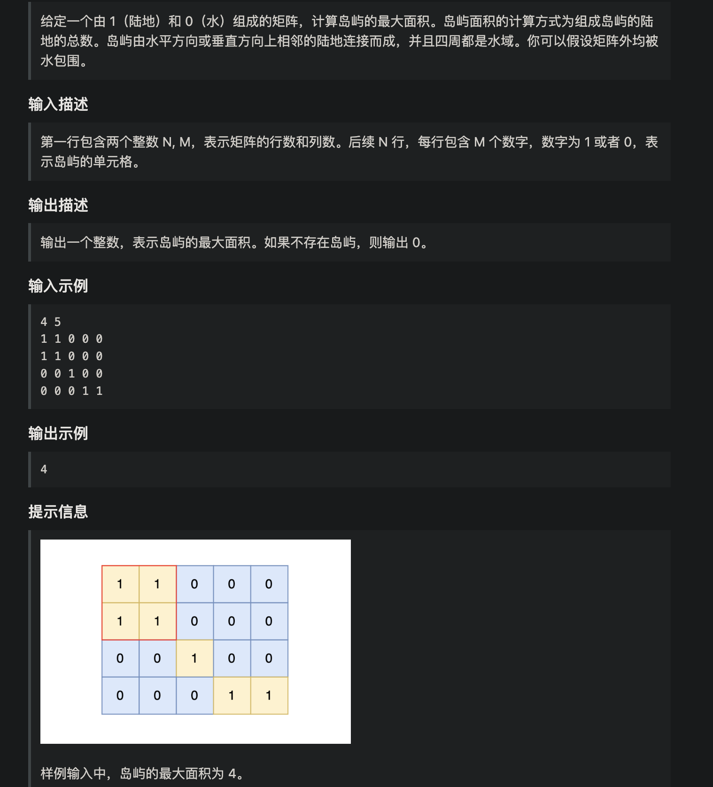
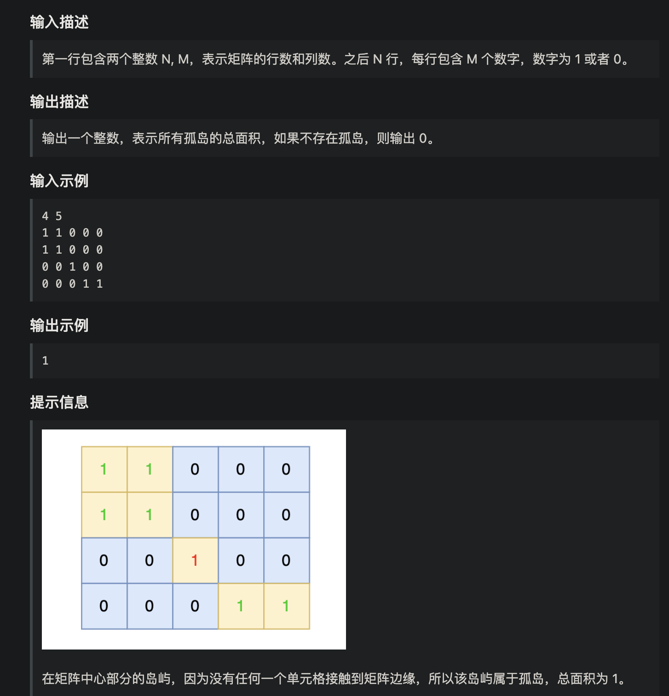

#  基础理论：

## 概念

#### 种类

图的种类分为 **有向图** 和 **无向图**

#### 连通性

**连通图**： 在无向图中，任何两个节点都是可以到达的，我们称之为连通图

**连通分量**： 在无向图中的极大连通子图称之为该图的一个连通分量

**强连通图**： 在有向图中，任何两个节点是可以相互到达的，我们称之为 强连通图

**强连通分量**： 在有向图中极大强连通子图称之为该图的强连通分量。


## 图的构造

### 邻接矩阵

邻接矩阵 使用 **二维数组**来表示图结构。接矩阵是从节点的角度来表示图，有多少节点就申请多大的二维数组。

例如： grid\[2][5] = 6，表示 节点 2 连接 节点5 为**有向图**，节点2 指向 节点5，边的权值为6。

如果想表示**无向图**，即：grid\[2][5] = 6，grid\[5][2] = 6，表示节点2 与 节点5 相互连通，权值为6。

**邻接矩阵的优点**：

-  表达方式简单，易于理解
- **检查任意两个顶点间是否存在边**的操作非常快
- 适合**稠密图**，在**边数接近顶点数平方**的图中，邻接矩阵是一种空间效率较高的表示方法。

**缺点**：

- 遇到**稀疏图**，会导致申请过大的二维数组造成**空间浪费** 且遍历 边 的时候需要**遍历整个n * n矩阵，造成时间浪费**


```java
public void addEdge(int u, int v, int w) {
        matrix[u][v] = w;
        matrix[v][u] = w; // 如果是有向图就去掉这一行
    }
```


### 邻接表

邻接表 使用 **数组 + 链表**的方式来表示。 邻接表是从边的数量来表示图，有多少边 才会申请对应大小的链表。

**邻接表的优点**：

- 对于**稀疏图**的存储，只需要存储边，**空间利用率高**
- 遍历节点连接情况相对容易

**缺点**：

- **检查任意两个节点间是否存在边**，效率相对低，需要 O(V)时间，V表示某节点**连接其他节点的数量**。

注意： 如果要有权，则用Map<Integer, List<Pair>>

```java
import java.util.*;

public class Graph {
    Map<Integer, List<Integer>> graph = new HashMap<>();

    // 添加有向边 u -> v
    public void addEdge(int u, int v) {
        if (!graph.containsKey(u)) {
            graph.put(u, new ArrayList<>());
        }
        graph.get(u).add(v);
    }

    // 打印图
    public void printGraph() {
        for (int node : graph.keySet()) {
            System.out.println(node + " -> " + graph.get(node));
        }
    }

    public static void main(String[] args) {
        Graph g = new Graph();
        g.addEdge(1, 2);
        g.addEdge(1, 3);
        g.addEdge(2, 4);
        g.addEdge(3, 4);
        g.printGraph();
    }
}
```


## 图的遍历

> **DFS** 更适合**全路径搜索**、**图遍历**、**连通块统计**等场景
>
> **BFS** 更适合求**最短路**、树的层序遍历、图中拓展层次结构。

迷宫模板

```java
int[][] maze = {
    {0, 0, 1, 0},
    {1, 0, 0, 0},
    {0, 1, 0, 1},
    {0, 0, 0, 0}
};
// 0 表示可以走，1 表示墙
// 从 (0, 0) 出发，目标是 (3, 3)
```

```java
int[][] dirs = {{0,1},{1,0},{0,-1},{-1,0}}; // 右、下、左、上
```

### dfs

- 搜索方向，是认准一个方向搜，直到碰壁之后再换方向
- 换方向是撤销原路径，改为节点链接的下一个路径，回溯的过程。

```java
boolean[][] visited;
int m, n;

public void dfs(int[][] maze, int x, int y) {
    // 越界、遇墙或访问过
    if (x < 0 || x >= m || y < 0 || y >= n || maze[x][y] == 1 || visited[x][y]) {
        return;
    }

    visited[x][y] = true;
    System.out.println("访问点：" + x + "," + y);

    for (int[] dir : dirs) {
        int nx = x + dir[0];
        int ny = y + dir[1];
        dfs(maze, nx, ny);
    }
}
```


### bfs

广搜的搜索方式就适合于解决两个点之间的最短路径问题。

因为广搜是从起点出发，以起始点为中心一圈一圈进行搜索，一旦遇到终点，记录之前走过的节点就是一条最短路。

```java
public void bfs(int[][] maze, int startX, int startY) {
    Queue<int[]> queue = new LinkedList<>();
    boolean[][] visited = new boolean[maze.length][maze[0].length];
    int m = maze.length, n = maze[0].length;

    queue.offer(new int[]{startX, startY});
    visited[startX][startY] = true;

    while (!queue.isEmpty()) {
        int[] cur = queue.poll();
        int x = cur[0], y = cur[1];
        System.out.println("访问点：" + x + "," + y);

        for (int[] dir : dirs) {
            int nx = x + dir[0];
            int ny = y + dir[1];
            if (nx >= 0 && nx < m && ny >= 0 && ny < n &&
                maze[nx][ny] == 0 && !visited[nx][ny]) {
                visited[nx][ny] = true;
                queue.offer(new int[]{nx, ny});
            }
        }
    }
}
```


# 所有可达路径





## 邻接矩阵写法：

```java
import java.util.ArrayList;
import java.util.List;
import java.util.Scanner;

public class Main {
    static List<List<Integer>> result = new ArrayList<>(); // 收集符合条件的路径
    static List<Integer> path = new ArrayList<>(); // 1节点到终点的路径

    public static void dfs(int[][] graph, int x, int n) {
        // 当前遍历的节点x 到达节点n
        if (x == n) { // 找到符合条件的一条路径
            result.add(new ArrayList<>(path));
            return;
        }
        for (int i = 1; i <= n; i++) { // 遍历节点x链接的所有节点
            if (graph[x][i] == 1) { // 找到 x链接的节点
                path.add(i); // 遍历到的节点加入到路径中来
                dfs(graph, i, n); // 进入下一层递归
                path.remove(path.size() - 1); // 回溯，撤销本节点
            }
        }
    }

    public static void main(String[] args) {
        Scanner scanner = new Scanner(System.in);
        int n = scanner.nextInt();
        int m = scanner.nextInt();

        // 节点编号从1到n，所以申请 n+1 这么大的数组
        int[][] graph = new int[n + 1][n + 1];

        for (int i = 0; i < m; i++) {
            int s = scanner.nextInt();
            int t = scanner.nextInt();
            // 使用邻接矩阵表示无向图，1 表示 s 与 t 是相连的
            graph[s][t] = 1;
        }

        path.add(1); // 无论什么路径已经是从1节点出发
        dfs(graph, 1, n); // 开始遍历

        // 输出结果
        if (result.isEmpty()) System.out.println(-1);
        for (List<Integer> pa : result) {
            for (int i = 0; i < pa.size() - 1; i++) {
                System.out.print(pa.get(i) + " ");
            }
            System.out.println(pa.get(pa.size() - 1));
        }
    }
}
```


## 领接表写法：

```java
import java.util.*;

public class Main {
    static List<List<Integer>> result = new ArrayList<>(); // 收集符合条件的路径
    static List<Integer> path = new ArrayList<>(); // 1节点到终点的路径
    static Map<Integer, List<Integer>> graph = new HashMap<>();

    public static void dfs(Map<Integer, List<Integer>> graph, int x, int n) {
        if (x == n) { // 找到符合条件的一条路径
            result.add(new ArrayList<>(path));
            return;
        }
        for (int i : graph.get(x)) { // 找到 x指向的节点
            path.add(i); // 遍历到的节点加入到路径中来
            dfs(graph, i, n); // 进入下一层递归
            path.remove(path.size() - 1); // 回溯，撤销本节点
        }
    }

    public static void main(String[] args) {
        Scanner scanner = new Scanner(System.in);
        int n = scanner.nextInt();
        int m = scanner.nextInt();


        while (m-- > 0) {
            int s = scanner.nextInt();
            int t = scanner.nextInt();
            // 使用邻接表表示 s -> t 是相连的
            addEdge(s, t);
        }

        path.add(1); // 无论什么路径已经是从1节点出发
        dfs(graph, 1, n); // 开始遍历

        // 输出结果
        if (result.isEmpty()) System.out.println(-1);
        for (List<Integer> pa : result) {
            for (int i = 0; i < pa.size() - 1; i++) {
                System.out.print(pa.get(i) + " ");
            }
            System.out.println(pa.get(pa.size() - 1));
        }
    }

    // 添加有向边 u -> v
    public static void addEdge(int u, int v) {
        if (!graph.containsKey(u)) {
            graph.put(u, new ArrayList<>());
        }
        graph.get(u).add(v);
    }

}
```


# 岛屿数量



## DFS版本

```java
import java.util.Scanner;

public class Main {
    public static int[][] dir ={{0,1},{1,0},{-1,0},{0,-1}};
    public static void dfs(boolean[][] visited,int x,int y ,int [][]grid)
    {
        for (int i = 0; i < 4; i++) {
            int nextX=x+dir[i][0];
            int nextY=y+dir[i][1];
            if(nextY<0||nextX<0||nextX>= grid.length||nextY>=grid[0].length)
                continue;
            if(!visited[nextX][nextY]&&grid[nextX][nextY]==1)
            {
                visited[nextX][nextY]=true;
                dfs(visited,nextX,nextY,grid);
            }
        }
    }
    public static void main(String[] args) {
        Scanner sc = new Scanner(System.in);
        int m= sc.nextInt();
        int n = sc.nextInt();
        int[][] grid = new int[m][n];
        for (int i = 0; i < m; i++) {
            for (int j = 0; j < n; j++) {
                grid[i][j]=sc.nextInt();
            }
        }
        boolean[][]visited =new boolean[m][n];
        int ans = 0;
        for (int i = 0; i < m; i++) {
            for (int j = 0; j < n; j++) {
                if(!visited[i][j]&&grid[i][j]==1)
                {
                    ans++;
                    visited[i][j]=true;
                    dfs(visited,i,j,grid);
                }
            }
        }
        System.out.println(ans);
    }
}

```


## BFS版本

```java
import java.util.*;

public class Main {
    public static int[][] dir = {{0, 1}, {1, 0}, {0, -1}, {-1, 0}};//下右上左逆时针遍历

    public static void bfs(int[][] grid, boolean[][] visited, int x, int y) {
        Queue<pair> queue = new LinkedList<pair>();//定义坐标队列，没有现成的pair类，在下面自定义了
        queue.add(new pair(x, y));
        visited[x][y] = true;//遇到入队直接标记为优先，
        // 否则出队时才标记的话会导致重复访问，比如下方节点会在右下顺序的时候被第二次访问入队
        while (!queue.isEmpty()) {
            int curX = queue.peek().first;
            int curY = queue.poll().second;//当前横纵坐标
            for (int i = 0; i < 4; i++) {
                //顺时针遍历新节点next，下面记录坐标
                int nextX = curX + dir[i][0];
                int nextY = curY + dir[i][1];
                if (nextX < 0 || nextX >= grid.length || nextY < 0 || nextY >= grid[0].length) {
                    continue;
                }//去除越界部分
                if (!visited[nextX][nextY] && grid[nextX][nextY] == 1) {
                    queue.add(new pair(nextX, nextY));
                    visited[nextX][nextY] = true;//逻辑同上
                }
            }
        }
    }

    public static void main(String[] args) {
        Scanner sc = new Scanner(System.in);
        int m = sc.nextInt();
        int n = sc.nextInt();
        int[][] grid = new int[m][n];
        boolean[][] visited = new boolean[m][n];
        int ans = 0;
        for (int i = 0; i < m; i++) {
            for (int j = 0; j < n; j++) {
                grid[i][j] = sc.nextInt();
            }
        }
        for (int i = 0; i < m; i++) {
            for (int j = 0; j < n; j++) {
                if (!visited[i][j] && grid[i][j] == 1) {
                    ans++;
                    bfs(grid, visited, i, j);
                }
            }
        }
        System.out.println(ans);
    }
}
```


# 岛屿的最大面积



```java
import java.util.*;
import java.math.*;

/**
 * DFS版
 */
public class Main{

    static final int[][] dir={{0,1},{1,0},{0,-1},{-1,0}};
    static int result=0;
    static int count=0;

    public static void main(String[] args){
        Scanner scanner = new Scanner(System.in);
        int n = scanner.nextInt();
        int m = scanner.nextInt();
        int[][] map = new int[n][m];
        for (int i = 0; i < n; i++) {
            for (int j = 0; j < m; j++) {
                map[i][j]=scanner.nextInt();
            }
        }
        boolean[][] visited = new boolean[n][m];
        for (int i = 0; i < n; i++) {
            for (int j = 0; j < m; j++) {
                if(!visited[i][j]&&map[i][j]==1){
                    count=0;
                    dfs(map,visited,i,j);
                    result= Math.max(count, result);
                }
            }
        }
        System.out.println(result);
    }

    static void dfs(int[][] map,boolean[][] visited,int x,int y){
                count++;
                visited[x][y]=true;
                for (int i = 0; i < 4; i++) {
                    int nextX=x+dir[i][0];
                    int nextY=y+dir[i][1];
                    //水或者已经访问过的跳过
                    if(nextX<0||nextY<0
                    ||nextX>=map.length||nextY>=map[0].length
                    ||visited[nextX][nextY]||map[nextX][nextY]==0)continue;
                    
                    dfs(map,visited,nextX,nextY);
                }
            }
}
```


# 孤岛的总面积



```java

import java.util.*;

public class Main {
    private static int count = 0;
    private static final int[][] dir = {{0, 1}, {1, 0}, {-1, 0}, {0, -1}}; // 四个方向

    private static void bfs(int[][] grid, int x, int y) {
        Queue<int[]> que = new LinkedList<>();
        que.add(new int[]{x, y});
        grid[x][y] = 0; // 只要加入队列，立刻标记
        count++;
        while (!que.isEmpty()) {
            int[] cur = que.poll();
            int curx = cur[0];
            int cury = cur[1];
            for (int i = 0; i < 4; i++) {
                int nextx = curx + dir[i][0];
                int nexty = cury + dir[i][1];
                if (nextx < 0 || nextx >= grid.length || nexty < 0 || nexty >= grid[0].length) continue; // 越界了，直接跳过
                if (grid[nextx][nexty] == 1) {
                    que.add(new int[]{nextx, nexty});
                    count++;
                    grid[nextx][nexty] = 0; // 只要加入队列立刻标记
                }
            }
        }
    }

    public static void main(String[] args) {
        Scanner scanner = new Scanner(System.in);
        int n = scanner.nextInt();
        int m = scanner.nextInt();
        int[][] grid = new int[n][m];
        
        // 读取网格
        for (int i = 0; i < n; i++) {
            for (int j = 0; j < m; j++) {
                grid[i][j] = scanner.nextInt();
            }
        }
        
        // 从左侧边，和右侧边向中间遍历
        for (int i = 0; i < n; i++) {
            if (grid[i][0] == 1) bfs(grid, i, 0);
            if (grid[i][m - 1] == 1) bfs(grid, i, m - 1);
        }
        
        // 从上边和下边向中间遍历
        for (int j = 0; j < m; j++) {
            if (grid[0][j] == 1) bfs(grid, 0, j);
            if (grid[n - 1][j] == 1) bfs(grid, n - 1, j);
        }
        
        count = 0;
        for (int i = 0; i < n; i++) {
            for (int j = 0; j < m; j++) {
                if (grid[i][j] == 1) bfs(grid, i, j);
            }
        }

        System.out.println(count);
    }
}


```

