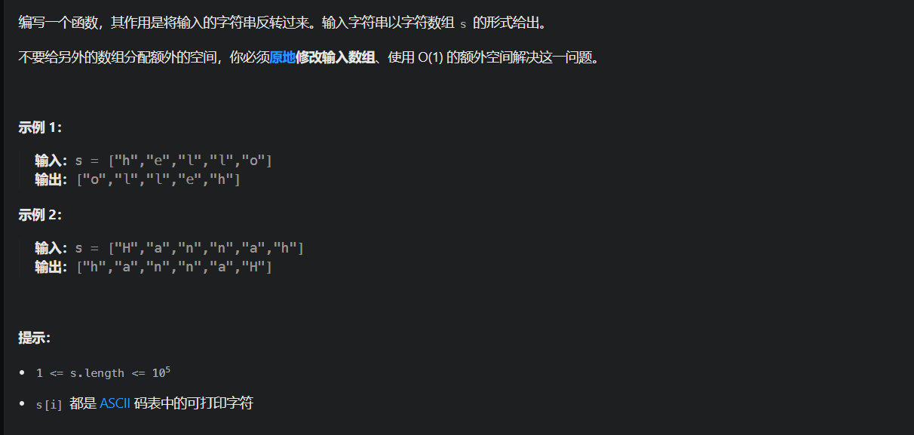
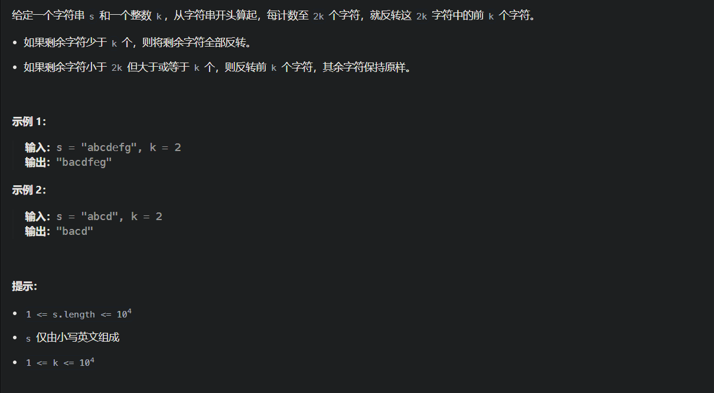
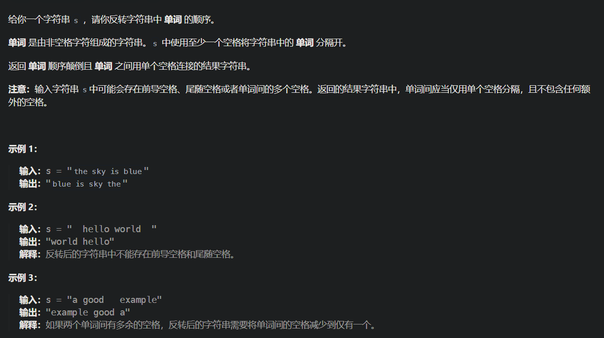
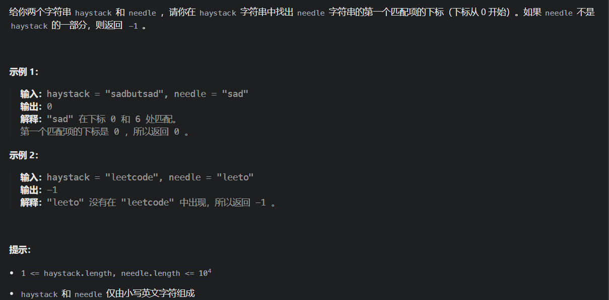
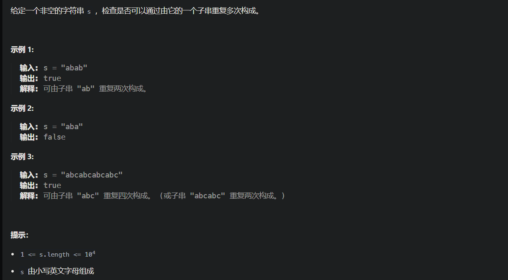
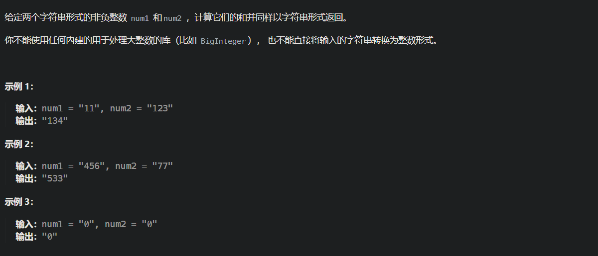

# 344.反转字符串

https://leetcode.cn/problems/reverse-string/description/



```java
class Solution {
    public void reverseString(char[] s) {
        int left = 0;
        int right = s.length - 1;
        while(left < right){
            char t = s[left];
            s[left++] = s[right];
            s[right--] = t;
        }
    }
}
```


# 541.反转字符串II

https://leetcode.cn/problems/reverse-string-ii/description/



```java
class Solution {
    public String reverseStr(String s, int k) {
        //转换为数组处理方便
        char[] sc = s.toCharArray();
        for(int i = 0; i < sc.length; i+=2*k){
            if(i + k - 1<= sc.length - 1)
                reverse(sc, i, i + k - 1);
            else
                reverse(sc, i, sc.length - 1);
        }
        return new String(sc);
    }
    public void reverse(char[] s, int left, int right){
        while(left < right){
            char t = s[left];
            s[left] = s[right];
            s[right] = t;
            left++;
            right--;
        }
    }
}
```


# △151.翻转字符串里的单词

https://leetcode.cn/problems/reverse-words-in-a-string/description/



解题思路如下：

- 移除多余空格
- 将整个字符串反转
- 将每个单词反转

举个例子，源字符串为："the sky is blue "

- 移除多余空格 : "the sky is blue"
- 字符串反转："eulb si yks eht"
- 单词反转："blue is sky the"

```java
class Solution {
    public String reverseWords(String s) {
        // 1.去除多余空格
        StringBuffer sb = deleteExtraSpaces(s);
        // 2.翻转字符串
        reverseString(sb, 0 , sb.length() - 1);
        // 3.翻转每个单词
        reverseEachWord(sb);
        return sb.toString();
    }

    public StringBuffer deleteExtraSpaces(String s) {
        // System.out.println("ReverseWords.removeSpace() called with: s = [" + s + "]");
        int start = 0;
        int end = s.length() - 1;
        //去除首尾多余空格
        while (s.charAt(start) == ' ')
            start++;
        while (s.charAt(end) == ' ')
            end--;
        StringBuffer sb = new StringBuffer();
        while (start <= end) {
            char c = s.charAt(start);
            //如果当前字符不是空格，或者是第一个空格(存储的sb中最后一个不是空格)（这种情况当前字符可以是空格）
            if (c != ' ' || sb.charAt(sb.length() - 1) != ' ') {
                sb.append(c);
            }
            start++;
        }
        // System.out.println("ReverseWords.removeSpace returned: sb = [" + sb + "]");
        return sb;
    }

    public void reverseString(StringBuffer sb, int start, int end) {
        // System.out.println("ReverseWords.reverseString() called with: sb = [" + sb + "], start = [" + start + "], end = [" + end + "]");
        while (start < end) {
            char temp = sb.charAt(start);
            sb.setCharAt(start, sb.charAt(end));
            sb.setCharAt(end, temp);
            start++;
            end--;
        }
        // System.out.println("ReverseWords.reverseString returned: sb = [" + sb + "]");
    }

    public void reverseEachWord(StringBuffer sb){
        int start = 0;
        int end = start + 1;
        while(end < sb.length()){
            while(end < sb.length() && sb.charAt(end) != ' ')
                end++;
            reverseString(sb, start, end - 1);
            start = end + 1;
            end = start + 1;
        }
    }
}
```


# *△28.找出字符串中第一个匹配项的下标

https://leetcode.cn/problems/find-the-index-of-the-first-occurrence-in-a-string/description/



```java
class Solution {
    public int strStr(String haystack, String needle) {
        int[] next = new int[needle.length()];
        getNext(next, needle);
        //i遍历haystack, j遍历needle
        for(int i = 0, j = 0; i <haystack.length(); i++){
            while(j > 0 && haystack.charAt(i) != needle.charAt(j))
                j = next[j - 1];
            if(haystack.charAt(i) == needle.charAt(j))
                j++;
            //needle遍历完了
            if(j == needle.length()){
                return i - j + 1;
            }
        }
        return -1;
    }
    public void getNext(int[] next, String needle){
        next[0] = 0;
        //i是后缀末尾，j是前缀末尾
        for(int i = 1, j = 0;i < needle.length();i++){
            while(j >0 && needle.charAt(j) != needle.charAt(i))
                j = next[j - 1];
            if(needle.charAt(j) == needle.charAt(i))
                j++;
            next[i] = j;
        }
    }
}
```


# *459.重复的子字符串

https://leetcode.cn/problems/repeated-substring-pattern/description/



```java
class Solution {
    public boolean repeatedSubstringPattern(String s) {
        int[] next = new int[s.length()];
        getNext(next, s);
        String haystack = s+s;
        String needle = s;
        //i从1开始，避免匹配到的是首位的s
        for(int i=1,j=0;i<haystack.length();i++){
            while(j>0 && haystack.charAt(i) != needle.charAt(j))
                j = next[j-1];
            if(haystack.charAt(i)==needle.charAt(j)){
                j++;
            }
            //i!=haystack.length()-1避免匹配到的是末尾的s
            if(j == needle.length() && i!=haystack.length()-1)
                return true;
            
        }
        return false;
    }
    public void getNext(int[] next,String s){
        next[0] = 0;
        for(int i=1,j=0;i<s.length();i++){
            while(j>0 && s.charAt(i) != s.charAt(j))
                j = next[j-1];
            if(s.charAt(i) == s.charAt(j))
                j++;
            next[i] = j;
        }
    }
}
```


# [415. 字符串相加](https://leetcode.cn/problems/add-strings/)



```java
class Solution {
    public String addStrings(String num1, String num2) {
        StringBuilder sb = new StringBuilder();
        int i = num1.length() - 1;
        int j = num2.length() - 1;
        int carry = 0;

        while (i >= 0 || j >= 0 || carry != 0) {
            int x = (i >= 0) ? num1.charAt(i--) - '0' : 0;
            int y = (j >= 0) ? num2.charAt(j--) - '0' : 0;
            int sum = x + y + carry;
            sb.append(sum % 10);
            carry = sum / 10;
        }

        return sb.reverse().toString();
    }
}

```

