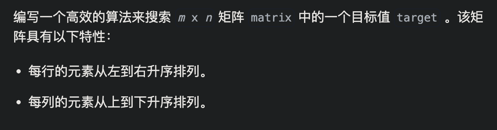

# 704.二分查找

[力扣题目链接](https://leetcode.cn/problems/binary-search/)


```java
class Solution {
    public int search(int[] nums, int target) {
        int left = 0;
        int right = nums.length-1;
        while(left <= right){               //左闭右闭区间
            int mid = left + right >>1;
            if(nums[mid] < target)
                left = mid + 1;
            else if(nums[mid] > target)
                right = mid - 1;
            else
                return mid;
        }
        return -1;
    }
}
```


## 35.搜索插入位置

[力扣题目链接](https://leetcode.cn/problems/search-insert-position/)


```java
class Solution {
    public int searchInsert(int[] nums, int target) {
        int left = 0;
        int right = nums.length - 1;
        while(left <= right){
            int mid = left + right >> 1;
            if(nums[mid] < target)
                left = mid + 1;
            else if(nums[mid] > target)
                right = mid - 1;
            else
                return mid;
        }
        return left;    //跳出循环时，left = right + 1； 
    }
}
```

## *34.在排序数组中查找元素的第一个和最后一个位置

[力扣链接](https://leetcode.cn/problems/find-first-and-last-position-of-element-in-sorted-array/)


理解： 找左边界时，让target >=  nums[mid]时，都要二分到左半边（普通的二分是<时划分），并且最后返回较大的那个，即left

找右边届时，让target <= nums[mid]时，都要划分到右半边，并且最后返回较小的那个，即right

```java
class Solution {
    public int[] searchRange(int[] nums, int target) {
        int leftBoundary = searchLeftBoudnary(nums, target);
        int rightBoundary = searchRightBoudnary(nums, target);
        return new int[]{leftBoundary, rightBoundary};
    }
    public int searchLeftBoudnary(int[] nums, int target){
        int left = 0;
        int right = nums.length - 1;
        while(left <= right){
            int mid = left + right >> 1;
            if(nums[mid] < target)
                left = mid + 1;
            else
                right = mid - 1;
        }
        //遍历结束后， left = right + 1
        if(left <= nums.length - 1 && nums[left] == target)
            return left;
        return -1;
    }

        public int searchRightBoudnary(int[] nums, int target){
        int left = 0;
        int right = nums.length - 1;
        while(left <= right){
            int mid = left + right >> 1;
            if(nums[mid] > target)
                right = mid - 1;
            else
                left = mid + 1;
        }
        //最终right = left - 1;
        if(right >= 0 && nums[right] == target)
            return right;
        return -1;
    }
}
```

## 69.x的平方根

https://leetcode.cn/problems/sqrtx/description/


```java
class Solution {
    public int mySqrt(int x) {
        int left = 0;
        int right = x;
        while(left <= right){
            int mid = left + right >> 1;
            if((long)mid * mid > x)
                right = mid - 1;
            else if((long)mid * mid < x)
                left = mid + 1;
            else
                return mid;
        }
        return right;
    }
}
```


## 367.有效的完全平方数

https://leetcode.cn/problems/valid-perfect-square/description/


```java
class Solution {
    public boolean isPerfectSquare(int num) {
        int left = 0;
        int right = num;
        while(left <= right){
            int mid = left + right >> 1;
            if((long)mid * mid > num)
                right = mid -1;
            else if((long)mid * mid < num)
                left = mid + 1;
            else
                return true;
        }
        return false;
    }
}
```

## [2529. 正整数和负整数的最大计数](https://leetcode.cn/problems/maximum-count-of-positive-integer-and-negative-integer/)


```java
class Solution {
    public int maximumCount(int[] nums) {
      // 第一个>=0的位置
        int neg = lowerBound(nums, 0);
        // 第一个 >= 1 的位置
        int pos = nums.length - lowerBound(nums, 1);
        return Math.max(neg, pos);
    }

    // 返回 nums 中第一个 >= target 的数的下标
    // 如果不存在这样的数，返回 nums.length
    private int lowerBound(int[] nums, int target) {
        int left = 0;
        int right = nums.length - 1;
        while (left <= right){
            int mid = left + right >> 1;
            if(target <= nums[mid])
                right = mid - 1;
            else
                left = mid + 1;
        }
        if(left <= nums.length-1 && nums[left] >= target)
            return left;
        return nums.length;
    }
}
```


# 移除元素

https://leetcode.cn/problems/remove-element/description/


slow存储，fast遍历

```java
class Solution {
    public int removeElement(int[] nums, int val) {
        int slow = 0;
        int fast = 0;
        for(;fast < nums.length;fast++){
            if(nums[fast] != val)
                nums[slow++] = nums[fast]; 
        }
        return slow;
    }
}
```

## 26.删除有序数组中的重复项

https://leetcode.cn/problems/remove-duplicates-from-sorted-array/description/


```java
class Solution {
    public int removeDuplicates(int[] nums) {
        int slow = 0;
        int fast = 0;
        for(;fast < nums.length;fast++){
            if(nums[fast] != nums[slow])
                nums[++slow] = nums[fast];
        }
        return slow + 1;
    }
}
```


# [80. 删除有序数组中的重复项 II](https://leetcode.cn/problems/remove-duplicates-from-sorted-array-ii/)


```java
class Solution {
    public int removeDuplicates(int[] nums) {
        if(nums.length <= 2) return nums.length;
        int slow = 2;
        int fast = 2;
        while(fast < nums.length){
            if(nums[slow-2] != nums[fast])
                nums[slow++] = nums[fast];
            fast++;
        }
        return slow;
    }
}
```


## 283.移动零

https://leetcode.cn/problems/move-zeroes/description/


```java
class Solution {
    public void moveZeroes(int[] nums) {
        int slow = 0;
        int fast = 0;
        for(;fast < nums.length;fast++){
            if(nums[fast] != 0)
                nums[slow++] = nums[fast];
        }
        for(;slow < nums.length;slow++){
            nums[slow] = 0;
        }
    }
}
```

## 844.比较含退格的字符串

https://leetcode.cn/problems/backspace-string-compare/description/


用栈秒了

```java
class Solution {
    public boolean backspaceCompare(String s, String t) {
        Stack<Character> st1 = new Stack<>();
        Stack<Character> st2 = new Stack<>();
        for(char c : s.toCharArray()){
            if(c != '#') st1.push(c);
            else{
                if(!st1.isEmpty())
                    st1.pop();
            }
        }
        for(char c : t.toCharArray()){
            if(c != '#') st2.push(c);
            else{
                if(!st2.isEmpty())
                    st2.pop();
            }
        }
        return st1.equals(st2);
    }
}
```


# 977.有序数组的平方

https://leetcode.cn/problems/squares-of-a-sorted-array/description/


```java
class Solution {
    public int[] sortedSquares(int[] nums) {
        int left = 0;
        int right = nums.length -1;
        int cur = nums.length - 1;
        int ans[] = new int[nums.length];   //开辟个新数组返回答案
        while(left <= right){
            int leftNum2 = nums[left] * nums[left];
            int rihgtNum2 = nums[right] * nums[right];
            if(leftNum2 >= rihgtNum2){
                ans[cur--] = leftNum2;
                left++;
            }else{
                ans[cur--] = rihgtNum2;
                right--;
            }
        }
        return ans;
    }
}
```


# 209.长度最小的子数组

https://leetcode.cn/problems/minimum-size-subarray-sum/description/


```java
//分析：要求是子数组，所以是连续的，所以要用滑动窗口来维护一个以每个元素为右端点的大于target的最小数组，然后不断取最小
class Solution {
    public int minSubArrayLen(int target, int[] nums) {
        int left = 0;
        int right = 0;
        int sum = 0;
        int res = Integer.MAX_VALUE;
        while(right < nums.length){
            sum += nums[right];
            //收缩左边界，这里要用while直到找到sum<target的子数组
            while(sum >= target){
                res = Math.min(res, right - left + 1);
                sum -= nums[left];
                left++;
            }
            right++;
        }
        return res == Integer.MAX_VALUE ? 0 : res;
    }
}
```

## *904.水果成篮

https://leetcode.cn/problems/fruit-into-baskets/description/


```java
class Solution {
    public int totalFruit(int[] fruits) {
        int left = 0;
        int right = 0;
        int res = 0;
        int fruit1 = fruits[0];
        int fruit2 = fruits[0];
        while(right < fruits.length){
            if(fruits[right] == fruit1 || fruits[right] == fruit2){
                res = Math.max(res, right - left + 1);
                right++;
            }else{
                //说明此时的右端点是第三种水果，要将左端点移到这个第三种水果的前一个水果，然后往前推，找到最长的子数组
                left = right - 1;
                fruit1 = fruits[right];
                fruit2 = fruits[left];
                while(left >= 1 && fruits[left - 1] == fruit2){
                    left--;
                }
            }
        }
        return res;
    }
}
```


## *76.最小覆盖子串△

https://leetcode.cn/problems/minimum-window-substring/description/


`win.get(temp) == require.get(temp)`：

- 比较的是两个 `Integer` 对象的内存地址是否相同。
- 当 `Integer` 的值在 [-128, 127] 范围内时，Java 会进行缓存，相同的 `Integer` 值会指向同一个对象。
- 当 `Integer` 的值超出这个范围时，每次创建 `Integer` 对象都会分配新的内存地址，即使值相同，`==` 也会返回 `false`。

```java
class Solution {
    public String minWindow(String s, String t) {
        HashMap<Character, Integer> win = new HashMap<>();
        HashMap<Character, Integer> require = new HashMap<>();
        int validNum = 0;
        int left = 0;
        int right = 0;
        int start = 0;//用于截取最后的字符串结果
        int resLen = Integer.MAX_VALUE;//用于截取最后的字符串结果

        for(int i = 0;i < t.length();i++){
            char c = t.charAt(i);
            require.put(c,require.getOrDefault(c,0) + 1);
        }

        while(right < s.length()){
            char temp = s.charAt(right);
            if(require.containsKey(temp)){
                win.put(temp, win.getOrDefault(temp,0) + 1);
                // if(win.get(temp) == require.get(temp))  注意这个差别
                if(win.get(temp).equals(require.get(temp)))
                    validNum++;
            }
            while(validNum == require.size()){
                if(right - left + 1 < resLen){
                    start = left;
                    resLen = right - left + 1;
                }
                temp = s.charAt(left);
                if(require.containsKey(temp)){
                    win.put(temp, win.get(temp) - 1);
                    if(win.get(temp)<Integer.valueOf(require.get(temp)))
                        validNum--;
                }
                left++;
            }
            right++;
        }
        System.out.println(start+"--"+resLen);
        return resLen==Integer.MAX_VALUE ? "" : s.substring(start,start+resLen);//注意这个区间是左闭右开
    }
}
```


# 59.螺旋矩阵II

https://leetcode.cn/problems/spiral-matrix-ii/description/


```java
import java.util.ArrayList;
import java.util.List;

//leetcode submit region begin(Prohibit modification and deletion)
class Solution {
    public List<Integer> spiralOrder(int[][] matrix) {
        int m = matrix.length;
        int n = matrix[0].length;
        List<Integer> res = new ArrayList<>();
        int loop = Math.min(m, n)/2;
        int offset = 1;
        int startRow = 0;
        int startCol = 0;
        int i,j;
        while (loop-- > 0){
            for (j = startCol; j < n -offset; j++)
                res.add(matrix[startRow][j]);
            for (i = startRow; i < m - offset;i++)
                res.add(matrix[i][j]);
            for(;j > startCol; j--)
                res.add(matrix[i][j]);
            for (;i > startRow; i--)
                res.add(matrix[i][j]);
            offset++;
            startRow++;
            startCol++;
        }
        if(Math.min(m,n)%2==1) {
            if (m < n) {
                for ( j = startCol; j < n - offset + 1; j++) {
                    res.add(matrix[startRow][j]);
                }
            } else {
                for ( i = startRow; i < m - offset + 1; i++) {
                    res.add(matrix[i][startCol]);
                }
            }
        }
        return res;
    }
}
//leetcode submit region end(Prohibit modification and deletion)

```


## 1.螺旋矩阵

https://leetcode.cn/problems/spiral-matrix/submissions/439207228/


```java
class Solution {
    public List<Integer> spiralOrder(int[][] matrix) {
        List<Integer> res = new ArrayList<>();
        int m = matrix[0].length;
        int n = matrix.length;
        int loop = Math.min(m,n)/2;
        int startX=0, startY=0;
        int offset = 1;
        int i=0,j=0;
        while(loop-->0){
            for(i = startX;i<m-offset;i++)
                res.add(matrix[startY][i]);
            for(j = startY;j<n-offset;j++)
                res.add(matrix[j][i]);
            for(;i>startX;i--)
                res.add(matrix[j][i]);
            for(;j>startY;j--)
                res.add(matrix[j][i]);
            startX++;
            startY++;
            offset++;
        }
        if(Math.min(m,n)%2==1){
        if(n<m){
            for(i=startX;i<m-offset+1;i++)
                res.add(matrix[startY][i]);
        }else{
            for(j=startY;j<n-offset+1;j++)
                res.add(matrix[j][startX]);
        }
        }
        return res;
    }
}
```


# 前缀和模板


```java
import java.util.Scanner;

public class Main {
    public static void main(String[] args) {
        final int N = 100010;
        Scanner scanner = new Scanner(System.in);
        int n = scanner.nextInt();
        int m = scanner.nextInt();
        int[] a = new int[N];
        int[] s = new int[N];
        for (int i = 0; i < n; i++) {
            a[i] = scanner.nextInt();
        }
        for (int i = 1; i <= n; i++) {
            s[i] = s[i - 1] + a[i - 1];
        }
        while (m-- > 0) {
            int l = scanner.nextInt();
            int r = scanner.nextInt();
            System.out.println(s[r] - s[l-1]);
        }
    }
}
```

# 二维前缀和模板


```java
import java.util.Scanner;

public class Main {
    public static void main(String[] args) {
        final int N = 1010;
        int[][] a = new int[N][N];
        int[][] s = new int[N][N];
        Scanner scanner = new Scanner(System.in);
        int n = scanner.nextInt();
        int m = scanner.nextInt();
        int q = scanner.nextInt();
        for (int i = 1; i <= n; i++) {
            for (int j = 1; j <= m; j++) {
                a[i][j] = scanner.nextInt();
                s[i][j] = s[i-1][j] + s[i][j-1]-s[i-1][j-1] + a[i][j];
            }
        }
        while (q-->0) {
            int x1 = scanner.nextInt();
            int y1 = scanner.nextInt();
            int x2 = scanner.nextInt();
            int y2 = scanner.nextInt();
            System.out.println(s[x2][y2] - s[x2][y1-1] - s[x1-1][y2] + s[x1-1][y1-1]);
        }

    }
}

```


# 开发商购买土地

[题目链接](https://kamacoder.com/problempage.php?pid=1044)


```java
import java.util.Scanner;

public class Main {
    public static void main(String[] args) {
        Scanner scanner = new Scanner(System.in);
        int n = scanner.nextInt();
        int m = scanner.nextInt();
        int sum = 0;
        int[][] vec = new int[n][m];
        for (int i = 0; i < n; i++) {
            for (int j = 0; j < m; j++) {
                vec[i][j] = scanner.nextInt();
                sum += vec[i][j];
            }
        }

        // 统计横向
        int[] horizontal = new int[n];
        for (int i = 0; i < n; i++) {
            for (int j = 0; j < m; j++) {
                horizontal[i] += vec[i][j];
            }
        }

        // 统计纵向
        int[] vertical = new int[m];
        for (int j = 0; j < m; j++) {
            for (int i = 0; i < n; i++) {
                vertical[j] += vec[i][j];
            }
        }

        int result = Integer.MAX_VALUE;
        int horizontalCut = 0;
        for (int i = 0; i < n; i++) {
            horizontalCut += horizontal[i];
            result = Math.min(result, Math.abs(sum - 2 * horizontalCut));
        }

        int verticalCut = 0;
        for (int j = 0; j < m; j++) {
            verticalCut += vertical[j];
            result = Math.min(result, Math.abs(sum - 2 * verticalCut));
        }

        System.out.println(result);
        scanner.close();
    }
}

```

 

# [3. 无重复字符的最长子串](https://leetcode.cn/problems/longest-substring-without-repeating-characters/)


```java
class Solution {
    public int lengthOfLongestSubstring(String s) {
        int left = 0;
        int right = 0;
        int res = 0;
        Set<Character> set = new HashSet<>();
        while(right < s.length()){
            char c = s.charAt(right);
            //右边界首次出现重复，说明当前左边界已到达最大值，记录res并收缩
            while(set.contains(c)){
                set.remove(s.charAt(left));
                left++;
            }
            set.add(c);
            res = Math.max(res, right - left + 1);
            right++;
        }
        return res;
    }
}
```


# [238. 除自身以外数组的乘积](https://leetcode.cn/problems/product-of-array-except-self/)


```java
class Solution {
    public int[] productExceptSelf(int[] nums) {
        //用前缀积和后缀积
        int len = nums.length;
        int[] L = new int[len];
        int[] R = new int[len];
        int[] res = new int[len];
        // L[i] 表示i号数字之前之积（不包括i）
        L[0] = 1;
        for(int i = 1; i < len; i++)
            L[i] = L[i-1] * nums[i-1];
        // R[i] 表示i号数字之后之积（不包括i）
        R[len-1] = 1;
        for(int i = len-2; i >= 0; i--)
            R[i] = R[i+1] * nums[i+1];
        for(int i = 0 ; i < len; i++)
            res[i] = L[i] * R[i];
        return res;
    }
}
```


# [73. 矩阵置零](https://leetcode.cn/problems/set-matrix-zeroes/)


标记数组

```java
class Solution {
    public void setZeroes(int[][] matrix) {
        int m = matrix.length;
        int n = matrix[0].length;
        boolean[] row = new boolean[m];
        boolean[] col = new boolean[n];
        for(int i = 0; i < m; i++){
            for(int j = 0; j < n; j++){
                if(matrix[i][j] == 0){
                    row[i] = true;
                    col[j] = true;
                }
            }
        }
        for(int i = 0; i < m; i++){
            for(int j = 0; j < n; j++){
                if(row[i] || col[j])
                    matrix[i][j] = 0;
            }
        }
    }
}
```


# [48. 旋转图像](https://leetcode.cn/problems/rotate-image/)


```java
class Solution {
    public void rotate(int[][] matrix) {
        int n = matrix.length;
        //拷贝到辅助数组
        int[][] temp = new int[n][n];
        for(int i = 0; i < n; i++)
            temp[i] = matrix[i].clone();
        //根据公式存放
        for(int i = 0; i < n; i++)
            for(int j = 0; j < n; j++)
              //关键公式
                matrix[j][n-1-i] = temp[i][j];
    }
}
```


# [240. 搜索二维矩阵 II](https://leetcode.cn/problems/search-a-2d-matrix-ii/)




```java
class Solution {
    public boolean searchMatrix(int[][] matrix, int target) {
        //每行都暴力二分搜索吧
        for(int i = 0; i < matrix.length; i++){
            if(binarySearch(matrix[i], target))
                return true;
        }
        return false;
    }

    boolean binarySearch(int[] nums, int target){
        int left = 0;
        int right = nums.length-1;
        while(left <= right){
            int mid = left + right >> 1;
            if(nums[mid] > target)
                right = mid - 1;
            else if (nums[mid] < target)
                left = mid + 1;
            else
                return true;
        }
        return false;
    }
}
```


# [*33. 搜索旋转排序数组](https://leetcode.cn/problems/search-in-rotated-sorted-array/)


```c
// 重点：
    // 将数组一分为二，其中一定有一个是有序的，另一个可能是有序，也能是部分有序。
    // 此时有序部分用二分法查找。无序部分再一分为二，其中一个一定有序，另一个可能有序，可能无序。就这样循环.
```

```java
class Solution {
    public int search(int[] nums, int target) {
        int len = nums.length;
        if(len == 0) return -1;
        if(len == 1) return nums[0] == target ? 0 : -1;
        int left = 0;
        int right = len - 1;
        while(left <= right){
            int mid = left + right >> 1;
            //找到了
            if(nums[mid] == target) return mid;
            //[0, mid]是有序的，即左区间是有序的，且mid在左区间
            if(nums[mid] >= nums[0]){
                //target也左区间，在左区间进行二分
                if(target >= nums[0]){
                    if(nums[mid] > target)
                        right = mid - 1;
                    else
                        left = mid + 1;
                }else{
                    //target在右区间，则转去右区间
                    left = mid + 1;
                }
            }else{
                //[mid, right-1]是有序的，即右区间是有序的，且mid在右区间
                //target也在右区间,在右区间二分
                if(target < nums[0]){
                    if(target <= nums[mid])
                        right = mid - 1;
                    else
                        left = mid + 1;
                }else{
                    //target在左区间，转去左区间
                    right = mid - 1;
                }
            }
            
        }
        return -1;
    }
}
```


# [*153. 寻找旋转排序数组中的最小值](https://leetcode.cn/problems/find-minimum-in-rotated-sorted-array/)


```java
设 x=nums[mid] 是现在二分取到的数。

!!我们需要判断 x 和数组最小值的位置关系，谁在左边，谁在右边？

把 x 与最后一个数 nums[n−1] 比大小：

如果 x>nums[n−1]，那么可以推出以下结论：
nums 一定被分成左右两个递增段；
第一段的所有元素均大于第二段的所有元素；
x 在第一段。
最小值在第二段。
所以 x 一定在最小值的左边。
如果 x≤nums[n−1]，那么 x 一定在第二段。（或者 nums 就是递增数组，此时只有一段。）
x 要么是最小值，要么在最小值右边。
所以，只需要比较 x 和 nums[n−1] 的大小关系，就间接地知道了 x 和数组最小值的位置关系，从而不断地缩小数组最小值所在位置的范围，二分找到数组最小值。
```


```java
class Solution {
    public int findMin(int[] nums) {
        int n = nums.length;
        if(n == 1) return nums[0];
        int left = 0;
      //因为最后退出循环时，left = right + 1，且最后答案取的是nums[left]。
      //如果最终是末尾元素最小，则要返回nums[n-1],所以right取n-2
        int right = n - 2;
        while (left <= right) {
            int mid = (left + right) >> 1;
            if (nums[mid] < nums[n - 1]) {
                right = mid - 1;
            } else {
                left = mid + 1;
            }
        }
        return nums[left];
    }
}
```

# [4. 寻找两个正序数组的中位数](https://leetcode.cn/problems/median-of-two-sorted-arrays/)

[讲解视频](https://www.bilibili.com/video/BV1z54y1b7wb/?spm_id_from=333.337.search-card.all.click&vd_source=55c287a81883465b30c11b1feb8b72c3)


 ```
 思路：若len是奇数，找到第len/2 + 1大的数字；若len是偶数，找到len/2和len/2 + 1大的数字取平均
 
 遍历len/2 + 1次，每次把两个数组中较小的那个赋值给right，left记录上一次循环的right
 ```


```java
class Solution {
    public double findMedianSortedArrays(int[] nums1, int[] nums2) {
        int n = nums1.length;
        int m = nums2.length;
        int len = n + m;
        int start1 = 0;
        int start2 = 0;
        int left = 0;
        int right = 0;
        for (int i = 0; i <= len/2; i++) {
            left = right;
            if(start1 >= n) right = nums2[start2++];
            else if(start2 >= m) right = nums1[start1++];
            else
                right = nums1[start1] > nums2[start2] ? nums1[start1++] : nums2[start2++];
        }
        if(len % 2 == 0) return left + right >> 1;
        else return right;
    }
}
```


# [118. 杨辉三角](https://leetcode.cn/problems/pascals-triangle/)


```java
class Solution {
    public List<List<Integer>> generate(int numRows) {
        List<List<Integer>> res = new ArrayList<>();
        List<Integer> path0 = new ArrayList<>();
        path0.add(1);
        res.add(path0);
        //行
        for(int i = 1; i < numRows; i++){
            List<Integer> path = new ArrayList<>();
            path.add(1);
            //
            for(int j = 1; j < i; j++){
                path.add(res.get(i-1).get(j-1) + res.get(i-1).get(j));
            }
            path.add(1);
            res.add(path);
        }
        return res;
    }
}
```


# [88. 合并两个有序数组](https://leetcode.cn/problems/merge-sorted-array/)


```java
//leetcode submit region begin(Prohibit modification and deletion)
class Solution {
    public void merge(int[] nums1, int m, int[] nums2, int n) {
        int p1 = m-1;
        int p2 = n-1;
        int end = m+n-1;
        while (p1 >= 0 || p2 >= 0){
            if(p1 == -1)
                nums1[end--] = nums2[p2--];
            else if(p2 == -1)
                nums1[end--] = nums1[p1--];
            else if(nums1[p1] <= nums2[p2])
                nums1[end--] = nums2[p2--];
            else
               nums1[end--] = nums1[p1--];
        }
    }
}
//leetcode submit region end(Prohibit modification and deletion)

```


# [169. 多数元素](https://leetcode.cn/problems/majority-element/)


```java
import java.util.Arrays;

//leetcode submit region begin(Prohibit modification and deletion)
// 2 3 3
class Solution {
    public int majorityElement(int[] nums) {
        int n = nums.length;
        Arrays.sort(nums);
        if(n == 1) return nums[0];
        int slow = 0;
        int fast = 1;
        int cnt = 1;
        while (fast < n){
            if(nums[slow] == nums[fast]) {
                cnt++;
                if (cnt > n / 2)
                    return nums[slow];
            }else{
                cnt = 1;
                slow = fast;
            }
            fast++;
        }
        return -1;
    }
}
//leetcode submit region end(Prohibit modification and deletion)

```


# [189. 轮转数组](https://leetcode.cn/problems/rotate-array/)


```java
class Solution {
    public void rotate(int[] nums, int k) {
        int len = nums.length;
        int[] res = new int[len];
        for(int i = 0; i < len; i++)
            res[(i+k) % len] = nums[i];
        for(int i = 0; i < len; i++)
            nums[i] = res[i];
    }
}
```


# [31. 下一个排列](https://leetcode.cn/problems/next-permutation/)


```java
```


# [8. 字符串转换整数 (atoi)](https://leetcode.cn/problems/string-to-integer-atoi/)


```java
class Solution {
    public int myAtoi(String s) {
        int n = s.length(), i = 0;
        long res = 0;
        // 去除前导零
        while (i < n && s.charAt(i) == ' ') i++;
        if (i == n) return 0;
        // 判断符号
        int flag = 1;
        if (s.charAt(i) == '+') i++;
        else if (s.charAt(i) == '-') {
            flag = -1;
            i++;
        }
        // 收获结果
        for (; i < n; i++) {
            char c = s.charAt(i);
            if (c < '0' || c > '9') break;
            res = res * 10 + flag * (c - '0');
            if (res <= Integer.MIN_VALUE) return Integer.MIN_VALUE;
            if (res >= Integer.MAX_VALUE) return Integer.MAX_VALUE;
        }
        return (int) res;
    }
}
```

