Java栈和队列的api

当你使用 Java 刷 LeetCode 上栈和队列相关的题目时，以下是一些常用的 API：

**栈 (Stack)**

- `java.util.Stack`
  - `push(E item)`: 将元素压入栈顶。
  - `pop()`: 移除并返回栈顶元素。如果栈为空，则抛出 `EmptyStackException`。
  - `peek()`: 返回栈顶元素但不移除它。如果栈为空，则抛出 `EmptyStackException`。
  - `empty()`: 如果栈为空，则返回 `true`，否则返回 `false`。
  - `search(Object o)`: 返回对象在栈中的位置，从栈顶开始计数（1 表示栈顶）。如果对象不在栈中，则返回 -1。

**队列 (Queue)**

- **`java.util.Queue` 接口** (通常使用 `LinkedList` 实现)

  - `offer(E e)`: 将元素插入队列尾部。成功时返回 `true`，如果队列已满（有容量限制时），则返回 `false`。
  - `poll()`: 移除并返回队列头部的元素。如果队列为空，则返回 `null`。
  - `peek()`: 返回队列头部的元素但不移除它。如果队列为空，则返回 `null`。
  - `isEmpty()`: 如果队列为空，则返回 `true`，否则返回 `false`。

- **`java.util.Deque` 接口** (通常使用 `LinkedList` 或 `ArrayDeque` 实现)

  - 除了上述 

    ```
    Queue
    ```

     接口的方法外，

    ```
    Deque
    ```

     还提供了在队列两端进行插入和删除操作的方法：

    - `addFirst(E e)`, `addLast(E e)`
    - `removeFirst()`, `removeLast()`
    - `getFirst()`, `getLast()`

**Deque vs. Queue**

- 如果你只需要基本的队列操作（先进先出），使用 `Queue` 就足够了。
- 如果你需要在队列两端进行操作（例如实现双端队列），或者需要更高效的实现，那么 `Deque` 是更好的选择。`ArrayDeque` 在大多数情况下比 `LinkedList` 更快。

**示例**

Java

```
import java.util.ArrayDeque;
import java.util.Deque;
import java.util.LinkedList;
import java.util.Queue;
import java.util.S   tack;

public class Example {
    public static void main(String[] a   rgs) {
        // 栈
        Stack<Integer> stack = new Stack<>();
        stack.push(1);
        stack.push(2);
        System.out.println(stack.pop()); // 输出 2

        // 队列
        Queue<String> queue = new LinkedList<>();
        queue.offer("apple");
        queue.offer("banana");
        System.out.println(queue.poll()); // 输出 apple

        // 双端队列
        Deque<Character> deque = new ArrayDeque<>();
        deque.addFirst('a');
        deque.addLast('b');
        System.out.println(deque.removeFirst()); // 输出 a
    }
}
```

# 232.用栈实现队列

https://leetcode.cn/problems/implement-queue-using-stacks/description/

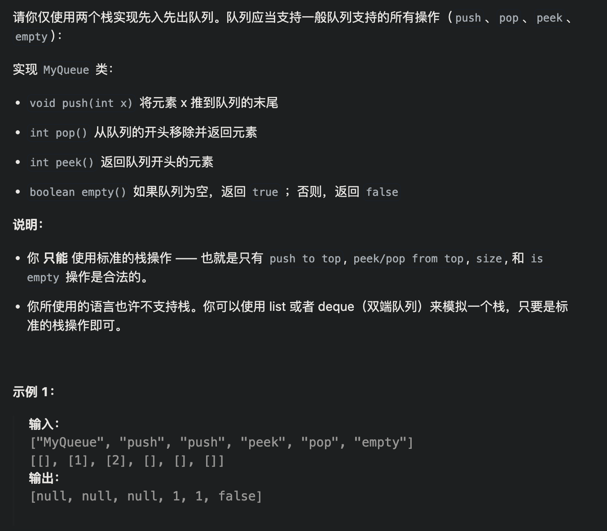

```java
class MyQueue {
    Stack<Integer> stackIn;
    Stack<Integer> stackOut;
    public MyQueue() {
        stackIn = new Stack<>();
        stackOut = new Stack<>();
    }
    
    public void push(int x) {
        stackIn.push(x);
    }
    
    public int pop() {
        if(stackOut.empty()){
            while(!stackIn.empty()){
                stackOut.push(stackIn.pop());
            }
        }
        return stackOut.pop();
    }
    
    public int peek() {
        int res = this.pop();
        stackOut.push(res);
        return res;
    }
    
    public boolean empty() {
        return stackOut.empty() && stackIn.empty();
    }
}
```


# 225.用队列实现栈

https://leetcode.cn/problems/implement-stack-using-queues/description/

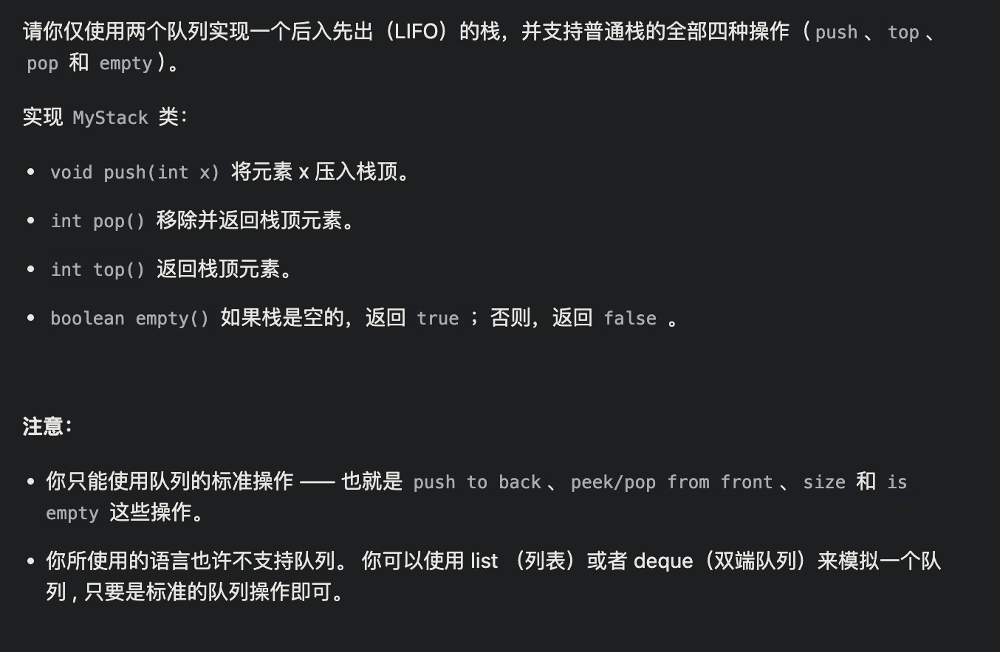

```java
class MyStack {
    Queue<Integer> queue1;
    Queue<Integer> queue2;
    Queue<Integer> queueTemp;

    public MyStack() {
        queue1 = new LinkedList<>();
        queue2 = new LinkedList<>();
    }
    
    public void push(int x) {
        queue1.offer(x);
    }
    
    public int pop() {
        while(queue1.size() > 1){
            queue2.offer(queue1.poll());
        }
        int res = queue1.poll();
        queueTemp = queue1;
        queue1 = queue2;
        queue2 = queueTemp;
        return res;
    }
    
    public int top() {
        int res = this.pop();
        queue1.offer(res);
        return res;
    }
    
    public boolean empty() {
        return queue1.isEmpty();
    }
}
```


# 20.有效的括号

https://leetcode.cn/problems/valid-parentheses/description/

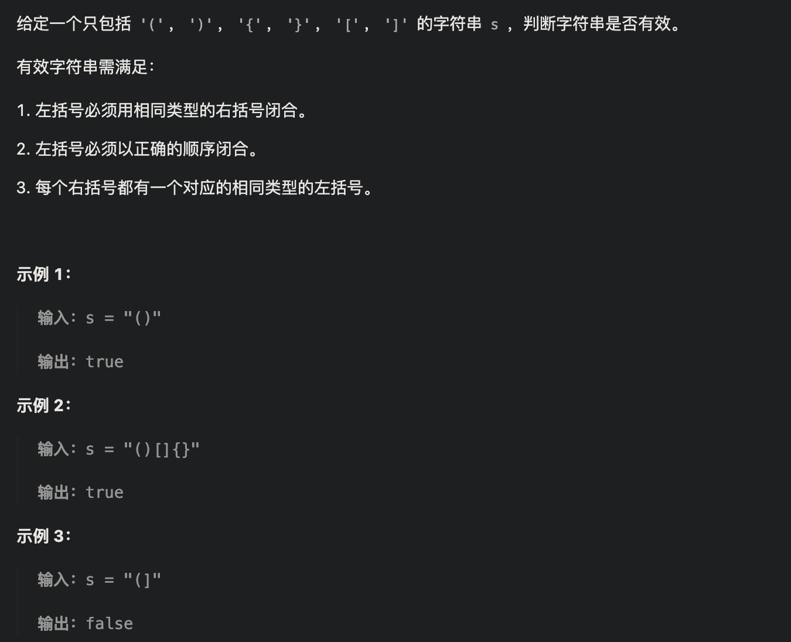

```java
class Solution {
    public boolean isValid(String s) {
        Stack<Character> stack = new Stack<>();
        HashMap<Character, Character> map = new HashMap<>();
        map.put(')', '(');
        map.put(']', '[');
        map.put('}', '{');
        for(int i = 0; i < s.length(); i++){
            char c = s.charAt(i);
            //是（{[
            if(!map.containsKey(c)){
                stack.push(c);
            }else{
                if(stack.isEmpty() || stack.peek() != map.get(c))
                    return false;
                else{
                    stack.pop();
                }
            }
        }
        return stack.isEmpty();
    }
}
```


# 1047.删除字符串中的所有相邻重复项

https://leetcode.cn/problems/remove-all-adjacent-duplicates-in-string/description/

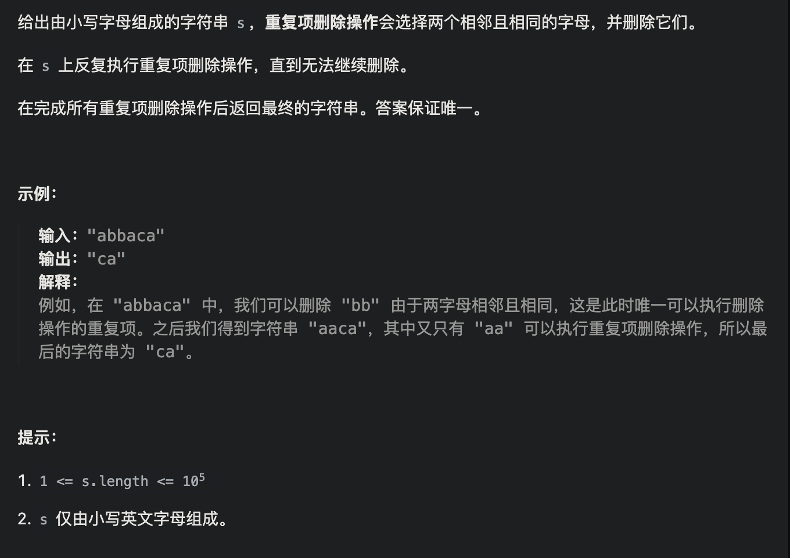

```java
class Solution {
    public String removeDuplicates(String s) {
        Stack<Character> stack = new Stack<>();
        for(int i = 0; i < s.length(); i++){
            char c = s.charAt(i);
            if(stack.isEmpty() || stack.peek() != c){
                stack.push(c);
            }else{
                stack.pop();
            }
        }
        String res = "";
        //用for遍历栈是从底部开始的
        for(char c : stack)
            res += c;
        return res;
    }
}
```


# 150.逆波兰表达式求值

https://leetcode.cn/problems/evaluate-reverse-polish-notation/description/

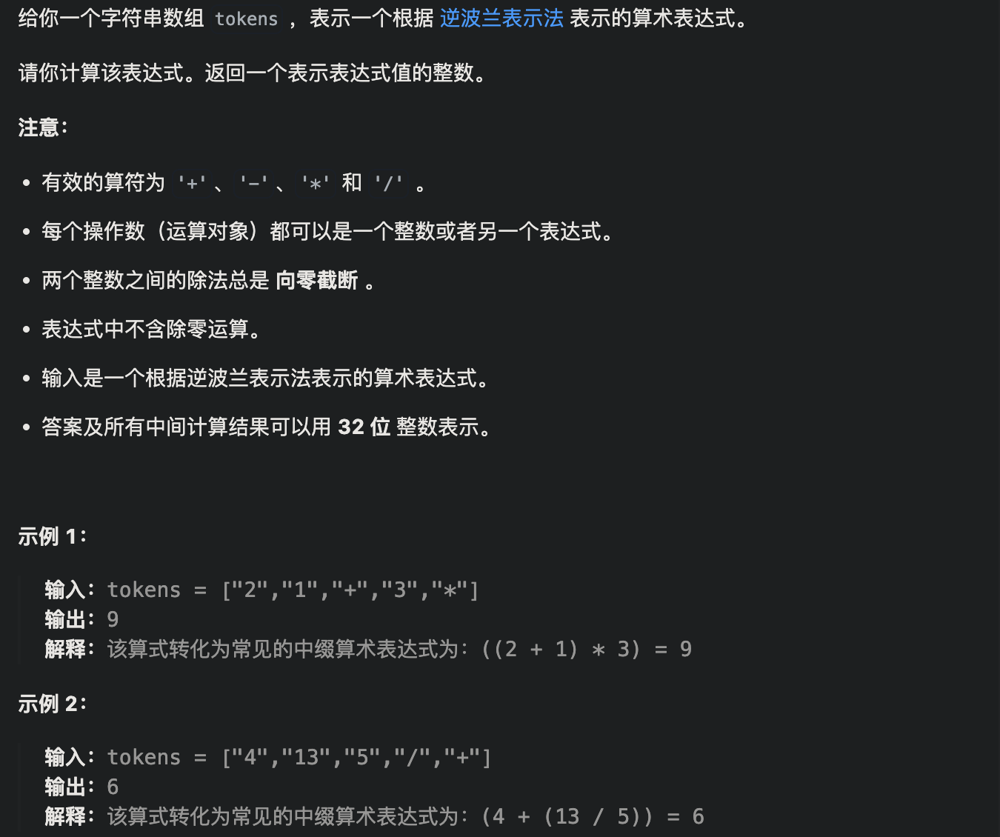

```java
class Solution {
    public int evalRPN(String[] tokens) {
        Stack<Integer> stack = new Stack<>();
        for(int i = 0;i < tokens.length;i++){
            String s = tokens[i];
            if(s.equals("+"))
                stack.push(stack.pop()+stack.pop());
            else if(s.equals("-"))
                stack.push(-stack.pop()+stack.pop());
            else if(s.equals("*"))
                stack.push(stack.pop()*stack.pop());
            else if(s.equals("/")){
                int temp1 = stack.pop();
                int temp2 = stack.pop();
                stack.push(temp2/temp1);
            }
            else
                stack.push(Integer.valueOf(s));
        }
        return stack.pop();
    }
}
```

# **239.△滑动窗口最大值

https://leetcode.cn/problems/sliding-window-maximum/description/

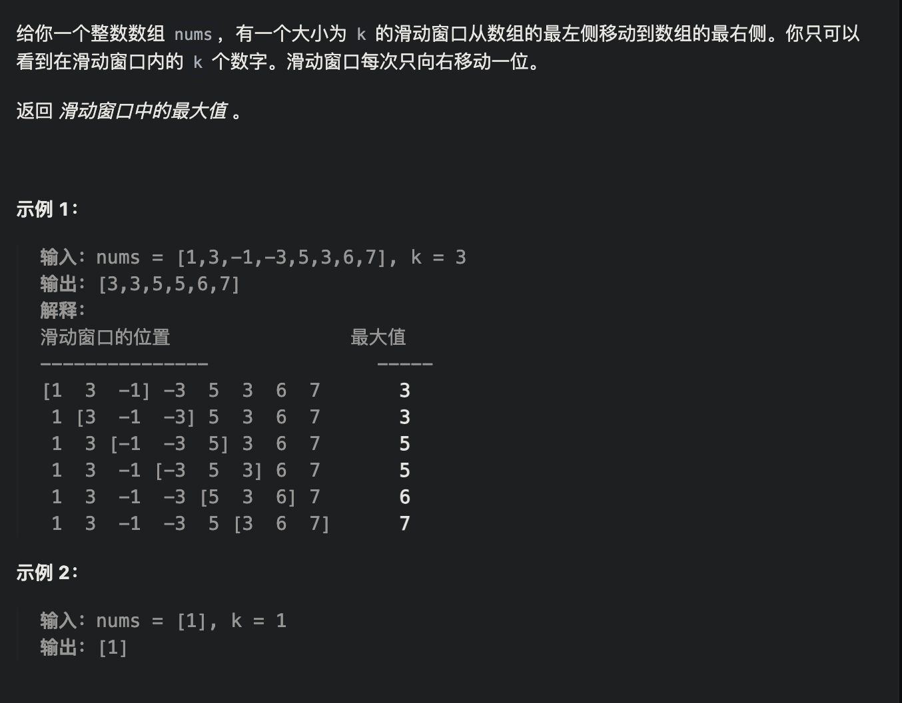

```java
class Solution {
    //自定义一个维护单调递减的队列
    public class MyQue{
      //双端队列才有队尾的api
        Deque<Integer> queue = new LinkedList<>();

        //新元素入队，弹出前面所有比它小的
        void offer(int num){
            while(!queue.isEmpty() && num > queue.getLast())
                queue.removeLast();
            queue.offer(num);
        }

        //旧元素出队，当它就是队首的最大元素时
      	//注意这里判断是必须有的
        void poll(int num){
            if(!queue.isEmpty() && num == queue.peek())
                queue.poll();
        }
        
        int getMax(){
            return queue.peek();
        }
    }
    public int[] maxSlidingWindow(int[] nums, int k) {
        MyQue myque = new MyQue();
        int len = nums.length - k + 1;
        int[] res = new int[len];
        int cnt = 0;
        //前k入队
        for(int i = 0; i < k; i++)
            myque.offer(nums[i]);
        res[cnt++] = myque.getMax();
        //后续入队
        for(int i = k; i < nums.length; i++){
          //这个顺序无所谓
            myque.poll(nums[i - k]);
            myque.offer(nums[i]);
            res[cnt++] = myque.getMax();
        }
        return res;
    }
}
```


# 347.前 K 个高频元素

https://leetcode.cn/problems/top-k-frequent-elements/

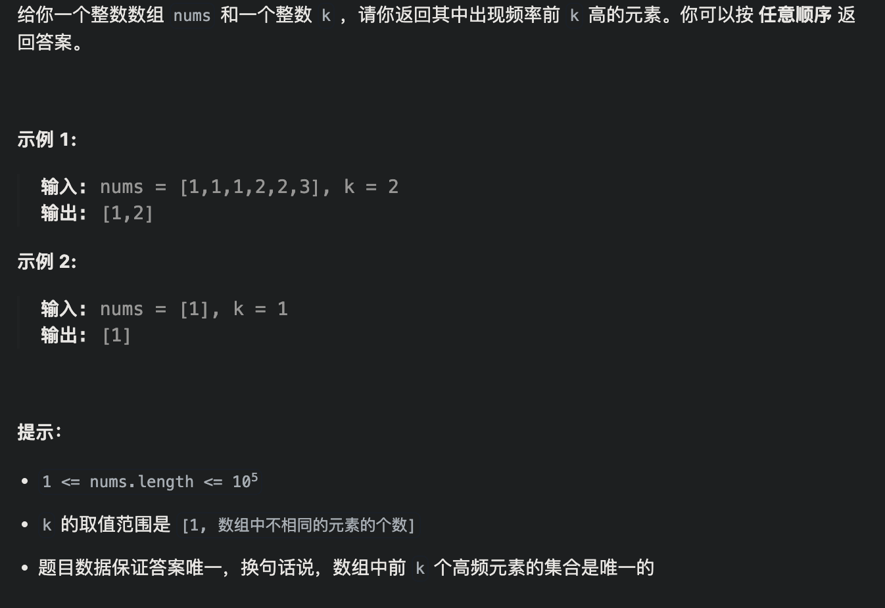

思路：用优先队列

```java
/*Comparator接口说明:
 * 返回负数，形参中第一个参数排在前面；返回正数，形参中第二个参数排在前面
 * (a, b) -> a-b 则为升序， 否则则是降序
 * 对于队列：排在前面意味着往队头靠
 * 对于堆（使用PriorityQueue实现）：从队头到队尾按从小到大排就是最小堆（小顶堆），
 *                                从队头到队尾按从大到小排就是最大堆（大顶堆）--->队头元素相当于堆的根节点
 * */
class Solution {
    //解法1：基于大顶堆实现
    public int[] topKFrequent1(int[] nums, int k) {
        Map<Integer,Integer> map = new HashMap<>(); //key为数组元素值,val为对应出现次数
        for (int num : nums) {
            map.put(num, map.getOrDefault(num,0) + 1);
        }
        //在优先队列中存储二元组(num, cnt),cnt表示元素值num在数组中的出现次数
        //出现次数按从队头到队尾的顺序是从大到小排,出现次数最多的在队头(相当于大顶堆)
        PriorityQueue<int[]> pq = new PriorityQueue<>((pair1, pair2) -> pair2[1] - pair1[1]);
        for(var set : map.entrySet()){
            pq.add(new int[]{set.getKey(), set.getValue()});
        }
        int[] ans = new int[k];
        for (int i = 0; i < k; i++) { //依次从队头弹出k个,就是出现频率前k高的元素
            ans[i] = pq.poll()[0];
        }
        return ans;
    }
```


# [**△394. 字符串解码](https://leetcode.cn/problems/decode-string/)

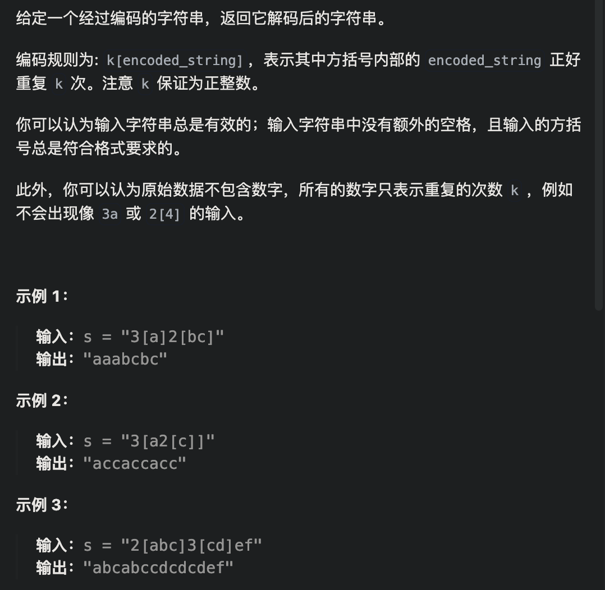

思路：一个计算栈，一个字符串栈。变量：当前重复次数k，当前字符串cur，【 入栈并重置， 】出栈并拼接，数字累计，字母拼接

```java
class Solution {
    public String decodeString(String s) {
        Stack<Integer> countStack = new Stack<>();
        Stack<String> stringStack = new Stack<>();
        //当前重复的次数
        int k = 0;
        //当前的字符串
        String currentString = "";
        for(char c : s.toCharArray()){
            if(c >= '0' && c <= '9'){
                k = k * 10 + c - '0';
            }else if(c == '['){
                //入栈
                countStack.push(k);
                stringStack.push(currentString);
                k = 0;
                currentString = "";
            }else if(c == ']'){
                StringBuilder sb = new StringBuilder(stringStack.pop());
                int times = countStack.pop();
                while(times-- > 0)
                    sb.append(currentString);
                currentString = sb.toString();
            }else{
                //普通英文字符，拼到当前字符串中
                currentString += c;
            }
        }
        return currentString;
    }
}
```


# [*155. 最小栈](https://leetcode.cn/problems/min-stack/)

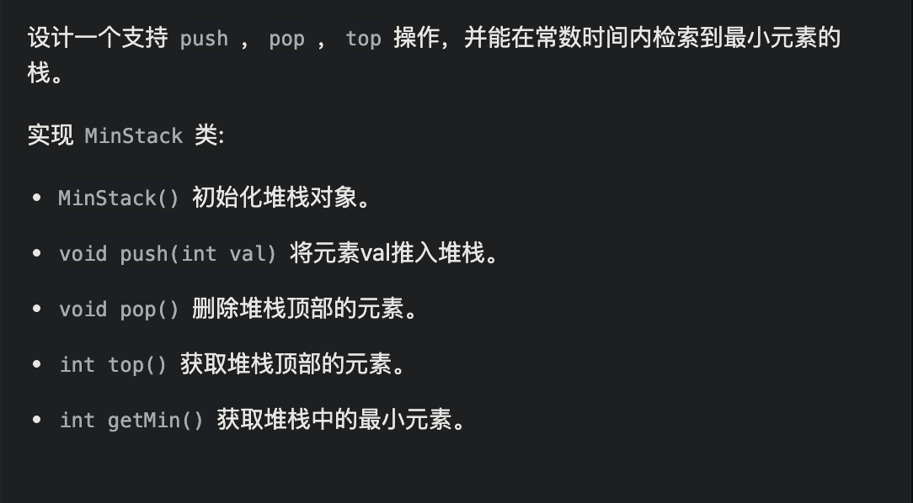

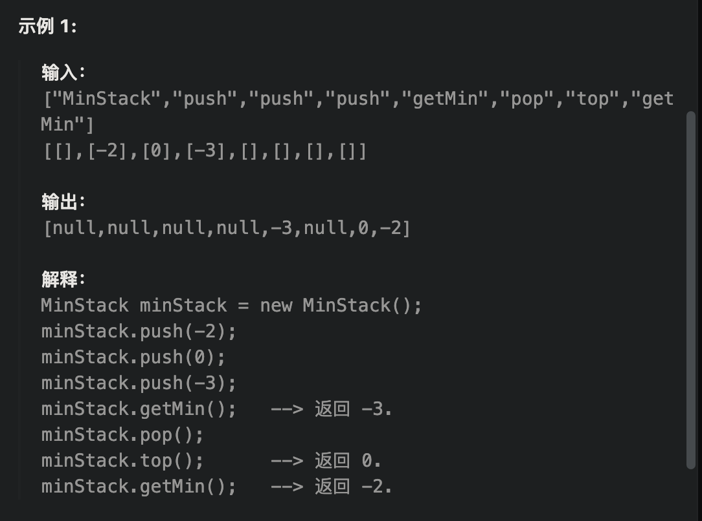

思路：维护两个stack，一个minstack只push比当前栈顶小的元素， pop时minstack只有栈顶元素和普通stackpop出来的一样才pop

```java
class MinStack {
    Stack<Integer> stack;
    //栈顶存最小的值
    Stack<Integer> minStack;

    public MinStack() {
        stack = new Stack<>();
        minStack = new Stack<>();
    }
    
    public void push(int val) {
        stack.push(val);
        if(minStack.isEmpty() || val <= minStack.peek())
            minStack.push(val);
    }
    
    public void pop() {
        if(stack.pop().equals(minStack.peek())){
            minStack.pop();
        }
    }
    
    public int top() {
        return stack.peek();
    }
    
    public int getMin() {
        return minStack.peek();
    }
}
```


# [227. 基本计算器 II](https://leetcode.cn/problems/basic-calculator-ii/)

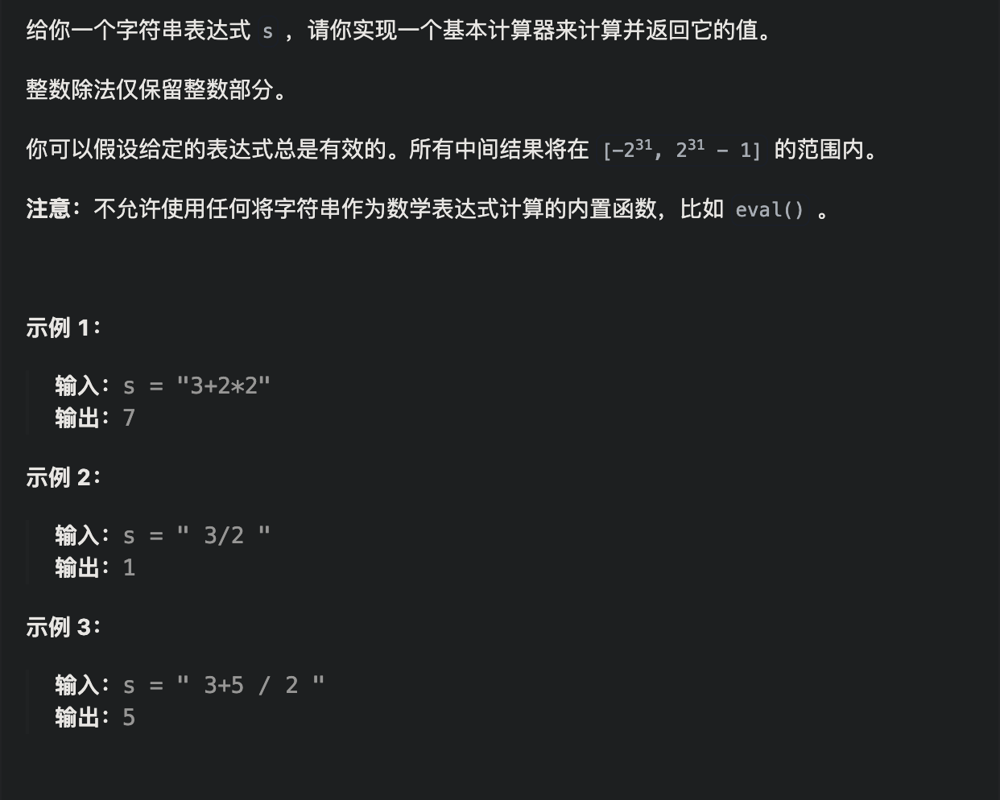

```java
import java.util.Stack;

//leetcode submit region begin(Prohibit modification and deletion)
class Solution {
    public int calculate(String s) {
        Stack<Integer> stack = new Stack<>();
        int num = 0;
        char preSign = '+';
        for (int i = 0; i < s.length(); i++) {
            char c = s.charAt(i);
            if (Character.isDigit(c))
                num = num * 10 + c - '0';
            if (!Character.isDigit(c) && c != ' ' || i == s.length() - 1) {
                if (preSign == '+')
                    stack.push(num);
                else if (preSign == '-')
                    stack.push(-num);
                else if (preSign == '*')
                    stack.push(stack.pop() * num);
                else
                    stack.push(stack.pop() / num);
                num = 0;
                preSign = c;
            }
        }
        int res = 0;
        for (int i = 0; i < stack.size(); i++) {
            res += stack.get(i);
            System.out.println(stack.get(i));
        }
        return res;
    }
}
//leetcode submit region end(Prohibit modification and deletion)

```


