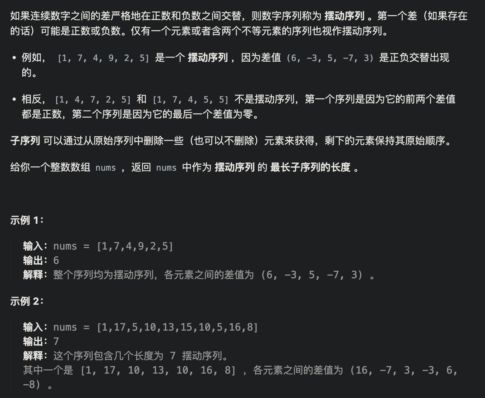

# [分发饼干](https://leetcode.cn/problems/assign-cookies/)


```java
// 思路1：优先考虑饼干，小饼干先喂饱小胃口
    public int findContentChildren(int[] g, int[] s) {
        Arrays.sort(g);
        Arrays.sort(s);
        int start = 0;
        int count = 0;
        for (int i = 0; i < s.length && start < g.length; i++) {
            if (s[i] >= g[start]) {
                start++;
                count++;
            }
        }
        return count;
    }
```


# [*摆动序列](https://leetcode.cn/problems/wiggle-subsequence/)




```java
class Solution {
    public int wiggleMaxLength(int[] nums) {
        if(nums.length <= 1)
            return nums.length;
        int res = 1;//末尾一定有一个波动（不一定是最后一个元素）
        int preDiff = 0;
        int curDiff = 0;
        for(int i = 0; i < nums.length - 1; i++){
            curDiff = nums[i+1] - nums[i];
            if((curDiff <0 && preDiff >=0) || (curDiff>0 && preDiff<=0)){
                res++;
                preDiff = curDiff;
            }
        }
        return res;
    }
}
```


# [☆最大子数组和](https://leetcode.cn/problems/maximum-subarray/)


```java
// DP 方法
class Solution {
    public int maxSubArray(int[] nums) {
        int[] dp = new int[nums.length];
        dp[0] = nums[0];
        int res = dp[0];

        for (int i = 1; i < nums.length; i++){
            dp[i] = Math.max(dp[i-1] + nums[i], nums[i]);
            res = Math.max(dp[i], res);
        }

        return res;
    }
}
```


# [☆跳跃游戏](https://leetcode.cn/problems/jump-game/)


```java
class Solution {
    public boolean canJump(int[] nums) {
        int len = nums.length;
        if(len == 1)   return true;
        int end = nums[0];
        for(int i = 0; i <= end; i++){
            end = Math.max(i + nums[i], end);
            if(end >= len - 1)
                return true;
        }
        return false;
    }
}
```


# [*跳跃游戏 II](https://leetcode.cn/problems/jump-game-ii/)


```java
class Solution {
    public int jump(int[] nums) {
        int len = nums.length;
        if(len == 1) return 0;
        int curEnd = 0;
        int nextEnd = 0;
        int res = 0;
        for(int i = 0; i < nums.length; i++){
            nextEnd = Math.max(nextEnd, nums[i] + i);
            if(i == curEnd){
                res++;
                curEnd = nextEnd;
                if(curEnd >= len - 1)
                    break;
            }
        }
        return res;
    }
}
```


# [K 次取反后最大化的数组和](https://leetcode.cn/problems/maximize-sum-of-array-after-k-negations/)


```java
class Solution {
    public int largestSumAfterKNegations(int[] nums, int k) {
        if (nums.length == 1) return nums[0];

        // 排序：先把负数处理了
        Arrays.sort(nums); 

        for (int i = 0; i < nums.length && k > 0; i++) { // 贪心点, 通过负转正, 消耗尽可能多的k
            if (nums[i] < 0) {
                nums[i] = -nums[i];
                k--;
            }
        }

        // 退出循环, k > 0 || k < 0 (k消耗完了不用讨论)
        if (k % 2 == 1) { // k > 0 && k is odd：对于负数：负-正-负-正
          //关键步骤：再次进行排序
            Arrays.sort(nums); // 再次排序得到剩余的负数，或者最小的正数
            nums[0] = -nums[0];
        }
        // k > 0 && k is even，flip数字不会产生影响: 对于负数: 负-正-负；对于正数：正-负-正 

        int sum = 0;
        for (int num : nums) { // 计算最大和
            sum += num;
        }
        return sum;
    }
}
```


# [**加油站](https://leetcode.cn/problems/gas-station/)


思路：
i从0开始累加rest[i]，和记为curSum，一旦curSum小于零，说明[0, i]区间都不能作为起始位置，因为这个区间选择任何一个位置作为起点，到i这里都会断油，那么起始位置从i+1算起，再从0计算curSum。

```java
class Solution {
    public int canCompleteCircuit(int[] gas, int[] cost) {
        int curSum = 0;
        int totalSum = 0;
        int start = 0;
        for(int i = 0; i < gas.length; i++){
            curSum += gas[i] - cost[i];
            totalSum += gas[i] - cost[i];
            if(curSum < 0){
                start = i + 1;
                curSum = 0;
            }
        }
        if(totalSum < 0) return -1;
        return start;
    }
}
```


# [*分发糖果](https://leetcode.cn/problems/candy/)


```java
class Solution {
    /**
         分两个阶段
         1、起点下标1 从左往右，只要 右边 比 左边 大，右边的糖果=左边 + 1
         2、起点下标 ratings.length - 2 从右往左， 只要左边 比 右边 大，此时 左边的糖果应该 取本身的糖果数（符合比它左边大） 和 右边糖果数 + 1 二者的最大值，这样才符合 它比它左边的大，也比它右边大
    */
    public int candy(int[] ratings) {
        int len = ratings.length;
        int[] candyVec = new int[len];
        candyVec[0] = 1;
        for (int i = 1; i < len; i++) {
            candyVec[i] = (ratings[i] > ratings[i - 1]) ? candyVec[i - 1] + 1 : 1;
        }

        for (int i = len - 2; i >= 0; i--) {
            if (ratings[i] > ratings[i + 1]) {
                candyVec[i] = Math.max(candyVec[i], candyVec[i + 1] + 1);
            }
        }

        int ans = 0;
        for (int num : candyVec) {
            ans += num;
        }
        return ans;
    }
}
```


# [柠檬水找零](https://leetcode.cn/problems/lemonade-change/)


```java
class Solution {
    public boolean lemonadeChange(int[] bills) {
        int five = 0;
        int ten = 0;
        //20不用维护
        for(int i = 0; i < bills.length; i++){
            if(bills[i] == 5){
                five++;
            }else if(bills[i] == 10){
                five--;
                ten++;
                if(five < 0)
                    return false;
            }else{
                if(ten >= 1 && five >= 1){
                    ten--;
                    five--;
                    continue;
                }
                if(five >= 3){
                    five -= 3;
                    continue;
                }
                return false;
            }
        }
        return true;
    }
}
```


# [*根据身高重建队列](https://leetcode.cn/problems/queue-reconstruction-by-height/)


思路：首先按身高从大到小排列，在身高相同的情况下，按前面的人数从小到大排列（前面人越少，放越前面），最后遍历排序后的数组按照前面的人数，放入list

```java
class Solution {
    public int[][] reconstructQueue(int[][] people) {
      //输入  [[7,0],[4,4],[7,1],[5,0],[6,1],[5,2]]
        // 身高从大到小排（身高相同k小的站前面）
        Arrays.sort(people, (a, b) -> {
            if (a[0] == b[0]) return a[1] - b[1];   // a - b 是升序排列，故在a[0] == b[0]的狀況下，會根據k值升序排列
            return b[0] - a[0];   //b - a 是降序排列，在a[0] != b[0]，的狀況會根據h值降序排列
        });
				//    [[7,0],[7,1],[6,1],[5,0],[5,2],[4,4]]
        List<int[]> list = new ArrayList<>();

        for (int[] p : people) {
            list.add(p[1],p);   //會將value插入到指定index裡。
        }
    	 插入[7,0]：[[7,0]]
		插入[7,1]：[[7,0],[7,1]]
		插入[6,1]：[[7,0],[6,1],[7,1]]
		插入[5,0]：[[5,0],[7,0],[6,1],[7,1]]
		插入[5,2]：[[5,0],[7,0],[5,2],[6,1],[7,1]]
		插入[4,4]：[[5,0],[7,0],[5,2],[6,1],[4,4],[7,1]]
        return list.toArray(new int[people.length][]);
    }
}

```


# [用最少数量的箭引爆气球](https://leetcode.cn/problems/minimum-number-of-arrows-to-burst-balloons/)


```java
import java.util.Arrays;

//leetcode submit region begin(Prohibit modification and deletion)
class Solution {
    public int findMinArrowShots(int[][] points) {
        Arrays.sort(points, (p1, p2) -> {return Integer.compare(p1[0], p2[0]);});
        int res = 1;
        int end = points[0][1];
        for (int i = 1; i < points.length; i++) {
            if(points[i][0] <= end){
                end = Math.min(end, points[i][1]);
            }else{
                res++;
                end = points[i][1];
            }
        }
        return res;
    }
}
//leetcode submit region end(Prohibit modification and deletion)

```


# [无重叠区间](https://leetcode.cn/problems/non-overlapping-intervals/)


思路：找到不重复的区间数，让后总区间数减去不重复的区间数

```java
class Solution {
    public int eraseOverlapIntervals(int[][] intervals) {
        int cnt = 1;
        Arrays.sort(intervals, (a, b) -> {return Integer.compare(a[0], b[0]);});
        int end = intervals[0][1];
        for (int i = 1; i < intervals.length; i++) {
            if(intervals[i][0] < end)
                end = Math.min(end, intervals[i][1]);
            else{
                cnt++;
                end = intervals[i][1];
            }
        }
        return intervals.length - cnt;
    }
}

//runtime:50 ms
//memory:98.7 MB

```


# [*划分字母区间](https://leetcode.cn/problems/partition-labels/)


思路：

关键：每个相同的字母都要放在同一个片段

- 统计每一个字符最后出现的位置
- 从头遍历字符，并更新字符的最远出现下标，如果找到字符最远出现位置下标和当前下标相等了，则找到了分割点

```java
class Solution {
    public List<Integer> partitionLabels(String s) {
        List<Integer> res = new ArrayList<>();
        int[] end = new int[26];//记录每个字母最后一次出现的下标
        for(int i = 0; i < s.length(); i++){
            end[s.charAt(i) - 'a'] = i;
        }
        int maxEnd = 0;
        int start = 0;
        for(int i = 0; i < s.length(); i++){
            maxEnd = Math.max(maxEnd, end[s.charAt(i) - 'a']);
            if(i == maxEnd){
                res.add(maxEnd - start + 1);
                start = maxEnd + 1;
            }
        }
        return res;
    }
}
```


# [合并区间](https://leetcode.cn/problems/merge-intervals/)


```java
class Solution {
    public int[][] merge(int[][] intervals) {
        List<int[]> res = new ArrayList<>();
        Arrays.sort(intervals, (a,b) -> Integer.compare(a[0], b[0]));
        int start = intervals[0][0];
        int end = intervals[0][1];
        int cnt = 1;
        for(int i = 1; i < intervals.length; i++){
            if(intervals[i][0] > end){
                res.add(new int[]{start, end});
                cnt++;
                start = intervals[i][0];
                end = intervals[i][1];
            }else{
                intervals[i][1] = Math.max(intervals[i][1], end);
                end = intervals[i][1];
            }
        }
        res.add(new int[]{start, end});
        return res.toArray(new int[cnt][]);
    }
    
}
```


# [*单调递增的数字](https://leetcode.cn/problems/monotone-increasing-digits/)


```java
class Solution {
    //思路：找到不满足单调递增的最左一位，让其减1，然后右边的都改成9
    public int monotoneIncreasingDigits(int n) {
        char[] c = String.valueOf(n).toCharArray();
        int start = c.length;
        for(int i = c.length - 2; i >= 0; i--){
            if(c[i] > c[i+1]){
                c[i]--;
                start = i + 1;
            }
        }
        for(int i = start; i < c.length; i++)
            c[i] = '9';
        return Integer.parseInt(String.valueOf(c));
    }
}
```


# [470. 用 Rand7() 实现 Rand10()](https://leetcode.cn/problems/implement-rand10-using-rand7/)


```java
class Solution extends SolBase {
    public int rand10() {
        int num = (rand7() - 1) * 7 + rand7();
        while (true){
            // 1-49
            if(num <= 40){
                return num % 10 + 1;
            }
            num = (rand7() - 1) * 7 + rand7();
        }
    }
}
```

