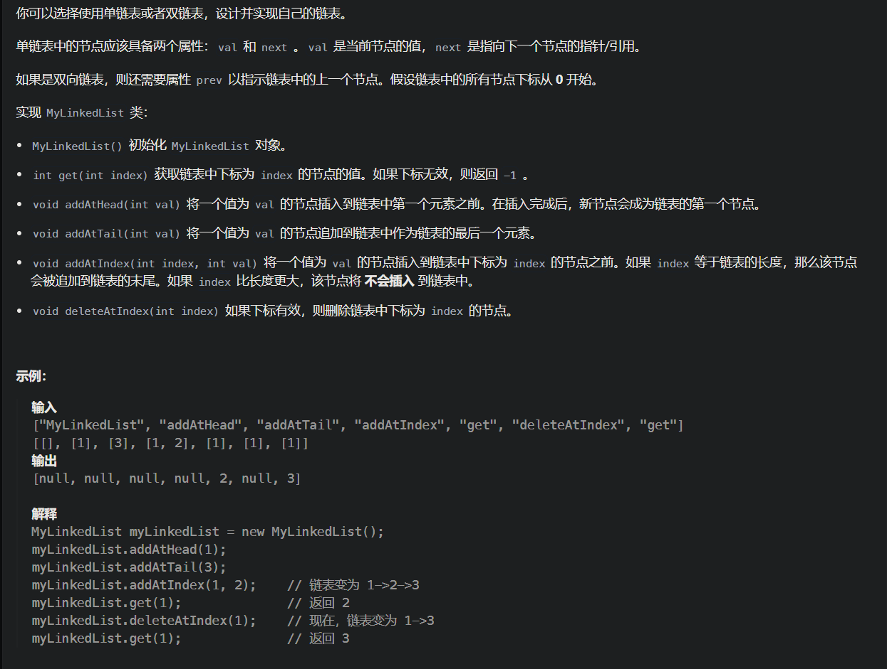
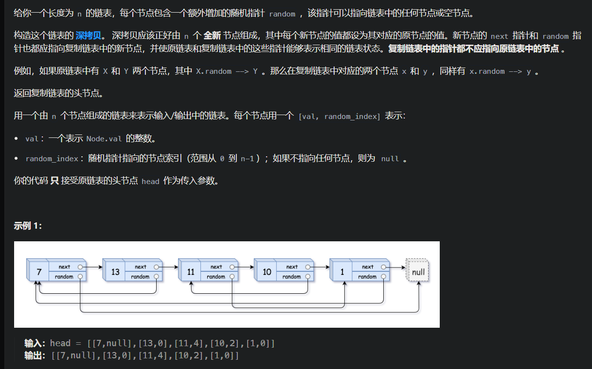
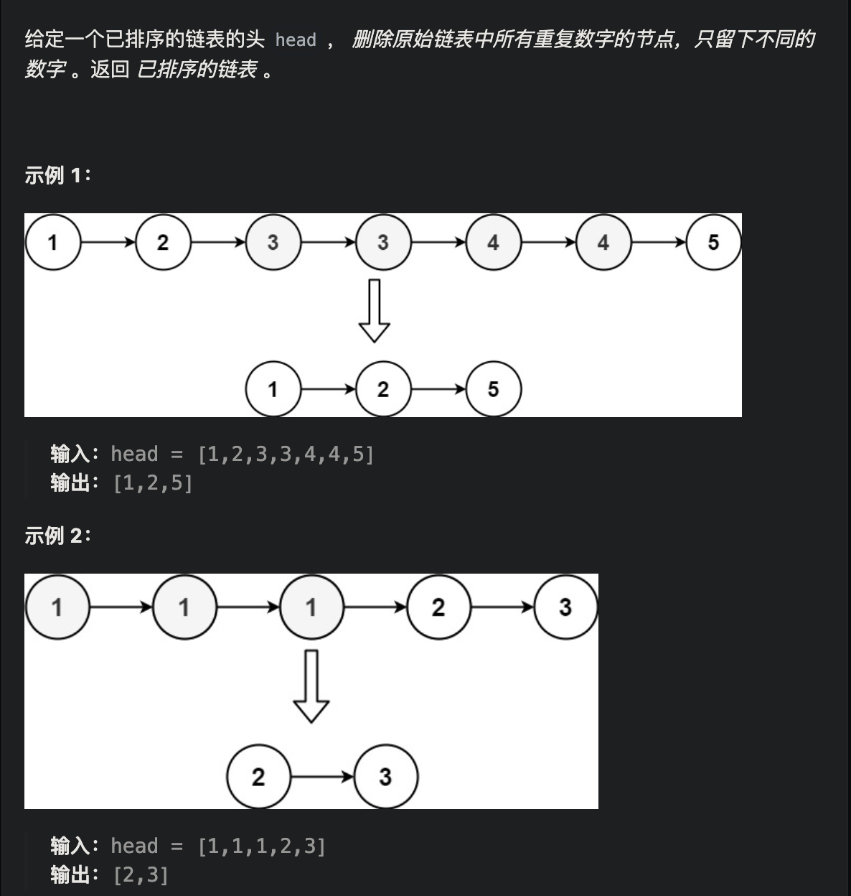

# 移除链表元素

https://leetcode.cn/problems/remove-linked-list-elements/description/


```java
class Solution {
    public ListNode removeElements(ListNode head, int val) {
        if(head == null)
            return head;
        ListNode dummy = new ListNode(-1,head);
        ListNode pre = dummy;
        ListNode cur = head;
        while(cur != null){
            if(cur.val == val){
                pre.next = cur.next;
            }else{
                pre =cur;
            }
            cur = cur.next;
        }
        return dummy.next;
    }
}
```


# 设计链表

https://leetcode.cn/problems/design-linked-list/description/



```java
class ListNode{
        int val;
        ListNode next;
        ListNode(){};
        ListNode(int val){
            this.val = val;
        }
    }

class MyLinkedList {
    int size;
    ListNode dummy;

    public MyLinkedList() {
        size = 0;
        dummy = new ListNode();
    }
    
    public int get(int index) {
        if(index <0 || index>size-1)
            return -1;
        ListNode cur =dummy;
        while(index-->0){
            cur = cur.next;
        }
        return cur.next.val;
    }
    
    public void addAtHead(int val) {
        addAtIndex(0,val);
    }
    
    public void addAtTail(int val) {
        addAtIndex(size,val);
    }
    
    public void addAtIndex(int index, int val) {
        if(index<0 || index>size)
            return;
        ListNode cur = dummy;
        ListNode newNode = new ListNode(val);
        while(index-->0){
            cur = cur.next;
        }
        newNode.next = cur.next;
        cur.next = newNode;
        size++;
    }
    
    public void deleteAtIndex(int index) {
        if(index <0 || index>=size)
            return;
        ListNode cur = dummy;
        while(index-->0){
            cur = cur.next;
        }
        cur.next = cur.next.next;
        size--;
    }
}
```


# ☆反转链表

https://leetcode.cn/problems/reverse-linked-list/description/


```java
class Solution {
    public ListNode reverseList(ListNode head) {
        ListNode pre = null;
        ListNode temp = null;
        ListNode cur = head;
        while(cur != null){
            temp = cur.next;
            cur.next = pre;
            pre = cur;
            cur = temp;
        }
        return pre;
    }
}
```

递归的方式

```java
class Solution {
    public ListNode reverseList(ListNode head) {
        if (head == null || head.next == null) {
            return head;
        }
        ListNode newHead = reverseList(head.next);
        head.next.next = head;
        head.next = null;
        return newHead;
    }
}
```


# [92. 反转链表 II](https://leetcode.cn/problems/reverse-linked-list-ii/)


```java
//leetcode submit region begin(Prohibit modification and deletion)
/**
 * Definition for singly-linked list.
 * public class ListNode {
 *     int val;
 *     ListNode next;
 *     ListNode() {}
 *     ListNode(int val) { this.val = val; }
 *     ListNode(int val, ListNode next) { this.val = val; this.next = next; }
 * }
 */
class Solution {
    public ListNode reverseBetween(ListNode head, int left, int right) {
        ListNode dummy = new ListNode();
        dummy.next = head;
        ListNode preStart = dummy;
        ListNode end = dummy;
        while (left -- > 1) preStart = preStart.next;
        while (right -- > 0) end = end.next;
        ListNode start = preStart.next;
        ListNode posEnd = end.next;
        preStart.next = null;
        end.next = null;
        reverse(start);
        preStart.next = end;
        start.next = posEnd;
        return dummy.next;
    }

    void reverse(ListNode head){
        if(head == null || head.next == null) return;
        reverse(head.next);
        head.next.next = head;
        head = null;
    }
}
//leetcode submit region end(Prohibit modification and deletion)

```


# [☆链表的中间结点](https://leetcode.cn/problems/middle-of-the-linked-list/)


```java
class Solution {
    public ListNode middleNode(ListNode head) {
        ListNode slow = head;
        ListNode fast = head.next;
        while(fast != null && fast.next != null){
            slow = slow.next;
            fast = fast.next.next;
        }
        //奇数：slow指向中间节点，  偶数：slow指向中间靠左的结点
        return slow;
    }
}
```

```java
class Solution {
    public ListNode middleNode(ListNode head) {
        ListNode slow = head;
        ListNode fast = head;
        while(fast != null && fast.next != null){
            slow = slow.next;
            fast = fast.next.next;
        }
        //奇数：slow指向中间节点，  偶数：slow指向中间靠右的结点
        return slow;
    }
}
```

区别在于初始化的fast的位置

# **24.两两交换链表中的节点

https://leetcode.cn/problems/swap-nodes-in-pairs/description/


建议使用虚拟头结点，这样会方便很多，要不然每次针对头结点（没有前一个指针指向头结点），还要单独处理。

每次进行交换操作，cur都在要交换的第一个结点之前


```java
class Solution {
    public ListNode swapPairs(ListNode head) {
        ListNode dummy = new ListNode(-1, head);
        ListNode node0 = dummy;
        ListNode node1 = head;
        while(node1 != null && node1.next != null){
            ListNode node2 = node1.next;
            ListNode node3 = node2.next;
            node0.next = node2;
            node2.next = node1;
            node1.next = node3;
            node0 = node1;
            node1 = node3;
        }
        return dummy.next;
    }
}
```


# 删除链表的倒数第N个节点

https://leetcode.cn/problems/remove-nth-node-from-end-of-list/description/


```java
class Solution {
    public ListNode removeNthFromEnd(ListNode head, int n) {
        ListNode dummy = new ListNode(0, head);
        ListNode fast = dummy;
        ListNode slow = dummy;
        //这里fast要先移动n+1个，才能保证slow是倒数第n结点的前一个，方便删除
        for(int i = 0;i <= n;i++){
            fast = fast.next;
        }
        while(fast != null){
            fast = fast.next;
            slow = slow.next;
        }
        //slow指向倒数第n个结点的前一个结点
        if(slow.next != null)
            slow.next = slow.next.next;
        return dummy.next;
    }
}
```

# 160.链表相交

https://leetcode.cn/problems/intersection-of-two-linked-lists-lcci/description/


```java
public class Solution {
    public ListNode getIntersectionNode(ListNode headA, ListNode headB) {
        ListNode curA = headA;
        ListNode curB = headB;
        int lenA = 0;
        int lenB = 0;
        while(curA != null){
            lenA++;
            curA = curA.next;
        }
        while(curB != null){
            lenB++;
            curB = curB.next;
        }
        curA = headA;
        curB = headB;
        //将CurA指向较长的那个链表
        if(lenA < lenB){
            ListNode temp = curA;
            curA = curB;
            curB = temp;
        }
        //计算出两个链表的长度之差，并让A先走这个差
        int diff = Math.abs(lenA - lenB);
        while(diff-- >0)
            curA = curA.next;
        while(curA != null){
            if(curA == curB)
                return curA;
            curA = curA.next;
            curB = curB.next;
        }
        return null;
    }
}
```


# *142.环形链表II

https://leetcode.cn/problems/linked-list-cycle-ii/description/


```java
public class Solution {
    public ListNode detectCycle(ListNode head) {
        if(head == null)
            return null;
        ListNode fast = head;
        ListNode slow = head;
        //终止条件代表无环
        while(fast != null && fast.next != null){
            fast = fast.next.next;
            slow = slow.next;
            //若有环，总会有相遇的时候
            if(slow == fast){
                slow = head;
                //开始找入口
                while(slow != fast){
                    slow = slow.next;
                    fast = fast.next;
                }
                return fast;
            }
        }
        return null;
    }
}
```


# [△234. 回文链表](https://leetcode.cn/problems/palindrome-linked-list/)


思路：找到中间节点，然后翻转后半段链表，最后两段链表同时遍历判断

```java
class Solution {
    public boolean isPalindrome(ListNode head) {
        ListNode mid = findMidListNode(head);
        ListNode head2 = reverseList(mid);
        while(head2 != null){
            if(head.val != head2.val)
                return false;
            head = head.next;
            head2 = head2.next;
        }
        return true;
    }

    ListNode findMidListNode(ListNode head){
        ListNode slow = head;
        ListNode fast = head;
        while(fast != null && fast.next != null){
            slow = slow.next;
            fast = fast.next.next;
        }
        //奇数：slow指向中间节点，  偶数：slow指向中间靠右的结点
        return slow;
    }

    ListNode reverseList(ListNode head){
        if (head == null || head.next == null) {
            return head;
        }
        ListNode newHead = reverseList(head.next);
        head.next.next = head;
        head.next = null;
        return newHead;
    }
}
```


# [**21. 合并两个有序链表](https://leetcode.cn/problems/merge-two-sorted-lists/)


递归

```java
class Solution {
    public ListNode mergeTwoLists(ListNode l1, ListNode l2) {
        if (l1 == null) {
            return l2;
        } else if (l2 == null) {
            return l1;
        } else if (l1.val < l2.val) {
            l1.next = mergeTwoLists(l1.next, l2);
            return l1;
        } else {
            l2.next = mergeTwoLists(l1, l2.next);
            return l2;
        }
    }
}
```


# [*2. 两数相加](https://leetcode.cn/problems/add-two-numbers/)


```java
class Solution {
    public ListNode addTwoNumbers(ListNode l1, ListNode l2) {
        ListNode dummy = new ListNode();
        ListNode cur = dummy;
        int carry = 0;
        while(l1 != null || l2 != null || carry == 1){
            int a = l1 != null ? l1.val :0;
            int b = l2 != null ? l2.val :0;
            int sum = a + b + carry;
            cur.next = new ListNode(sum % 10);
            cur = cur.next;
            carry = sum / 10;
            if(l1 != null) l1 = l1.next;
            if(l2 != null) l2 = l2.next;
        }
        return dummy.next;
    }
}
```


# [*△25. K 个一组翻转链表](https://leetcode.cn/problems/reverse-nodes-in-k-group/)


```java
//leetcode submit region begin(Prohibit modification and deletion)
/**
 * Definition for singly-linked list.
 * public class ListNode {
 *     int val;
 *     ListNode next;
 *     ListNode() {}
 *     ListNode(int val) { this.val = val; }
 *     ListNode(int val, ListNode next) { this.val = val; this.next = next; }
 * }
 */
class Solution {
    public ListNode reverseKGroup(ListNode head, int k) {
        ListNode dummy = new ListNode(-1, head);
        ListNode pre = dummy;
        ListNode end = dummy;
        ListNode start = dummy;
        while (end != null){
            for (int i = 0; i < k && end != null; i++) {
              end = end.next;
            }
            if(end == null) break;
            ListNode next = end.next;
            end.next = null;
            start = pre.next;
            pre.next = reverse(start);
            start.next = next;
            pre = start;
            end = start;
        }
        return dummy.next;
    }

    ListNode reverse(ListNode head){
        if(head == null || head.next == null) return head;
        ListNode newHead = reverse(head.next);
        head.next.next = head;
        head.next = null;
        return newHead;
    }

}
//leetcode submit region end(Prohibit modification and deletion)

```


# [138. 随机链表的复制](https://leetcode.cn/problems/copy-list-with-random-pointer/)



遍历两次链表：第一次是为了创建所有节点并存储在哈希表中；第二次则是为了设置这些新节点的 next 和 random 指针

```java
class Solution {
    public Node copyRandomList(Node head) {
        if(head == null) return head;
        HashMap<Node, Node> map = new HashMap<>();
        Node cur = head;
        while(cur != null){
            map.put(cur, new Node(cur.val));
            cur = cur.next;
        }
        cur = head;
        while (cur != null){
            Node newNode = map.get(cur);
            Node random = map.get(cur.random);
            Node next = map.get(cur.next);
            newNode.random = random;
            newNode.next = next;
            cur = cur.next;
        }
        return map.get(head);
    }
}
```


# [***148. 排序链表](https://leetcode.cn/problems/sort-list/)


```java
class Solution {
    public ListNode sortList(ListNode head) {
      //注意head.next也要判断
        if(head == null || head.next == null) return head;
        ListNode mid = findMid(head);
        ListNode head2 = mid.next;
        //断开两段链表
        mid.next = null;
        //分别排序
        ListNode left = sortList(head);
        ListNode right = sortList(head2);
        //合并两段，记录res
        ListNode res = new ListNode();
        ListNode cur = res;
        while(left != null && right != null){
            if(left.val < right.val) {
                cur.next = left;
                left = left.next;
            }else{
                cur.next = right;
                right = right.next;
            }
            cur = cur.next;
        }
        cur.next = left == null ? right : left;
        return res.next;
    }
    public ListNode findMid(ListNode head){
        ListNode slow = head;
        ListNode fast = head.next;
        while(fast != null && fast.next != null){
            slow = slow.next;
            fast = fast.next.next;
        }
        return slow;
    }
}
```


# [*23. 合并 K 个升序链表](https://leetcode.cn/problems/merge-k-sorted-lists/)


```java
class Solution {
    public ListNode mergeKLists(ListNode[] lists) {
        int k = lists.length;
        ListNode dummy = new ListNode();
        ListNode cur = dummy;
        while(true){
            ListNode minNode = null;
            int minPointer = -1;
            //找到k个链表当前遍历到的最小的那个结点以及那个链表在数组中的下标
            for(int i = 0; i < k; i++){
                if(lists[i] == null) continue;
                if(minNode == null || lists[i].val < minNode.val){
                    minNode = lists[i];
                    minPointer = i;
                }
            }
            //所有链表都遍历到头了则退出大循环
            if(minPointer == -1) break;
            cur.next = minNode;
            cur = cur.next;
            //最小结点的链表向后移动一个结点
            lists[minPointer] = lists[minPointer].next;
        }
        return dummy.next;
    }
}
```


# [*146. LRU 缓存](https://leetcode.cn/problems/lru-cache/)


哈希表存储key和链表之间的映射关系

get和put要O(1) 说明要使用双向链表

```java
public class LRUCache {
    class DLinkedNode {
        int key;
        int value;
        DLinkedNode prev;
        DLinkedNode next;
        public DLinkedNode() {}
        public DLinkedNode(int _key, int _value) {key = _key; value = _value;}
    }

    private Map<Integer, DLinkedNode> cache = new HashMap<Integer, DLinkedNode>();
  	//size维护当前缓存中结点数量
    private int size;
    private int capacity;
    private DLinkedNode head, tail;

    public LRUCache(int capacity) {
        this.size = 0;
        this.capacity = capacity;
        // 使用伪头部和伪尾部节点
        head = new DLinkedNode();
        tail = new DLinkedNode();
        head.next = tail;
        tail.prev = head;
    }

    public int get(int key) {
        DLinkedNode node = cache.get(key);
        if (node == null) {
            return -1;
        }
        // 如果 key 存在，先通过哈希表定位，再移到头部（最近使用）
      	// moveToHead实现：先删除当前节点，再加入到头结点
        moveToHead(node);
        return node.value;
    }

    public void put(int key, int value) {
        DLinkedNode node = cache.get(key);
        if (node == null) {
            // 如果 key 不存在，创建一个新的节点
            DLinkedNode newNode = new DLinkedNode(key, value);
            // 添加进哈希表
            cache.put(key, newNode);
            // 添加至双向链表的头部
            addToHead(newNode);
            ++size;
            if (size > capacity) {
                // 如果超出容量，删除双向链表的尾部节点
                DLinkedNode tail = removeTail();
                // 删除哈希表中对应的项
                cache.remove(tail.key);
                --size;
            }
        }
        else {
            // 如果 key 存在，先通过哈希表定位，再修改 value，并移到头部
            node.value = value;
            moveToHead(node);
        }
    }

    private void addToHead(DLinkedNode node) {
        node.prev = head;
        node.next = head.next;
        head.next.prev = node;
        head.next = node;
    }

    private void removeNode(DLinkedNode node) {
        node.prev.next = node.next;
        node.next.prev = node.prev;
    }

    private void moveToHead(DLinkedNode node) {
        removeNode(node);
        addToHead(node);
    }

    private DLinkedNode removeTail() {
        DLinkedNode res = tail.prev;
        removeNode(res);
        return res;
    }
}
```


# [143. 重排链表](https://leetcode.cn/problems/reorder-list/)


```java
//leetcode submit region begin(Prohibit modification and deletion)
/**
 * Definition for singly-linked list.
 * public class ListNode {
 *     int val;
 *     ListNode next;
 *     ListNode() {}
 *     ListNode(int val) { this.val = val; }
 *     ListNode(int val, ListNode next) { this.val = val; this.next = next; }
 * }
 */
class Solution {
    public void reorderList(ListNode head) {
        ListNode midNode = getMid(head);
        ListNode head2 = reverse(midNode.next);
        midNode.next = null;
        // 1-2-3
        // 5-4
        ListNode p1 = head;
        ListNode p2 = head2;
        while (p1 != null && p2 != null) {
            ListNode temp1 = p1.next;
            ListNode temp2 = p2.next;
            p1.next = p2;
            p2.next = temp1;
            p1 = temp1;
            p2 = temp2;
        }
    }

    ListNode getMid(ListNode head){
        ListNode slow = head;
        ListNode fast = head.next;
        while (fast != null && fast.next != null){
            slow = slow.next;
            fast = fast.next.next;
        }
        return slow;
    }

    ListNode reverse(ListNode head){
        if(head == null || head.next == null) return head;
        ListNode newHead = reverse(head.next);
        head.next.next = head;
        head.next = null;
        return newHead;
    }
}
//leetcode submit region end(Prohibit modification and deletion)

```


# [82. 删除排序链表中的重复元素 II](https://leetcode.cn/problems/remove-duplicates-from-sorted-list-ii/)



```java
class Solution {
    public ListNode deleteDuplicates(ListNode head) {
        ListNode dummy = new ListNode(-1, head);
        ListNode slow = dummy;
        ListNode fast = head;

        while (fast != null) {
            // 如果当前节点有重复（直到 cur.next 不等于当前值）
            if (fast.next != null && fast.val == fast.next.val) {
                // 跳过所有重复节点
                while (fast.next != null && fast.val == fast.next.val) {
                    fast = fast.next;
                }
                slow.next = fast.next; // 直接跳过这段重复
            } else {
                slow = slow.next; // 当前是独特节点，移动 pre
            }
            fast = fast.next;
        }

        return dummy.next;
    }
}
```

