# MySql

## 1.数据库层面发生死锁怎么办？

事务 A、事务 B 交叉持有锁

```sql
-- 事务 A
BEGIN;
UPDATE orders SET amount = 500 WHERE id = 1; -- 锁住 `id = 1`
UPDATE orders SET amount = 300 WHERE id = 2; -- 等待 `id = 2`

-- 事务 B
BEGIN;
UPDATE orders SET amount = 400 WHERE id = 2; -- 锁住 `id = 2`
UPDATE orders SET amount = 600 WHERE id = 1; -- 等待 `id = 1`

```

解决方法：
保持固定的加锁顺序：事务 A 和 事务 B 都按 `先锁 T1 再锁 T2` 进行操作


## 2.Sharding-Sphere分库分表的数据源存在什么地方？

### 核心原理

- SQL 解析

  - ```sql
    SELECT * FROM user WHERE user_id = 123;
    ```

  - ```
    表名: user
    查询条件: user_id = 123
    ```

- 分库分表路由

  - ```sql
    databaseShardingAlgorithm: user_id % 2
    tableShardingAlgorithm: user_id % 4
    ```

  - ```
    user_id=123：
    
    数据库：user_db_1
    
    表：user_table_3
    ```

- SQL 改写

  - ```
    SELECT * FROM user_table_3 WHERE user_id = 123;
    ```

- SQL 执行

  - 并行执行 SQL，提高性能

- 结果合并

  - **如果 SQL 查询涉及多个分片，ShardingSphere 需要合并结果**, 举个例子

  - ```sql
    SELECT COUNT(*) FROM user;
    ```

  - ```sql
    COUNT(user_db_0.user_table_0) + COUNT(user_db_0.user_table_1) + COUNT(user_db_1.user_table_2) + COUNT(user_db_1.user_table_3)
    ```

### 数据源配置

```yaml
spring:
  shardingsphere:
    datasource:
      names: ds0, ds1  # 数据源名称
      ds0:
        type: com.zaxxer.hikari.HikariDataSource
        jdbc-url: jdbc:mysql://127.0.0.1:3306/user_db_0
        username: root
        password: 123456
      ds1:
        type: com.zaxxer.hikari.HikariDataSource
        jdbc-url: jdbc:mysql://127.0.0.1:3306/user_db_1
        username: root
        password: 123456

```


### 分库分表场景下如何生成全局唯一主键？

> **分库分表之后，每张表只能看到“自己那一部分数据”，不能用自增主键。必须使用分布式主键生成方案。**

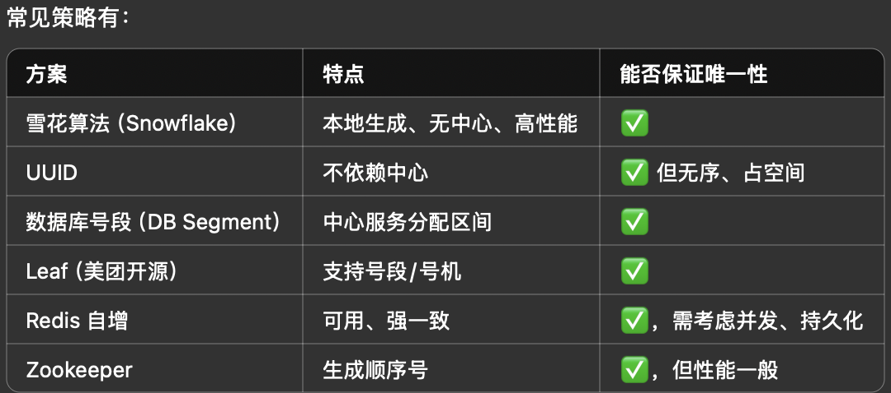


### 怎么保证雪花算法的唯一性？

雪花算法id

```
[ 1bit | 41bit时间戳 | 10bit机器+数据中心ID | 12bit序列号 ]
```

​	•	1 bit：最高位固定为 0（正数）

​	•	41 bit：当前**时间戳**（毫秒）— 可用约 69 年

​	•	10 bit：**机器 ID**（5 bit 机房ID + 5 bit 机器ID）— 最多支持 1024 台节点

​	•	12 bit：**每毫秒内的自增序列** — 支持每台机器每毫秒生成 4096 个 ID


**只要每台机器 ID 不冲突，时间有序，序列号在一个毫秒内不重复，就能全局唯一。**


## 3.索引中能不能有 NULL？NULL 与其他值比较会怎样？


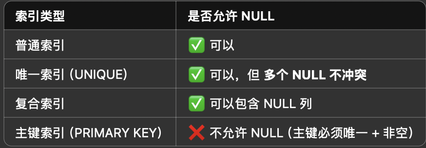


> 索引中是可以包含 NULL 值的，普通索引和唯一索引都允许，只要主键不允许。

> 由于 SQL 中 NULL != NULL，所以多个 NULL 插入唯一索引不会冲突。

> 判断 NULL 不能用 = NULL，要用 IS NULL；否则可能导致查询失败、索引失效。

# JUC

## 1.用线程池去多线程地解析一个很大的文件，如何操作？如何选择阻塞队列？

**问题分析**：

1. **文件很大，不能一次性加载到内存**。
2. **需要使用线程池，并发解析文件**，提高处理效率。
3. 如何选择合适的阻塞队列？
   - 任务队列需要考虑**生产者-消费者模型**。
   - 任务不能堆积太多，否则会造成内存溢出。

**SynchronousQueue 带来的好处**

**`SynchronousQueue` 不存任务，必须立刻消费，防止任务堆积**。

**如果消费者消费速度慢，生产者会阻塞，防止内存占用过高**。

**适用于“实时消费，不能积压”的场景，如日志解析、在线流处理。**


1. 生产者线程
   - 逐行读取大文件，将行数据提交到 `SynchronousQueue`。
   - **如果消费者处理慢，生产者会阻塞，防止过多任务积压**。
2. 消费者线程（线程池）
   - 直接从 `SynchronousQueue` 获取任务，**消费完成才能继续生产**。
   - 确保消费者能及时处理任务，避免积压。

如何保证文件解析高效？

**使用 `BufferedReader` 逐行读取文件，避免一次性加载**。

**使用 `SynchronousQueue` 控制任务流，避免积压**。

**线程池 `maximumPoolSize` > `corePoolSize`，让消费者根据负载自动扩展**。

**消费者进行** **异步批量处理，提高吞吐量**（如 Kafka/数据库写入）。


## 2.如果线程池嵌套线程池，可能会有什么问题？

> 线程池嵌套线程池可能导致任务被**死锁**卡住或**线程资源耗尽**，最终引发“线程饥饿”或“任务阻塞”的问题。

```java
ExecutorService pool = Executors.newFixedThreadPool(1);

Runnable outerTask = () -> {
    System.out.println("外层任务启动：" + Thread.currentThread().getName());

    Future<String> future = pool.submit(() -> {
        System.out.println("内层任务执行：" + Thread.currentThread().getName());
        return "inner done";
    });

    try {
        String result = future.get(); // ❗同步等待，当前线程卡住了
        System.out.println("结果：" + result);
    } catch (Exception e) {
        e.printStackTrace();
    }
};

pool.submit(outerTask);
```


# Redis

## 1.脑裂问题

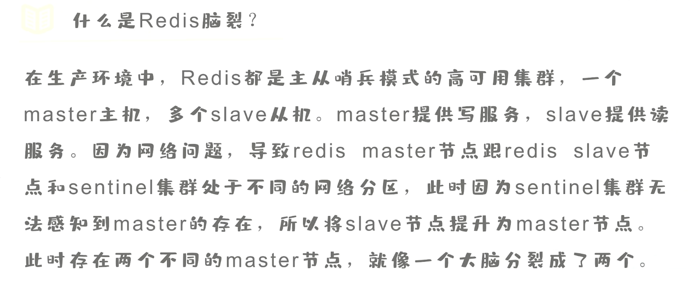

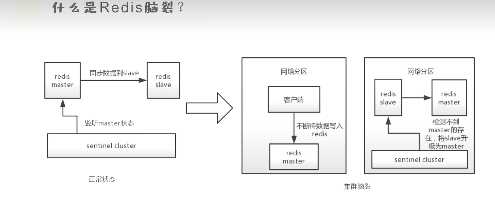

### 脑裂带来的危害

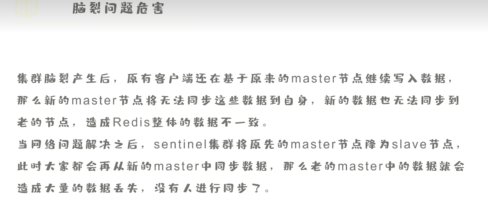

### 解决方案

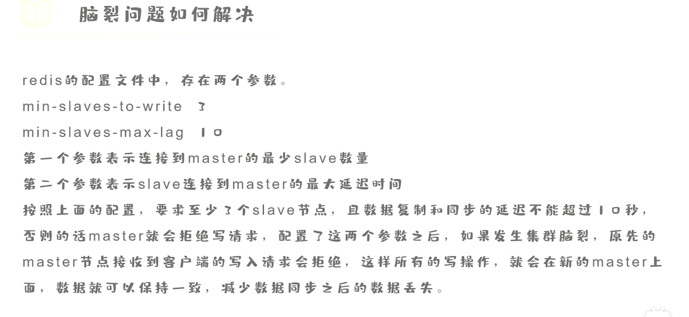


## 2.redis分布式锁和redisson分布式锁的区别？

Redis 分布式锁：使用 `SET NX EX`

**存在的问题**

1️⃣ **锁过期问题**：业务未完成，锁已自动过期，被其他线程抢占。
 2️⃣ **非可重入问题**：同一线程再次获取锁会失败，导致死锁。
 3️⃣ **非公平锁**：多个线程竞争时，可能某个线程一直抢不到锁。
 4️⃣ **Redis 主从复制延迟问题**：如果锁写入主节点，但还未同步到从节点，主节点宕机，可能导致**多个线程获取到相同的锁**（即锁丢失）。


Redisson 实现分布式锁

### **Redisson 优势**

1️⃣ **可重入锁**（同一线程可多次获取，不会死锁）。hash表实现
 2️⃣ **自动续期**（默认 `30s` 过期，且会**自动续期**，不会因业务执行时间过长导致锁提前释放）。独立的看门狗线程实现


## 3.假如数据库更新，删除了几个数据，布隆过滤器怎么处理？

### 为什么普通布隆过滤器不能直接删除数据？

###### 布隆过滤器使用 **多个哈希函数** 将 **一个 key 映射到多个 bit 位**

- **不能删除的原因**：
  - **多个 key 可能共用相同 bit 位**（哈希冲突）。
  - **如果直接把 bit 置 `0`，可能影响其他 key**（误删）。
  - **布隆过滤器本质上是单向 `set` 操作，无法反向 `unset`**。

### 解决方案

#### 重建布隆过滤器

 **适用场景**

- **数据删除量较大，布隆过滤器误判率较高**。
- **数据库支持批量查询，允许重新构建 Bloom Filter**。

**周期性重新构建布隆过滤器**（如每天、每周）。

**重新遍历数据库，插入最新的数据集合**


#### 使用计数布隆过滤器

原理：

- 计数布隆过滤器（CBF）**用整数数组替代 bit 数组**：

- **数据新增**：多个哈希函数对应的位置 `+1`。
- **数据删除**：多个哈希函数对应的位置 `-1`（如果 `count = 0`，表示删除）。

缺点：

**占用内存更大**（比普通 Bloom Filter 多 4~8 倍）。

**仍然可能出现误判（如果 `counter` 不准确）**。

# RocketMQ

## 1.RocketMQ的事务？


# JVM

## 1.JVM 最多能占系统多大内存？

理论上，对于64位系统，单个进程内存的最大寻址空间为2的64次方，非常大了，基本可以当作没有限制，所以-Xmx的最大值可以认为是无限大。

实际上，JVM 不能超过系统的**总物理内存（RAM）**，在 Linux 系统上，建议 JVM 使用物理内存的 80% 以下；

若超出了，如果启用了交换空间（swap 或 pagefile），JVM 可能会使用**物理内存 + swap** 作为运行时的可用内存

# 操作系统

## 1.系统最大内存指的是什么？

64位操作系统，理论寻址空间 **16EB（2^64）**，但受限于 RAM 和 Swap。

**系统最大内存** = 物理内存（RAM） + **虚拟内存**（Swap/Pagefile）（虚拟内存通常建议 Swap 大小 ≈ 物理内存）


## 2.虚存理论最大值是什么？

虚拟内存最大值理论上是**寻址空间**的大小。

64位操作系统，理论寻址空间 **16EB（2^64）**


## 3.协程了解吗？介绍一下，协程里面用 ThreadLocal 会有问题吗？

**协程（Coroutine）** 是一种比线程（Thread）更**轻量级**的并发执行单元。协程 由**用户态**调度，切换成本低（只需保存和恢复寄存器、栈等）

**协程中使用 `ThreadLocal` 可能会导致意外行为**，因为 `ThreadLocal` 绑定的是 **物理线程**，而协程在**多个物理线程上调度**时，`ThreadLocal` 可能无法正确传递。

比如，一个协程 **起初运行在 A 线程**，然后因挂起切换到 **B 线程** 继续执行，原来存储在 `ThreadLocal` 中的变量无法自动传递到新线程

解决方案：使用**TransmittableThreadLocal**，适用于 Java 线程池/虚拟线程


## 4.多线程和异步IO的对比

### 多线程方案


**每个请求由一个独立线程处理**，使用线程池控制线程数量

多线程的适用范围则是那种需要**长时间CPU**运算的场合，例如耗时较长的图形处理和算法执行。

但是往往由于使用线程编程的简单和符合习惯，所以很多朋友往往会使用多线程来执行耗时较长的I/O操作。


```java
import java.util.concurrent.ExecutorService;
import java.util.concurrent.Executors;

public class MultiThreadExample {
    public static void main(String[] args) {
        ExecutorService executor = Executors.newFixedThreadPool(5); // 线程池大小 5

        for (int i = 0; i < 10; i++) {
            int taskId = i;
            executor.execute(() -> {
                System.out.println("线程 " + Thread.currentThread().getName() + " 处理任务 " + taskId);
                try { Thread.sleep(1000); } catch (InterruptedException ignored) { }
            });
        }

        executor.shutdown(); // 关闭线程池
    }
}

```


### 异步IO方案


**使用 `CompletableFuture` 或 `Netty` 进行异步非阻塞 IO**。

当需要执行**I/O操作**时，使用**异步**操作比使用**多线程+同步I/O**操作更合适。I/O操作不仅包括了直接的文件、网络的读写，还包括数据库操作、Web Service、HttpRequest以及.Net Remoting等跨进程的调用。

```java
import java.util.concurrent.CompletableFuture;

public class AsyncIOExample {
    public static void main(String[] args) {
        for (int i = 0; i < 10; i++) {
            int taskId = i;
            CompletableFuture.runAsync(() -> {
                System.out.println("线程 " + Thread.currentThread().getName() + " 异步处理任务 " + taskId);
                try { Thread.sleep(1000); } catch (InterruptedException ignored) { }
            });
        }

        try { Thread.sleep(2000); } catch (InterruptedException ignored) { } // 等待任务完成
    }
}

```


### 多线程和异步的区别

多线程是关于功能的并发执行。而异步编程是关于函数之间的非阻塞执行，我们可以将异步应用于单线程或多线程当中。

因此，**多线程只是异步编程的一种实现形式**。

比如，你和你的朋友决定一起做一顿午餐。“异步”就是你对朋友说：“你去商店买意大利面，回来的时候告诉我一声，然后一起做午餐。在你买意大利面的同时，我去准备番茄酱和饮料。”

而“线程”是：“你烧水，我加热番茄酱。当水烧开了，告诉我，我把意大利放进去。当番茄酱热了，你可以把奶酪添加进去。当两者都完成了，就可以坐下来一起吃晚餐。”在线程的示例中，我们可以看到“When，Do”的事件顺序，而这些顺序代表着每个人（线程）的指令集集合的顺序。

上述示例可以看出，多线程是与具体的执行者相关的，而异步是与任务相关的。

多线程是程序设计的逻辑层概念，它是进程中并发运行的一段代码，可以实现线程间的切换执行。

异步和同步是相对的，异步就是彼此独立，在等待某事件的过程中继续做自己的事，不需要等待这一事件完成后再工作。

多线程就是实现异步的一个方式。异步是让调用方法的主线程不需要同步等待另一线程的完成，从而可以让主线程干其它的事情。

所以本质上，异步和多线程并不是一个同等关系，**异步是最终目的，多线程只是实现异步的一种手段**。


### 如何选择

面对多线程和异步，我们该如何选择呢？其实，通常情况下选择的依据是主要取决于性能。

那么，同步/异步与单线程/多线程之间的所有组合，哪种模型表现更好？

简而言之，对于具有大量I/O操作和不同计算的大规模应用程序，使用异步多线程有利于充分利用计算资源，并且能够照顾到非阻塞函数。这也是所有操作系统所采用的线程模型。

编写异步操作的复杂程度较高，程序主要使用回调方式进行处理，与正常的思维方式有些出入，而且难以调试。而多线程的使用（滥用）会给系统带来上下文切换的额外负担，并且线程间的共享变量可能造成死锁。

因此在实现这两种模式时，往往需要处理资源竞争、死锁、共享资源和回调事件等问题。


## 5. 什么是线程饥饿

> **线程饥饿（Thread Starvation）是指某些线程长时间无法获得 CPU 或其他资源，一直处于就绪态，导致迟迟不能执行或完成任务。**

> 常见原因包括高优先级线程长期占用 CPU、调度器不公平、资源独占等


## 6.静态库和动态库

> 静态库是在**编译时**被打包进可执行文件中的代码库，最终生成的程序文件中包含了库的全部代码；.lib（Windows）
>
> 动态库是在**运行时**才被加载进内存的**共享代码库**。.dll（Windows）

> 静态库体积大、更新麻烦但运行独立；动态库体积小、易于维护，多个程序还能共享同一份内存，是现代操作系统下更常见的库加载方式。

# 计算机网络

## 1.为什么用比如迅雷下载器下载一个任务可以比用浏览器下载快

- **多线程分块下载**
  - 传统浏览器 **单线程顺序下载**，服务器按**FIFO（先进先出）**返回数据，速度受限。**单 TCP 连接受限于 TCP 拥塞控制**
  - 迅雷等下载器 **使用多个 TCP 连接，同时请求不同的文件块**。**多个 TCP 连接**可以提升**带宽利用率**。
- **P2P 传输**
  - 迅雷等 P2P 下载工具可以**从多个用户共享的资源中下载不同部分**
  - ​	**浏览器**：只能从**服务器 A 下载**，如果服务器带宽小，速度会受限
  - **迅雷**：可以从**多个用户（B、C、D）下载不同片段**，并合并
- **CDN（内容分发网络）加速**
  - 浏览器通常直接从源站下载，路径较长
  - 迅雷等下载器**自动选择离用户最近的 CDN 节点**，减少延迟


## 2.如何预防 DDoS 攻击？

**DDoS（分布式拒绝服务攻击，Distributed Denial of Service）** 是通过大量流量请求**耗尽服务器资源**，导致服务不可用。

- **限制 IP 访问频率**，检测单个 IP 发送的请求速率，**超过阈值则限流**。可以用nginx限流
- **泛洪攻击**也是ddos攻击的一种，利用 TCP 握手未完成占满服务器连接。可以用 **SYN cookies**，这种技术通过在 **SYN-ACK 响应**中编码连接信息，从而在不占用大量资源的情况下验证客户端
- **使用分布式架构**，攻击流量均衡到不同节点，防止单点崩溃。可以采用nginx负载均衡策略
- **阻止异常 IP（黑名单 / 地理封锁）**，可以用nginx屏蔽特定ip


# 场景题

## 1.聊聊你对大模型的使用？除了对话机器人。

- **智能搜索 & 知识检索**

传统搜索基于关键字匹配，而 LLM 可以基于语义理解进行精准匹配，并结合外部数据库。

比如**企业内部知识库搜索**（如技术文档、API 说明），**电商智能搜索**（用户搜索“适合春游的鞋子”，LLM 理解语义后推荐）

- **代码智能生成** 

- **代码补全**（如 GitHub Copilot、Tabnine），**SQL 生成**（用户输入自然语言："查询 2024 年销售额"，LLM 生成 SQL）。

- **文档自动摘要 & 报告生成**


## 2.百万点赞，如何设计点赞系统

### 数据库表设计：

**1. 点赞记录表（likes）**

- **作用**：记录每一次点赞事件，支持溯源、查询、去重。
- **核心字段**：
  - `Mid`（用户 ID）：点赞用户。
  - `messageID`（实体 ID）：被点赞的对象（如文章、评论、视频等）。
  - **其他字段**：
    - **点赞来源**（可能是 App、Web、小程序等）。
    - **点赞时间**。
  - **索引**：
    - `Mid, messageID` 联合索引，**优化查询是否点赞**。

**2. 点赞统计表（counts）**

- **作用**：维护每个被点赞实体的总点赞数、点踩数等，减少 `COUNT` 查询开销。
- **主键**：
  - `BusinessID`（业务 ID）：区分不同业务场景（如视频、文章）。
  - `messageID`（实体 ID）：被点赞的具体对象。
- **其他字段**：
  - `like_count`（点赞数）。
  - `dislike_count`（点踩数）。
- **索引**：
  - `messageID` 维度索引，优化业务查询。

### redis缓存设计

- 存储点赞状态：

  - **作用**：判断用户是否点过赞，避免查数据库。

  - **数据结构**：使用 **Redis `Set`** 存储点赞用户 ID。

- 存储点赞计数
  - **作用**：减少 `COUNT(*)` 查询，直接返回点赞数。
  - **数据结构**：使用 **Redis `String`** 存储点赞数。

### RocketMQ 异步写入数据库

可以用**批量消费** RocketMQ进行优化：在写入点赞数和点赞事件的时候，可以累计10s内的点赞数和点赞时间，然后一次性批量写入数据库，可以减少数据库的IO次数

### 定期同步 Redis 和数据库，可以用定时任务

为了解决

Redis 宕机，数据丢失；异步写入导致数据库延迟


## 3.集群模式下，N个节点，写入时写W个节点，读的时候读R个节点，满足什么条件能保证读到最新数据？

**N**：集群中的总副本数（节点数）。

**W**：一次写操作必须更新的副本数量。

**R**：一次读操作必须从多少个副本读取数据。

### **(1) 强一致性（Strong Consistency）**

- **条件**：`W + R > N`

意味着：

- **写入至少覆盖 W 个副本**。
- **读取时至少访问 R 个副本**
- 保证 **写入和读取的交集至少有 1 个副本** 持有最新数据。

### **(2) 最终一致性（Eventual Consistency）**

- **条件**：`W + R <= N`
- **特点**：
  - 允许数据短时间内不一致，但最终同步。
  - 适用于 **社交点赞、推荐系统、缓存等高并发场景**。

### **(3) 读后写一致性（Read-Your-Writes Consistency）**

- **条件**：`W > N/2 且 R = 1`
- **特点**：
  - **用户自己修改的数据，自己一定能读到最新值**。
  - 适用于 **用户个性化数据，如购物车、个人资料修改等**。


## 4.秒杀架构

### 秒杀场景

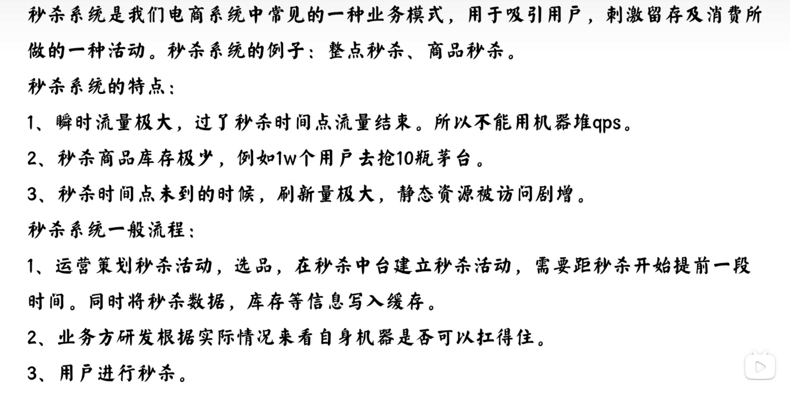

### 秒杀要考虑的点

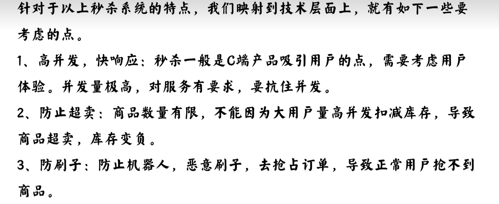

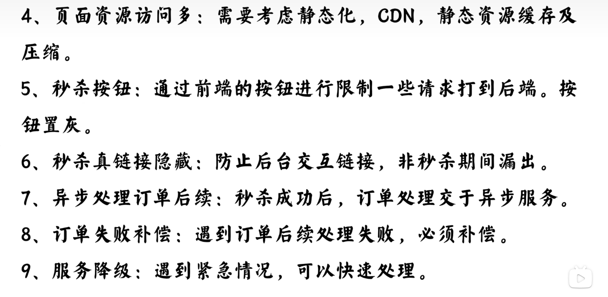

### 高并发响应

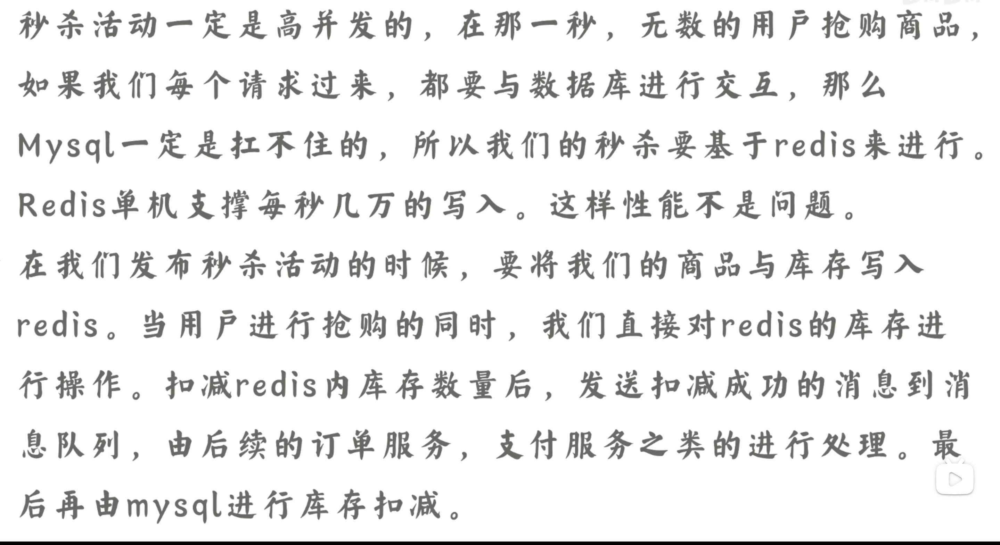

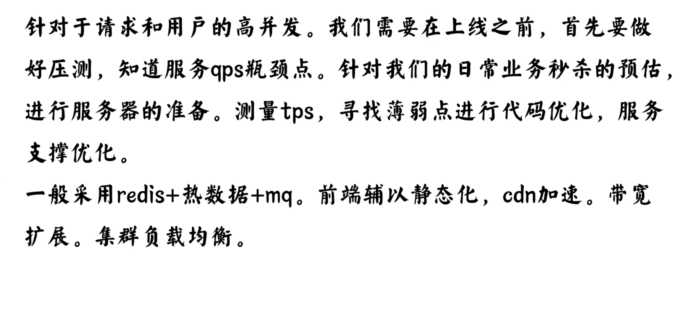

### 防止超卖

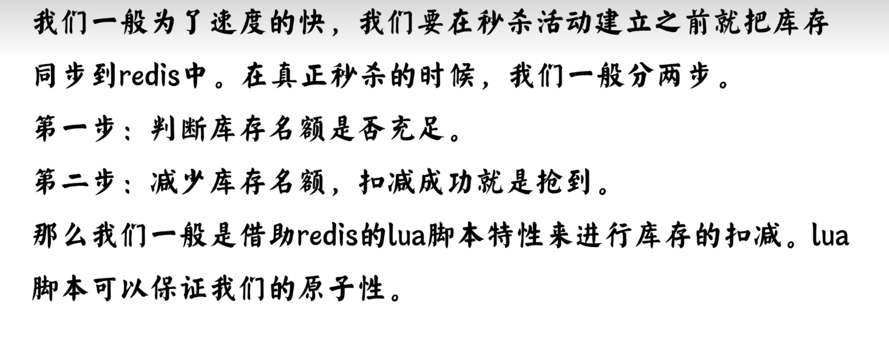

### 解决少卖

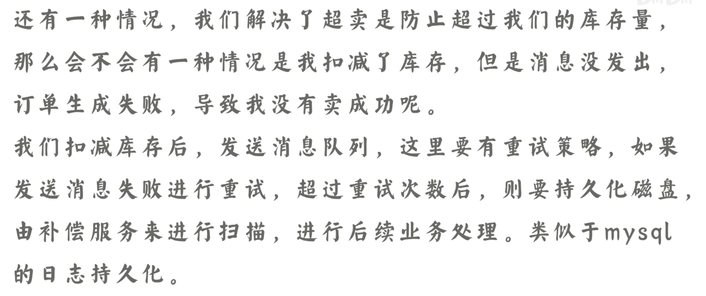

### 用户限流，防止刷子

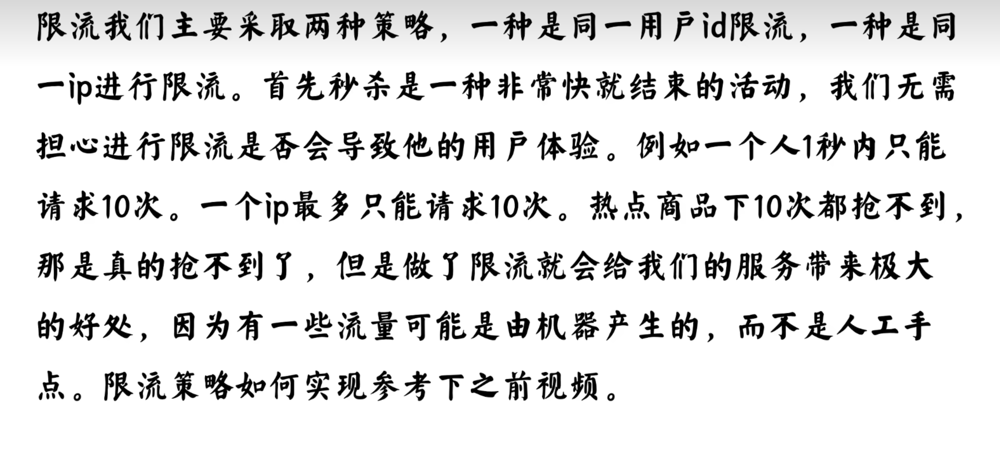

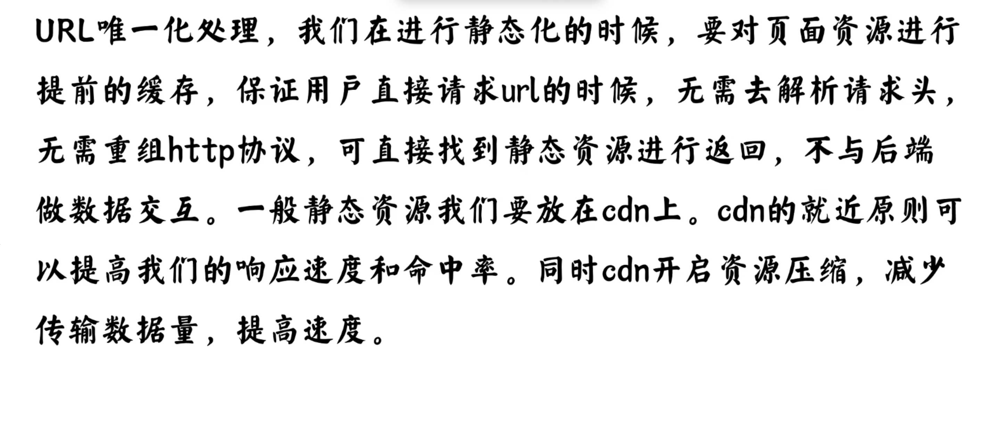

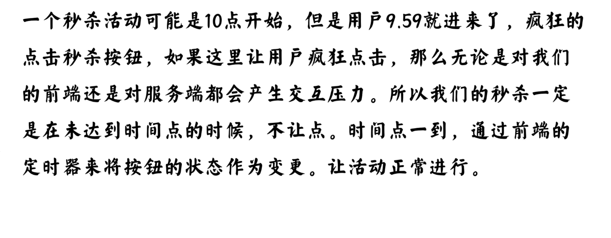

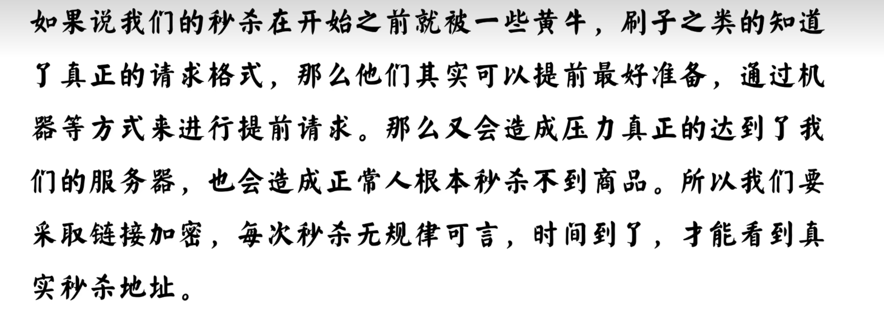

### 异步处理订单

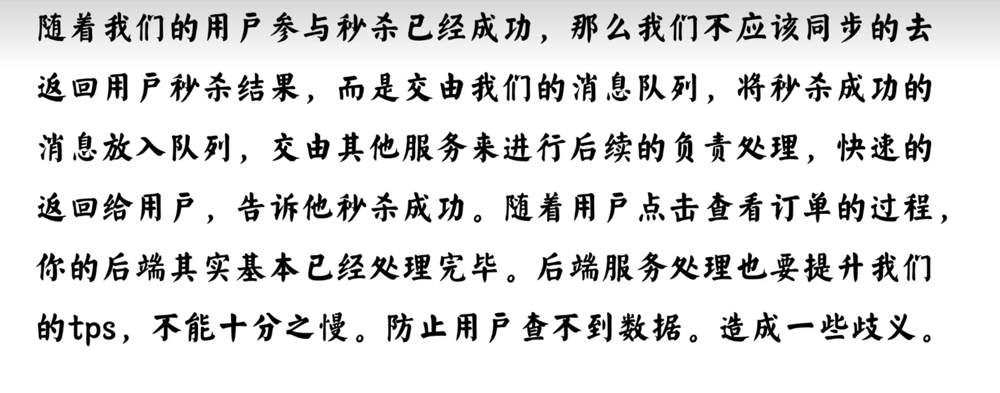

### 订单失败补偿

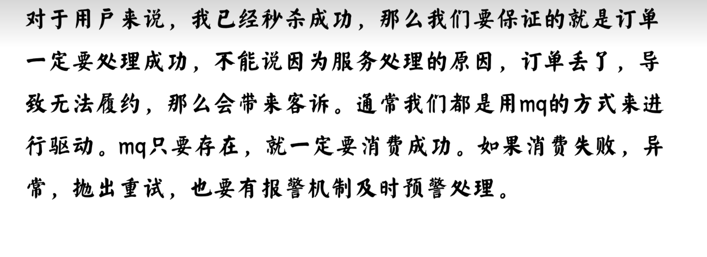

### 服务降级

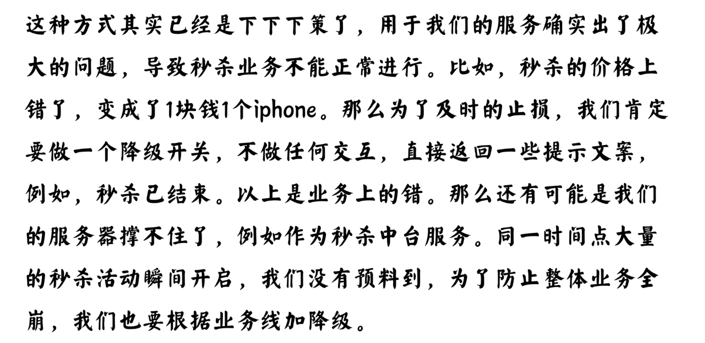


## 5.两个50亿的url找出相同url


### 方案1

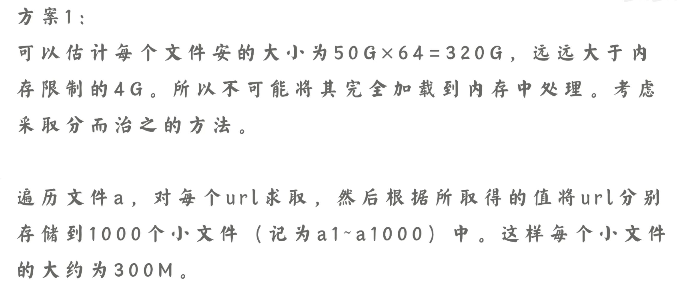


### 方案2

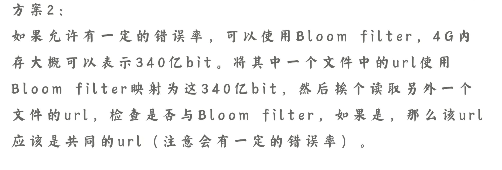

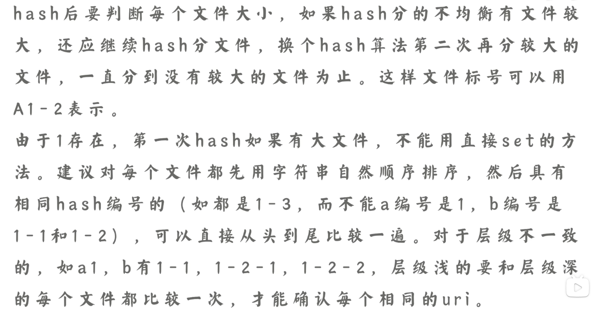


## 6.从1000w记录中，找出最热门的10个记录？

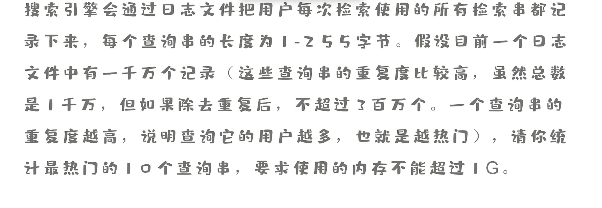

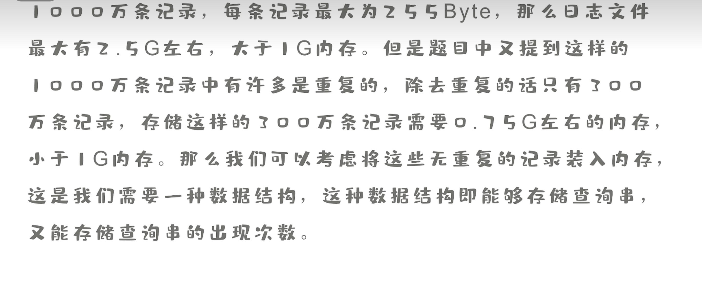

### 方案

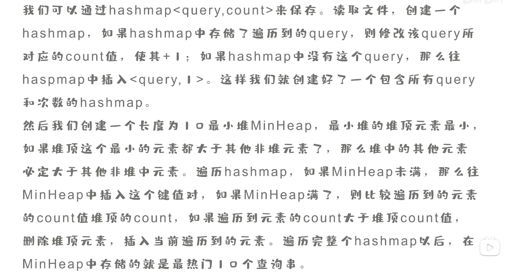


## 7.在一亿个数中找出最大的1万个数

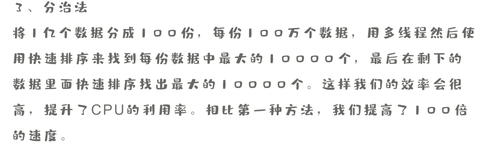

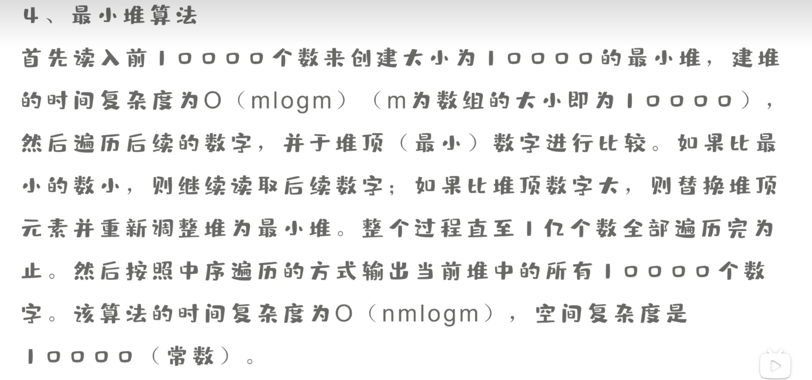


## 8. 设计商品排行榜


## 9.十万级发券业务性能瓶颈及解决方案

## 10.下了订单后，可能会有库存模块，可能有配送模块，消息队列一个消息发出有多个模块收到，你觉得怎么设计好一点？

## 11.如何实现跨域单点登录（如淘宝登录后访问天猫自动登录）？

### 核心思路：

```
跨域 SSO 的关键是浏览器不能共享 Cookie，所以各子系统通过重定向到统一 SSO 中心来确认登录状态。
登录成功后，SSO 在自己的域下保存登录态，然后通过一次性授权码（code）重定向回子系统，子系统后端拿 code 向 SSO 获取用户信息，建立本地会话。
这样就实现了登录一次，多个系统自动登录的能力。
```

### 场景设定

```
天猫和淘宝不是一个域名，比如：

	•	淘宝：taobao.com
	•	天猫：tmall.com

跨域意味着：两个系统不能共享 Cookie（同源策略）
```

### 实现

```
🎯 核心组件：
	•	✅ 用户（浏览器端）
	•	✅ 淘宝系统（子系统 A）
	•	✅ 天猫系统（子系统 B）
	•	✅ 统一认证中心（SSO Server）

⸻

✅ 登录流程分步解析：

✅ 1）未登录时访问淘宝
	•	用户访问 taobao.com，发现本地没有登录态
	•	浏览器被 302 重定向到 SSO 登录中心：sso.com/login?redirect=taobao.com

✅ 2）SSO 登录中心处理登录
	•	用户输入账号密码，登录成功后：
	•	在 sso.com 域下，写入登录 Cookie（如 SSO-TOKEN）
	•	生成一个一次性授权码（如 code=xyz123）
	•	重定向回淘宝：taobao.com?code=xyz123

✅ 3）淘宝收到授权码，向 SSO 请求用户信息
	•	淘宝通过后端请求：GET sso.com/token/validate?code=xyz123
	•	SSO 校验成功，返回用户信息
	•	淘宝给用户发本地 Cookie（例如 JWT 或 Session）

✅ 此时用户在淘宝就“登录”了，但SSO Cookie 还保留在 sso.com 域下

⸻

✅ 实现“天猫自动登录”

✅ 用户访问天猫时
	•	天猫也发现没有登录态
	•	天猫重定向到 sso.com/login?redirect=tmall.com

✅ 因为浏览器访问的是 sso.com：
	•	浏览器带上了之前写入的 Cookie（SSO-TOKEN）
	•	SSO 发现用户已经登录 ✅
	•	立即生成新的一次性授权码，重定向回天猫：tmall.com?code=abc456

✅ 天猫根据 code 再次调用 SSO 获取用户信息
	•	自己创建本地 Cookie，完成自动登录

⸻

✅ 跨域如何传递登录状态？
	•	浏览器不能共享 taobao.com 和 tmall.com 的 Cookie
	•	但 两个系统都能访问同一个 sso.com 域
	•	所以关键就是：让所有系统通过跳转 + code 来“间接共享登录状态”

```


## 12. 50万个坐标点，如何设计数据结构来找到距离一个点最近的10个点

**KD-Tree + KNN 查询（最常用）**

###  **1. 数据结构：KD-Tree**

构建过程：

​	1.	第 0 层用 x 维排序，选择中位数为根

​	2.	左边构建左子树，右边构建右子树

​	3.	第 1 层用 y 维排序（交替）

	4.	递归下去直到叶子节点

复杂度：**O(n log n)**（平衡二叉树）


### **2. 查询算法：K 近邻搜索（KNN）**

**✅ 第一步：递归下探，找到目标所在叶子节点**

​	•	类似二叉查找，按分割维度比较大小

​	•	找到离目标点最近的“子空间区域”


------


**✅ 第二步：回溯 + 剪枝 + 小顶堆维护最近 K 个点**

​	•	回溯过程中计算当前节点与目标点距离

​	•	用**小顶堆（最大长度 K）**维护当前最近的 K 个点

​	•	判断另一个子空间是否有可能存在更近的点（即圆与分割线交叉）

​	•	若可能 ➜ 继续递归搜索另一个分支


------


**✅ 查询复杂度：**

​	•	平均情况：**O(log n + k log k)**


