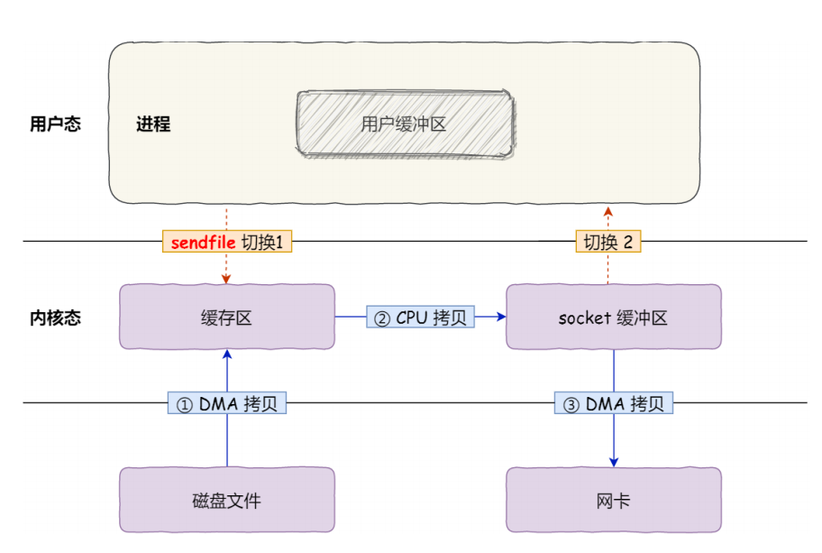

#  大量用户，我要存储用户和用户的好友关系，用什么数据结构来设计存储？

这是一个典型的“**好友关系建模**”问题，结合“**大量用户**”和“**图论**”的提示，我们可以从**图的角度建模用户关系网络**。

## 核心思路

社交网络、关系推荐、路径查找等复杂图查询 —— 用图数据库天然契合。

将“用户”建模为**图的节点（Vertex）**，将“好友关系”建模为**图中的边（Edge）**：

- 如果好友关系是**单向的**（如关注），用**有向图（Directed Graph）**
- 如果好友关系是**双向的**（如微信好友），用**无向图（Undirected Graph）**


对于“**大量用户**”的高效存储和查询，使用**邻接表**构建图

```java
// Java 中的结构：Map<用户ID, Set<好友ID>>
Map<Integer, Set<Integer>> userGraph = new HashMap<>();
```

优点：

- 占用空间小（O(N + E)）
- 查询某个用户的所有好友效率高（O(k)，k为好友数）

[如果要快速查找**两个用户是否为好友**， 可以考虑使用 **邻接矩阵**]


## Redis 实现（大厂常用方案）

Redis 更适合做**高性能好友关系缓存**，适合读多写少的查询场景

```java
SADD friends:123 456 789
SADD friends:456 123
```

查询操作

```java
SMEMBERS friends:123
```

查询共同好友

```java
SINTER friends:123 friends:456
```


## 常见查询场景及算法实现

| **查询场景**     | **描述**                      | **实现方法（Java）**                        |
| ---------------- | ----------------------------- | ------------------------------------------- |
| 查询某个用户好友 | 用户所有直接连接的用户        | Map<Integer, Set> 中查找即可                |
| 查询共同好友     | A 和 B 的好友集合取交集       | SetUtils.intersection(setA, setB)           |
| 是否路径可达     | A 和 B 是否能通过若干好友连接 | DFS / BFS                                   |
| 推荐好友         | 查找“朋友的朋友”但非直接好友  | BFS 深度为2 + 排除自己和直接好友 + 计数排序 |
| 社区划分         | 找出紧密相连的用户群体        | 图的聚类算法：Louvain、Label Propagation 等 |


# 多个文件上传且文件名完全相同，如何保证线程安全？

这是一个**并发场景下的文件上传冲突问题**，重点考察**线程安全 + 文件重名冲突处理策略**，常出现在高并发系统、网盘、OSS等场景。


## 问题本质

多个用户或多个线程**几乎同时上传相同文件名的文件**，如果你用文件名作为唯一标识，可能导致：

- 文件被覆盖（线程不安全）
- 文件上传失败（命名冲突）
- 数据错乱（写入时未加锁）


## 方案1：**文件名做唯一化（加 UUID 或时间戳）**

在上传之前，**重命名文件**，使得文件名具有全局唯一性。

```java
String originalFileName = "avatar.png";
String suffix = originalFileName.substring(originalFileName.lastIndexOf("."));
String newFileName = UUID.randomUUID().toString() + suffix;
// 最终保存路径如：/upload/2025/04/11/2f4e-xxx.png
```

## 方案2：**使用用户私有目录隔离**

```java
/upload/user123/avatar.png
/upload/user456/avatar.png
```

## 方案3：**使用分布式锁控制写入（如 Redis + Redisson）**

```java
String lockKey = "upload:" + fileName;
try {
    RLock lock = redissonClient.getLock(lockKey);
    if (lock.tryLock(3, 10, TimeUnit.SECONDS)) {
        // 写文件逻辑
    }
} finally {
    lock.unlock();
}
```


# 大文件上传， 如何保证效率和高可用？

这是一个非常经典的高并发系统设计题，考察你对**大文件上传的分片（分块）机制、断点续传、并发控制、存储设计、高可用容错机制**的综合能力。


## 问题本质分析

大文件上传的难点在于：

- 文件体积大（上传耗时长）
- 网络不稳定（容易中断）
- 多用户并发（资源竞争大）
- 服务异常（需容错/续传）


## 关键设计点详解

### 架构

```text
前端：大文件切片
  ↓
后端：接收分片 + 校验 + 临时存储
  ↓
数据库/Redis：记录上传进度、文件哈希
  ↓
最终合并 + 持久化到分布式存储（如 OSS）
```

### **1. 分片上传（Chunk Upload）**

**前端将大文件拆成多个小分片并并行上传**

- 减少单次上传压力，提高上传成功率
- 每个分片单独处理，失败可重传


### **2. 上传唯一标识（秒传优化）**

**文件内容做哈希（如 MD5、SHA256）生成唯一 ID**

- 秒传优化：服务端查 MD5，有则直接返回上传成功
- 防重复上传、做断点续传定位用


### **3.断点续传 + 幂等控制**

**服务端记录每个用户上传的文件分片状态**

```
Key: upload:md5:{userId}
Value: bitmap 或已上传分片列表（如 1,2,3,5）
```

- 断点续传时，前端读取未上传片段继续发
- 幂等：同一分片多次上传结果一致，服务端判断已存在则跳过


### **4. 合并分片 + 校验完整性**

- 所有分片上传完成后，触发合并操作（后端合并或由对象存储提供合并接口）
- 最后校验 MD5 与原始文件一致，确保无误


### **5. 高可用存储设计**

上传后的数据要保证可靠：

- 使用对象存储（如阿里 OSS、S3、MinIO），天然支持分片、断点续传
- 存储服务本身支持多副本、高可用、异地灾备
- 元数据存数据库 + 异步备份到冷存储或消息队列做异步处理


## 操作系统相关优化

### **1. 零拷贝（Zero-copy）**

传统上传流程会产生多次用户态/内核态的**上下文切换和数据拷贝**：

```
硬盘 → 内核缓冲区 → 用户态缓冲区 → Socket缓冲区 → 网卡
```



可以使用 **sendfile+DMA拷贝** 等方式实现 **零拷贝**，减少 CPU 拷贝负担，提升 I/O 吞吐。

- 它可以替代前⾯的 read() + write() 这两个系统调⽤
  - 数据从磁盘到网卡，CPU 不再拷贝，减少 2 次上下文切换
  - 数据直接从 Page Cache 传输到网卡，完全避免 CPU 参与拷贝
- 2次上下文切换 和 0次数据拷贝


FileChannel.transferTo()实现零拷贝

```java
public void sendFile(Socket socket, File file) throws IOException {
    try (FileInputStream fis = new FileInputStream(file);
         FileChannel fileChannel = fis.getChannel();
         OutputStream out = socket.getOutputStream()) {

        WritableByteChannel target = Channels.newChannel(out);
        fileChannel.transferTo(0, file.length(), target);
    }
}
```


### **2. 多线程并发上传（IO 多路复用）**

使用线程池或异步 IO（如 NIO、Netty）来同时上传多个分片：

- 利用多核 CPU 并行处理
- 不阻塞主线程，提升吞吐
- **异步**写盘防止磁盘 I/O 成为瓶颈，MQ


## 计算机网络相关优化

### **1. 并发连接（分片 + 并发）**

- HTTP 是基于 TCP 的，单连接上限通常在 10~50 Mbps
- 使用多个连接（多线程/分片）并发上传，达到**聚合带宽效果**
- 实测：将 1GB 文件拆为 20 片并发上传，时间缩短近 70%


# 订单结算场景， 如何设计高可用且高并发的服务？


## **问题定义：电商订单结算的核心挑战**

> 订单结算 = 用户下单 → 商品库存校验 → 优惠券抵扣 → 运费计算 → 总价生成 → 锁定资源（库存/优惠）→ 返回给用户确认页

**典型难点：**

- 高并发下系统容易崩溃
- 多个依赖服务（库存、优惠券、运费）可能不稳定
- 数据要强一致，不能多扣库存、重复使用优惠券
- 用户体验要快（页面秒出）


## **核心模块设计方案**


### **前端防抖 + 请求幂等**

- 下单按钮加前端防抖（1秒内不能点两次）
- 后端用分布式锁做幂等注解，防止重复提交


### **API 网关层：限流 + 鉴权 + 灰度**

- 限流（如 Sentinel、Nginx 限速）：防止恶意刷单
- 鉴权：保护接口调用
- 熔断/降级：防止服务雪崩扩散


### **服务拆分（按职责解耦）**

拆分有利于**单服务故障不影响全局**

- **结算服务**：只负责计算总价，调用商品、库存、优惠券等服务
- **订单服务**：最终下单入库
- **库存服务**：锁库存、扣库存
- **优惠券服务**：校验 + 锁定优惠券


### **资源锁定机制（避免超卖/重复使用）**

在订单创建之前，需锁定资源：

#### **库存锁定：**

- Redis 预扣库存（扣减时原子 Lua 脚本）
- 锁失败即提示“库存不足”

#### **优惠券锁定：**

- 使用 分布式锁 加锁
- 成功则标记该券已被占用（等待支付）


### **服务间通信：异步化提升性能**

- 使用 RocketMQ / Kafka 异步处理：

  - 日志记录（下单日志、行为日志）
  - 异步通知（短信、积分发放）
  - 支付成功 → 通知库存服务 → 实际扣减

  

### **分布式事务处理方案**

为了保证 **结算→下单→扣库存** 的一致性：

RocketMQ 事务消息（先发送 half 消息，等本地事务完成后 commit）


# 如何设计一个IM系统

这是一道**系统设计 + 网络协议栈 + 实时通信机制**综合考察题，面试官希望你能从 **“计算机网络角度”**切入，而不是仅谈业务逻辑或数据库设计


## **IM系统的本质（从网络视角理解）**

**即时通讯系统**的核心目标是：

- 保证消息的**实时性**
- 支持**双向通信（全双工）**
- 网络连接要**稳定、低延迟、低丢包**

从网络协议角度看，本质上是一个**长连接（长生命周期）+ 异步收发 + 多路复用的网络服务系统**。


## **传输协议选择：TCP vs UDP vs QUIC**

| **协议** | **是否有连接** | **可靠性** | **适用性**                     |
| -------- | -------------- | ---------- | ------------------------------ |
| TCP      | 是             | ✔️可靠      | 主流选择，支持长连接           |
| UDP      | 否             | ❌不可靠    | 需要自定义可靠机制，适合音视频 |
| QUIC     | 是（基于UDP）  | ✔️可靠      | 新协议，连接迁移能力强         |


**传统IM系统通常选择： TCP + 自定义协议**， 因为

- 可靠传输（不丢消息、不乱序）
- 长连接支持
- 可配合心跳包、滑动窗口、ACK机制
- TCP是全双工的

但**Quick**协议在 IM 场景中具备明显优势


## **QUIC 相比 TCP 的核心优势**

**零 RTT 建立连接（0-RTT）**

- TCP 建立连接需要 3 次握手（3-RTT 才能完成 TLS + 应用层）
- QUIC **1 次握手甚至 0-RTT** 就能发送应用数据（类似缓存 TLS 会话）

在移动端 IM 场景中，**每次重连能快几十～上百毫秒**


**多路复用无队头阻塞**

- TCP 是按字节流传输，一个包丢了 → 整个连接阻塞等待重传
- QUIC 内建**多路复用**机制，**丢一个 stream 不会影响其他 stream**

IM 中：比如文字消息和文件同时传，文件丢了包不会影响文字显示速度。

**总结**

> QUIC 在 IM 场景中具备明显优势：它基于 UDP 实现，自带多路复用机制，能避免 TCP 的队头阻塞问题；同时内建 TLS 1.3 加密，大幅提升安全性和连接建立速度。特别适合移动场景，它支持连接迁移，允许设备从 WiFi 切换到移动网络后不重连，大大提升用户体验。QUIC 的握手速度远优于 TCP + TLS 的三次握手，支持 0-RTT 数据传输，是未来实时通信的主流趋势。


## **连接模型设计（客户端与服务端）**

**单客户端长连接**

客户端和服务端之间维持一条 **TCP 长连接**，避免频繁三次握手/挥手。


服务端使用**高并发连接模型**

- Reactor 多路复用（如 **Netty** 使用的 NIO）
- 每个连接使用线程池处理 IO 事件
- 使用**非阻塞 IO（NIO）**或 **EPOLL** 提高性能


## **心跳 + 空闲连接检测**

为了防止**连接假死**，服务端要定期检测客户端是否活着：

- 客户端每隔 30s 发送 PING（心跳包）
- 服务端响应 PONG
- 若超过一定时间未收到心跳，则**断开连接释放资源**


## **消息可靠传输机制（网络传输层上补强）**

虽然 TCP 保证可靠性，但应用层还需处理：

| **问题**           | **应对策略**                     |
| ------------------ | -------------------------------- |
| 客户端消息发送失败 | 本地重试 + 本地消息队列          |
| 服务端转发失败     | 推送失败消息入队列（MQ、DB）     |
| 消息重复投递       | 消息ID做幂等控制                 |
| 网络异常断线重连   | 客户端自动重连 +离线消息补偿机制 |

