#  大量用户，我要存储用户和用户的好友关系，用什么数据结构来设计存储？

这是一个典型的“**好友关系建模**”问题，结合“**大量用户**”和“**图论**”的提示，我们可以从**图的角度建模用户关系网络**。

## 核心思路

社交网络、关系推荐、路径查找等复杂图查询 —— 用图数据库天然契合。

将“用户”建模为**图的节点（Vertex）**，将“好友关系”建模为**图中的边（Edge）**：

- 如果好友关系是**单向的**（如关注），用**有向图（Directed Graph）**
- 如果好友关系是**双向的**（如微信好友），用**无向图（Undirected Graph）**


对于“**大量用户**”的高效存储和查询，使用**邻接表**构建图

```java
// Java 中的结构：Map<用户ID, Set<好友ID>>
Map<Integer, Set<Integer>> userGraph = new HashMap<>();
```

优点：

- 占用空间小（O(N + E)）
- 查询某个用户的所有好友效率高（O(k)，k为好友数）

[如果要快速查找**两个用户是否为好友**， 可以考虑使用 **邻接矩阵**]


## Redis 实现（大厂常用方案）

Redis 更适合做**高性能好友关系缓存**，适合读多写少的查询场景

```java
SADD friends:123 456 789
SADD friends:456 123
```

查询操作

```java
SMEMBERS friends:123
```

查询共同好友

```java
SINTER friends:123 friends:456
```


## 常见查询场景及算法实现

| **查询场景**     | **描述**                      | **实现方法（Java）**                        |
| ---------------- | ----------------------------- | ------------------------------------------- |
| 查询某个用户好友 | 用户所有直接连接的用户        | Map<Integer, Set> 中查找即可                |
| 查询共同好友     | A 和 B 的好友集合取交集       | SetUtils.intersection(setA, setB)           |
| 是否路径可达     | A 和 B 是否能通过若干好友连接 | DFS / BFS                                   |
| 推荐好友         | 查找“朋友的朋友”但非直接好友  | BFS 深度为2 + 排除自己和直接好友 + 计数排序 |
| 社区划分         | 找出紧密相连的用户群体        | 图的聚类算法：Louvain、Label Propagation 等 |


# 多个文件上传且文件名完全相同，如何保证线程安全？

这是一个**并发场景下的文件上传冲突问题**，重点考察**线程安全 + 文件重名冲突处理策略**，常出现在高并发系统、网盘、OSS等场景。


## 问题本质

多个用户或多个线程**几乎同时上传相同文件名的文件**，如果你用文件名作为唯一标识，可能导致：

- 文件被覆盖（线程不安全）
- 文件上传失败（命名冲突）
- 数据错乱（写入时未加锁）


## 方案1：**文件名做唯一化（加 UUID 或时间戳）**

在上传之前，**重命名文件**，使得文件名具有全局唯一性。

```java
String originalFileName = "avatar.png";
String suffix = originalFileName.substring(originalFileName.lastIndexOf("."));
String newFileName = UUID.randomUUID().toString() + suffix;
// 最终保存路径如：/upload/2025/04/11/2f4e-xxx.png
```

## 方案2：**使用用户私有目录隔离**

```java
/upload/user123/avatar.png
/upload/user456/avatar.png
```

## 方案3：**使用分布式锁控制写入（如 Redis + Redisson）**

```java
String lockKey = "upload:" + fileName;
try {
    RLock lock = redissonClient.getLock(lockKey);
    if (lock.tryLock(3, 10, TimeUnit.SECONDS)) {
        // 写文件逻辑
    }
} finally {
    lock.unlock();
}
```


# 大文件上传， 如何保证效率和高可用？

这是一个非常经典的高并发系统设计题，考察你对**大文件上传的分片（分块）机制、断点续传、并发控制、存储设计、高可用容错机制**的综合能力。


## 问题本质分析

大文件上传的难点在于：

- 文件体积大（上传耗时长）
- 网络不稳定（容易中断）
- 多用户并发（资源竞争大）
- 服务异常（需容错/续传）


## 关键设计点详解

### 架构

```text
前端：大文件切片
  ↓
后端：接收分片 + 校验 + 临时存储
  ↓
数据库/Redis：记录上传进度、文件哈希
  ↓
最终合并 + 持久化到分布式存储（如 OSS）
```

### **1. 分片上传（Chunk Upload）**

**前端将大文件拆成多个小分片并并行上传**

- 减少单次上传压力，提高上传成功率
- 每个分片单独处理，失败可重传


### **2. 上传唯一标识（秒传优化）**

**文件内容做哈希（如 MD5、SHA256）生成唯一 ID**

- 秒传优化：服务端查 MD5，有则直接返回上传成功
- 防重复上传、做断点续传定位用


### **3.断点续传 + 幂等控制**

**服务端记录每个用户上传的文件分片状态**

```
Key: upload:md5:{userId}
Value: bitmap 或已上传分片列表（如 1,2,3,5）
```

- 断点续传时，前端读取未上传片段继续发
- 幂等：同一分片多次上传结果一致，服务端判断已存在则跳过


### **4. 合并分片 + 校验完整性**

- 所有分片上传完成后，触发合并操作（后端合并或由对象存储提供合并接口）
- 最后校验 MD5 与原始文件一致，确保无误


### **5. 高可用存储设计**

上传后的数据要保证可靠：

- 使用对象存储（如阿里 OSS、S3、MinIO），天然支持分片、断点续传
- 存储服务本身支持多副本、高可用、异地灾备
- 元数据存数据库 + 异步备份到冷存储或消息队列做异步处理


## 操作系统相关优化

### **1. 零拷贝（Zero-copy）**

传统上传流程会产生多次用户态/内核态的**上下文切换和数据拷贝**：

```
硬盘 → 内核缓冲区 → 用户态缓冲区 → Socket缓冲区 → 网卡
```


可以使用 **sendfile+DMA拷贝** 等方式实现 **零拷贝**，减少 CPU 拷贝负担，提升 I/O 吞吐。

- 它可以替代前⾯的 read() + write() 这两个系统调⽤
  - 数据从磁盘到网卡，CPU 不再拷贝，减少 2 次上下文切换
  - 数据直接从 Page Cache 传输到网卡，完全避免 CPU 参与拷贝
- 2次上下文切换 和 0次数据拷贝


FileChannel.transferTo()实现零拷贝

```java
public void sendFile(Socket socket, File file) throws IOException {
    try (FileInputStream fis = new FileInputStream(file);
         FileChannel fileChannel = fis.getChannel();
         OutputStream out = socket.getOutputStream()) {

        WritableByteChannel target = Channels.newChannel(out);
        fileChannel.transferTo(0, file.length(), target);
    }
}
```


### **2. 多线程并发上传（IO 多路复用）**

使用线程池或异步 IO（如 NIO、Netty）来同时上传多个分片：

- 利用多核 CPU 并行处理
- 不阻塞主线程，提升吞吐
- **异步**写盘防止磁盘 I/O 成为瓶颈，MQ


## 计算机网络相关优化

### **1. 并发连接（分片 + 并发）**

- HTTP 是基于 TCP 的，单连接上限通常在 10~50 Mbps
- 使用多个连接（多线程/分片）并发上传，达到**聚合带宽效果**
- 实测：将 1GB 文件拆为 20 片并发上传，时间缩短近 70%


# 订单结算场景， 如何设计高可用且高并发的服务？


## **问题定义：电商订单结算的核心挑战**

> 订单结算 = 用户下单 → 商品库存校验 → 优惠券抵扣 → 运费计算 → 总价生成 → 锁定资源（库存/优惠）→ 返回给用户确认页

**典型难点：**

- 高并发下系统容易崩溃
- 多个依赖服务（库存、优惠券、运费）可能不稳定
- 数据要强一致，不能多扣库存、重复使用优惠券
- 用户体验要快（页面秒出）


## **核心模块设计方案**


### **前端防抖 + 请求幂等**

- 下单按钮加前端防抖（1秒内不能点两次）
- 后端用分布式锁做幂等注解，防止重复提交


### **API 网关层：限流 + 鉴权 + 灰度**

- 限流（如 Sentinel、Nginx 限速）：防止恶意刷单
- 鉴权：保护接口调用
- 熔断/降级：防止服务雪崩扩散


### **服务拆分（按职责解耦）**

拆分有利于**单服务故障不影响全局**

- **结算服务**：只负责计算总价，调用商品、库存、优惠券等服务
- **订单服务**：最终下单入库
- **库存服务**：锁库存、扣库存
- **优惠券服务**：校验 + 锁定优惠券


### **资源锁定机制（避免超卖/重复使用）**

在订单创建之前，需锁定资源：

#### **库存锁定：**

- Redis 预扣库存（扣减时原子 Lua 脚本）
- 锁失败即提示“库存不足”

#### **优惠券锁定：**

- 使用 分布式锁 加锁
- 成功则标记该券已被占用（等待支付）


### **服务间通信：异步化提升性能**

- 使用 RocketMQ / Kafka 异步处理：

  - 日志记录（下单日志、行为日志）
  - 异步通知（短信、积分发放）
  - 支付成功 → 通知库存服务 → 实际扣减

  

### **分布式事务处理方案**

为了保证 **结算→下单→扣库存** 的一致性：

RocketMQ 事务消息（先发送 half 消息，等本地事务完成后 commit）


# 如何设计一个IM系统

这是一道**系统设计 + 网络协议栈 + 实时通信机制**综合考察题，面试官希望你能从 **“计算机网络角度”**切入，而不是仅谈业务逻辑或数据库设计


## **IM系统的本质（从网络视角理解）**

**即时通讯系统**的核心目标是：

- 保证消息的**实时性**
- 支持**双向通信（全双工）**
- 网络连接要**稳定、低延迟、低丢包**

从网络协议角度看，本质上是一个**长连接（长生命周期）+ 异步收发 + 多路复用的网络服务系统**。


## **传输协议选择：TCP vs UDP vs QUIC**

| **协议** | **是否有连接** | **可靠性** | **适用性**                     |
| -------- | -------------- | ---------- | ------------------------------ |
| TCP      | 是             | ✔️可靠      | 主流选择，支持长连接           |
| UDP      | 否             | ❌不可靠    | 需要自定义可靠机制，适合音视频 |
| QUIC     | 是（基于UDP）  | ✔️可靠      | 新协议，连接迁移能力强         |


**传统IM系统通常选择： TCP + 自定义协议**， 因为

- 可靠传输（不丢消息、不乱序）
- 长连接支持
- 可配合心跳包、滑动窗口、ACK机制
- TCP是全双工的

但**Quick**协议在 IM 场景中具备明显优势


## **QUIC 相比 TCP 的核心优势**

**零 RTT 建立连接（0-RTT）**

- TCP 建立连接需要 3 次握手（3-RTT 才能完成 TLS + 应用层）
- QUIC **1 次握手甚至 0-RTT** 就能发送应用数据（类似缓存 TLS 会话）

在移动端 IM 场景中，**每次重连能快几十～上百毫秒**


**多路复用无队头阻塞**

- TCP 是按字节流传输，一个包丢了 → 整个连接阻塞等待重传
- QUIC 内建**多路复用**机制，**丢一个 stream 不会影响其他 stream**

IM 中：比如文字消息和文件同时传，文件丢了包不会影响文字显示速度。

**总结**

> QUIC 在 IM 场景中具备明显优势：它基于 UDP 实现，自带多路复用机制，能避免 TCP 的队头阻塞问题；同时内建 TLS 1.3 加密，大幅提升安全性和连接建立速度。特别适合移动场景，它支持连接迁移，允许设备从 WiFi 切换到移动网络后不重连，大大提升用户体验。QUIC 的握手速度远优于 TCP + TLS 的三次握手，支持 0-RTT 数据传输，是未来实时通信的主流趋势。


## **连接模型设计（客户端与服务端）**

**单客户端长连接**

客户端和服务端之间维持一条 **TCP 长连接**，避免频繁三次握手/挥手。


服务端使用**高并发连接模型**

- Reactor 多路复用（如 **Netty** 使用的 NIO）
- 每个连接使用线程池处理 IO 事件
- 使用**非阻塞 IO（NIO）**或 **EPOLL** 提高性能


## **心跳 + 空闲连接检测**

为了防止**连接假死**，服务端要定期检测客户端是否活着：

- 客户端每隔 30s 发送 PING（心跳包）
- 服务端响应 PONG
- 若超过一定时间未收到心跳，则**断开连接释放资源**


## **消息可靠传输机制（网络传输层上补强）**

虽然 TCP 保证可靠性，但应用层还需处理：

| **问题**           | **应对策略**                     |
| ------------------ | -------------------------------- |
| 客户端消息发送失败 | 本地重试 + 本地消息队列          |
| 服务端转发失败     | 推送失败消息入队列（MQ、DB）     |
| 消息重复投递       | 消息ID做幂等控制                 |
| 网络异常断线重连   | 客户端自动重连 +离线消息补偿机制 |


# 如何设计动态线程池

动态线程池中，怎么监控这个线程池的状态？怎么知道什么时候该给它加点线程了？或者说什么时候你是需要扩容机器的？


## **需要设置哪些“监控指标”**

**系统层面指标（线程池维度）**

| **指标**                          | **含义**           | **建议阈值设置**        |
| --------------------------------- | ------------------ | ----------------------- |
| activeCount                       | 当前活跃线程数     | ≥ maximumPoolSize × 0.9 |
| queue.size()                      | 当前等待队列长度   | ≥ queueCapacity × 0.8   |
| taskCount vs completedTaskCount   | 任务积压量         | 持续差距变大说明阻塞    |
| threadPoolQueueWaitTime（自定义） | 平均排队等待时间   | > 500ms 就是“卡顿”预警  |
| 拒绝任务数（rejected）            | 被拒绝执行的任务数 | ≥ 1 立即报警            |


**业务层面指标（结合业务语义）**

| **指标**                | **含义**                        | **建议阈值设置**       |
| ----------------------- | ------------------------------- | ---------------------- |
| 请求耗时（avg latency） | 接口平均响应时间                | > SLA（如 > 500ms）    |
| 成功率/错误率           | 5xx 错误率、超时率              | > 5% 报警              |
| QPS / TPS               | 当前业务的吞吐量                | 可配历史均值 ± 偏移量  |
| 请求分布 / 热点分析     | 某些 case 的 QPS 明明很低但很慢 | 单独报警               |
| 接口等级（SLA等级）     | 比如“支付” vs “搜索建议”        | 不同等级接口设不同阈值 |


**为什么不能只看系统指标？**

不要只看线程池队列/活跃线程数，还要看业务表现，

| **线程池状态**              | **QPS** | **延迟** | **业务表现**       | **判断结果**       |
| --------------------------- | ------- | -------- | ------------------ | ------------------ |
| 活跃线程数低                | 5       | 1500ms   | 响应慢             | 可能 DB 卡住       |
| 活跃线程数满                | 500     | 100ms    | 响应快             | 没必要扩容         |
| 队列积压多                  | 50      | 800ms    | 仅发生在非核心接口 | 可容忍或降级处理   |
| 活跃线程高 + 业务成功率下降 | 200     | 1200ms   | 用户投诉多         | 需要扩容或优化逻辑 |


## **如何设定阈值？（实战经验）**

**分接口设阈值**

- 核心接口（如下单、支付）更敏感：队列阈值可设低些（80%就报警）
- 弱一致性接口（日志、推荐）容忍度高


## **怎么判断当前线程数/机器资源“不够用了”，需要扩容或调优**

### **【加线程】的常见信号：**

| **现象**                             | **原因**               | **应对**                   |
| ------------------------------------ | ---------------------- | -------------------------- |
| ActiveCount 经常等于 maximumPoolSize | 所有线程满负载工作中   | 说明线程数可能不够         |
| Queue.size() 持续变大                | 任务来得快，处理不过来 | 可考虑加线程或改用拒绝策略 |
| 任务平均等待时间变长                 | 队列阻塞明显           | 增加 corePoolSize          |
| 任务执行时间短 + 队列爆炸            | 高吞吐任务             | 增加线程池并发度更有效     |


### **【扩机器】的信号：**

| **现象**                                     | **原因**         | **应对**               |
| -------------------------------------------- | ---------------- | ---------------------- |
| 已经把线程池配得很大，但 CPU 使用率长期 80%+ | CPU 成为瓶颈     | **扩机器**（水平扩展） |
| GC频繁、Full GC 增多                         | 内存压力过大     | 扩内存或增加节点分摊   |
| 网络 I/O 拖慢线程吞吐                        | 网络资源不够     | 拆分节点 / 服务分离    |
| 单台 QPS 接近极限                            | 系统承压接近上限 | 扩实例 + 负载均衡      |


# 事务消息实现：用户支付订单+下游服务

## 事务消息原理


```
生产者将消息发送至云消息队列 RocketMQ 版服务端。

云消息队列 RocketMQ 版服务端将消息持久化成功之后，向生产者返回Ack确认消息已经发送成功，此时消息被标记为“暂不能投递”，这种状态下的消息即为半事务消息。

生产者开始执行本地事务逻辑。

生产者根据本地事务执行结果向服务端提交二次确认结果（Commit或是Rollback），服务端收到确认结果后处理逻辑如下：

二次确认结果为Commit：服务端将半事务消息标记为可投递，并投递给消费者。

二次确认结果为Rollback：服务端将回滚事务，不会将半事务消息投递给消费者。

在断网或者是生产者应用重启的特殊情况下，若服务端未收到发送者提交的二次确认结果，或服务端收到的二次确认结果为Unknown未知状态，经过固定时间后，服务端将对消息生产者即生产者集群中任一生产者实例发起消息回查。
```


## 实际业务实例

> 目标：用户支付订单成功后，需要更新多个业务系统（订单系统、物流、积分、购物车等），这些操作要么**全部成功**，要么**全部不发生**，即保持一致性。


执行流程图

```
用户请求下单
     ↓
sendMessageInTransaction("扣库存消息")
     ↓
↓Prepare消息存入MQ（消费者不可见）
↓
回调本地 executeLocalTransaction() → 创建订单写库
     ↓
写库成功         写库失败
↓                    ↓
COMMIT        ROLLBACK
消息可见        消息丢弃
↓
库存系统消费者 → 扣减库存

如果生产者崩溃，RocketMQ 会触发 checkLocalTransaction() 回查
```


## 生产者代码

```java
// 发送事务消息
SendResult result = producer.sendMessageInTransaction(msg, arg);

// 实现事务监听器
TransactionListener listener = new TransactionListener() {
    // 执行本地事务（更新订单）
    public LocalTransactionState executeLocalTransaction(Message msg, Object arg) {
        boolean ok = orderService.updateOrderStatus(msg.getKey());
        return ok ? COMMIT_MESSAGE : ROLLBACK_MESSAGE;
    }

    // 回查事务状态（RocketMQ 检查未提交事务时调用）
    public LocalTransactionState checkLocalTransaction(Message msg) {
        return orderService.isUpdated(msg.getKey()) ? COMMIT_MESSAGE : ROLLBACK_MESSAGE;
    }
};
```

总结

> **RocketMQ 事务消息是通过“发送半消息 + 回调本地事务 + 状态回查”机制，实现分布式操作与消息发送之间的强一致性保障。**


# 百万点赞，如何设计点赞系统

### 数据库表设计：

**1. 点赞记录表（likes）**

- **作用**：记录每一次点赞事件，支持溯源、查询、去重。
- **核心字段**：
  - `Mid`（用户 ID）：点赞用户。
  - `messageID`（实体 ID）：被点赞的对象（如文章、评论、视频等）。
  - **其他字段**：
    - **点赞来源**（可能是 App、Web、小程序等）。
    - **点赞时间**。
  - **索引**：
    - `Mid, messageID` 联合索引，**优化查询是否点赞**。

**2. 点赞统计表（counts）**

- **作用**：维护每个被点赞实体的总点赞数、点踩数等，减少 `COUNT` 查询开销。
- **主键**：
  - `BusinessID`（业务 ID）：区分不同业务场景（如视频、文章）。
  - `messageID`（实体 ID）：被点赞的具体对象。
- **其他字段**：
  - `like_count`（点赞数）。
  - `dislike_count`（点踩数）。
- **索引**：
  - `messageID` 维度索引，优化业务查询。

### redis缓存设计

- 存储点赞状态：

  - **作用**：判断用户是否点过赞，避免查数据库。

  - **数据结构**：使用 **Redis `Set`** 存储点赞用户 ID。

- 存储点赞计数
  - **作用**：减少 `COUNT(*)` 查询，直接返回点赞数。
  - **数据结构**：使用 **Redis `String`** 存储点赞数。

### RocketMQ 异步写入数据库

可以用**批量消费** RocketMQ进行优化：在写入点赞数和点赞事件的时候，可以累计10s内的点赞数和点赞时间，然后一次性批量写入数据库，可以减少数据库的IO次数

### 定期同步 Redis 和数据库，可以用定时任务

为了解决

Redis 宕机，数据丢失；异步写入导致数据库延迟


# 集群模式下，N个节点，写入时写W个节点，读的时候读R个节点，满足什么条件能保证读到最新数据？

**N**：集群中的总副本数（节点数）。

**W**：一次写操作必须更新的副本数量。

**R**：一次读操作必须从多少个副本读取数据。

### **(1) 强一致性（Strong Consistency）**

- **条件**：`W + R > N`

意味着：

- **写入至少覆盖 W 个副本**。
- **读取时至少访问 R 个副本**
- 保证 **写入和读取的交集至少有 1 个副本** 持有最新数据。

### **(2) 最终一致性（Eventual Consistency）**

- **条件**：`W + R <= N`
- **特点**：
  - 允许数据短时间内不一致，但最终同步。
  - 适用于 **社交点赞、推荐系统、缓存等高并发场景**。

### **(3) 读后写一致性（Read-Your-Writes Consistency）**

- **条件**：`W > N/2 且 R = 1`
- **特点**：
  - **用户自己修改的数据，自己一定能读到最新值**。
  - 适用于 **用户个性化数据，如购物车、个人资料修改等**。


# 秒杀架构

### 秒杀场景

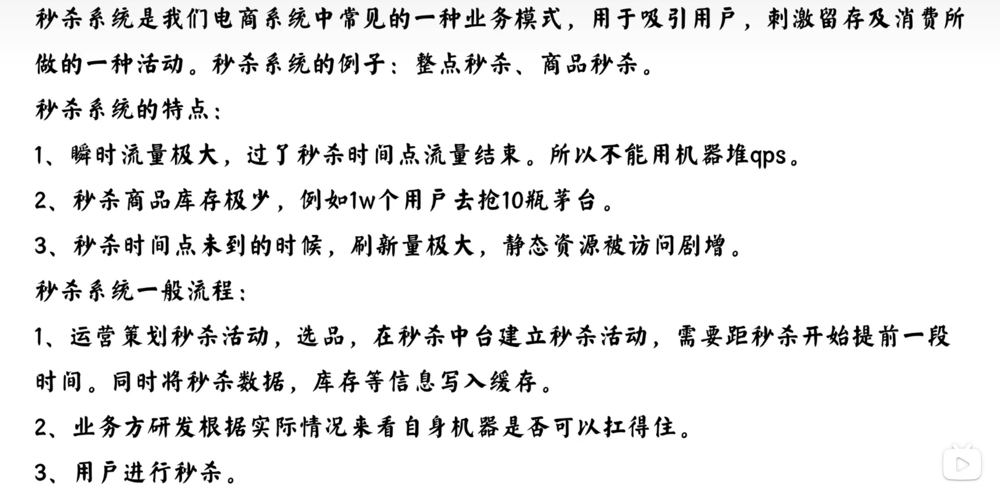

### 秒杀要考虑的点

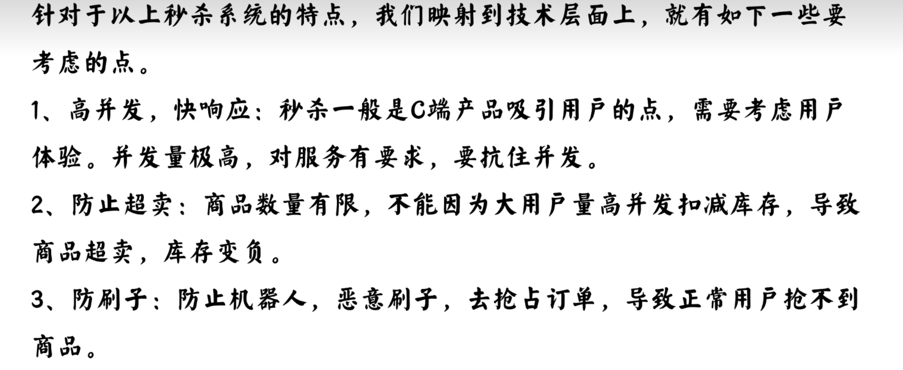

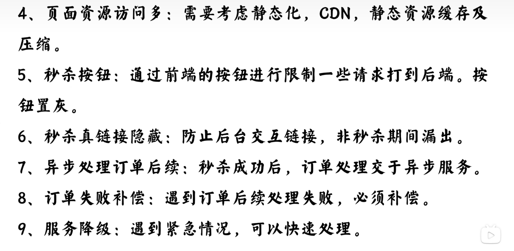

### 高并发响应

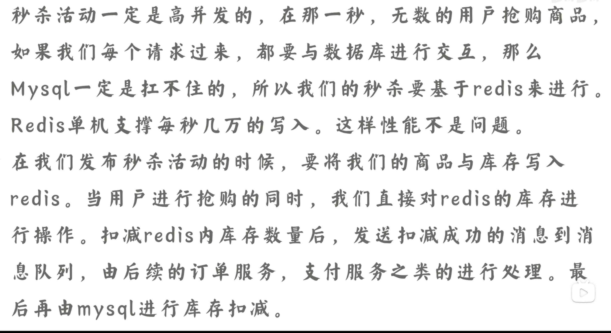

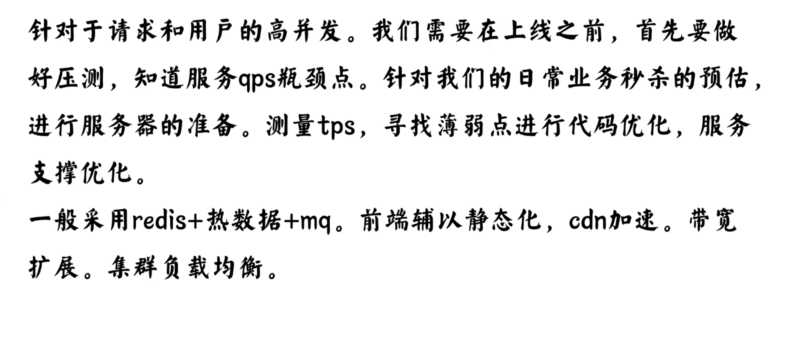

### 防止超卖

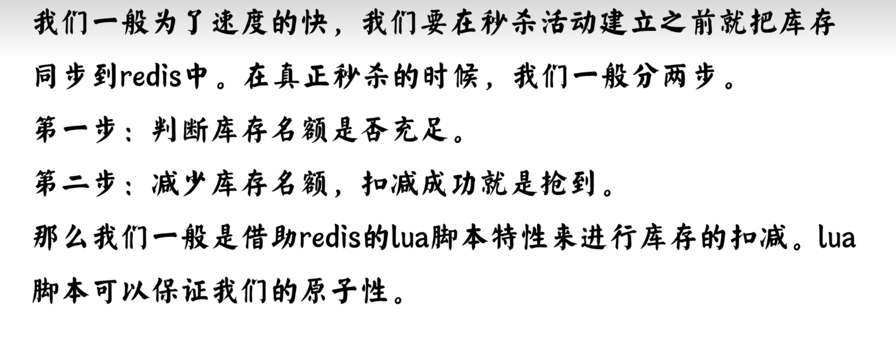

### 解决少卖

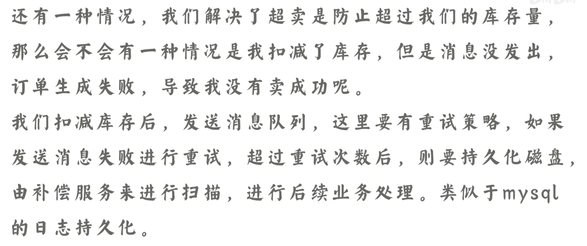

### 用户限流，防止刷子

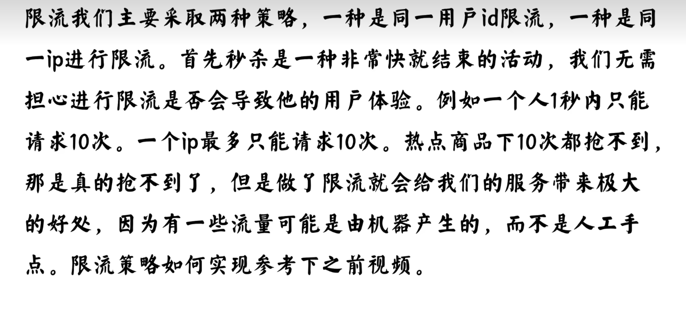

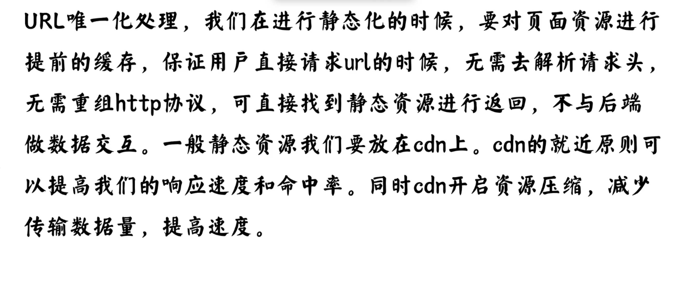

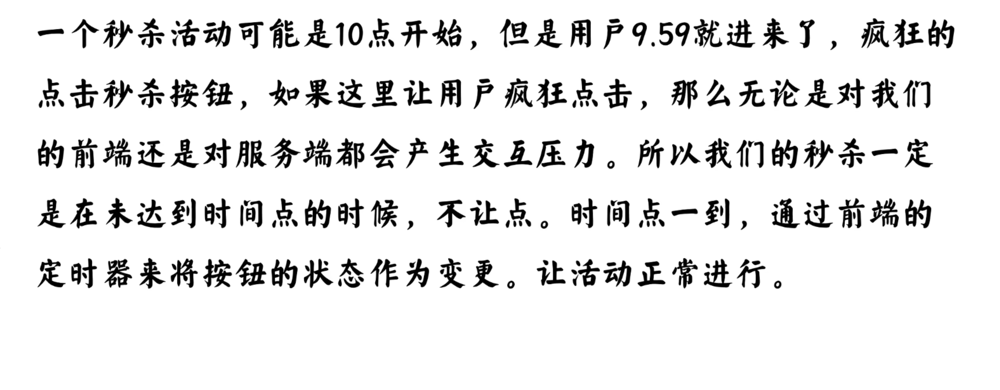


### 异步处理订单

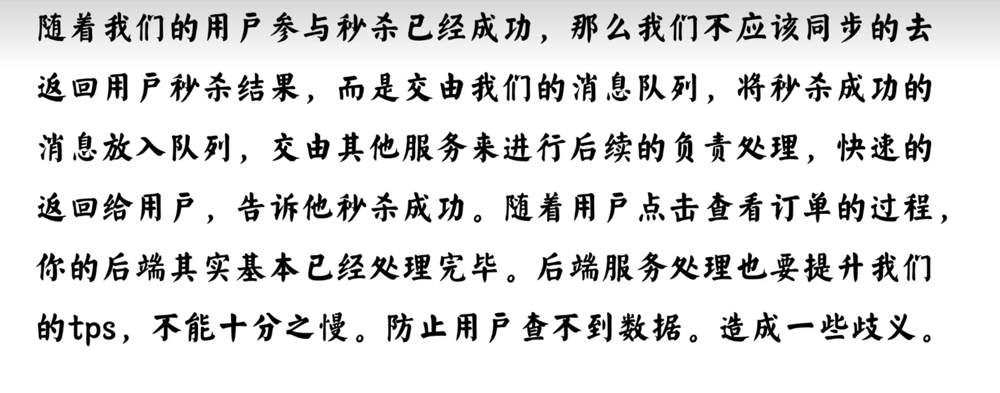

### 订单失败补偿

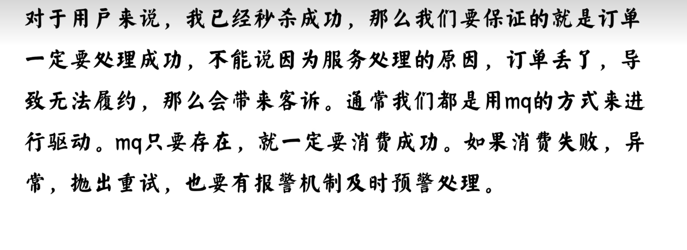

### 服务降级

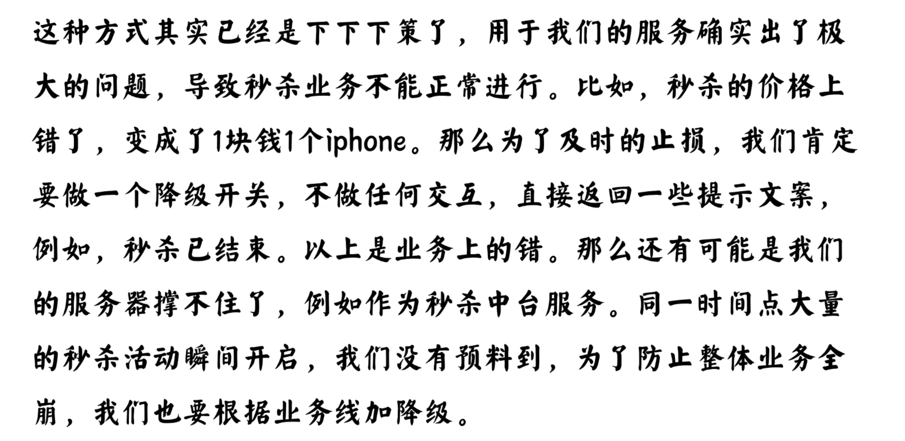

### 缓存数据库的一致性

- Redis 库存为空后，发送个延时消息比如 5 秒后请求数据库查看是否还有库存，有的话刷到缓存里。
- 定时任务，定期将数据库的数据同步到缓存中

# 两个50亿的url找出相同url


### 方案1

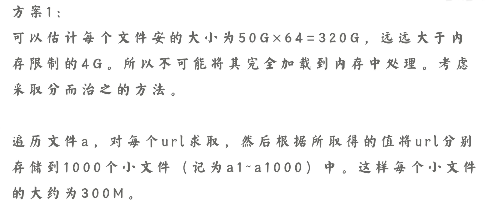

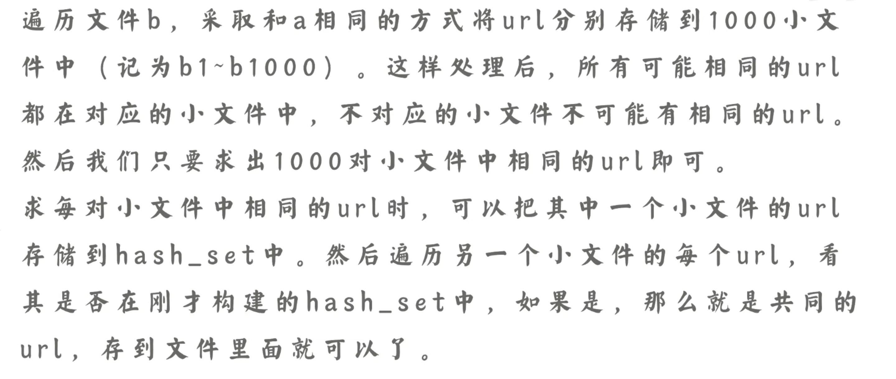


### 方案2

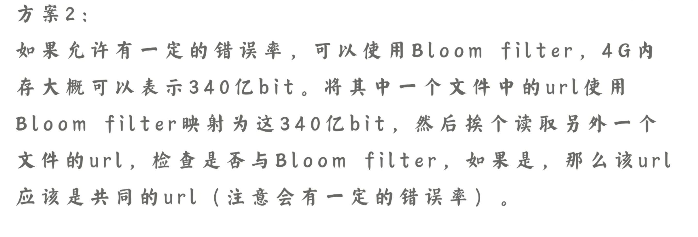

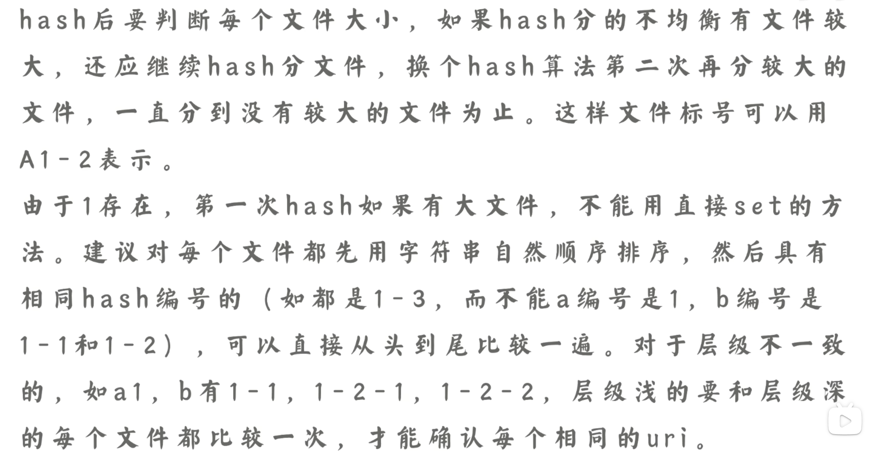


# 从1000w记录中，找出最热门的10个记录？

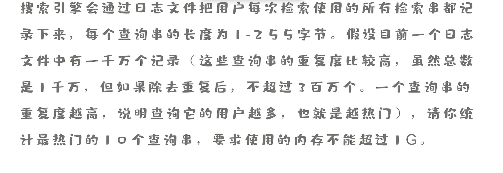

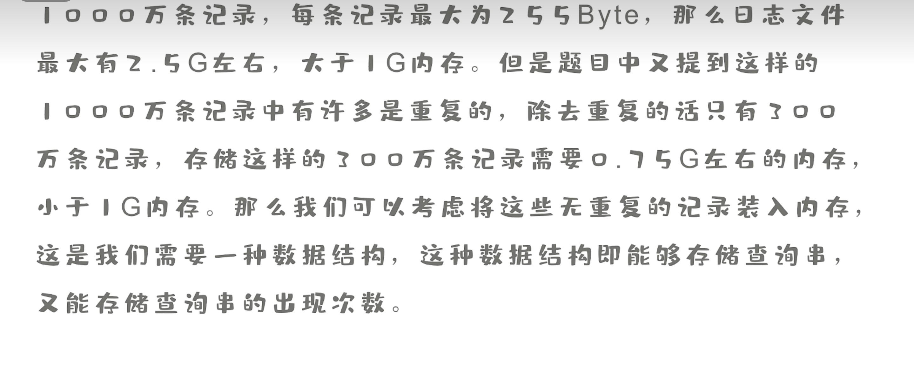

### 方案

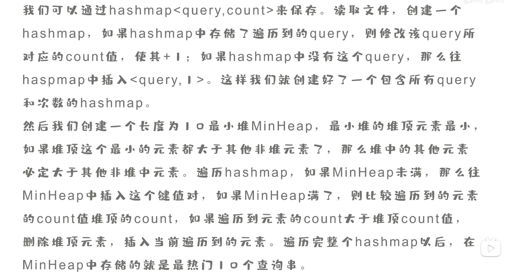


# 在一亿个数中找出最大的1万个数

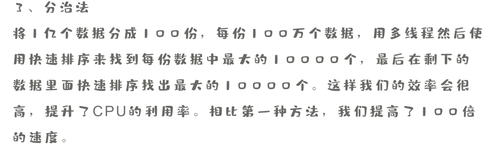

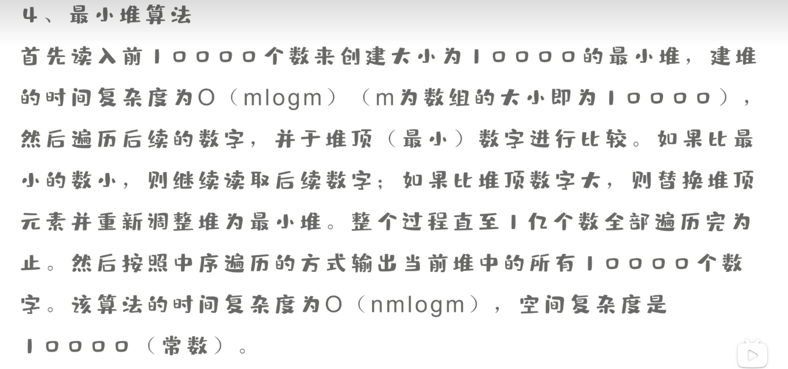


# 设计商品排行榜


# 十万级发券业务性能瓶颈及解决方案


# 下了订单后，可能会有库存模块，可能有配送模块，消息队列一个消息发出有多个模块收到，你觉得怎么设计好一点？


# 如何实现跨域单点登录（如淘宝登录后访问天猫自动登录）？

### 核心思路：

```
跨域 SSO 的关键是浏览器不能共享 Cookie，所以各子系统通过重定向到统一 SSO 中心来确认登录状态。
登录成功后，SSO 在自己的域下保存登录态，然后通过一次性授权码（code）重定向回子系统，子系统后端拿 code 向 SSO 获取用户信息，建立本地会话。
这样就实现了登录一次，多个系统自动登录的能力。
```

### 场景设定

```
天猫和淘宝不是一个域名，比如：

	•	淘宝：taobao.com
	•	天猫：tmall.com

跨域意味着：两个系统不能共享 Cookie（同源策略）
```

### 实现

```
🎯 核心组件：
	•	✅ 用户（浏览器端）
	•	✅ 淘宝系统（子系统 A）
	•	✅ 天猫系统（子系统 B）
	•	✅ 统一认证中心（SSO Server）

⸻

✅ 登录流程分步解析：

✅ 1）未登录时访问淘宝
	•	用户访问 taobao.com，发现本地没有登录态
	•	浏览器被 302 重定向到 SSO 登录中心：sso.com/login?redirect=taobao.com

✅ 2）SSO 登录中心处理登录
	•	用户输入账号密码，登录成功后：
	•	在 sso.com 域下，写入登录 Cookie（如 SSO-TOKEN）
	•	生成一个一次性授权码（如 code=xyz123）
	•	重定向回淘宝：taobao.com?code=xyz123

✅ 3）淘宝收到授权码，向 SSO 请求用户信息
	•	淘宝通过后端请求：GET sso.com/token/validate?code=xyz123
	•	SSO 校验成功，返回用户信息
	•	淘宝给用户发本地 Cookie（例如 JWT 或 Session）

✅ 此时用户在淘宝就“登录”了，但SSO Cookie 还保留在 sso.com 域下

⸻

✅ 实现“天猫自动登录”

✅ 用户访问天猫时
	•	天猫也发现没有登录态
	•	天猫重定向到 sso.com/login?redirect=tmall.com

✅ 因为浏览器访问的是 sso.com：
	•	浏览器带上了之前写入的 Cookie（SSO-TOKEN）
	•	SSO 发现用户已经登录 ✅
	•	立即生成新的一次性授权码，重定向回天猫：tmall.com?code=abc456

✅ 天猫根据 code 再次调用 SSO 获取用户信息
	•	自己创建本地 Cookie，完成自动登录

⸻

✅ 跨域如何传递登录状态？
	•	浏览器不能共享 taobao.com 和 tmall.com 的 Cookie
	•	但 两个系统都能访问同一个 sso.com 域
	•	所以关键就是：让所有系统通过跳转 + code 来“间接共享登录状态”

```


# 50万个坐标点，如何设计数据结构来找到距离一个点最近的10个点

**KD-Tree + KNN 查询（最常用）**

###  **1. 数据结构：KD-Tree**

构建过程：

​	1.	第 0 层用 x 维排序，选择中位数为根

​	2.	左边构建左子树，右边构建右子树

​	3.	第 1 层用 y 维排序（交替）

	4.	递归下去直到叶子节点

复杂度：**O(n log n)**（平衡二叉树）


### **2. 查询算法：K 近邻搜索（KNN）**

**✅ 第一步：递归下探，找到目标所在叶子节点**

​	•	类似二叉查找，按分割维度比较大小

​	•	找到离目标点最近的“子空间区域”


------


**✅ 第二步：回溯 + 剪枝 + 小顶堆维护最近 K 个点**

​	•	回溯过程中计算当前节点与目标点距离

​	•	用**小顶堆（最大长度 K）**维护当前最近的 K 个点

​	•	判断另一个子空间是否有可能存在更近的点（即圆与分割线交叉）

​	•	若可能 ➜ 继续递归搜索另一个分支


------


**✅ 查询复杂度：**

​	•	平均情况：**O(log n + k log k)**


# 一个请求的响应时间很慢，但后端服务器处理速度很快，如何排查？

> ✅ 请求响应慢

> ✅ 但后端服务处理快

这说明问题**可能不在业务逻辑本身**，而是在业务逻辑**之外的链路上**。接下来我们来系统化地回答这个问题。


## **总体定位框架**

```
[客户端] —→ [网络] —→ [网关] —→ [负载均衡] —→ [服务A] —→ [服务B] —→ [数据库/缓存]
```

## **逐层分析排查点**

| **层级/环节**          | **可能原因**                           | **排查手段**                               |
| ---------------------- | -------------------------------------- | ------------------------------------------ |
| 🧍客户端                | 客户端网络差，DNS失败，卡住            | 抓包工具（F12、Charles、Wireshark）        |
| 🌐网络链路              | 请求到达服务慢，带宽丢包，高延迟       | ping/traceroute、链路RTT测量、抓包工具     |
| 🔁负载均衡/Gateway      | 网关/SLB 转发慢，限流/熔断拦截         | 查看网关日志、延迟统计、指标监控           |
| ⏳排队/线程池等待       | 请求到服务A 但线程池满，等待排队       | 监控线程池指标：activeCount/queueSize      |
| ✅服务逻辑              | 你的前提是这部分执行快                 | 可以从日志确认响应时间                     |
| 🧵服务处理完但响应慢    | 响应返回卡在 socket 写出、客户端读取慢 | 用 jstack 看阻塞线程、netstat 查看连接状态 |
| 🧱网络拥堵              | TCP 拥塞，Window 缩小                  | tcpdump、服务侧带宽监控                    |
| ⏳Nagle算法/Delayed ACK | 小包延迟发送                           | 关闭 TCP_NODELAY，或服务器禁用 nagle 算法  |


## **重点怀疑场景**

### **网关/负载均衡限速或转发慢**

- 你的服务处理快，但请求/响应要先经过 API 网关（如 Nginx、Kong、Spring Cloud Gateway）或 SLB（如阿里云负载均衡）
- 如果这些组件本身转发慢、或做了限流/熔断/慢启动，会**挡在服务前面**

**排查思路**

- 查看网关日志（是否限流、响应慢）

- 比较：

  - ```
    请求总耗时（客户端感知） - 服务耗时（日志打印） = 网关/中间层耗时
    ```

**解决方案**

- 增加网关实例数
- 优化限流策略（如基于接口优先级、动态令牌桶）


### **连接复用阻塞（HTTP/1.1 keep-alive、HTTP/2、TCP）**

- HTTP/2 多路复用 / HTTP/1.1 连接复用
- 某个连接中前面的请求处理慢，就会拖住后续请求（**队头阻塞 HoL Blocking**）


**表现**

- 相同用户/同一连接的多个请求，部分响应时间异常高
- 看链路追踪 Timeline：你服务响应早了，但浏览器/客户端很晚才收到


 **排查思路**

- 用 tcpdump 看一个 TCP 连接内多个请求的先后顺序
- 使用链路追踪系统（如 SkyWalking）分析 trace 分布

**解决方案**

- 改用 HTTP/3（基于 QUIC，无 HoL）
- 调整客户端连接池策略（连接数加大，负载均衡策略轮询）


### **线程池排队导致的“快服务+慢响应”**

- 你的业务处理很快（比如 20ms），但线程池排队时间较长（比如 500ms）
- 最终响应慢并不是“执行慢”，而是“排队久”

**表现**

- 日志中打印耗时仅几十毫秒，但客户端等了几百毫秒
- 线程池活跃线程数 activeCount == maximumPoolSize
- 队列长度持续变大 queue.size()

**解决方案**

- **增加核心/最大线程数**
- 使用 CallerRunsPolicy 代替队列膨胀
- 拆分大任务 → 小任务，减少每次任务耗时


### **下游依赖响应慢**

- 你的业务接口可能依赖多个下游服务或组件
- 虽然你服务层逻辑快，但下游服务响应慢，最终也拖慢整个请求

**常见慢点**

- SQL 查询慢 / 慢查询无索引
- Redis 缓存穿透 / 热 Key 拖慢
- RPC 调用链过长（调用链 A→B→C→D）
- 下游线程池爆掉，导致你请求过去了却排队/被限流

**解决方案**

- DB 加索引 / 改写 SQL / 加缓存
- 熔断慢下游，兜底返回
- 分级依赖（核心路径使用保障）
- 引入隔离舱（如 Hystrix、Sentinel）防止依赖雪崩


# 4G内存的机器运行超出内存大小的程度怎么做，一定能运行吗

这实际上是在问：

- 超过物理内存能不能跑？
- 操作系统怎么调度？
- JVM 如何设置堆大小？
- 如果超出了，会发生什么？我们该怎么优化？


### 操作系统允许超出物理内存吗？

是的。

操作系统使用**虚拟内存**机制，每个进程看到的是独立的虚拟地址空间（远大于物理内存），**物理内存不够时会用磁盘空间作为 swap 区**。

- 比如 Linux 可以配置 swap 分区：/swapfile
- 当内存不够时，OS 会把部分内存页换出到磁盘

所以即使物理只有 4G，程序总内存用到 6G、8G 是可能的（但可能会慢）。


### JVM 如何应对？

假如你是 Java 程序，在启动时指定了：

```bash
java -Xmx6g -Xms6g -jar yourApp.jar
```

但你机器物理内存只有 4G：

- **JVM 启动时可能失败**（系统检测不到足够空间）

- 如果系统开了 swap，而且 JVM 启动成功了，那么：

  - 程序可能运行得极慢（GC卡顿、频繁 Full GC）
  - 极端时操作系统会 kill 掉进程（OOM Killer）

  

## 如何让“超出内存”仍能稳定运行？

**优化内存占用，减少 footprint**

- 分离业务模块、拆分微服务降低单进程压力
- 部署到多台机器，做服务拆分/横向扩容


**调整 GC 策略（减轻 Full GC）**

- 使用 G1、ZGC、Shenandoah 等低延迟 GC
- 配置合理的堆区大小（避免触发过多 GC）


# 机房里两台机器，各有1tb数据，大部分相同，怎么在网络带宽相对较小的情况下找出不同的1kb数据的起始位置

这道题的关键词非常关键：

- 各有 1TB 数据，**大部分相同**
- **网络带宽较小**
- 找出 “不同的 1KB 数据的起始位置”


## 题目理解 & 本质

| **要素**            | **含义分析**                    |
| ------------------- | ------------------------------- |
|                     |                                 |
| 数据 1TB            | 文件量大，不可一次性比较        |
| 大部分相同          | 可以“只比较不同部分”，减少开销  |
| 带宽小              | 要极度压缩传输数据量            |
| 要找不同的 1KB 起点 | 要精确定位差异，不是只是有/没有 |

> 所以，本质上是一个：**带宽受限下的大规模数据一致性比较 + 差异定位问题**


## 解决方案总体思路： 滑动窗口 + 分段哈希 + 差异上报

### **两台机器的协同机制：**

1. **先统一分块策略**：按 1KB 块划分 1TB 文件，共有约 1TB / 1KB = 10^9 块（10亿块）

2. **一方生成“摘要索引”**（如：hash 或 rolling checksum）：

   - 每 1KB 计算一个 Hash（如 MD5、SHA1、甚至 CRC32）
   - 存入 Hash List（1个hash约16~32B）

   ```
   10亿块 × 16字节 = 16GB（可优化）
   ```

3. **优化传输**：

   - 不直接传全部 hash，而是使用：
     - **Bloom Filter**（压缩传输）
     - 或只传摘要片段（分层校验）

   

4. **另一台机器对本地数据做 Rolling Hash**

   - 将每个1KB块的hash值对比远程摘要
   - 找出本地 hash 不在远程 hash 列表中的块，即为“不同块”

   

5. **记录不同块的起始位置**（即：1KB对齐的 offset）

   - 只返回 offset 列表即可（非常轻）

   

## **关键技术点解释**

**什么是 Rolling Hash？**

> **Rolling Hash 是一种支持“滑动窗口快速更新”的哈希算法**。

> 它能在常数时间内计算字符串/数据块在“滑动一位”后新的哈希值。

假设你要对一个字符串中长度为 k 的子串做哈希：

- 普通 hash 算法：每次都重新对整个子串计算（O(k)）
- Rolling Hash：你只需“用上一个 hash 值 + 一点点增量”，快速算出新值（O(1)）


**▶️ 1.** **为什么用 Hash（或 Rolling Checksum）？**

- 减少数据传输量
- 快速定位“哪块不同”
- 使用 Rolling Hash 可支持未对齐数据对比（提升容错能力）


**▶️ 2.** **为什么用 Bloom Filter？**

- 减少传输开销（10亿个 hash 不可能全传）
- 判断“某个hash值是否存在于远程”，牺牲一点误判换取节省


**▶️ 3.** **起始位置如何返回？**

- 每个不一致块返回起始 offset（单位是 1KB）
- 数据量极小，例如只有 100 个不同块 → 返回 100 个数字而已


# spring能访问所有内存区域吗，为什么？

这个问题很巧妙，看似问的是 Spring，其实考的是你对**Java内存模型（JMM）**、**Spring框架作用边界**、以及**JVM内存区域划分**的理解。

> **不能**。Spring 是运行在 JVM 应用层的框架，它只能访问 JVM 分配给应用的内存区域（如堆、方法区、线程栈等），**无法访问 JVM 外或被严格保护的内存区域（如操作系统内核空间、本地内存、其他进程内存）**。

## **为什么不能？**

- Java 是运行在 JVM 中的语言，受限于 JVM 的沙箱模型

- 不能越权操作进程外资源（除非使用 native JNI 或反射 hacks）

- | **区域**                 | **Spring 能访问吗？** | **为什么**                          |
  | ------------------------ | --------------------- | ----------------------------------- |
  | **堆内存（heap）**       | ✅ 能                  | Bean、对象都在这里                  |
  | **方法区（metaspace）**  | ✅ 部分能              | Spring 加载的 class、注解信息都在这 |
  | **线程栈（stack）**      | ❌ 不能直接访问        | 每个线程私有、受 JVM 管理           |
  | **本地方法区（native）** | ❌ 不直接能            | 除非通过 JNI                        |
  | **直接内存（off-heap）** | ❌ 不直接能            | 需要通过 NIO / Unsafe / Netty       |
  | **操作系统内存/内核态**  | ❌ 不能访问            | 被操作系统保护                      |


Spring 框架的作用主要集中在：

- **堆内存**：用于创建和管理 Bean 对象
- **方法区（元空间）**：存放 Spring 的类信息、注解、代理类等
- **ThreadLocal（线程变量）**：部分事务、上下文控制使用 ThreadLocal
- **缓存区**：比如 Spring 使用 Caffeine、Guava cache，也分配在堆或 off-heap

Spring 本身不涉及：

- 直接操作 JVM 栈帧
- 直接操控本地方法区或 off-heap
- 管理物理内存或操作系统页表


# spring中怎么使用事务，使用场景分别是什么？

### **基于注解的声明式事务（最常用）**

```java
@Service
public class OrderService {

    @Transactional
    public void createOrder() {
        // 操作1：写入订单表
        // 操作2：扣减库存
        // 操作3：插入日志表
    }
}
```

- 默认：**方法执行成功就提交，抛出运行时异常就回滚**

- 可配置：

  - ```java
    @Transactional(rollbackFor = Exception.class, propagation = Propagation.REQUIRED, isolation = Isolation.READ_COMMITTED)
    ```


### **编程式事务控制**

```java
TransactionTemplate template = new TransactionTemplate(transactionManager);
template.execute(status -> {
    // 自己写逻辑
    return null;
});
```

适用于：**对事务开始/回滚粒度控制要求特别高的地方**


## **Spring 事务常用场景有哪些？**

| **场景**                  | **原因**                                   |
| ------------------------- | ------------------------------------------ |
| 用户下单                  | 要么下单成功 + 扣库存 + 发消息，要么都失败 |
| 扣余额 + 写流水           | 要保证账户余额和账单一致                   |
| 秒杀抢购                  | 成功就发券、失败要回滚                     |
| 商户开通 + 初始化账户信息 | 多张表操作，需要保证一致                   |
| 定时任务批量更新          | 中途失败需整体回滚                         |


### 不适用场景

| **场景**                     | **原因**                       |
| ---------------------------- | ------------------------------ |
| 纯查询逻辑                   | 没有写操作，用事务浪费连接与锁 |
| **调用外部接口（MQ/HTTP）**  | 外部系统不受本地事务控制       |
| 长时间执行任务（上传、导入） | 占用连接时间过长，影响系统吞吐 |
| **异步任务处理**             | 线程上下文丢失，事务不生效     |


## **事务失效的常见坑**

1. **方法是 private / final / 非 public**

   - Spring AOP 无法代理

   

2. **方法内调用自身方法**

   - 没有走代理，事务不生效

   

3. **用了 @Transactional 但数据库不是支持事务的引擎（如 MyISAM）**

4. **异常被 catch 住了没有抛出**

   - 事务认为“没抛异常”就该提交

   

# 分库分表：分买家库、卖家库，如果设计分库分表键可以快速对应到买家表/卖家表？

你可能有如下结构：

- 有两个角色：**买家（buyer）**、**卖家（seller）**

- 两套业务数据分别分库分表，比如：

  

  - 买家库：buyer_db_0、buyer_db_1…
  - 卖家库：seller_db_0、seller_db_1…

  

面试官想问你：

> 在这样的分库分表环境中，怎么设计分库键，才能“**快速路由定位某个买家或卖家数据在哪张表**”？


### 设计思路

- 买家数据只用买家ID分库
- 卖家数据只用卖家ID分库
- 保证同一个买家或卖家相关数据路由到**同一库/同一表**


### 如何处理买卖双方的场景

比如订单表，包含买家和卖家

#### **✅ 推荐做法：**

> 订单主表 **按 buyer_id 分库分表**（因为买家访问更频繁）

- 分库键：buyer_id
- 查询订单详情时根据 buyer_id 定位
- 若有 seller_id 的查询（如：卖家订单统计）→ **用中间表或异步汇总**

避免用买家+卖家做**复合路由键**

- 会导致路由不唯一，容易引发**全库路由、性能雪崩**


# 一百万条订单数据，怎么快速排序？

**外部排序**（External Sort）

- **分片 + 内存排序**（每片 10万条，内存中快排后写入临时文件）
- **多路归并排序**（K路归并多个有序文件）


**多线程优化**

- 将 1M 数据拆成 10 份 → 每个线程并发排序
- 最后进行归并（可用优先队列）

```java
list.parallelStream()
    .sorted(Comparator.comparing(Order::getCreateTime))
    .collect(Collectors.toList());
```


# 一个SpringBoot程序如何在linux系统中部署，简要讲讲关键步骤和命令

## **前提条件**

- 目标机器是 Linux
- 已安装好 JDK（Java 8/11/17）
- Spring Boot 项目已打包为 xxx.jar

## **部署关键步骤**

**① 拷贝 jar 包到 Linux 机器**

**② 登录 Linux，进入 jar 包目录**

**③ 启动程序**

```bash
nohup java -Xmx512m -jar myapp.jar --spring.profiles.active=prod > logs/app.log 2>&1 &
```

>  java -jar 启动程序，并指定环境 profile

**④ 查看运行状态**

```bash
ps -ef | grep myapp.jar     # 查看进程
netstat -tunlp | grep 8080  # 查看端口监听
tail -f logs/app.log        # 查看日志输出
```

**⑤ 设置开机自启（可选）**


# 文件分发系

假设文件分发系统是一个类似于**中台**的一个服务，它最核心的功能是**上传文件**，你要**文件分发**，首先你得支持文件上传。**上传文件之后就支持其他的有需要这个文件的去下载这个文件**。规定一下，如果我想要用一个传统的像 **HTTP 服务**， HTTP 服务通过 API 的方式来做上传和下载，然后一次上传，肯定是一个文件，可能只会上传一次，当然它可能会被下载无数次。就这么一个服务，刚才也提到了几个你可能会考虑的点，我想你展开讲一下。基于你考虑的几个点，比如说**高可用、高性能、高并发**。你再来想一想刚才我提到的这个场景，**下载可能是海量的，然后上传的动作不会很大**。这个场景你再想想这个系统应该去设计？


核心考点在于：

- 你能否理解上传少、下载多的典型场景
- 如何围绕“高并发、高可用、高性能、可扩展性”进行系统级设计
- 如何进行读多写少场景的优化


这类系统的瓶颈**一定不是在上传，而在下载性能**：

- 上传只要**幂等、安全、存储合规**即可
- 下载要做到**快速读取、负载均衡、CDN缓存、抗压能力强**

```
            +-------------------+
   上传者 → |  Upload API       |
            +-------------------+
                    ↓
          +---------------------+      +---------------------+
          |  元信息数据库（MySQL） | ←→ | 去重缓存/限流缓存（Redis）|
          +---------------------+      +---------------------+
                    ↓
         +----------------------+
         | 对象存储 / 文件系统  | ←→ 下载者通过 download API 获取 URL
         +----------------------+
                    ↑
         +----------------------+
         | CDN / Nginx 静态代理 |
         +----------------------+
```


## **详细设计模块拆解**

| **字段**   | **类型**    | **描述**         |
| ---------- | ----------- | ---------------- |
| id         | string/UUID | fileId           |
| filename   | string      | 原始文件名       |
| url/path   | string      | 存储路径/签名URL |
| md5        | string      | 文件内容指纹     |
| uploader   | userId      | 上传者           |
| created_at | datetime    | 上传时间         |

### **1️⃣ 上传服务（写少）**

1. **客户端计算文件 MD5 + 上传请求**（先做秒传判断）：

   ```
   POST /upload
   Body: file, filename, md5
   ```

   

2. **服务端判断是否已存在（MD5 去重）**：

   - Redis / MySQL 中查是否已有记录
   - 有 → 直接返回已有 fileId 和 URL（实现“秒传”）

   

3. **文件写入对象存储（如 MinIO/OSS）**

   - 失败自动重试 + 校验 MD5

   

4. **写入 MySQL 文件元信息表（幂等写）**

5. **返回 fileId + 下载地址**

**✅ 上传优化点：**

- ✔️ 支持分片上传（大文件上传）
- ✔️ 断点续传（失败后补传）
- ✔️ 上传限流（IP 限制、令牌桶）


### **2️⃣ 下载服务（读多、高并发）**

1. 用户通过 fileId 请求下载：

   ```
   GET /download/{fileId}
   ```

2. 后端校验 fileId（是否有效、权限控制）

3. 从 MySQL 查文件元信息（可加缓存）

4. 返回：

   - CDN URL（如阿里云 OSS CDN）
   - 或 Nginx 本地代理路径
   - 或 302 重定向（带 token 的临时签名 URL）

   

5. 用户发起真实下载请求（命中 CDN 或本地缓存）

| **优化点**           | **说明**                            |
| -------------------- | ----------------------------------- |
| CDN 分发             | 热文件走 CDN 静态缓存，减轻源站压力 |
| Range 下载支持       | 断点续传提升大文件体验              |
| Redis 限流 + IP 灰度 | 防止恶意刷流量                      |
| 热点文件多副本       | 热文件缓存多个节点                  |
| 服务无状态 + 多副本  | 下载 API 可水平扩展                 |
| 异步/秒传/分片上传   | 提升上传体验                        |


| **功能模块** | **技术选型建议**                     |
| ------------ | ------------------------------------ |
| 存储层       | MinIO / 阿里云 OSS / FastDFS         |
| 文件元信息   | MySQL（主备）                        |
| 缓存与限流   | Redis + Lua 脚本 + 滑动窗口限流      |
| 下载加速     | CDN + Nginx 静态代理                 |
| 上传服务     | Spring Boot / Spring WebFlux（异步） |
| 安全控制     | 鉴权拦截器 + URL签名 + IP限速        |


# 存储 10 万个文件，每个文件 10MB，要 快速读写

### **核心设计思想回顾（五要点）**

1. **数据分布均衡** → 分目录 / 分块
2. **索引快速命中** → 内存 + 持久索引
3. **文件物理存储高效** → 顺序写 + Page Cache + 大文件合并
4. **高并发访问能力** → 读写隔离 + 限流 + 缓存
5. **系统具备扩展性 & 运维能力**


## **存储架构细化设计**

### 1. 存储层结构设计

- 最深可 3 层（hash 前 6 位）

  - ```
    /data/
       ├── 7f/
       │    └── a8/
       │         └── 7fa8xx_fileId.data
    ```

- 保证：

  - 单目录 < 5000 文件
  - 写入时路径可计算，无需查索引
  - 读写可并发访问（文件名唯一）

- ```
  fileId_fileType.fileExt  →  7fa839ac_META.json / 7fa839ac_BODY.bin
  ```


## **索引系统的深入设计**

- 每个文件的元信息存储为：

  - ```json
    {
      "fileId": "7fa839ac",
      "path": "/data/7f/a8/7fa839ac.data",
      "offset": 0,
      "size": 10485760,
      "md5": "abc123...",
      "uploadTime": "2024-01-01T00:00:00"
    }
    ```

索引保存方式建议

- | **存储方案**      | **是否推荐**                      | **说明** |
  | ----------------- | --------------------------------- | -------- |
  | Redis             | ✅ 高速热数据索引（支持 TTL 控制） |          |
  | RocksDB / LevelDB | ✅ 持久化、压缩好，写快读快        |          |
  | MySQL             | ❌ 不推荐主索引（可做备份/历史）   |          |
  | 本地 mmap 文件    | ✅ 零拷贝访问，可超高性能          |          |


## **并发读写与性能设计**

写入路径优化：

- **写前检查 MD5**：文件是否已存在（避免重复）
- **异步写入索引**：先写文件，索引入队，由消费者异步入库
- **顺序写 + Append-only**：操作系统页缓存效率更高
- **日志 + 回滚机制**：写失败可回滚文件及索引

读取路径优化：

1. fileId → 索引服务 → 获取 path/offset
2. 支持：
   - 断点续传（Range）
   - 大文件分页读
   - 缓存命中直接返回（例如热点文件加 Guava Cache）
   - CDN/Nginx 静态代理热数据


## **可扩展性设计**

**✅ 1. 服务水平扩展**

- 多台机器挂 /data1 /data2 ... 自动分配
- 文件分布式路由（哈希到不同节点）

**✅ 2. 文件迁移支持**

- 支持 “冷热数据” 迁移策略（7 天内热数据放本地，冷数据归档 OSS）
- 文件访问频率统计（LRU 热度打分）


## **边界考虑点**

| **场景**                 | **应对策略**                       |
| ------------------------ | ---------------------------------- |
| 文件丢失 / 索引不一致    | 启用日志、可重建索引               |
| 文件重复上传             | **使用 MD5 + Redis 锁去重**        |
| 单磁盘空间不足           | 多挂载点自动路由                   |
| 多线程同时上传同一个文件 | 加文件级锁 or 幂等保证（如 setnx） |


## 总结

> “我会将 10 万个 10MB 文件按 hash 路由存储在多层目录中，避免单目录过大造成 I/O 性能下降，同时维护 fileId → path/offset 的索引结构，索引可存于内存 + Redis + RocksDB 的多级结构中。写入走顺序流、读文件时走 path + offset 快速定位，同时支持断点续传和 CDN 加速。在系统扩展上，文件按规则分布到多磁盘挂载点并支持冷热数据归档。整体系统可支撑高并发写入和高 QPS 下载请求。”


# mq在整个IT的基础设施里面它的意义是什么？它对整个软件架构带来什么样的好处或者变化？

### **系统解耦** **—— 各模块独立演化**

- 发送方只需负责“发消息”，不关心“谁处理、什么时候处理”
- 接收方可以独立上线/扩展，不影响发送方

> 🎯 解耦后模块更容易开发、测试、部署、重构


### **异步通信** **—— 提高系统响应速度**

- 原来同步调用需要等待结果，现在可以“发完即走”
- 客户端响应更快，服务端压力降低

> 🎯 常用于：下单成功异步发短信、异步写日志、异步推送等


### **削峰填谷** **—— 平滑突发流量、保护核心服务**

- 高并发时，MQ 作为**缓冲池**，把请求“排队”处理
- 防止瞬时压力压垮数据库、服务

> 🎯 常用于秒杀、日志写入、邮件发送、导入导出等场景


### **可靠投递** **—— 防止消息丢失/重复处理**

- 支持 ACK、重试、死信队列、幂等消费机制

> 🎯 帮助实现“最终一致性”、“消息补偿”等高可靠要求

## **典型使用场景**

| **场景**               | **使用 MQ 的好处**                  |
| ---------------------- | ----------------------------------- |
| 下单 → 扣库存 → 发短信 | 异步处理，防止接口阻塞              |
| 大量日志写入           | 异步写入日志系统，保护主流程        |
| 秒杀限流               | 请求入队，限速处理，保护数据库      |
| 用户行为事件打点       | 多方订阅事件，做推荐、风控、BI 分析 |
| 分布式任务协调         | 使用延迟消息、定时消息做“可靠调度”  |


# 网站如果要做反爬虫，有什么措施

## **常见反爬虫策略**

| **层级** | **策略类型** | **说明**                   |
| -------- | ------------ | -------------------------- |
| L1       | 基础限流拦截 | 限制频率、IP、UA           |
| L2       | 验证挑战类   | 验证码、人机识别           |
| L3       | 深层行为分析 | JS混淆、指纹识别、滑动行为 |


### **基础层防爬（轻量但有效）**

| **策略**              | **说明**                     |
| --------------------- | ---------------------------- |
| **IP限频 / IP封禁**   | 设置访问频率限制，如 N 次/秒 |
| UA 检查（User-Agent） | 拦截空 UA、Python/Java 等 UA |
| **Referer 检查**      | **拦截非本站来源的请求**     |
| **Cookie 必需校验**   | 爬虫请求不带或带错误 Cookie  |
| **Header 完整性校验** | 缺失常见浏览器头可识别爬虫   |


### **挑战类防爬（中级）**

| **策略**                | **说明**                 |
| ----------------------- | ------------------------ |
| 图形验证码（图形/滑动） | 拦截机器请求，提高成本   |
| 行为验证码              | 极验/滑动验证/点击顺序等 |
| 登录/接口 Token 限制    | 请求必须带有效 token     |


### **深层识别类防爬（高级）**

| **策略**                           | **说明**                           |
| ---------------------------------- | ---------------------------------- |
| JS 加密/加签                       | 请求参数/响应数据通过 JS 加密      |
| **字段动态名称**                   | 字段名/结构动态变化，难解析        |
| 浏览器指纹识别                     | 检查屏幕、字体、插件等生成唯一标识 |
| **滑动行为轨迹分析（MouseTrack）** | 分析鼠标滑动轨迹是否“人类自然”     |
| **请求顺序 / 路径特征识别**        | 判断访问行为是否符合正常用户习惯   |


# 读取文件第一行，能怎么做，怎么优化

读取文件第一行在开发中非常常见，比如：

- 读取 CSV 表头
- 判断日志类型
- 文件格式探测


### **BufferedReader**

```java
try (BufferedReader reader = new BufferedReader(new FileReader("file.txt"))) {
    String firstLine = reader.readLine();
    System.out.println(firstLine);
}
```


### **使用NIO**

```java
try (Stream<String> lines = Files.lines(Paths.get("file.txt"))) {
    String firstLine = lines.findFirst().orElse(null);
}
```


## **工程优化：大批量读取第一行怎么办？**

如果你要批量读取**100万个文件的第一行**，可以考虑：

- ✅ 多线程并发读取（IO 密集型）
- ✅ 使用 Java NIO + ThreadPoolExecutor
- ✅ 使用 memory mapped file（mmap）优化随机小文件读取
- ✅ 批量读取写日志缓存（减少磁盘 seek）


```java
import java.io.*;
import java.nio.file.*;
import java.util.*;
import java.util.concurrent.*;
import java.util.stream.Collectors;

public class BatchFirstLineReader {

    private static final int THREAD_COUNT = Runtime.getRuntime().availableProcessors() * 2;
    private static final int BATCH_WRITE_SIZE = 1000;
    private static final Path LOG_FILE = Paths.get("first_lines.log");

    public static void main(String[] args) throws InterruptedException, IOException {
        List<Path> files = Files.walk(Paths.get("/data/files/"))
                .filter(Files::isRegularFile)
                .collect(Collectors.toList());

        ExecutorService executor = Executors.newFixedThreadPool(THREAD_COUNT);
        BlockingQueue<String> lineQueue = new LinkedBlockingQueue<>();

        // 批量写日志线程
        Thread writerThread = new Thread(() -> {
            try (BufferedWriter writer = Files.newBufferedWriter(LOG_FILE)) {
                List<String> buffer = new ArrayList<>(BATCH_WRITE_SIZE);
                while (true) {
                    String line = lineQueue.poll(3, TimeUnit.SECONDS);
                    if (line != null) {
                        buffer.add(line);
                    }
                    if (buffer.size() >= BATCH_WRITE_SIZE || (line == null && !buffer.isEmpty())) {
                        for (String l : buffer) writer.write(l + "\n");
                        writer.flush();
                        buffer.clear();
                    }
                    if (line == null && Thread.currentThread().isInterrupted()) break;
                }
            } catch (Exception e) {
                e.printStackTrace();
            }
        });
        writerThread.start();

        // 并发读取任务提交
        CountDownLatch latch = new CountDownLatch(files.size());
        for (Path file : files) {
            executor.submit(() -> {
                try (BufferedReader reader = Files.newBufferedReader(file)) {
                    String firstLine = reader.readLine();
                    if (firstLine != null) {
                        lineQueue.offer(file.getFileName() + ": " + firstLine);
                    }
                } catch (IOException ignored) {
                } finally {
                    latch.countDown();
                }
            });
        }

        latch.await();
        writerThread.interrupt(); // 通知写线程可以退出
        executor.shutdown();
        System.out.println("读取完毕，共处理文件数: " + files.size());
    }
}
```


- 使用 ThreadPoolExecutor 多线程并发读取（适合 I/O 密集型任务）
- 使用 Files.newBufferedReader()（避免 readAllLines() 带来的多余读取）
- 批量结果写入内存队列，再批量刷入磁盘（减少磁盘 write 次数）
- 可扩展支持 mmap 优化读取
